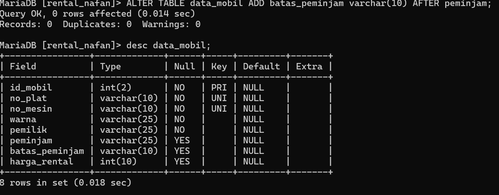
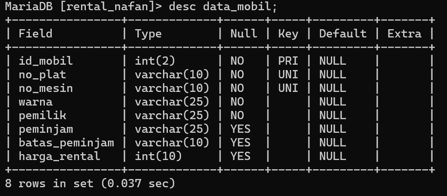
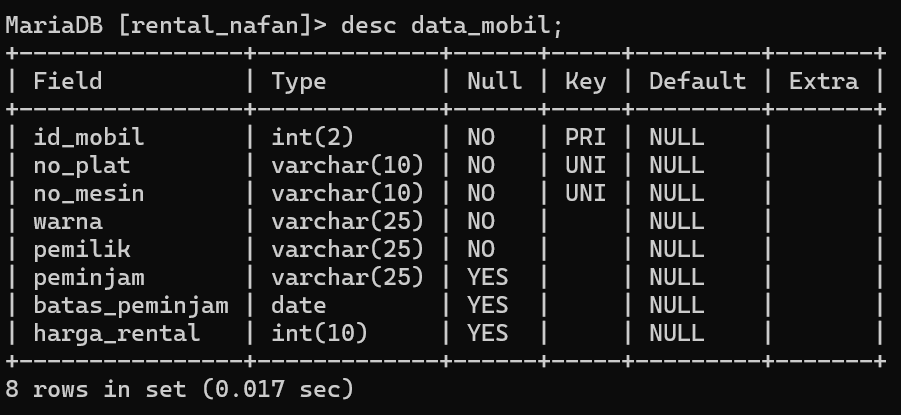
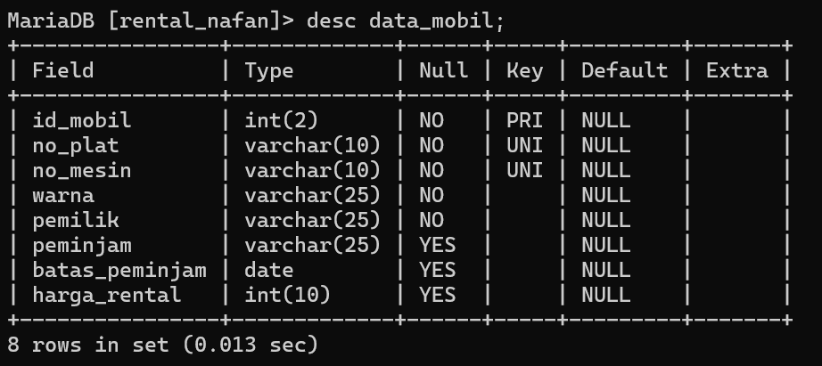
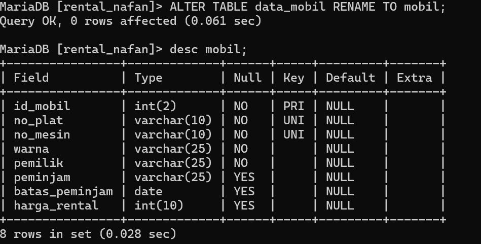

# Menambahkan kolom

>[!Info] INI SEBELUM MENAMBAHKAN ALTER

  

## Struktur query

```mysql

ALTER TABLE nama_tabel ADD nama_kolom varchar(10) AFTER nama_kolom;

```

## Contoh query

```mysql

	ALTER TABLE tabel_guru ADD status varchar(10) honorer;

```

## Hasil



## Analisis

1. `ALTER TABLE`: Ini menunjukkan bahwa kita sedang memodifikasi struktur dari tabel yang sudah ada.
2. `mobil`: Ini adalah nama tabel yang akan kita ubah.
3. `ADD batas_peminjam varchar(10)`: Ini berarti kita akan menambahkan kolom baru bernama `batas_peminjam` ke tabel `mobil`, dan kolom tersebut akan memiliki tipe karakter variabel dengan panjang maksimum 10 karakter.
4. `AFTER peminjam`: Ini menunjukkan bahwa kolom baru `batas_peminjam` akan ditambahkan setelah kolom yang sudah ada yaitu `peminjam` di dalam tabel.

## Kesimpulan

Pernyataan SQL tersebut menambahkan kolom baru dengan nama `batas_peminjam` ke tabel `mobil`, dengan tipe data karakter variabel dan panjang maksimum 10 karakter, yang akan ditempatkan setelah kolom `peminjam` yang sudah ada di dalam tabel.

# Tambahan

## Kode

```mysql

UPDATE mobil SET batas_peminjam="2024-04-24" WHERE peminjam IS NOT Null;

```

## Hasil


# Mengubah nama kolom

## Struktur query

```mysql

ALTER TABLE nama_tabel RENAME CHANGE nama_kolom TO nama_kolom_yang_baru;

```

## Contoh query

```mysql

ALTER TABLE mobil RENAME CHANGE batas_peminjam TO varchar(10);

```

## Hasil



## Analisis

1. `ALTER TABLE`: Ini menunjukkan bahwa kita sedang memodifikasi struktur dari sebuah tabel.
2. `mobil`: Ini adalah nama tabel yang akan kita ubah.
3. `RENAME COLUMN batas_peminjam TO deadline`: Ini berarti kita akan mengubah nama kolom yang sudah ada dari `batas_peminjam` menjadi `deadline` di dalam tabel `mobil`.

## kesimpulan

Pernyataan SQL tersebut mengubah nama kolom yang sudah ada dari `batas_peminjam` menjadi `deadline` di dalam tabel `mobil`.

# Mengubah tipe data kolom

## Struktur query

```mysql

ALTER TABLE nama_tabel MODIFY nama_kolom DATE;

```

## Contoh query

```mysql

ALTER TABLE data_mobil MODIFY varchar(10) DATE;

```

## Hasil


## Analisis

1. `ALTER TABLE`: Ini adalah perintah SQL yang digunakan untuk mengubah struktur tabel.
2. `mobil`: Ini adalah nama tabel yang ingin Anda ubah strukturnya.
3. `MODIFY deadline DATE:` Ini adalah bagian yang melakukan perubahan. Perintah ini mengubah kolom "`deadline`" dalam tabel "`mobil`" menjadi memiliki tipe data `DATE`. Ini berarti kolom "`deadline`" sebelumnya mungkin memiliki tipe data yang berbeda, dan Anda sedang mengubahnya menjadi tipe data `DATE`.

## kesimpulan

`ALTER TABLE mobil MODIFY deadline DATE;` mengubah tipe data kolom "`deadline`" dalam tabel "`mobil`" menjadi `DATE`. Ini memastikan bahwa kolom tersebut hanya dapat menyimpan nilai-nilai tanggal yang valid. Pastikan untuk memeriksa kompatibilitas data yang ada dan lakukan pencadangan data sebelum menjalankan perintah tersebut.

# Menambahkan constraint

## Struktur query

```mysql

ALTER TABLE nama_tabel ALTER nama_kolom SET DEFAULT 'READY';

```

## Contoh query

```mysql

ALTER TABLE data_mobil ALTER deadline SET DEFAULT 'READY';

```

## Hasil


## Analisis

1. `ALTER TABLE`: Ini adalah perintah SQL yang digunakan untuk mengubah struktur tabel.

2. `mobil`: Ini adalah nama tabel yang ingin Anda ubah strukturnya.

3. `ALTER deadline SET DEFAULT READY`: Ini adalah bagian yang melakukan perubahan. Perintah ini mengatur nilai default untuk kolom "`deadline`" dalam tabel "`mobil`" menjadi `READY`. PIni berarti bahwa jika baris baru ditambahkan ke tabel tanpa nilai yang ditentukan untuk kolom "`deadline`", maka nilainya akan secara otomatis diatur menjadi '`READY`'.

## kesimpulan

Perintah `ALTER TABLE mobil ALTER deadline SET DEFAULT 'READY';` mengatur nilai default untuk kolom "`deadline`" dalam tabel "`mobil`" menjadi '`READY`'. Ini akan membuat '`READY`' menjadi nilai default untuk kolom "`deadline`" jika tidak ada nilai yang ditentukan saat penambahan baris baru. Pastikan nilai default tersebut sesuai dengan kebutuhan aplikasi Anda sebelum menjalankan perintah ini.

## Referensi

https://revou.co/panduan-teknis/sql-constraint

# Menghapus constraint

## Struktur query

```mysql

ALTER TABLE nama_tabel ALTER nama_kolom DROP DEFAULT;

```

## Contoh query

```mysql

ALTER TABLE data_mobil ALTER deadline DROP DEFAULT;

```

## Hasil


## Analisis

1. `ALTER TABLE`: Ini adalah perintah SQL yang digunakan untuk mengubah struktur tabel.

2. `mobil`: Ini adalah nama tabel yang ingin Anda ubah strukturnya.

3. `ALTER deadline DROP DEFAULT`: Ini adalah bagian yang melakukan perubahan. Perintah ini menghapus nilai default dari kolom "`deadline`" dalam tabel "`mobil`". Ini berarti bahwa setelah perintah ini dijalankan, jika baris baru ditambahkan ke tabel tanpa nilai yang ditentukan untuk kolom "`deadline`", kolom tersebut tidak akan memiliki nilai default.

## kesimpulan

Perintah `ALTER TABLE mobil ALTER deadline DROP DEFAULT;` menghapus nilai default dari kolom "`deadline`" dalam tabel "`mobil`". Setelah perintah ini dijalankan, kolom tersebut tidak akan memiliki nilai `default`. Pastikan hal ini sesuai dengan kebutuhan aplikasi Anda sebelum menjalankan perintah tersebut.

## referensi

https://www.geeksforgeeks.org/sql-drop-constraint/

# Menghapus kolom

## Struktur query

```mysql

ALTER TABLE nama_tabel DROP COLUMN nama_kolom;

```

## Contoh query

```mysql

ALTER TABLE data_mobil DROP COLUMN deadline;

```

## Hasil



## Analisis

1. `ALTER TABLE`: Ini adalah perintah SQL yang digunakan untuk mengubah struktur tabel.

2. `mobil`: Ini adalah nama tabel yang ingin Anda ubah strukturnya.

3. `DROP COLUMN deadline`: Ini adalah bagian yang melakukan perubahan. Perintah ini menghapus kolom "`deadline`" dari tabel "`mobil`". Ini berarti bahwa setelah perintah ini dijalankan, kolom "`deadline`" beserta semua data yang ada di dalamnya akan dihapus dari tabel "`mobil`".

## kesimpulan

Perintah `ALTER TABLE mobil DROP COLUMN deadline;` menghapus kolom "`deadline`" dari tabel "`mobil`". Ini akan menghapus semua data yang terkait dengan kolom tersebut. Pastikan untuk membuat pencadangan data sebelum menjalankan perintah ini dan pastikan bahwa penghapusan kolom tersebut sesuai dengan kebutuhan aplikasi Anda.

# Mengganti nama tabel

## Struktur query

```mysql

ALTER TABLE nama_tabel RENAME TO nama_kolom;

```

## Contoh query

```mysql

ALTER TABLE data_mobil RENAME TO ganteng;

```

## Hasil



## Analisis

1. `ALTER TABLE`: Ini adalah perintah SQL yang digunakan untuk mengubah struktur tabel.

2. `mobil`: Ini adalah nama tabel yang ingin Anda ubah.

3. `RENAME TO data_mobil`: Ini adalah bagian yang melakukan perubahan. Perintah ini mengubah nama tabel "`mobil`" menjadi "`data_mobil`"..

## kesimpulan

Perintah `ALTER TABLE mobil RENAME TO data_mobil;` mengubah nama tabel "`mobil`" menjadi "`data_mobil`". Pastikan untuk memperbarui kode atau query yang menggunakan nama tabel lama setelah menjalankan perintah ini.

# Referensi pembahasan ALTER

https://www.techonthenet.com/mysql/tables/alter_table.php
