## Definisi Basis Data

**Basis** : Adalah tempat berkumpul, markas, gudang, wadah suatu data

**Data** : Adalah sekumpulan fakta sebuah objek

**Kesimpulan** : **Basis data** adalah kumpulan informasi yg disimpan di dalam komputer secara sistematik

## Peranan Basis Data

**Lembaga Indomaret** : menggunakan sistem basis data untuk mencatat data karyawan, kode barang, harga barang, kasir, isi barang, tempat barang. Jika melakukan transaksi ada Kasir yg melakukan transaksi dengan pembeli, jika ada barang masuk karyawan/staf yg mengatur tempat barangnya serta menghitung barang yg masuk, karyawan yg menjaga kasir.

## Struktur Basis Data

| NO  | NO  | NAMA                  | KELAS    | UMUR | KLM |
| --- | --- | --------------------- | -------- | ---- | --- |
|     | 1   | Farhan                | XI RPL 1 | 16   | L   |
|     | 2   | Hansar                | XI RPL 1 | 17   | L   |
|     | 3   | M nafan nabil.N       | XI RPL 1 | 16   | L   |
|     | 4   | Muh.Nur Reski Alfatir | XI RPL 1 | 16   | L   |

### Tabel

Tabel adalah sebuah struktur dasar yang menyimpan data dalam format terstruktur. Setiap tabel memiliki kolom yang mewakili atribut dan baris yang mewakili catatan. Contoh seperti di bawah berikut

- Baris merupakan deretan horizontal yang terdiri dari kata, angka, data atau objek lainnya, contoh di atas contoh untuk baris seperti. 1,Ahmad Anugrah Satya, XI RPL 1, 16, L, 2, Muh.Daud Reski Jayadi, XI RPL 1, 17, L, Dan seterusnya.
- Kolom merupakan deretan vertikal contoh di atas untuk kolom seperti. 1, 2, 3, 4, Ahmad Anugrah Satya, Muh.Daud Reski Jayadi, Dan seterusnya.
- untuk isinya itu merupakan sebuah item data atau karakter yang di masukkan ke dalam tabel.

### Database

Database (basis data) adalah kumpulan data yang terorganisir dengan cara tertentu untuk memudahkan pengelolaan, penyimpanan, dan pengambilan informasi. Dalam sebuah database, data disimpan dalam tabel yang terdiri dari baris dan kolom. Setiap baris dalam tabel mewakili sebuah catatan atau entitas, sedangkan kolom menyimpan. Di database juga memiliki komponen utama seperti.

1. **Tabel:** Struktur dasar yang menyimpan data dalam format terstruktur. Setiap tabel memiliki kolom yang mewakili atribut dan baris yang mewakili catatan.
2. **Baris atau Record:** Masing-masing baris dalam tabel berisi data untuk satu entitas atau catatan tertentu.
3. **Kolom atau Field:** Masing-masing kolom dalam tabel menyimpan informasi tentang atribut tertentu, seperti nama, alamat, atau nomor telepon.
4. Item Data atau Karakter: merupakan isian dari baris dan kolom.
    

# instalasi mySQL

### Menggunakan XAMPP
* 1. Buka Xampp 
* 2. Klik `start` di MySQL  
* 3.  Klik `Shell`
* 4. Masuk Kedatabase dengan akun administrator `mysql -u root -p 
	Passwordny Kosong Jadi silahkan langsung enter
* 5. Buat Database
* Create Database `[nama_database];`
* 6.Tampilkan Database
* Contoh
* `Show databases`
* 7.Hentikan Proses
* Contoh
*  `Drop Database xi_rpl_1;`
* 8. Menggunakan Da\tabase;
* use`[nama_database];`
* contoh
* `Use_kelas;`

## referensi youtube

[https://youtu.be/JojQd-l7fEE?si=OPIB01q45A2FmY1x](https://youtu.be/JojQd-l7fEE?si=OPIB01q45A2FmY1x)

# penggunaan awal MySQL

## Query

```mysql
<mysql -u root -p>
```

## hasil
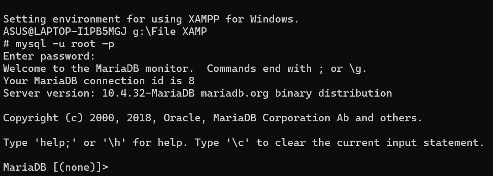

## Analisis kesimpulan

- `<mySQL>` Salah satu aplikasi database server dengan bahasa pemrograman structured query languange `(SQL)` yang berfungsi untuk mengelola data secara terstruktur dan sistematis.
- `<-u root>` Bagian ini mengeset pengguna (user) yang akan digunakan saat terhubung ke server MYSQL. Dalam contoh ini, pengguna yang digunakan adalah `"root"`. Pengguna `"root"` biasanya memiliki hak akses penuh ke server MYSQL dan dapat melakukan tindakan administratif.
- `<-p>` Opsi ini digunakan untuk meminta kata sandi (password) setelah perintah dijalankan ini adalah langkah keamanan yang umum digunakan untuk memastikan hanya pengguna yang sah yang dapat mengakses server MYSQL. Setelah kita menekan Enter setelah perintah ini, kita akan diminta memasukkan kata sandi untuk pengguna `"root"`.

# Data Base

Database (basis data) adalah kumpulan terstruktur dari informasi yang disimpan secara elektronik dalam sistem komputer. Database dirancang untuk menyimpan, mengatur, dan mengelola data dengan cara yang efisien dan dapat diakses.

## buat data base

- `CREATE DATABASE` adalah perintah untuk membuat database baru.
- `[XI_RPL_1]` adalah nama yang Anda pilih untuk database baru Anda. Tanda kurung siku `<("[]")>` digunakan di sini untuk menghindari kesalahan jika nama database mengandung karakter spesial atau spasi. Namun, perlu dicatat bahwa tidak semua DBMS mengizinkan penggunaan tanda kurung siku dalam nama database, jadi pastikan untuk menyesuaikan sintaksdengan DBMS yang Anda gunakan.

### Query

```mysql
create database xi_rpl_1;
```

### Hasil:
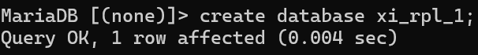
## Tampilkan data base

`SHOW DATABASE` digunakan untuk menampilkan daftar database yang ada dalam sistem manejemen basis data (DBMS). Perintah ini dapat digunakan di beberapa DBMS seperti MYSQL, PostgreSQL, dan beberapa DBMS lainnya. Namun, perintahnya dapat sedikit berbeda tergantung

### Query

```mysql
show databases;
```
### Hasil:
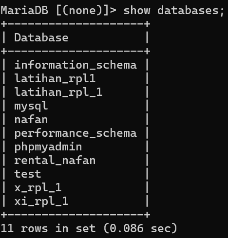

## hapus database

`<DROP DATABASE [nama_database]>` digunakan dalam sistem manajemen basis data (DBMS) untuk menghapus sebuah database beserta semua objek yang terkait dengan database tersebut, seperti tabel, indeks, tampilan, prosedur tersimpan, dan lain-lain.

### Query

```mysql
drop database xi_rpl_1;
```
### Hasil:
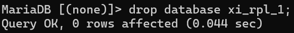

## gunakan data base

`USE [nama_database]` digunakan dalam sistem manajemen basis data (DBMS) untuk beralih atau memilih database yang akan digunakan. Ketika Anda menggunakan perintah `<USE>` diikuti dengan nama database, DBMS akan mengarahkan semua perintah dan operasi selanjutnya pada database yang ditentukan.

### Query
```mysql
use rental_nafan;
```
### Hasil:
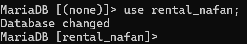
# Tipe Data pada Mysql

## angka

- ==INT:== Untuk menyimpan nilai bilangan bulat (integer). Misalnya, INT dapat digunakan untuk menyimpan angka seperti 1, 100, -10, dan sebagainya.
- ==DECIMAL: ==Digunakan untuk menyimpan nilai desimal presisi tinggi, cocok untuk perhitungan finansial atau keuangan.
- ==FLOAT dan DOUBLE: ==Digunakan untuk menyimpan nilai desimal dengan presisi floating-point. DOUBLE memiliki presisi lebih tinggi dibandingkan FLOAT.
- ==TINYINT, SMALLINT,== ==MEDIUMINT==, dan ==BIGINT: ==Tipe data ini menyimpan bilangan bulat dengan ukuran yang berbeda-beda. Contoh :
    

CREATE TABLE contoh_tabel ( id INT, harga DECIMAL(10, 2), jumlah_barang TINYINT );

Dalam contoh tersebut, id menggunakan tipe data INT, harga menggunakan tipe data `DECIMAL` dengan presisi 10 digit dan 2 angka di belakang koma, dan jumlah_barang menggunakan tipe data `TINYINT.`

## teks
- ==CHAR(N) ==Menyimpan string karakter tetap dengan panjang N. Contoh: ==CHAR(10) ==akan menyimpan string dengan panjang tepat 10 karakter.
- ==VARCHAR(N):== Menyimpan string karakter dengan panjang variabel maksimal N. Misalnya, ==VARCHAR(255) ==dapat menyimpan string hingga 255 karakter, tetapi sebenarnya hanya menyimpan panjang yang diperlukan plus beberapa overhead.
- ==TEXT: ==Digunakan untuk menyimpan teks dengan panjang variabel, tanpa batasan panjang tertentu. Cocok untuk data teks yang panjangnya tidak terduga.
- ==ENUM: ==Memungkinkan Anda mendefinisikan set nilai yang mungkin dan membatasi kolom hanya dapat mengambil salah satu dari nilai tersebut.
- ==SET: ==Mirip dengan ENUM, namun dapat menyimpan satu atau lebih nilai dari himpunan yang telah ditentukan.
    

**Contoh :** 
```mysql
CREATE TABLE nafan_tables (
    nama CHAR(50),
    alamat VARCHAR(100),
    catatan TEXT,
);
```


Hasil : 

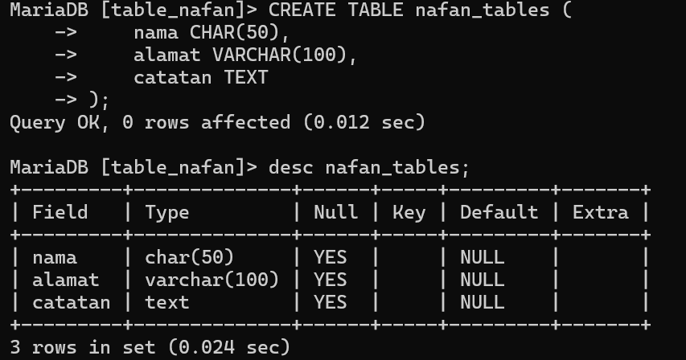
## tanggal

- ==DATE== : Menyimpan nilai tanggal dengan format YYYY-MM-DD.
- ==TIME==: Menyimpan nilai waktu dengan format HH:MM:SS.
- ==DATETIME: ==Menggabungkan nilai tanggal dan waktu dengan format YYYY-MM-DD HH:MM:SS.
- ==TIMESTAMP: ==Sama seperti DATETIME, tetapi dengan kelebihan diatur secara otomatis saat data dimasukkan atau diubah.
    

Contoh : 

```mysql
CREATE TABLE nafan_table (
    tanggal DATE,
    waktu TIME,
    datetimekolom DATETIME,
    timestampkolom TIMESTAMP
);
```

Hasil : 

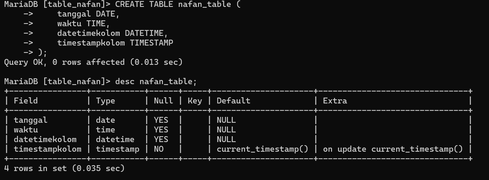


Dalam contoh ini, kolom _==tanggal==_ akan menyimpan nilai tanggal, _==waktu==_ menyimpan nilai waktu, ==*datetimekolom== menyimpan kombinasi tanggal dan waktu, dan *_==timestampkolom==_ akan secara otomatis diatur saat data dimasukkan atau diubah.

## Boolean

- ==BOOL / BOOLEAN / TINYINT(1):== Digunakan untuk menyimpan nilai boolean, yang dapat mewakili kebenaran atau kesalahan. Representasi nilai benar adalah 1, sedangkan nilai salah direpresentasikan sebagai 0. Meskipun nilai selain 0 dianggap benar, secara umum, ketiganya seringkali digunakan secara bergantian. Seringkali, ketika Anda mendeklarasikan kolom sebagai BOOL atau BOOLEAN, MySQL mengonversinya secara otomatis menjadi TINYINT(1), yang juga dapat digunakan untuk menyimpan nilai boolean dengan 0 untuk false dan 1 untuk true.

Contoh : 
```mysql
CREATE TABLE tasks (
    id INT AUTO_INCREMENT PRIMARY KEY,
    task_name VARCHAR(100) NOT NULL,
    completed TINYINT(1) NOT NULL DEFAULT 0
);

```

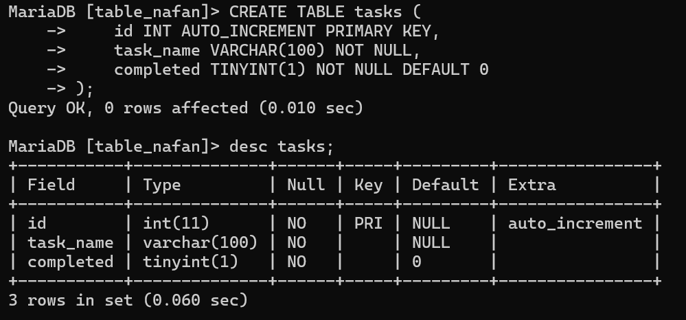

Dalam contoh ini, kita menggunakan TINYINT(1) sebagai tipe data untuk kolom completed. Ini adalah pendekatan yang valid karena MySQL mengonversi BOOL menjadi TINYINT(1) secara otomatis. Dalam hal ini, nilai yang dapat disimpan adalah 1 untuk TRUE dan 0 untuk FALSE.

## Tipe data Pilihan


### Enum 

Misalkan kita ingin membuat tabel `users` dengan kolom `role` yang hanya boleh memiliki beberapa peran tertentu, misalnya "admin", "editor", dan "author". Enum dapat digunakan untuk menetapkan batasan ini:

Contoh : 

```mysql
CREATE TABLE users (
id INT AUTO_INCREMENT PRIMARY KEY,
username VARCHAR(50) NOT NULL, 
role ENUM('admin', 'editor', 'author') NOT NULL );
```

Hasil : 

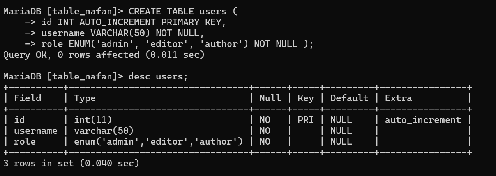

> [! Enum]- **Struktur Tabel**: Tabel `users` terdiri dari tiga kolom: `id` sebagai primary key, `username` untuk menyimpan nama pengguna, dan `role` untuk menyimpan peran pengguna yang dibatasi menjadi "admin", "editor", atau "author".
     
### SET 

tipe data SET digunakan untuk mendefinisikan sebuah kolom yang dapat memiliki satu atau beberapa nilai dari sekumpulan nilai yang telah ditentukan. Nilai-nilai dalam tipe data SET disimpan sebagai himpunan tanpa urutan tertentu, dan setiap nilai hanya dapat muncul satu kali.

Contoh : 
```mysql
CREATE TABLE Set_tabel(
    id INT PRIMARY KEY,
    preferences SET('Email', 'SMS') NOT NULL
);
```

Hasil : 

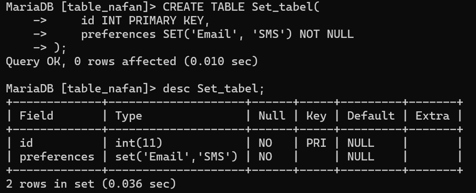


>[! Set ]
kesimpulan Preferences ada kolom dengan tipe data set yang terdapat 2 pilihan didalam nya yaitu Email dan SMS

# Tabel

## Buat Tabel

**Struktur Query**:

```sql
CREATE TABLE [nama_table] ( 
nama_kolom1 tipe_data(ukuran) [tipe_constraint] 
nama_kolom2 tipe_data(ukuran) [tipe_constraint] 
nama_kolom3 tipe_data(ukuran) [tipe_constraint] );
```

**Contoh Query**:

```sql
CREATE TABLE Penjual (
id_pelanggan int(4) PRIMARY KEY NOT NULL,
nama_depan varchar(25) NOT NULL,
nama_belakang varchar(25) NOT NULL,
no_telp char(12) UNIQUE );
```

**Hasil**: 
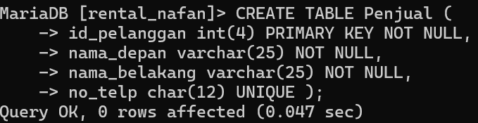

**Analisis**:

- `id_pelanggan`: Kolom bertipe data integer dengan panjang maksimum 4 digit. Dideklarasikan sebagai kunci utama (PRIMARY KEY) yang tidak boleh kosong (NOT NULL).
- `nama_depan`: Kolom bertipe data varchar dengan panjang maksimum 25 karakter. Dideklarasikan sebagai tidak boleh kosong (NOT NULL).
- `nama_belakang`: Kolom bertipe data varchar dengan panjang maksimum 25 karakter. Dideklarasikan sebagai tidak boleh kosong (NOT NULL).
- `no_telp`: Kolom bertipe data char dengan panjang tepat 12 karakter. Dideklarasikan sebagai unik (UNIQUE), yang berarti tidak boleh ada nomor telepon yang sama di antara pelanggan yang berbeda. Tidak dideklarasikan sebagai tidak boleh kosong (NULL).

**Kesimpulan**: struktur tabel ini memungkinkan untuk menyimpan informasi dasar tentang pelanggan, termasuk identifikasi mereka, nama depan dan belakang, serta nomor telepon yang unik jika tersedia.

## Tampilkan Struktur Tabel


**Struktur Query**: 
```mysql
desc [nama_table];
```

**Contoh Query**: 
```mysql
desc Pelanggan;
```

Hasil: 
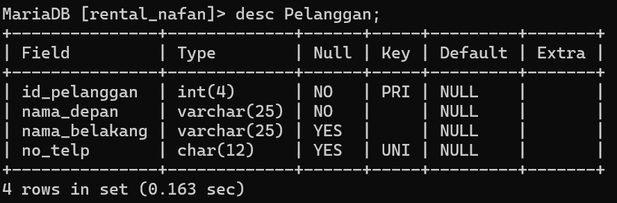

**Analisis**: `desc pelanggan;`:dapat melihat secara detail karakteristik dari setiap kolom dalam tabel tersebut, termasuk nama kolom, tipe data, panjang maksimum (jika berlaku), dan konstrain khusus seperti PRIMARY KEY, UNIQUE, atau NOT NULL yang diterapkan pada setiap kolom.

**Kesimpulan**: perintah tersebut memberikan gambaran tentang bagaimana tabel "Pelanggan" telah didefinisikan dalam basis data.

## Menampilkan Daftar Tabel

**Struktur Query**: 
```mysql
show tables;
```

**Contoh**: 
```mysql
show tables;
```

**Hasil**: 
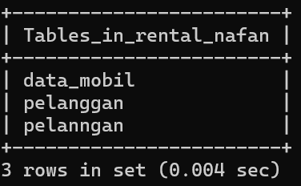

**Analisis**: `show tables;`:untuk menampilkan semua tabel yang ada dalam database yang sedang aktif.

**Kesimpulan**: memiliki peran penting dalam memberikan visibilitas awal terhadap struktur database, yang menjadi dasar untuk pekerjaan lebih lanjut dalam pengelolaan dan penggunaan data.

## QNA

> [! Faq]- Mengapa hanya kolom id_pelanggan yang menggunakan constraint PRIMARY KEY?
> 
> > Untuk membedakan id Pelanggan yang sama, mencegah duplikasi, dan mempermudah pencarian data.

> [! Faq]- Mengapa pada kolom no_telp yang menggunakan tipe data chat bukan varchar?
> 
> > Tipe data char menyimpan data dalam karakter panjang lebih efisien. pencarian pada kolom tipe data `CHAR` dapat lebih cepat.

> [! Faq]- Mengapa hanya kolom no_telp yang menggunakan constraint UNIQUE?
> 
> > Karna no_telp tidak ada yang sama semua pasti berbeda dan nilainya unik maka menggunakan constrains unique artinya data dalam tabel id_telpon berbeda tidak ada yang sama.

> [! Faq]- Mengapa kolom no_telp tidak memakai constraint NOT NULL, sementara kolom lainnya menggunakan constraint tersebut?
> 
> > Nomor telpon dianggap opsional. nomor telepon hanya menjadi wajib saat pengguna melakukan langkah-langkah tertentu, Anda mungkin tidak ingin mengharuskan pengguna mengisinya pada tahap awal.

> [! Faq]- Perbedaan PK & UNIQUE
> 
> > PRIMERY KEY untuk membedakan data yang sama dan hanya boleh 1 dan tidak boleh tidak ada. Kalau UNiQUE sebuah kolom yang memiliki data yang berbeda atau tidak sama unique boleh 1,2,3 Dan seterusnya dan boleh tidak ada.

# Insert

## Insert 1 Data

### Struktur


```mysql
Insert into [nama_tabel]
Values (nilai1, nilai2, nilai3, nilai4)
```

### Contoh


```mysql
insert into Penjual
values (1,"nafan","nabil","08500000");
```

### Hasil
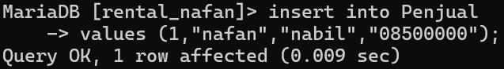


### Analisis

- `insert into Pelanggan`: Ini adalah perintah untuk memasukkan baris data ke dalam tabel "Pelanggan".
- `values (1,"nafan","nabil","081934124518")`: Ini adalah nilai yang akan dimasukkan ke dalam tabel "Pelanggan". Urutannya sesuai dengan kolom-kolom pada tabel tersebut.

### Kesimpulan

mencoba untuk memasukkan data baru ke dalam tabel "Pelanggan".
## Insert > 1 Data

### Struktur

```sql
Insert into [nama_table]
Values (nilai1, nilai2, nilai3, nilai4)
       (nilai1, nilai2, nilai3, nilai4)
       (nilai1, nilai2, nilai3, nilai4)
```

### Contoh

```sql
 insert into Penjual
values (2,"farhan","maulana","0890000"),
(3,"hansar","null","0870000"),
(4,"ardi","ansyah","08100000");
```

### Hasil
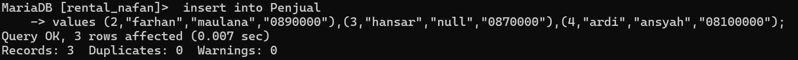
### Analisis

- `insert into Pelanggan`: Ini adalah perintah untuk memasukkan baris data ke dalam tabel "Pelanggan".
- `values (2,"farhan","maualan","0890000"),(3,"hansar","null","0870000"),(4,"ardi","ansyah","08100000");`: Ini adalah nilai yang akan dimasukkan ke dalam tabel "Pelanggan". Urutannya sesuai dengan kolom-kolom pada tabel tersebut.

### Kesimpulan

data telah dimasukkan ke dalam tabel Pelanggan dengan masing-masing nilai kolom sesuai dengan urutan yang diberikan

## Menyebut Kolom

### Struktur


```sql
insert into [nama_table]
(Kolom1, kolom1, kolom3)
values (niali1, nilai2, nilai3);
```

### Contoh


```sql
	insert into Penjual
	(id_pelanggan,nama_depan,nama_belakang)
	values (5,"muh","fadil");
```

### Hasil
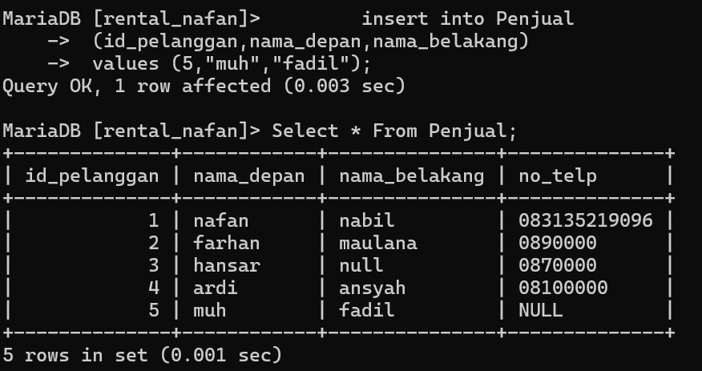


### Analisis

- `insert into Pelanggan`: Ini adalah perintah untuk memasukkan baris data ke dalam tabel "Pelanggan".
- `(id_pelanggan,nama_depan,nama_belakang)`:yang diberikan nilai, sedangkan kolom lainnya akan diisi dengan nilai default jika diperbolehkan atau NULL jika tidak diizinkan.
- `values (5,"muh","fadil")`:Ini adalah nilai yang akan dimasukkan ke dalam tabel "Pelanggan". Urutannya sesuai dengan kolom-kolom pada tabel tersebut.

### Kesimpulan

sebuah entri baru telah dimasukkan ke dalam `tabel Pelanggan`,Tidak ada kolom lain yang diberikan nilai dalam perintah INSERT, sehingga kolom-kolom yang tidak disebutkan akan menggunakan nilai default atau NULL.

## ==Select==

Selanjutnya query ini memiliki fungsi untuk menampilkan hasil dari table yang telah di inputkan (Insert) data kedalam tabel tersebut, berbeda dengan `desc` yang hanya menampilkan struktur dari table query ini menampilkan hasil dari table.

### Select all table

untuk menampilkan hasil dari seluruh table yang telah dibuat/menampilkan seluruh baris dan kolom kita menggunakan format seperti dibawah ini :

```sql
SELECT * FROM [NAMA_TABLE];
```

Dan hasilnya akan tampil seperti ini : 
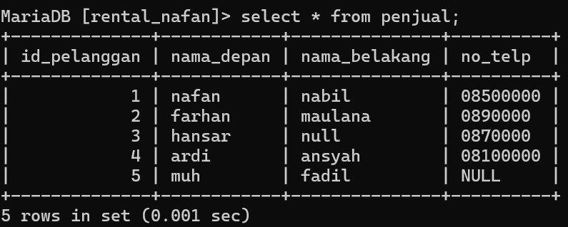

### Select field spesifik

lalu untuk menampilkan beberapa kolom yang spesifik kita dapat menggunakan format yang sedikit berbeda dengan format all table, yaitu seperti dibawah ini :

```sql
SELECT NAMA_KOLOM_1, NAMA_KOLOM_2, NAMA_KOLOM_N FROM PELANGGAN;
```

Dan hasil yang akan tampil ialah kolom kolom yang di minta saja contoh dan hasilnya akan seperti ini : 


### Select kondisi "where"

lalu kondisi yang saat satu ini berfungsi untuk mengambil data yang lebih spesifik dari sebuah field dengan simbol simbol aritmatika mulai dari "+", "-", "/", "%",">","<". Misalnya kita meminta untuk menampilkan field "Nama_Depan" pada "Id_Pelanggan" ke 2, kita dapat menggunakan simbol aritmatika seperti berikut :

```sql
SELECT Nama_Kolom FROM Nama_Table WHERE Id_Pelanggan=2; 
```

Dan contoh serta hasilnya akan terlihat seperti berikut ini : 


> [!info]- Analisis
> 
> > - Insert ialah query yang berfungsi untuk memasukkan data pada table yang telah kita buat.
> > - Select ialah query yang berfungsi untuk menampilkan hasil table dan select ini terbagi menjadi 3 bagian.
> > - 3 Jenis Select ialah Select All Table, Select Field Spesifik dan Select kondisi atau "Where".
> > - Where ini berisikan simbol simbol aritamtika mulai dari "+", "-", "/", "%",">","<".
> > - "`*`"simbol bintang ini memiliki makna "all" atau "semua"

### Kesimpulan
Kesimpulannya ialah **insert** bertugas untuk memasukkan nilai pada table yang telah dibuat dan **Select** berfungsi untuk menampilkan hasil dari table yang telah dibuat dan di input datanya dari _Query_ sebelumnya, lalu **Select** ini dapat menampilkan semua sesuai dengan yang kita menggunakan misalnya jika ingin menampilkan seluruh table kita menggunakan simbol "`*`" atau All lalu jika ingin menampilkan beberapa field kita dapat menggunakan format hanya perlu memanggil nama fieldnya.

Lalu yang terakhir ialah kondisi "Where" dimana kita dapat memanggil nama field dengan menggunakan simbol aritmatika, misalnya kita ingin memanggil field "Nama_Pelanggan" tapi hanya ''Id_Pelanggan" 2 kita dapat menggunkan format seperti ini `SELECT Nama_Kolom FROM Nama_Table WHERE Id_Pelanggan=2;`

## ==Update==

Selanjutnya jika ingin mengganti nilai dari sebuah kolom tertentu kita bisa menggunakan _Query_ **Update** lalu formatnya seperti dibawah ini :

```sql
Format :
UPDATE [Nama_Table] SET [Nama_Kolom]="Nilai_Pengganti" WHERE kondisi;

Contoh :
UPDATE Penjual SET No_Telp="083135219096" WHERE Id_Pelanggan=1;
```

Berikut ialah contoh pengaplikasian dan hasil dari penggunaan **Update** : 
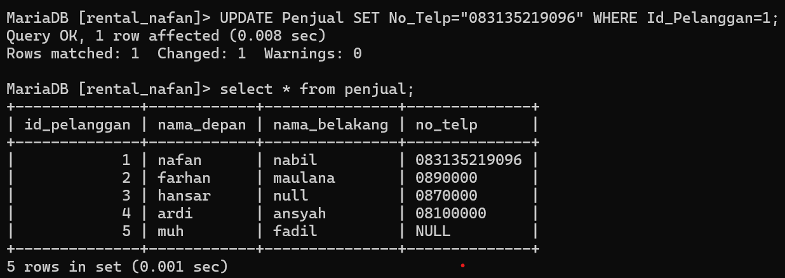

## ==Delete==
Kita juga dapat menghapus baris pada table dengan _Query_ **Delete**, untuk menghapus keseluruhan baris kita dapat menggunakan format seperti ini :

```sql
Format :
DELETE FROM [Nama_Table] WHERE [Nama_Kolom];

Contoh :
DELETE FROM Penjual WHERE Id_Pelanggan=5;

```

Berikut ialah contoh pengaplikasian dan hasil dari penggunaan **Delete** :

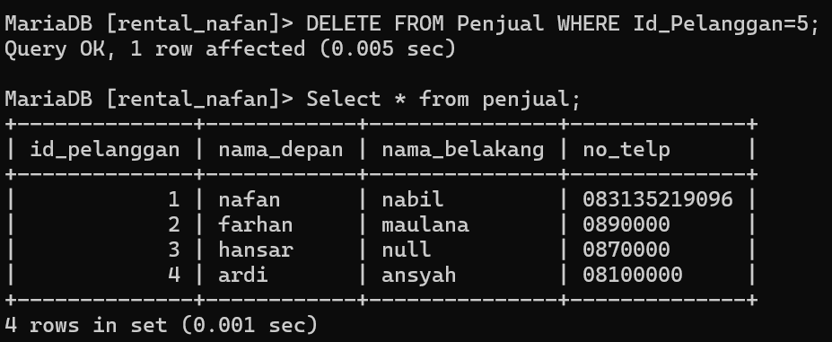


> [!Info]- Analisis
> 
> > **Update** ialah _Query_ untuk mengganti nilai yang telah ada pada sebuah table yang telah ada sebelumnya. **Delete** ialah _Query_ untuk menghapus baris pada sebuah tabel yang telah dibuat sebelumnya. Penggunaan _Where_ masih sangat berperan penting dalam kondisi seperti ini.

### Kesimpulan
dua _Query_ yang akan dipelajari selanjutnya ialah untuk mengganti data dan menghapus baris data pada table. _Query_ nya ialah **Update** untuk mengganti data yang telah ada pada table, dan _Query_ **Delete** untuk menghapus nilai yang telah ada pada table yang telah kita buat. kedua _Query_ ini memiliki format yang lumayan mirip, dimana memerlukan _Where_ untuk menuliskan kondisinya.

UPDATE orders SET CustID = 'ISLAT' WHERE OrderID = 10260;
