# Remedial Basis Data

## Database

### Query : 
```mysql
 Create Database sekolah_nafan;
```
### Hasil : 
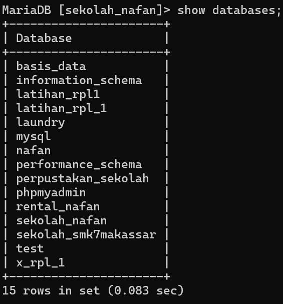
### Analisis 

**CREATE DATABASE sekolah_nafan ;**

- **CREATE DATABASE**: Perintah ini digunakan untuk membuat sebuah database baru.
- **sekolah_nafan**: Nama dari database yang akan dibuat. Dalam hal ini, database tersebut dinamai `sekolah_nafan`.

- **CREATE DATABASE**: Perintah dalam SQL yang digunakan untuk membuat database baru. Database adalah kumpulan data yang terorganisir, dan di dalamnya Anda dapat membuat tabel-tabel untuk menyimpan data lebih spesifik.
- **sekolah_nafan**: Ini adalah nama yang Anda berikan untuk database baru. Nama ini harus unik di dalam server database Anda agar tidak terjadi konflik dengan database yang sudah ada.
## Soal 1
### Query :
```mysql
CREATE TABLE guru (
    id_guru INT AUTO_INCREMENT PRIMARY KEY,
    nama_depan VARCHAR(50) NOT NULL,
    nama_belakang VARCHAR(50),
    mapel VARCHAR(100) NOT NULL,
    jabatan VARCHAR(100),
    usia INT,
    tanggal_lahir DATE
);
```


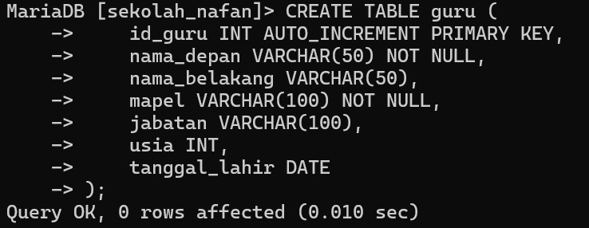

### Hasil:

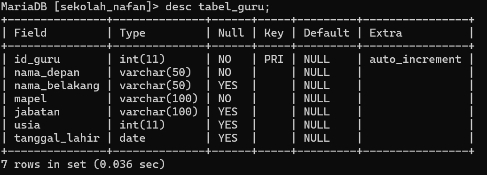
### Analisis

**CREATE TABLE tabel_guru ;**

- **CREATE TABLE**: Perintah ini digunakan untuk membuat tabel baru di dalam database.
- **tabel_guru**: Nama tabel yang akan dibuat. Dalam hal ini, tabel tersebut dinamai `tabel_guru`.

**id_guru INT AUTO_INCREMENT PRIMARY KEY,**

- **id_guru**: Nama kolom pertama yang akan menyimpan ID unik untuk setiap guru.
- **INT**: Tipe data integer (bilangan bulat).
- **AUTO_INCREMENT**: Instruksi untuk secara otomatis menambahkan nilai unik secara berurutan setiap kali baris baru dimasukkan ke dalam tabel. Ini memastikan bahwa setiap guru memiliki ID yang unik tanpa perlu menentukan nilai secara manual.
- **PRIMARY KEY**: Menandai kolom ini sebagai primary key, yang berarti nilai dalam kolom ini harus unik dan tidak boleh null. Primary key digunakan untuk mengidentifikasi setiap baris dalam tabel secara unik.

**nama_depan VARCHAR(50) NOT NULL,**

- **nama_depan**: Nama kolom kedua yang akan menyimpan nama depan guru.
- **VARCHAR(50)**: Tipe data karakter dengan panjang maksimal 50 karakter. VARCHAR digunakan untuk menyimpan teks dengan panjang variabel.
- **NOT NULL**: Instruksi ini berarti kolom ini tidak boleh kosong; setiap baris harus memiliki nilai untuk kolom ini.

**nama_belakang VARCHAR(50),**

- **nama_belakang**: Nama kolom ketiga yang akan menyimpan nama belakang guru.
- **VARCHAR(50)**: Tipe data karakter dengan panjang maksimal 50 karakter. Kolom ini bisa memiliki nilai null, yang berarti tidak wajib diisi.

**mapel VARCHAR(100) NOT NULL,**

- **mapel**: Nama kolom keempat yang akan menyimpan mata pelajaran yang diajarkan oleh guru.
- **VARCHAR(100)**: Tipe data karakter dengan panjang maksimal 100 karakter.
- **NOT NULL**: Kolom ini tidak boleh kosong; setiap baris harus memiliki nilai untuk kolom ini.

**jabatan VARCHAR(100),**

- **jabatan**: Nama kolom kelima yang akan menyimpan jabatan guru.
- **VARCHAR(100)**: Tipe data karakter dengan panjang maksimal 100 karakter. Kolom ini bisa memiliki nilai null, yang berarti tidak wajib diisi.

**usia INT,**

- **usia**: Nama kolom keenam yang akan menyimpan usia guru.
- **INT**: Tipe data integer (bilangan bulat). Kolom ini bisa memiliki nilai null, yang berarti tidak wajib diisi.

**tanggal_lahir DATE**

- **tanggal_lahir**: Nama kolom ketujuh yang akan menyimpan tanggal lahir guru.
- **DATE**: Tipe data tanggal. Kolom ini bisa memiliki nilai null, yang berarti tidak wajib diisi.

- **INT**: Tipe data untuk menyimpan bilangan bulat, seperti ID atau usia.
- **VARCHAR**: Tipe data untuk menyimpan teks dengan panjang variabel, cocok untuk nama atau deskripsi.
- **DATE**: Tipe data untuk menyimpan tanggal.
- **AUTO_INCREMENT**: Digunakan untuk kolom yang perlu menghasilkan nilai unik secara otomatis setiap kali data baru dimasukkan.
- **PRIMARY KEY**: Kolom yang digunakan untuk mengidentifikasi setiap baris secara unik.
- **NOT NULL**: Menandakan bahwa kolom tersebut harus selalu berisi nilai dan tidak boleh kosong.
## Soal 2
### Query : 

```mysql
INSERT INTO tabel_guru (id_guru, nama_depan, nama_belakang, mapel, jabatan, usia, tanggal_lahir)
VALUES
(1, 'Adrianty', '', 'Pemrograman Web', 'Ketua Jurusan', 34, '1982-06-29'),
(2, 'Ibrahim', 'Mallombasang', 'Basis Data', 'Kepala Sekolah', 21, '2000-09-21'),
(3, 'Muhammad', 'Yusuf', 'Pemodelan Perangkat Lunak', '', 28, '1992-12-24'),
(4, 'Rusdyansyar', '', 'Pemrograman Berorientasi Objek', 'Asisten Kepala Sekolah', 25, '1996-01-21');

```

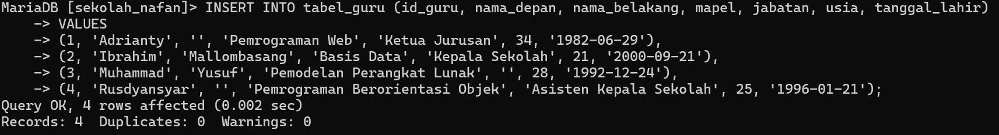
### Hasil :

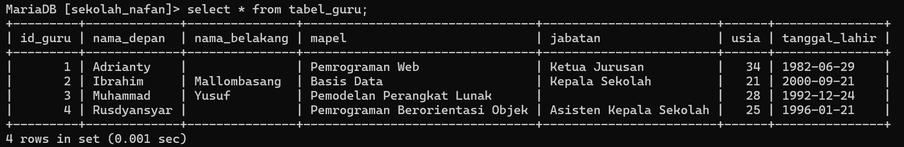

### Analisi : 

- **INSERT INTO**: Perintah ini digunakan untuk memasukkan data baru ke dalam tabel.
- **tabel_guru**: Nama tabel tempat data akan dimasukkan.
- **(id_guru, nama_depan, nama_belakang, mapel, jabatan, usia, tanggal_lahir)**: Daftar kolom yang akan diisi dengan data baru.

**VALUES**

- **VALUES**: Kata kunci ini digunakan untuk menunjukkan bahwa berikutnya akan ada daftar nilai yang sesuai dengan kolom-kolom yang disebutkan sebelumnya.

**(1, 'Adrianty', '', 'Pemrograman Web', 'Ketua Jurusan', 34, '1982-06-29')**

- **(1, 'Adrianty', '', 'Pemrograman Web', 'Ketua Jurusan', 34, '1982-06-29')**: Nilai-nilai ini sesuai dengan kolom yang disebutkan di bagian INSERT INTO.
    - **1**: Nilai untuk kolom `id_guru`, merupakan ID unik untuk guru tersebut.
    - **'Adrianty'**: Nilai untuk kolom `nama_depan`, merupakan nama depan guru.
    - **''**: Nilai untuk kolom `nama_belakang`, merupakan nama belakang guru. Kosong dalam kasus ini.
    - **'Pemrograman Web'**: Nilai untuk kolom `mapel`, merupakan mata pelajaran yang diajarkan oleh guru.
    - **'Ketua Jurusan'**: Nilai untuk kolom `jabatan`, merupakan jabatan guru.
    - **34**: Nilai untuk kolom `usia`, merupakan usia guru.
    - **'1982-06-29'**: Nilai untuk kolom `tanggal_lahir`, merupakan tanggal lahir guru dalam format YYYY-MM-DD.
- **(2, 'Ibrahim', 'Mallombasang', 'Basis Data', 'Kepala Sekolah', 21, '2000-09-21')**
    
    - **2**: ID unik untuk guru.
    - **'Ibrahim'**: Nama depan.
    - **'Mallombasang'**: Nama belakang.
    - **'Basis Data'**: Mata pelajaran.
    - **'Kepala Sekolah'**: Jabatan.
    - **21**: Usia.
    - **'2000-09-21'**: Tanggal lahir.
- **(3, 'Muhammad', 'Yusuf', 'Pemodelan Perangkat Lunak', '', 28, '1992-12-24')**
    
    - **3**: ID unik untuk guru.
    - **'Muhammad'**: Nama depan.
    - **'Yusuf'**: Nama belakang.
    - **'Pemodelan Perangkat Lunak'**: Mata pelajaran.
    - **''**: Jabatan (kosong dalam kasus ini).
    - **28**: Usia.
    - **'1992-12-24'**: Tanggal lahir.
- **(4, 'Rusdyansyar', '', 'Pemrograman Berorientasi Objek', 'Asisten Kepala Sekolah', 25, '1996-01-21')**
    
    - **4**: ID unik untuk guru.
    - **'Rusdyansyar'**: Nama depan.
    - **''**: Nama belakang (kosong dalam kasus ini).
    - **'Pemrograman Berorientasi Objek'**: Mata pelajaran.
    - **'Asisten Kepala Sekolah'**: Jabatan.
    - **25**: Usia.
    - **'1996-01-21'**: Tanggal lahir.

- **id_guru**: Primary key, ID unik untuk setiap guru.
- **nama_depan**: Nama depan guru.
- **nama_belakang**: Nama belakang guru.
- **mapel**: Mata pelajaran yang diajarkan oleh guru.
- **jabatan**: Jabatan yang dipegang oleh guru.
- **usia**: Usia guru.
- **tanggal_lahir**: Tanggal lahir guru dalam format YYYY-MM-DD.

## Soal 3
### Query  :  
```mysql 
VALUES (5, 'Nafan', 'Nabil', 'Rekayasa Perangkat Lunak', 'Siswa', 17, '2007-08-22');
```

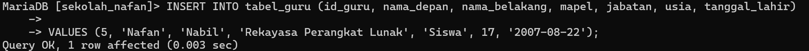
### Hasil : 
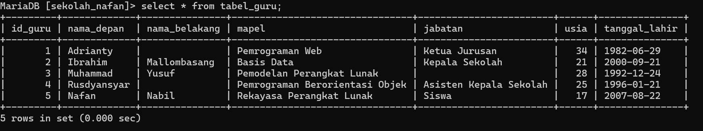
###  Analisis 

1. **VALUES Clause**: Ini adalah bagian dari pernyataan SQL `INSERT INTO`, yang digunakan untuk menyisipkan data baru ke dalam tabel.
    
2. **Data yang Disisipkan**:
    
    - `5`: Nilai untuk kolom `id_guru`. Ini menunjukkan bahwa data ini disisipkan dengan `id_guru` bernilai 5.
    - `'Nafan'`: Nilai untuk kolom `nama_depan`. Ini adalah nama depan dari guru yang dimasukkan.
    - `'Nabil'`: Nilai untuk kolom `nama_belakang`. Ini adalah nama belakang dari guru yang dimasukkan.
    - `'Rekayasa Perangkat Lunak'`: Nilai untuk kolom `mapel` (mata pelajaran). Guru ini mengajar mata pelajaran rekayasa perangkat lunak.
    - `'Siswa'`: Nilai untuk kolom `jabatan`. Dalam konteks ini, mungkin ini adalah posisi atau jabatan guru dalam institusi tertentu, dalam hal ini disebut sebagai "Siswa".
    - `17`: Nilai untuk kolom `usia`. Ini adalah usia dari guru yang dimasukkan.
    - `'2007-08-22'`: Nilai untuk kolom `tanggal_lahir`. Ini adalah tanggal lahir dari guru yang dimasukkan, dalam format YYYY-MM-DD.
3. **Format Penulisan**: Pada kodingan yang diberikan, nilai-nilai yang dimasukkan dikelompokkan dalam urutan yang sesuai dengan urutan kolom yang telah ditentukan dalam tabel target (`tabel_guru` dalam kasus ini). Setiap nilai dikelilingi oleh tanda kutip untuk nilai string dan tanpa tanda kutip untuk nilai numerik, kecuali untuk tanggal yang harus diapit oleh tanda kutip tunggal (') dan diikuti dengan t even Head I

## Soal 4
### Query : 
```mysql 
INSERT INTO tabel_guru (id_guru, nama_depan, nama_belakang, mapel, jabatan, usia, tanggal_lahir)
VALUES
(1, 'Adrianty', '', 'Pemrograman Web', 'Ketua Jurusan', 34, '1982-06-29'),
(2, 'Ibrahim', 'Mallombasang', 'Basis Data', 'Kepala Sekolah', 21, '2000-09-21'),
(3, 'Muhammad', 'Yusuf', 'Pemodelan Perangkat Lunak', '', 28, '1992-12-24'),
(4, 'Rusdyansyar', '', 'Pemrograman Berorientasi Objek', 'Asisten Kepala Sekolah', 25, '1996-01-21'),
(5, 'Nafan', 'Nabil', 'Rekayasa Perangkat Lunak', 'Siswa', 17, '2007-08-22');
```
### Hasil : 


### Analisis
- **`INSERT INTO tabel_guru`**: Ini adalah pernyataan SQL yang digunakan untuk menyisipkan (insert) data ke dalam tabel `tabel_guru`.
    
- **Klausa `VALUES`**: Klausa ini menentukan nilai-nilai yang akan dimasukkan ke dalam tabel. Setiap baris di dalam `VALUES` menunjukkan satu baris data yang akan dimasukkan ke dalam tabel.
    
- **`(id_guru, nama_depan, nama_belakang, mapel, jabatan, usia, tanggal_lahir)`**: Ini adalah daftar kolom-kolom di tabel `tabel_guru` yang akan diisi dengan nilai-nilai yang sesuai dari klausa `VALUES`.
    
- **Baris-baris di dalam `VALUES`**:
    
    - `(1, 'Adrianty', '', 'Pemrograman Web', 'Ketua Jurusan', 34, '1982-06-29')`: Data untuk guru pertama.
        
        - `id_guru = 1`
        - `nama_depan = 'Adrianty'`
        - `nama_belakang = ''`
        - `mapel = 'Pemrograman Web'`
        - `jabatan = 'Ketua Jurusan'`
        - `usia = 34`
        - `tanggal_lahir = '1982-06-29'`
    - `(2, 'Ibrahim', 'Mallombasang', 'Basis Data', 'Kepala Sekolah', 21, '2000-09-21')`: Data untuk guru kedua.
        
        - `id_guru = 2`
        - `nama_depan = 'Ibrahim'`
        - `nama_belakang = 'Mallombasang'`
        - `mapel = 'Basis Data'`
        - `jabatan = 'Kepala Sekolah'`
        - `usia = 21`
        - `tanggal_lahir = '2000-09-21'`
    - `(3, 'Muhammad', 'Yusuf', 'Pemodelan Perangkat Lunak', '', 28, '1992-12-24')`: Data untuk guru ketiga.
        
        - `id_guru = 3`
        - `nama_depan = 'Muhammad'`
        - `nama_belakang = 'Yusuf'`
        - `mapel = 'Pemodelan Perangkat Lunak'`
        - `jabatan = ''` (kosong)
        - `usia = 28`
        - `tanggal_lahir = '1992-12-24'`
    - `(4, 'Rusdyansyar', '', 'Pemrograman Berorientasi Objek', 'Asisten Kepala Sekolah', 25, '1996-01-21')`: Data untuk guru keempat.
        
        - `id_guru = 4`
        - `nama_depan = 'Rusdyansyar'`
        - `nama_belakang = ''`
        - `mapel = 'Pemrograman Berorientasi Objek'`
        - `jabatan = 'Asisten Kepala Sekolah'`
        - `usia = 25`
        - `tanggal_lahir = '1996-01-21'`
    - `(5, 'Nafan', 'Nabil', 'Rekayasa Perangkat Lunak', 'Siswa', 17, '2007-08-22')`: Data untuk guru kelima.
        
        - `id_guru = 5`
        - `nama_depan = 'Nafan'`
        - `nama_belakang = 'Nabil'`
        - `mapel = 'Rekayasa Perangkat Lunak'`
        - `jabatan = 'Siswa'`
        - `usia = 17`
        - `tanggal_lahir = '2007-08-22'`
## Soal 5 
### Query : 
```mysql
SELECT * FROM tabel_guru
WHERE nama_depan = 'Rusdyansyar';

```


### Hasil : 
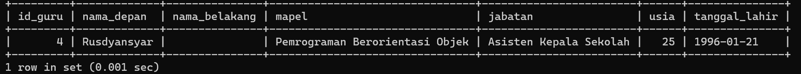
### Analisis 
- **SELECT * FROM tabel_guru**:
    
    - **SELECT**: Ini adalah pernyataan SQL yang digunakan untuk mengambil data dari database.
    - *****: Simbol asterisk (*) berarti "semua kolom". Jadi, `SELECT *` berarti memilih semua kolom dalam tabel.
    - **FROM tabel_guru**: Bagian ini menentukan tabel yang akan diambil datanya, yaitu `tabel_guru`.
- **WHERE nama_depan = 'Rusdyansyar'**:
    
    - **WHERE**: Ini adalah klausa yang digunakan untuk memfilter hasil query berdasarkan kondisi tertentu.
    - **nama_depan = 'Rusdyansyar'**: Kondisi ini menentukan bahwa hanya baris-baris di mana kolom `nama_depan` memiliki nilai `'Rusdyansyar'` yang akan diambil.
    
     - **SELECT**: Digunakan untuk memilih data dari database.
     - **FROM**: Menunjukkan tabel mana yang akan diambil datanya.
     - **WHERE**: Klausa untuk menentukan kondisi filter data.
    - *****: Simbol yang digunakan untuk memilih semua kolom dalam tabel.
    
## Soal 6 
### Query : 
```mysql 
UPDATE tabel_guru
SET nama_belakang = 'Ganteng'
WHERE id_guru = 2;

```

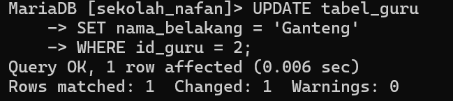
### Hasil : 
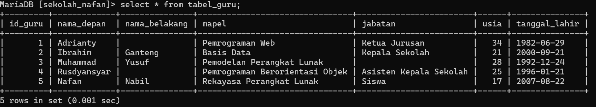
### Analisis 
- **UPDATE tabel_guru**:
    
    - **UPDATE**: Pernyataan SQL yang digunakan untuk mengubah data dalam tabel yang ada.
    - **tabel_guru**: Nama tabel yang akan diperbarui. Dalam hal ini, tabel yang diperbarui adalah `tabel_guru`.
- **SET nama_belakang = 'Ganteng'**:
    
    - **SET**: Klausa ini digunakan untuk menentukan kolom mana yang akan diperbarui dan nilai baru yang akan diberikan.
    - **nama_belakang = 'Ganteng'**: Mengatur kolom `nama_belakang` untuk semua baris yang memenuhi kondisi di klausa `WHERE` menjadi `'Ganteng'`.
- **WHERE id_guru = 2**:
    
    - **WHERE**: Klausa ini digunakan untuk menentukan kondisi yang harus dipenuhi oleh baris yang akan diperbarui.
    - **id_guru = 2**: Kondisi yang menyatakan bahwa hanya baris dengan `id_guru` yang bernilai 2 yang akan diperbarui.
    
    - **UPDATE**: Digunakan untuk memperbarui data yang ada dalam tabel.
    - **SET**: Digunakan untuk menentukan kolom mana yang akan diperbarui dengan nilai baru.
    - **WHERE**: Digunakan untuk menentukan kondisi atau kriteria untuk memilih baris yang akan diperbarui.
## Soal 7 
### Query  : 
```mysql
Delete FROM tabel_guru WHERE id_guru=5;
```

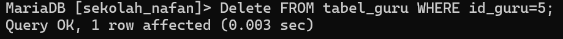
### Hasil : 
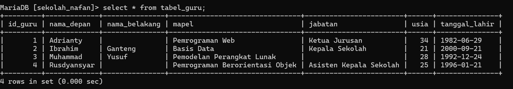
### Analisis 

- **DELETE**:
    
    - **DELETE**: Pernyataan SQL yang digunakan untuk menghapus data dari tabel.
- **FROM tabel_guru**:
    
    - **FROM**: Menentukan tabel sumber data dari mana baris akan dihapus.
    - **tabel_guru**: Nama tabel dari mana data akan dihapus. Dalam hal ini, tabel yang dimaksud adalah `tabel_guru`.
- **WHERE id_guru=5**:
    
    - **WHERE**: Klausa untuk memfilter baris yang akan dihapus berdasarkan kondisi tertentu.
    - **id_guru=5**: Kondisi yang menyatakan bahwa hanya baris dengan `id_guru` yang bernilai 5 yang akan dihapus.
    
     - **DELETE**: Digunakan untuk menghapus data dari tabel yang ada.
    - **FROM**: Digunakan untuk menentukan tabel sumber data.
    - **WHERE**: Digunakan untuk menentukan kondisi atau kriteria untuk memilih baris yang akan dihapus
    
    - Fungsi utama dari query ini adalah untuk menghapus data dalam tabel `tabel_guru`.
    - Query ini akan menghapus baris yang memiliki `id_guru` bernilai 5.
    - Setelah query ini dijalankan, baris dengan `id_guru` bernilai 5 tidak lagi ada dalam tabel `tabel_guru`.
## Soal 8 
### Query : 
```mysql
SELECT * FROM tabel_guru
WHERE usia < 30
  AND mapel LIKE 'Pem%'
ORDER BY usia ASC;

```

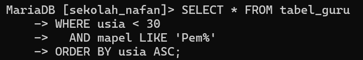
### Hasil : 
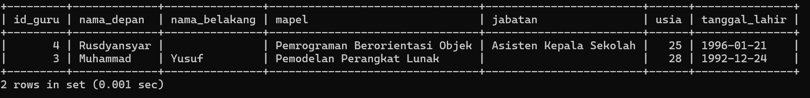
### Analisis 

- **WHERE usia < 30**:
    
    - **WHERE**: Klausa untuk memfilter baris yang akan dipilih atau diproses berdasarkan kondisi tertentu.
    - **usia < 30**: Kondisi yang menyatakan bahwa hanya baris dengan nilai `usia` kurang dari 30 yang akan dipilih.
- **AND mapel LIKE 'Pem%'**:
    
    - **AND**: Operator logika yang digunakan untuk menggabungkan dua kondisi. Kedua kondisi harus benar agar baris dipilih.
    - **mapel LIKE 'Pem%'**: Kondisi yang menyatakan bahwa hanya baris dengan nilai `mapel` yang dimulai dengan "Pem" yang akan dipilih. Karakter `%` adalah wildcard yang mewakili nol atau lebih karakter setelah "Pem".
- **ORDER BY usia ASC**:
    
    - **ORDER BY**: Klausa untuk mengurutkan hasil query.
    - **usia**: Kolom yang digunakan untuk mengurutkan hasil.
    - **ASC**: Urutan naik (ascending) dari nilai terkecil ke terbesar.
    
     - **WHERE**: Klausa yang digunakan untuk menentukan kondisi yang harus dipenuhi oleh baris yang akan dipilih atau diproses dalam query.
    - **AND**: Operator logika yang digunakan untuk menggabungkan beberapa kondisi dalam klausa `WHERE`. Kedua kondisi harus benar agar baris dipilih.
    - **LIKE**: Operator yang digunakan untuk pencarian pola teks. Dalam hal ini, digunakan untuk mencari nilai dalam kolom `mapel` yang dimulai dengan "Pem".
    - **ORDER BY**: Klausa yang digunakan untuk mengurutkan hasil query berdasarkan satu atau lebih kolom.
    
    - **ASC**: Singkatan dari "ascending", yang berarti urutan naik dari nilai terkecil ke terbesar.
     - Klausa `WHERE` memfilter baris yang memenuhi kedua kondisi: `usia` kurang dari 30 dan `mapel` dimulai dengan "Pem".
    - Klausa `ORDER BY` mengurutkan hasil yang difilter berdasarkan kolom `usia` dari yang terkecil ke terbesar.
    - Hasil dari query ini adalah semua baris yang memenuhi kondisi usia kurang dari 30 dan mapel dimulai dengan "Pem", diurutkan berdasarkan usia.

## Soal 9 
### Query : 
```mysql
SELECT id_guru, nama_depan
FROM tabel_guru
WHERE nama_depan LIKE '%i%';

```


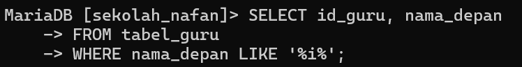
### Hasil : 

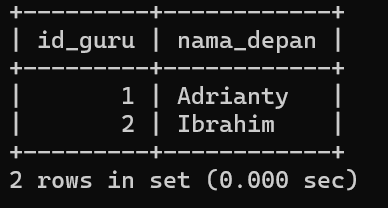
### Analisis 

- **SELECT**: Pernyataan SQL yang digunakan untuk memilih data dari tabel.
- **id_guru, nama_depan**: Kolom yang ingin ditampilkan dalam hasil.
- **FROM**: Klausa yang menentukan tabel sumber data.
- **WHERE**: Klausa yang digunakan untuk memfilter baris yang akan dipilih berdasarkan kondisi tertentu.
- **LIKE**: Operator yang digunakan untuk pencarian pola teks. Dalam hal ini, digunakan untuk mencari nilai dalam kolom `nama_depan` yang mengandung karakter "i".
- **%**: Wildcard yang mewakili nol atau lebih karakter sebelum atau setelah karakter yang ditentukan.

- Klausa `SELECT` memilih kolom `id_guru` dan `nama_depan` dari tabel `tabel_guru`.
- Klausa `WHERE` memfilter baris yang memiliki nilai `nama_depan` yang mengandung karakter "i".
- Hasil dari query ini adalah daftar baris dengan kolom `id_guru` dan `nama_depan` di mana `nama_depan` mengandung karakter "i".
## Soal 10
### Query : 
```mysql
SELECT CONCAT(nama_depan, ' ', nama_belakang) AS nama_lengkap
FROM tabel_guru;

```


### Hasil :
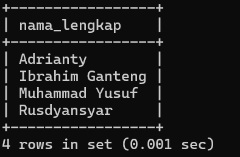
### Analisis

- **CONCAT(nama_depan, ' ', nama_belakang)**:
    
    - **CONCAT**: Fungsi SQL yang digunakan untuk menggabungkan dua atau lebih string menjadi satu string.
    - **nama_depan**: Kolom pertama yang akan digabungkan.
    - **' '**: Spasi yang akan ditambahkan antara `nama_depan` dan `nama_belakang`.
    - **nama_belakang**: Kolom kedua yang akan digabungkan.
- **AS nama_lengkap**:
    
    - **AS**: Klausa yang digunakan untuk memberikan alias atau nama sementara pada hasil gabungan kolom.
    - **nama_lengkap**: Alias untuk hasil gabungan dari `nama_depan` dan `nama_belakang`.
- **FROM tabel_guru**:
    
    - **FROM**: Klausa yang menentukan tabel sumber data. Dalam hal ini, tabel yang digunakan adalah `tabel_guru`.
    
    - **CONCAT**: Fungsi SQL untuk menggabungkan string. Dalam konteks ini, digunakan untuk menggabungkan `nama_depan` dan `nama_belakang` dengan spasi di antaranya.
    
    - **CONCAT(nama_depan, ' ', nama_belakang)**: Menggabungkan nilai kolom `nama_depan` dan `nama_belakang` dari tabel `tabel_guru` dengan menambahkan spasi di antara mereka.
    - **AS nama_lengkap**: Memberikan alias `nama_lengkap` pada hasil gabungan, sehingga kolom hasil gabungan akan diberi nama `nama_lengkap`.

## Soal 11
### Query : 
```mysql 
 ALTER TABLE tabel_guru
 ADD COLUMN status ENUM('PNS', 'PPPK', 'Honorer') NOT NULL DEFAULT 'Honorer';
```

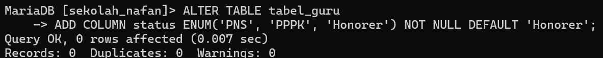

```mysql 
 INSERT INTO tabel_guru (nama_depan, nama_belakang, mapel, jabatan, usia, tanggal_lahir, status)
    -> VALUES
    -> ('Adrianty', '', 'Pemrograman Web', 'Ketua Jurusan', 34, '1982-06-29', 'Honorer'),
    -> ('Ibrahim', 'Ganteng', 'Basis Data', 'Kepala Sekolah', 21, '2000-09-21', 'PPPK'),
    -> ('Muhammad', 'Yusuf', 'Pemodelan Perangkat Lunak', '', 28, '1992-12-24', 'Honorer'),
    -> ('Rusdyansyar', '', 'Pemrograman Berorientasi Objek', 'Asisten Kepala Sekolah', 25, '1996-01-21', 'Honorer');
```

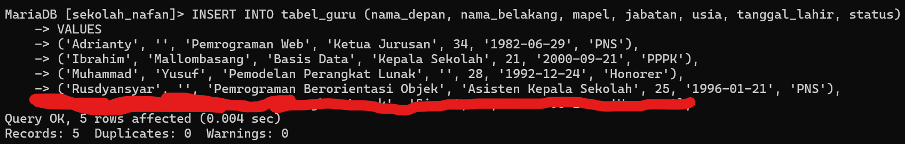
### Hasil : 

Struktur:
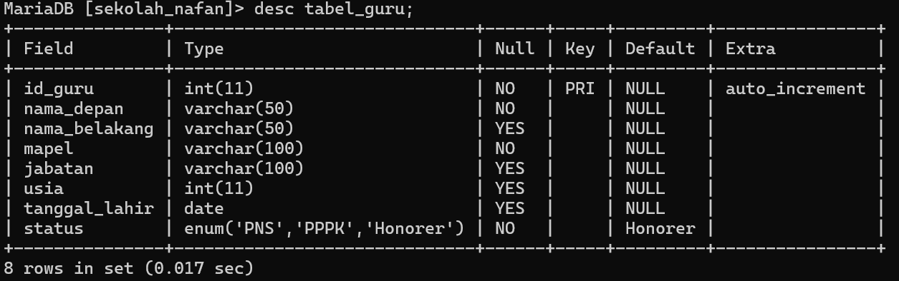


Data Pada Tabel : 
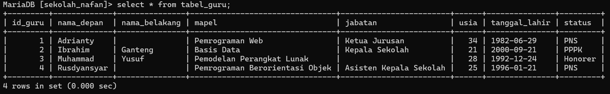
### Analisis 
- **ALTER TABLE**: Ini adalah perintah SQL yang digunakan untuk mengubah struktur tabel yang sudah ada (`tabel_guru` dalam konteks ini).
    
- **ADD COLUMN status**: Menambahkan sebuah kolom baru ke tabel `tabel_guru`. Nama kolomnya adalah `status`.
    
- **ENUM('PNS', 'PPPK', 'Honorer')**: Tipe data `ENUM` digunakan di sini untuk membatasi nilai yang dapat dimasukkan ke dalam kolom `status`. Dalam kasus ini, hanya tiga nilai yang diperbolehkan: 'PNS', 'PPPK', atau 'Honorer'. Ini memastikan bahwa kolom `status` hanya akan menerima nilai dari pilihan yang telah ditentukan.
    
- **NOT NULL**: Menyatakan bahwa kolom `status` tidak boleh bernilai `NULL`, artinya setiap baris harus memiliki nilai yang valid untuk kolom `status`.
    
- **DEFAULT 'Honorer'**: Mengatur nilai default untuk kolom `status` jika tidak ada nilai yang disediakan saat memasukkan data baru ke dalam tabel. Dalam hal ini, nilai defaultnya adalah 'Honorer'.

- Tujuan dari perintah ini adalah untuk memperluas struktur tabel `tabel_guru` dengan menambahkan informasi status pegawai (guru) yang memiliki tiga pilihan status yang sudah ditentukan.

- `INSERT INTO tabel_guru`: Perintah ini digunakan untuk memasukkan data ke dalam tabel `tabel_guru`.
- `(nama_depan, nama_belakang, mapel, jabatan, usia, tanggal_lahir, status)`: Menentukan kolom-kolom mana yang akan diisi dengan nilai yang diberikan dalam VALUES.
- `VALUES`: Bagian dari perintah INSERT yang mendefinisikan nilai-nilai yang akan dimasukkan ke dalam tabel.

- Terdapat empat baris data yang dimasukkan sekaligus:
    - Baris pertama: ('Adrianty', '', 'Pemrograman Web', 'Ketua Jurusan', 34, '1982-06-29', 'Honorer')
    - Baris kedua: ('Ibrahim', 'Ganteng', 'Basis Data', 'Kepala Sekolah', 21, '2000-09-21', 'PPPK')
    - Baris ketiga: ('Muhammad', 'Yusuf', 'Pemodelan Perangkat Lunak', '', 28, '1992-12-24', 'Honorer')
    - Baris keempat: ('Rusdyansyar', '', 'Pemrograman Berorientasi Objek', 'Asisten Kepala Sekolah', 25, '1996-01-21', 'Honorer')
    
     - `nama_depan`: Nama depan dari guru.
    - `nama_belakang`: Nama belakang dari guru (dalam kasus ini beberapa nilai kosong `''`).
    - `mapel`: Mata pelajaran yang diajarkan oleh guru.
    - `jabatan`: Jabatan guru di sekolah (misalnya 'Ketua Jurusan', 'Kepala Sekolah', 'Asisten Kepala Sekolah').
    - `usia`: Usia guru.
    - `tanggal_lahir`: Tanggal lahir guru.
    - `status`: Status pekerjaan guru (dalam kasus ini 'Honorer' untuk semua, kecuali 'Ibrahim' yang memiliki status 'PPPK').

## Soal 12 
### Query : 
```mysql
SELECT nama_depan, MAX(usia) AS usia
FROM tabel_guru;

```

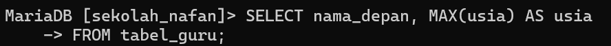
### Hasil : 
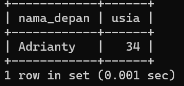
### Analisis
1. **SELECT**: Digunakan untuk memilih kolom-kolom dari tabel yang akan ditampilkan dalam hasil query.
    
    - `nama_depan`: Kolom ini dipilih untuk ditampilkan dalam hasil query. Ini adalah kolom yang berisi nama depan dari setiap guru dalam tabel.
    - `MAX(usia) AS usia`: Menggunakan fungsi agregasi `MAX()` untuk mengambil nilai tertinggi dari kolom `usia` dalam tabel. Alias `usia` diberikan pada hasil agregasi untuk memberikan nama yang lebih deskriptif pada hasil.
2. **FROM**: Menentukan tabel sumber dari mana data akan diambil.
    
    - `tabel_guru`: Nama tabel yang disediakan di mana kita ingin melakukan seleksi dan fungsi agregasi.

**Tujuan Query:**

- Query ini dirancang untuk menampilkan nama depan dari guru yang memiliki usia tertinggi dalam tabel `tabel_guru`. Dengan menggunakan `MAX(usia)`, query akan mengembalikan satu baris hasil yang berisi nama depan dari guru yang memiliki usia tertinggi.

**Catatan Tambahan:**

- Penggunaan `MAX(usia)` akan mengambil nilai usia tertinggi dari semua baris dalam tabel. Jika terdapat beberapa guru dengan usia yang sama tertinggi, query ini akan mengembalikan salah satu dari mereka, tetapi hanya nama depan akan ditampilkan.


