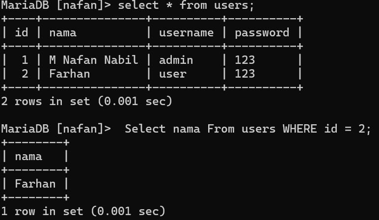
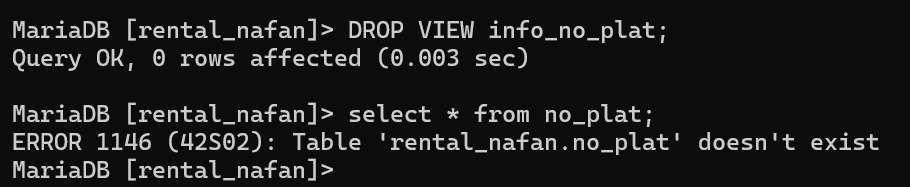

Setelah mempelajari select di materi sebelumnya sekarang kita akan masuk ke dalam materi select lanjutan, fungsi dari select select ini ialah untuk mendapatkan hasil yang lebih spesifik dan lebih luas, sekarang kita akan mempelajari 7 select lanjutan **(AND ,OR ,BETWEEN-AND ,NOT BETWEEN ,<= ,>= ,<> ATAU !=)** Untuk penjelasan lebih lanjutnya ialah seperti berikut :

> [!info]- Isi Table yang akan digunakan :


## AND

untuk **AND** ini akan mengambil "data 1" _dan_ "data 2", contoh kodenya adalah seperti berikut :

```sql
SELECT id_guru,nama_depan FROM tabel_guru WHERE id_guru="3" AND na="Rusdyansyar";
```

Dan hasilnya akan seperti berikut : 


## OR

Untuk **OR** ini akan mengambil "data 1" _atau_ "data 2", contoh kodenya ialah seperti berikut :

```sql
SELECT warna,pemilik FROM data_mobil WHERE warna="Hitam" OR pemilik="ibrahim";
```

Dan hasilnya akan seperti berikut : 


## BETWEEN-AND
Untuk **BETWEEN-AND** ini akan mengambil antara "data 1" _sampai_ "data 2" dibantu dengan **AND**, contoh kodenya ialah seperti berikut :

```sql
SELECT * FROM tabel_guru WHERE tanggal_lahir BETWEEN 1982-06-29 AND 2000-09-21;
```

Dan hasilnya akan seperti berikut : 

## NOT BETWEEN
Untuk **NOT BETWEEN** ini akan mengambil "data" yang _bukan antara_ "data 1" _dan_ "data 2", contoh kodenya ialah seperti berikut :

```sql
SELECT * FROM data_mobil WHERE harga_rental NOT BETWEEN 100000 AND 200000;
```

Dan hasilnya akan seperti berikut : 

## <=
Untuk **<=** ini akan mengambil "data" lebih kecil atau sama dengan "nilai data", contoh kodenya ialah seperti berikut :

```sql
MariaDB [rental_nafan]> SELECT * FROM data_mobil WHERE harga_rental <= 50000;
```

Dan hasilnya akan seperti berikut : 

## >=
Untuk **>=** ini akan mengambil "data" lebih besar atau sama dengan "nilai data", contoh kodenya ialah seperti berikut :

```sql
MariaDB [rental_nafan]> SELECT * FROM data_mobil WHERE harga_rental >= 50000;
```

Dan hasilnya akan seperti berikut : 


## <> atau !=
Untuk **<> atau !=** ini akan mengambil "data" yang tidak sama dengan "nilai data", contoh kodenya ialah seperti berikut :

```sql
MariaDB [rental_nafan]> SELECT * FROM data_mobil WHERE harga_rental <> 50000;
```

Dan hasilnya akan seperti berikut : 

## Tantangan

Untuk tantangan saya akan mengambil nama pemilik "Ibrahim" dengan cara memanggilnya dengan syarat nomor pelatnya yaitu "DD 2440 AX" lalu hasilnya akan seperti berikut : 


## TANTANGAN LOGIN

### Struktur

```sql
SELECT [nama_kolom] FROM [nama_tabel]
WHERE [nama_kolom] = [nilai];
```

### Contoh

```sql
SELECT nama FROM akun 
WHERE id = 1;
```

### Hasil




### Analisis


- `SELECT` : digunakan untuk mengambil sebuah data pada tabel
- `nama` : nama dari kolom yang akan kita tampilkan
- `FROM akun` : merupakan nama tabel yang ingin kita ambil datanya
- `WHERE` : digunakan untuk menyaring data yang ada pada tabel
- `id = 2;` merupakan baris yang akan kita tampilkan yang memiliki id bernilai 2

### Kesimpulan

perintah SQL tersebut adalah mengambil/menampilkan nama yang memiliki ID 2 dari tabel `akun`.


> [!info]- Analisis
> 
> > "AND" : Mengambil data 1 **dan** data 2. "OR" : Mengambil data antara data 1 **atau** data 2. "BETWEEN-AND" : Mengambil data **antara** data 1 **sampai** data 2. "NOT BETWEEN" : Mengambil data yang tidak **antara** data 1 **sampai** data 2. "<=" : Mengambil data yang lebih kecil atau sama dengan nilai data. ">=" : Mengambil data yang lebih besar atau sama dengan nilai data. "<> atau !=" : Mengambil data yang **tidak** sama dengan nilai data.

Kesimpulan : Select ini memiliki cakupan yang luas dan bervariasi semunya juga memiliki kelebihan dan keunikan masing masing sehingga dapat menampilkan hasil sebuah nilai yang di inginkan, keberagaman select ini mulai dari AND ,OR ,BETWEEN-AND ,NOT BETWEEN ,<= ,>= ,<> ATAU !=.

## IN
### Struktur Query

```sql
SELECT * FROM [nama_tabel] WHERE [nama_kolom] IN('nilai1','nilai2');

```

### Contoh

```sql
SELECT * FROM mobil WHERE warna IN('Hitam','Merah');
```

### Hasil


### Analisis


- `SELECT * FROM` : Merupakan query awal untuk menampilkan sebuah tabel yang didalamnya berisikan kolom, di mana kolom tersebut menampung sebuah data.
- `mobil` nama dari tabel yang ingin kita tampilkan data-data nya.
- `WHERE` : digunakan untuk menyaring data yang ada pada tabel.
- `warna IN('Hitam','Merah');` : Query tersebut menampilkan sebuah data pada tabel dimana kolom warna yang bernilai Hitam dan Merah akan di tampilkan.

### Kesimpulan

Perintah MySQL tersebut Menyaring sebuah data pada tabel mobil dimana akan hanya menampilkan warna Hitam dan Merah.

---

## IN & AND

### Struktur Query


```sql
SELECT * FROM [nama_tabel]
 WHERE [nama_kolom] IN ('nilai')
 AND [nama_kolom] = nilai;

```

### Contoh


```sql
SELECT * FROM mobil
     WHERE warna IN('Merah','silver')
     AND harga_rental = 50000;
```

### Hasil


### Analisis

- `SELECT * FROM` : Merupakan query awal untuk menampilkan sebuah tabel yang didalamnya berisikan kolom, di mana kolom tersebut menampung sebuah data.
- `mobil` nama dari tabel yang ingin kita tampilkan data-data nya.
- `WHERE` : digunakan untuk menyaring data yang ada pada tabel.
- `warna IN('Merah','silver') AND harga_rental = 50000;` : Query tersebut mencari dimana kolom warna yang hanya memiliki nilai Merah atau silver, dan kolom harga_rental bernilai 50000 yang akan tampil.

### Kesimpulan

Menggunakan operator AND, memastikan bahwa kedua kondisi/kolom harus benar untuk memilih baris yang akan diambil.

---

## IN & OR

### Struktur Query


```sql
SELECT * FROM [nama_tabel]
    WHERE [nama_kolom] IN ('nilai')
    OR [nama_kolom] = nilai;
```

### Contoh


```sql
SELECT * FROM mobil
     WHERE warna IN('Merah','silver')
     OR harga_rental = 150000;
```

### Hasil


### Analisis

- `SELECT * FROM` : Merupakan query awal untuk menampilkan sebuah tabel yang didalamnya berisikan kolom, di mana kolom tersebut menampung sebuah data.
- `mobil` nama dari tabel yang ingin kita tampilkan data-data nya.
- `WHERE` : digunakan untuk menyaring data yang ada pada tabel.
- `warna IN('Merah','silver') OR harga_rental = 150000;` : query tersebut mencari data pada kolom warna bernilai Merah dan silver atau kolom harga_rental yang bernilai 150000 yang akan ditampilkan.

### Kesimpulan

Menggunakan operator logika OR memastikan bahwa salah satu dari 2 kondisi/kolom tersebut memenuhi syarat akan diambil.

---

## IN + AND + OPERATOR

---

### LEBIH BESAR

#### Struktur Query


```sql
SELECT * FROM [nama_tabel]
     WHERE [nama_kolom] IN ('nilai1','nilai2')
     AND [nama_kolom] > nilai;
```

#### Contoh

```sql
SELECT * FROM mobil
     WHERE warna IN('Merah','silver')
     AND harga_rental > 50000;
```

#### Hasil


#### Analisis

- `SELECT * FROM` : Merupakan query awal untuk menampilkan sebuah tabel yang didalamnya berisikan kolom, di mana kolom tersebut menampung sebuah data.
- `mobil` nama dari tabel yang ingin kita tampilkan data-data nya.
- `WHERE` : digunakan untuk menyaring data yang ada pada tabel.
- `warna IN('Merah','silver') AND harga_rental > 50000;`: query tersebut mencari data pada kolom warna yang bernilai Merah atau silver dengan kriteria harga_rental berada di atas 50000.

#### Kesimpulan

Query tersebut mencari data pada kolom warna yang bernilai Merah atau silver dan pada saat yang sama kolom harga_rental harus lebih besar dari 50000.

---

### LEBIH KECIL

#### Struktur Query


```sql
SELECT * FROM [nama_tabel]
     WHERE [nama_kolom] IN ('nilai1','nilai2')
     AND [nama_kolom] > nilai;
```

#### Contoh


```sql
SELECT * FROM mobil
     WHERE warna IN('Merah','silver')
     AND harga_rental < 1000000;
```

#### Hasil


#### Analisis


- `SELECT * FROM` : Merupakan query awal untuk menampilkan sebuah tabel yang didalamnya berisikan kolom, di mana kolom tersebut menampung sebuah data.
- `mobil` nama dari tabel yang ingin kita tampilkan data-data nya.
- `WHERE` : digunakan untuk menyaring data yang ada pada tabel.
- `warna IN('Merah','silver') AND harga_rental < 50000;`: query tersebut mencari data pada kolom warna yang bernilai Merah atau silver dengan kriteria harga_rental berada dibawah 100000.

#### Kesimpulan

Query tersebut mencari data pada kolom warna yang bernilai Merah atau silver dan pada saat yang sama kolom harga_rental berada dibawah 100000.

---

# LIKE

---

## MENCARI AWALAN

### Struktur Query


```sql
SELECT * FROM [nama_tabel]
     WHERE [nama_kolom] LIKE 'nilai%';
```

### Contoh


```sql
SELECT * FROM mobil
     WHERE pemilik LIKE 'i%';
```

### Hasil


### Analisis

- `SELECT * FROM` : Merupakan query awal untuk menampilkan sebuah tabel yang didalamnya berisikan kolom, di mana kolom tersebut menampung sebuah data.
- `mobil` nama dari tabel yang ingin kita tampilkan data-data nya.
- `WHERE` : digunakan untuk menyaring data yang ada pada tabel.
- `pemilik LIKE 'T%';` : query tersebut mencari data pada kolom pemilik yang berawalan kata huruf T akan diambil.

### Kesimpulan

`SELECT * FROM mobil WHERE pemilik LIKE 'T%';` : Query tersebut mencari data pada tabel mobil yang memiliki awalan kata huruf T pada kolom pemilik.

---

## MENCARI AKHIRAN

### Struktur Query

```sql
SELECT * FROM [nama_tabel]
     WHERE [nama_kolom] LIKE 'nilai%';
```

### Contoh

```sql
SELECT * FROM mobil
     WHERE pemilik LIKE '%m';
```

### Hasil


### Analisis

- `SELECT * FROM` : Merupakan query awal untuk menampilkan sebuah tabel yang didalamnya berisikan kolom, di mana kolom tersebut menampung sebuah data.
- `mobil` nama dari tabel yang ingin kita tampilkan data-data nya.
- `WHERE` : digunakan untuk menyaring data yang ada pada tabel.
- `pemilik LIKE '%a';` : Query tersebut mencari data pada kolom pemilik yang akhiran katanya adalah huruf a yang akan diambil

### Kesimpulan

`SELECT * FROM mobil WHERE pemilik LIKE '%a';` : Perintah query tersebut akan menampilkan sebuah data pada tabel mobil dimana kolom pemilik akhiran katanya huruf a.

---

## MENCARI AWALAN & AKHIRAN

### Struktur Query

```sql
SELECT * FROM [nama_tabel]
   WHERE [nama_kolom] LIKE                            'nilai_awal%nilai_akhir';
```

### Contoh


```sql
SELECT * FROM mobil
   WHERE pemilik LIKE 'i%m';
```

### Hasil


### Analisis

- `SELECT * FROM` : Merupakan query awal untuk menampilkan sebuah tabel yang didalamnya berisikan kolom, di mana kolom tersebut menampung sebuah data.
- `mobil` nama dari tabel yang ingin kita tampilkan data-data nya.
- `WHERE` : digunakan untuk menyaring data yang ada pada tabel.
- `pemilik LIKE 'T%q';` : Perintah query tersebut akan menampilkan sebuah data pada kolom pemilik yang berawalan huruf T dan akhiran katanya q.

### Kesimpulan

`SELECT * FROM mobil WHERE pemilik LIKE 'T%q';` : Perintah query tersebut mencari data pada tabel dimana kolom pemilik yang awalan katanya huruf T dan akhiran katanya q yang akan diambil.

---

## MENCARI BERDASARKAN TOTAL KARAKTER

### Struktur Query

```sql
SELECT * FROM [nama_tabel]
   WHERE [nama_kolom] LIKE 'Nilai__';

SELECT * FROM [nama_tabel]
   WHERE [nama_kolom] LIKE 'underscore';
```

### Contoh

```sql
SELECT * FROM mobil
    WHERE pemilik LIKE 'B___';

SELECT * FROM mobil
     WHERE warna LIKE '______';
```

### Hasil


### Analisis

- `SELECT * FROM` : Merupakan query awal untuk menampilkan sebuah tabel yang didalamnya berisikan kolom, di mana kolom tersebut menampung sebuah data.
- `mobil` nama dari tabel yang ingin kita tampilkan data-data nya.
- `WHERE` : digunakan untuk menyaring data yang ada pada tabel.
- `pemilik LIKE 'T_____';` : perintah query ini akan mencari data dimana kolom pemilik memiliki awalan kata huruf T serta panjang karakternya sebanyak 6.
- `warna LIKE '_____';` : perintah ini mencari data, dimana kolom warna yang memiliki jumlah karakter sebanyak 6 yang akan diambil.

### Kesimpulan

- `SELECT * FROM mobil WHERE pemilik LIKE 'T_____';` : perintah query tersebut akan mencari data pada tabel mobil, dimana kolom pemilik memiliki awalan kata T dan jumlah karakter sebanyak 6 yang akan diambil.
- `SELECT * FROM mobil WHERE warna LIKE '_____';` : dan kalau perintah query ini akan mencari data pada tabel mobil, dimana kolom warna memiliki jumlah karakter sebanyak 6 maka akan diambil.

---

## KOMBINASI


```sql
SELECT * FROM [nama_tabel]
    WHERE [nama_kolom] LIKE 'nilai%'

SELECT * FROM [nama_tabel]
    WHERE [nama_kolom] LIKE 'nilai%';

```

### Contoh


```sql
SELECT * FROM mobil
    WHERE pemilik LIKE '_d%';

SELECT * FROM mobil
    WHERE pemilik LIKE '__i%';
```

### Hasil


### Analisis

- `SELECT * FROM` : Merupakan query awal untuk menampilkan sebuah tabel yang didalamnya berisikan kolom, di mana kolom tersebut menampung sebuah data.
- `mobil` nama dari tabel yang ingin kita tampilkan data-data nya.
- `WHERE` : digunakan untuk menyaring data yang ada pada tabel.
- `pemilik LIKE '_d%';` : perintah ini akan mencari data pada kolom pemilik, dimana underscore nya sebagai pengganti karakter awal dan karakter keduanya bernilai d.
- `pemilik LIKE '__i%';` perintah ini akan mencari data pada kolom pemilik, yang dimana 2 underscore nya sebagai pengganti nilai asli dan karakter ketiganya bernilai i.

### Kesimpulan

- `SELECT * FROM mobil WHERE pemilik LIKE '_d%';` : Perintah query tersebut akan mencari data pada tabel mobil, dimana kolom pemilik yang bernilai d pada karakter keduanya akan diambil.
- `SELECT * FROM mobil WHERE pemilik LIKE '__i%';` : Perintah query tersebut akan mencari data pada tabel mobil, dimana kolom pemilik yang bernilai i pada karakter ketiga yang akan diambil.

---

## NOT LIKE

### Struktur Query


```sql
SELECT * FROM [nama_tabel]
    WHERE [nama_kolom] NOT LIKE 'nilai%';
```

### Contoh

```sql
SELECT * FROM mobil
    WHERE pemilik NOT LIKE 'nafan%';
```

### Hasil


### Analisis

- `SELECT * FROM` : Merupakan query awal untuk menampilkan sebuah tabel yang didalamnya berisikan kolom, di mana kolom tersebut menampung sebuah data.
- `mobil` nama dari tabel yang ingin kita tampilkan data-data nya.
- `WHERE` : digunakan untuk menyaring data yang ada pada tabel.
- `pemilik NOT LIKE 'opi%';` : Perintah query ini tidak akan menampilkan yang bernilai Opi pada kolom pemilik

### Kesimpulan

`SELECT * FROM mobil WHERE pemilik NOT LIKE 'opi%';`: Jadi Perintah tersebut mengecualikan sebuah data pada tabel mobil dimana kolom pemilik yang bernilai Opi tidak akan ditampilkan.

---

# NULL & NOT NULL

## NULL

### Struktur Query

```sql
SELECT * FROM [nama_tabel] WHERE [nama_kolom] IS NULL;
```

### Contoh

```sql
SELECT * FROM mobil WHERE peminjam IS NULL;
```

### Hasil


### Analisis

- `SELECT * FROM` : Merupakan query awal untuk menampilkan sebuah tabel yang didalamnya berisikan kolom, di mana kolom tersebut menampung sebuah data.
- `mobil` nama dari tabel yang ingin kita tampilkan data-data nya.
- `WHERE` : digunakan untuk menyaring data yang ada pada tabel.
- `peminjam IS NULL`pada kolom peminjam akan menampilkan data yang kosong.

### Kesimpulan

Null digunakan ketika kita ingin menampilkan kolom yang kosong/belum ada isinya.

---

## NOT NULL

### Struktur Query


```sql
SELECT * FROM [nama_tabel] WHERE [nama_kolom] IS NOT NULL;
```

### Contoh

```sql
SELECT * FROM mobil WHERE peminjam IS NOT NULL;
```

### Hasil


### Analisis

- `SELECT * FROM` : Merupakan query awal untuk menampilkan sebuah tabel yang didalamnya berisikan kolom, di mana kolom tersebut menampung sebuah data.
- `mobil` nama dari tabel yang ingin kita tampilkan data-data nya.
- `WHERE` : digunakan untuk menyaring data yang ada pada tabel.
- `peminjam IS NOT NULL` pada kolom peminjam akan ditampilkan data yang terisi/tidak kosong.

### Kesimpulan

Not null di gunakan ketika kita ingin menampilkan data yang terisi atau tidak kosong.

---

# ORDER BY & LIMIT

## Mengurutkan data dari data terkecil

### Struktur Query

```sql
SELECT * FROM [nama_tabel] ORDER BY [nama_kolom] ASC;
```

### Contoh

```sql
SELECT * FROM mobil ORDER BY pemilik ASC;
```

### Hasil


### Analisis

- `SELECT * FROM` : Merupakan query awal untuk menampilkan sebuah tabel yang didalamnya berisikan kolom, di mana kolom tersebut menampung sebuah data.
- `mobil` nama dari tabel yang ingin kita tampilkan data-data nya.
- `ORDER BY` digunakan untuk mengurutkan hasil query berdasarkan hasil tertentu.
- `ASC`digunakan untuk mengurutkan hasil secara berurutan dari nilai terkecil ke nilai terbesar, seperti urutan alfabetis dari A ke Z.

### Kesimpulan

`ORDER BY ASC` digunakan untuk mengurutkan nilai dari yang terkecil.

---

## Mengurutkan data dari data terbesar

### Struktur Query

```sql
SELECT * FROM [nama_tabel] ORDER BY [nama_kolom] DESC;
```

### Contoh


```sql
SELECT * FROM mobil ORDER BY peminjam DESC;
```

### Hasil


### Analisis

- `SELECT * FROM` : Merupakan query awal untuk menampilkan sebuah tabel yang didalamnya berisikan kolom, di mana kolom tersebut menampung sebuah data.
- `mobil` nama dari tabel yang ingin kita tampilkan data-data nya.
- `ORDER BY` digunakan untuk mengurutkan hasil query berdasarkan hasil tertentu.
- `DESC` digunakan untuk mengurutkan hasil secara berurutan dari nilai terbesar ke nilai terkecil, seperti urutan alfabetis dari Z ke A.

### Kesimpulan

`ORDER BY DESC` digunakan untuk mengurutkan nilai dari yang terbesar.

---

## Membatasi data yang tampil

## Struktur Query

```sql
SELECT * FROM [nama_tabel]
    WHERE [nama_kolom] = [nilai] ORDER BY         [nama_kolom] ASC LIMIT [nilai];
```

## Contoh


```sql
SELECT * FROM mobil 
    WHERE warna = 'Hitam' ORDER BY                harga_rental ASC LIMIT 2;
```

## Hasil


## Analisis

- `SELECT * FROM` : Merupakan query awal untuk menampilkan sebuah tabel yang didalamnya berisikan kolom, di mana kolom tersebut menampung sebuah data.
- `mobil` nama dari tabel yang ingin kita tampilkan data-data nya.
- `WHERE warna = 'Hitam'` Memilih hanya baris-baris di mana nilai kolom warna adalah `'Hitam'`.
- `ORDER BY harga_rental ASC` Mengurutkan baris-baris tersebut berdasarkan kolom harga_rental secara menaik (dari harga rental terendah ke tertinggi).
- `LIMIT 2` Membatasi hasil query untuk hanya menampilkan 2 baris pertama yang memenuhi kondisi warna hitam dan diurutkan berdasarkan harga rental.

## Kesimpulan

Perintah SQL tersebut mengambil data `mobil` berwarna `hitam` dengan `harga_rental` terendah, hanya menampilkan 2 hasil teratas.

---

# DISTINCT

## Contoh Pertama

### Struktur Query

```sql
SELECT DISTINCT(nama_kolom) FROM [nama_tabel];
```

### Contoh

```sql
SELECT DISTINCT(warna) FROM mobil;
```

### Hasil


### Analisis

- `SELECT DISTINCT (warna)` digunakan untuk mengambil nilai unik dari kolom warna dalam tabel, dan menghapus data duplikat sehingga hanya menampilkan data-data yang berbeda.
- `FROM mobil` Query tersebut memerintahkan untuk mengambil data pada tabel mobil.

### Kesimpulan

Distinct digunakan untuk menampilkan data-data yang asli atau tidak duplikat

---

## Kombinasi Distinct dan Order By

### Struktur Query

```sql
SELECT DISTINCT(nama_kolom) FROM [nama_tabel] ORDER BY [nama_kolom] DESC;
```

### Contoh

```sql
SELECT DISTINCT(harga_rental) FROM mobil ORDER BY harga_rental DESC;
```

### Hasil


### Analisis

- `SELECT DISTINCT (harga_rental)` digunakan untuk mengambil nilai unik dari kolom harga_rental dalam tabel, dan menghapus data duplikat sehingga hanya menampilkan data-data yang berbeda.
- `FROM mobil` Query tersebut memerintahkan untuk mengambil data pada tabel mobil.
- `ORDER BY harga_rental DESC` Query tersebut Mengurutkan isi dalam kolom harga_rental dari yang tertinggi.

### Kesimpulan

Kombinasi Distinct dan Order By digunakan ketika ingin mengetahui jumlah data asli yang ada pada kolom secara berurutan, baik dari yang tertinggi ataupun yang terendah.

---

# CONCAT, CONCAT_WS, AS

## Menggabungkan kolom tanpa pemisah

### Struktur Query

```sql
SELECT CONCAT(kolom1,kolom2) FROM [nama_tabel];
```

### Contoh

```sql
SELECT CONCAT(pemilik,warna) FROM mobil;
```

### Hasil


### Analisis

- `SELECT CONCAT` digunakan untuk mengambil dan menggabungkan 2 kolom atau lebih menjadi satu string tunggal.
- `(pemilik,warna)` Merupakan kolom yang akan di gabungkan menjadi satu.
- `FROM mobil` query tersebut akan mengambil data dari tabel mobil.

### kesimpulan

`CONCAT` digunakan ketika kita ingin menggabungkan suatu kolom menjadi satu.

---

## Menggabungkan kolom dengan pemisah

### Struktur Query

```sql
SELECT  CONCAT_WS(Separator,kolom1,kolom2,
kolom3) FROM [nama_tabel];
```

### Contoh

```sql
SELECT CONCAT_WS("-",no_plat,no_mesin,
id_mobil) FROM mobil;
```

### Hasil


### Analisis

- `SELECT CONCAT_WS` digunakan untuk mengambil dan menggabungkan 2 kolom atau lebih menjadi satu string tunggal dengan pemisah.
- `("-",no_plat,no_mesin,id_mobil)` tanda "-" adalah pemisah yang akan digunakan. `no_plat,no_mesin,id_mobil` nama kolom-kolom yang dipilih dari tabel untuk di gabungkan.
- `FROM mobil` query tersebut akan mengambil data dari tabel mobil.

### kesimpulan

`CONCAT_WS` digunakan untuk menggabungkan nilai kolom-kolom dengan pemisah agar data-data yang di gabung terlihat rapi.

---

## Memberikan nama kolom alias

### Struktur Query

```sql
SELECT CONCAT_WS(Separator,kolom1,kolom2) AS [nama_alias] FROM mobil;
```

### Contoh

```sql
SELECT CONCAT_WS("+",pemilik,peminjam) AS COLLAB FROM mobil;
```

### Hasil


### Analisis

- `SELECT CONCAT_WS` digunakan untuk mengambil dan menggabungkan 2 kolom atau lebih menjadi satu string tunggal dengan pemisah.
- `("+",pemilik,peminjam)` tanda`"+"` sebagai pemisah `pemilik,peminjam` merupakan kolom yang akan digabungkan nilainya,setiap nilai dari kolom `pemilik` dan `peminjam` akan digabungkan menjadi satu string dengan tanda `"+"` di antara mereka.
- `AS COLLAB` AS merupakan alias sedangkan collab nama dari penggabungan 2 kolom yaitu pemilik dan peminjam.
- `FROM mobil` query tersebut akan mengambil data dari tabel mobil.

### kesimpulan

Kita bisa menggunakan Query tersebut untuk menggabungkan sebuah kolom dengan memberi nama alias, agar lebih mudah di mengerti.

---

# VIEW

## Membuat tabel virtual

### Struktur Query


```sql
CREATE VIEW [nama_tabel_virtual] AS SELECT id_mobil,no_plat,pemilik,peminjam FROM [nama_tabel] WHERE [nama_kolom] = "nilai";
```

### Contoh

```sql
CREATE VIEW info_no_plat AS SELECT id_mobil, no_plat, pemilik, peminjam FROM mobil WHERE pemilik = "Baim";
```

### Hasil


### Analisis

- `CREATE VIEW info_no_plat AS` Perintah query tersebut membuat sebuah tabel virtual dengan nama info_no_plat.
- `SELECT id_mobil, no_plat, pemilik, peminjam FROM mobil` digunakan untuk memilih kolom-kolom dari tabel mobil untuk di masukkan ke dalam tabel virtual yang dibuat.
- `WHERE pemilik = "Baim";` perintah tersebut akan menampilkan data-data yang pemiliknya Dani.

### kesimpulan

Tabel virtual digunakan untuk mengelompokkan sebuah kolom tertentu dari tabel yang sudah ada.

---

## Menampilkan tabel virtual

### Struktur Query

### Contoh

```sql
SELECT * FROM info_no_plat;
```

### Hasil

### Analisis

- `SELECT * FROM` : Merupakan query awal untuk menampilkan sebuah tabel virtual yang didalamnya berisikan kolom, di mana kolom tersebut menampung sebuah data.
- `info_no_plat` nama dari tabel virtual.

### kesimpulan

Jika ingin menampilkan tabel virtual cukup dengan perintah SELECT * FROM.

---

## Menghapus tabel virtual

### Struktur Query

### Contoh

```sql
DROP VIEW info_no_plat;
```

### Hasil


### Analisis

- `DROP VIEW` perintah query tersebut akan menghapus tabel virtual.
- `info_no_plat` nama tabel virtual yang akan di hapus.

### kesimpulan

Jika ingin menghapus tabel virtual cukup dengan perintah DROP VIEW.

---

# Tantangan

## 1

### Struktur Query


```sql
CREATE VIEW [nama_tabel_virtual] AS SELECT [kolom_pilihan] FROM [nama_tabel] WHERE [kolom] = nilai;
```

### Contoh

```sql
CREATE VIEW tantangan AS SELECT no_plat,warna,peminjam FROM mobil WHERE peminjam is null;
```

### Hasil


### Analisis

- `CREATE VIEW` perintah MySQL yang digunakan untuk membuat tabel view yang akan tersimpan di dalam database.
- `tantangan AS` nama alias dari tabel virtual yang kita buat.
- `SELECT no_plat,warna,peminjam` Kolom yang kita pilih untuk di masukkan ke dalam sebuah tabel view yang dibuat.
- `FROM mobil` kolom yang kita pilih untuk tabel view merupakan dari tabel mobil yang sudah ada.
- `WHERE peminjam is null;` data yang akan tampil dimana peminjamnya null atau tidak ada.

### Kesimpulan

Program MySQL tersebut membuat sebuah view yang disebut `tantangan` yang berisi daftar mobil yang belum dipinjam, dengan kolom-kolom `no_plat`, `warna`, dan `peminjam` dari tabel `mobil` di mana nilai `peminjam` belum diisi (NULL). View ini menyediakan informasi tentang mobil-mobil yang tersedia untuk dipinjam.

---

## 2

### Struktur Query

```sql
UPDATE [nama_tabel] SET [nama_kolom] = nilai WHERE [nama_kolom] = nilai;
```

### Contoh

```sql
UPDATE mobil SET peminjam = Farhan WHERE id_mobil = 4;
```

### Hasil


### Analisis

- `UPDATE mobil` Query tersebut akan mengupdate data pada tabel mobil.
- `SET peminjam = NULL` perintah tersebut akan mengosongkan kolom peminjam dengan `NULL`.
- `WHERE id_mobil = 4;` data yang akan di update yang memiliki `Id_mobil = 4`.

### Kesimpulan

Perintah MySQL tersebut akan mengubah nilai kolom `peminjam` menjadi NULL untuk `mobil` yang memiliki `id_mobil = 4` dalam tabel `mobil`.

---

# AGREGASI

## Menghitung total nilai numerik suatu kolom (Sum)

### Struktur Query


```sql
SELECT SUM(nama_kolom) AS [nama_alias] FROM [nama_tabel]
```

### Contoh

```sql
SELECT SUM(harga_rental) AS total_harga FROM mobil;
```

### Hasil


### Analisis

- `SELECT` digunakan untuk mengambil/menampilkan data
- `SUM` digunakan untuk menjumlahkan nilai numerik dalam kolom.
- `harga_rental` nama kolom yang ingin di jumlahkan nilainya.
- `AS total_harga`sebagai nama alias kolom
- `FROM mobil` query tersebut akan mengambil data dari tabel mobil.

### Kesimpulan

`SUM` digunakan untuk menjumlahkan nilai numerik dalam kolom

---

## Menghitung jumlah baris/data, biasanya berdasarkan kriteria tertentu (Count)

### Struktur Query

```sql
SELECT COUNT(nama_kolom) AS [nama_alias] FROM 
[nama_tabel];
```

### Contoh

```sql
SELECT COUNT(pemilik) AS total_pemilik FROM mobil;
```

### Hasil


### Analisis

- `SELECT` digunakan untuk mengambil/menampilkan data.
- `COUNT` digunakan untuk menghitung jumlah baris(nilai non-NULL).
- `pemilik` nama kolom yang ingin di hitung jumlah barisnya.
- `AS total_pemilik` sebagai nama alias kolom
- `FROM mobil` query tersebut akan mengambil data dari tabel mobil.

### Kesimpulan

`COUNT` digunakan ketika ingin menghitung jumlah baris dalam suatu kolom(atau jumlah non-NULL).

---

### Struktur Query

```sql
SELECT COUNT(nama_kolom) AS [nama_alias] FROM 
[nama_tabel];
```

### Contoh

```sql
SELECT COUNT(peminjam) AS total_peminjam FROM mobil;
```

### Hasil


### Analisis

- `SELECT` digunakan untuk mengambil/menampilkan data.
- `COUNT` digunakan untuk menghitung jumlah baris(nilai non-NULL).
- `peminjam` nama kolom yang ingin di hitung jumlah barisnya.
- `AS total_peminjam` sebagai nama alias kolom
- `FROM mobil` query tersebut akan mengambil data dari tabel mobil.

### Kesimpulan

`COUNT` digunakan untuk menghitung jumlah baris dalam kolom yang hanya memiliki (bukan NULL)

---

## Menampilkan nilai terendah (Min)

### Struktur Query

```sql
SELECT MIN(nama_kolom) AS [nama_alias] FROM [nama_tabel];
```

### Contoh


```sql
SELECT MIN(harga_rental) AS minimum FROM mobil;
```

### Hasil


### Analisis


- `SELECT` digunakan untuk mengambil/menampilkan data.
- `MIN` digunakan untuk menampilkan nilai numerik terendah dalam suatu kolom.
- `harga_rental` nama kolom yang ingin kita tampilkan nilai terendahnya.
- `AS minuman` sebagai nama alias kolom
- `FROM mobil` query tersebut akan mengambil data dari tabel mobil.

### Kesimpulan

`MIN` digunakan untuk menampilkan nilai terendah dari suatu kolom.

---

## Menampilkan nilai tertinggi (Max)

### Struktur Query

```sql
SELECT MAX(nama_kolom) AS [nama_alias] FROM [nama_tabel];
```

### Contoh

```sql
SELECT MAX(harga_rental) AS maximum FROM mobil;
```

### Hasil


### Analisis

- `SELECT` digunakan untuk mengambil/menampilkan data.
- `MAX` digunakan untuk menampilkan nilai numerik tertinggi dalam suatu kolom
- `harga_rental` nama kolom yang ingin kita tampilkan nilai tertinggi nya.
- `AS maximun` sebagai nama alias kolom
- `FROM mobil` query tersebut akan mengambil data dari tabel mobil.

### Kesimpulan

`MAX` digunakan untuk menampilkan nilai numerik tertinggi dari suatu kolom.

---

## Menampilkan nilai rata-rata (Avg)

### Struktur Query

```sql
SELECT AVG(nama_kolom) AS [nama_alias] FROM [nama_tabel];
```

### Contoh

```sql
SELECT AVG(harga_rental) AS rerata FROM mobil;
```

### Hasil


### Analisis

- `SELECT` digunakan untuk mengambil/menampilkan data.
- `AVG` digunakan untuk menghitung rata-rata dari nilai numerik yang ada pada kolom
- `harga_rental` nama kolom yang ingin kita tampilkan nilai tertinggi nya.
- `AS rerata` sebagai nama alias kolom
- `FROM mobil` query tersebut akan mengambil data dari tabel mobil.

### Kesimpulan


`AVG` digunakan untuk menghitung rata-rata dari nilai numerik pada suatu kolom.

## Relasi Tabel

