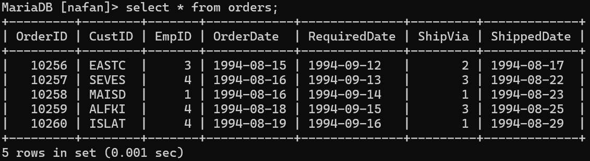
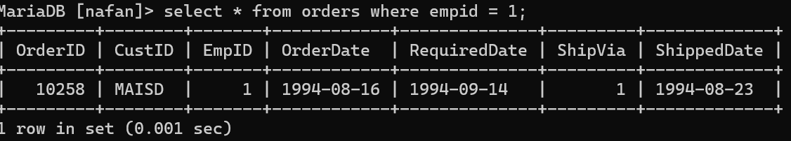
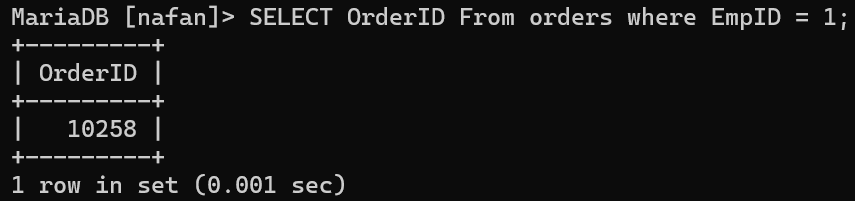

# 11
## Query
```mysql
INSERT INTO orderid (OrderID, CustID, EmpID, OrderDate, RequiredDate, ShippedDate, ShipVia)
    -> VALUES
    -> (10256, 'EASTC', 3, '1994-08-15', '1994-09-12', '1994-08-17', 2),
    -> (10257, 'SEVES', 4, '1994-08-16', '1994-09-13', '1994-08-22', 3),
    -> (10258, 'MAISD', 1, '1994-08-16', '1994-09-14', '1994-08-23', 1),
    -> (10259, 'ALFKI', 4, '1994-08-18', '1994-09-15', '1994-08-25', 3),
    -> (10260, 'ISLAT', 4, '1994-08-19', '1994-09-16', '1994-08-29', 1);
```
## Analisis
Program ini adalah contoh output dari sebuah tabel "orders" dalam format yang mirip dengan tabel yang ada dalam database relasional. Tabel ini mungkin digunakan untuk melacak pesanan dalam sebuah sistem, dan setiap baris mewakili satu pesanan dengan informasi yang terkait.
1. **OrderID**: Ini adalah ID unik untuk setiap pesanan. Setiap pesanan memiliki nomor ID yang berbeda.
2. **CustID**: Ini adalah ID atau kode pelanggan yang melakukan pesanan. Setiap pelanggan memiliki kode yang berbeda. Perhatikan bahwa untuk OrderID 10260, nilai CustID diganti dari 'ALFKI' menjadi 'ISLAT'.
3. **EmpID**: Ini adalah ID karyawan yang memproses pesanan.
4. **OrderDate**: Ini adalah tanggal ketika pesanan dibuat.
5. **RequiredDate**: Ini adalah tanggal ketika pelanggan meminta pesanan tersebut harus dipenuhi.
6. **ShipVia**: Ini mungkin adalah metode pengiriman yang digunakan untuk pesanan tersebut.
7. **ShippedDate**: Ini adalah tanggal ketika pesanan dikirim.

- Memeriksa bagaimana data ini digunakan dalam sistem yang lebih besar.
- Melakukan analisis tren pada data pesanan dari waktu ke waktu.
- Melakukan pemrosesan lebih lanjut atau analisis statistik terhadap pesanan, misalnya, total penjualan, rata-rata jumlah pesanan, atau metode pengiriman yang paling umum digunakan.
## Hasil


## Kesimpulan
Kesimpulannya, program ini memberikan gambaran tentang pesanan yang diproses dalam suatu sistem, termasuk detail-detail penting seperti informasi pelanggan, tanggal pesanan, informasi pengiriman, dan keterlibatan karyawan. Dengan menggunakan data ini secara efektif, bisnis dapat meningkatkan efisiensi operasional dan memenuhi kebutuhan pelanggan dengan lebih baik.
# 12
## Query
```mysql
select * from orders where empid = 1;
```
## Analisis
Output program menunjukkan satu baris data dari tabel orders. Berikut adalah analisis singkat

1. **OrderID**: Nomor pesanan adalah 10258.
2. **CustID**: Kode pelanggan yang melakukan pesanan adalah 'MAISD'.
3. **EmpID**: Karyawan dengan ID 1 yang memproses pesanan.
4. **OrderDate**: Pesanan dibuat pada tanggal 16 Agustus 1994.
5. **RequiredDate**: Pelanggan meminta pesanan harus dipenuhi pada tanggal 14 September 1994.
6. **ShipVia**: Metode pengiriman yang digunakan adalah 1.
7. **ShippedDate**: Pesanan dikirim pada tanggal 23 Agustus 1994.

Analisis program ini terbatas pada satu baris data, sehingga informasi yang diberikan tidak memberikan gambaran yang lengkap tentang kinerja keseluruhan sistem atau tren pesanan. Namun, kita dapat menyimpulkan bahwa pesanan ini diproses dengan sukses, dan pengiriman dilakukan dalam waktu yang wajar, yaitu pada tanggal 23 Agustus 1994, beberapa hari setelah pesanan dibuat.

## Hasil

## Kesimpulan
Satu pesanan spesifik (OrderID: 10258) telah diproses. Pelanggan dengan kode 'MAISD' melakukan pesanan tersebut. Pesanan dibuat pada tanggal 16 Agustus 1994, dan pelanggan meminta pesanan harus dipenuhi pada tanggal 14 September 1994. Pesanan dikirim pada tanggal 23 Agustus 1994 dengan metode pengiriman yang tidak spesifik. Meskipun pesanan tersebut dikirim lebih awal dari yang diminta oleh pelanggan, informasi tersebut memberikan gambaran tentang efisiensi layanan yang mungkin terjadi dalam sistem.

CREATE TABLE siswa (
 id_siswa int(10) Primary Key,
 nama_siswa varchar(25) Not Null,
buku_yang_dipinjam Varchar(25) Not Null,
tgl_peminjam date Not Null,
 tgl_pengembalian date Not Null );

# 13
## Query
```mysql
SELECT OrderID From orders where EmpID = 1;
```
## Analisis
Query ini bertujuan untuk menampilkan OrderID dari pesanan yang diproses oleh karyawan dengan ID 1. Output dari query ini adalah OrderID dari pesanan-pesanan tersebut. Dalam hal ini, hanya satu pesanan yang diproses oleh karyawan dengan ID 1, yaitu pesanan dengan OrderID 10258.
## Hasil

## Kesimpulan
Dengan menggunakan kriteria yang diberikan dalam query, kita dapat dengan mudah mengidentifikasi pesanan-pesanan yang diproses oleh karyawan dengan ID 1. Hasilnya menunjukkan bahwa hanya ada satu pesanan yang sesuai dengan kriteria tersebut, yaitu pesanan dengan OrderID 10258. Ini memberikan informasi yang berguna tentang aktivitas karyawan tertentu dalam proses pesanan.
