# Anatomi CSS


## Selector

Selector CSS di gunakan untuk memilih elemen HTML yang akan diberi gaya.Dengan menggunakan selector, Anda dapat menargetkan satu atau lebih elemen HTML untuk menerapkan properti CSS.
## Property

Property dalam CSS adalah karakteristik atau gaya yang diterapkan pada elemen HTML, seperti warna, ukuran font, atau margin. Properti bekerja dengan selector untuk mengatur tata letak dan penampilan elemen

## Property value

Dalam CSS property value (nilai sifat) merujuk pada nilai konkret yang diberikan kepada suatu properti.

# Percobaan I

# Kode Program


```html
<!DOCTYPE html>
<html>
    <head>
        <title>Belajar CSS 1</title>
        <style>
            p {
                color: red;
            }
        </style>
    </head>
    <body>
        <p>Welcome CSS</p>
    </body>
</html>
```

# Hasil


Penjelasan

1. : Mendefinisikan jenis dokumen HTML yang digunakan, dalam hal ini HTML5.
2. : Elemen utama yang memuat seluruh konten dokumen.
3. : Bagian yang berisi informasi tambahan tentang dokumen, seperti judul dan link ke stylesheet eksternal.
4. `<title>`: Menentukan judul halaman web yang akan ditampilkan di tab browser.
5. `<style>`: Bagian di mana Anda dapat menambahkan aturan CSS untuk mengubah tampilan elemen HTML di halaman.
6. `p { color: red; }`: Aturan CSS yang mengubah warna teks pada semua elemen
    
    menjadi merah.
    
7. : Bagian yang berisi konten aktual halaman web, seperti teks, gambar, atau elemen lainnya.
8. Welcome CSS
    
    : Elemen paragraf dengan teks "Welcome CSS", yang akan ditampilkan dengan warna merah karena aturan CSS yang telah ditentukan sebelumnya.

# Percobaan II 
## Kode Program
```css
button{         
width: 150px;             
height: 50px;               
color: white;               
font-size: 20px;              
text-align: right;        
}
```

Color

Before
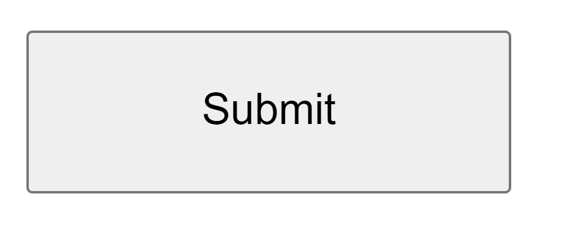
After
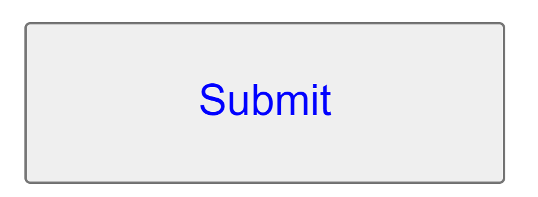
Font-size

Before

After
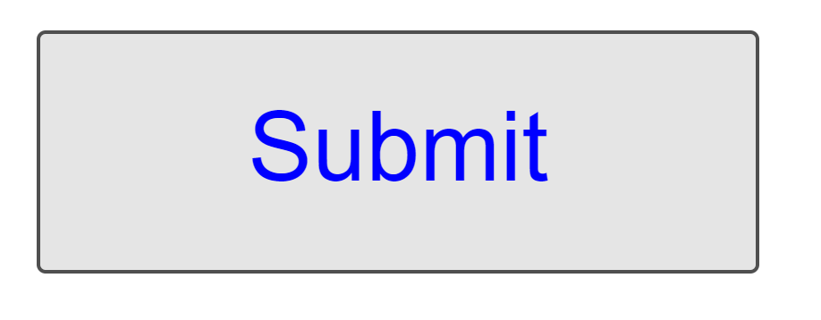
Text-align

Before

After
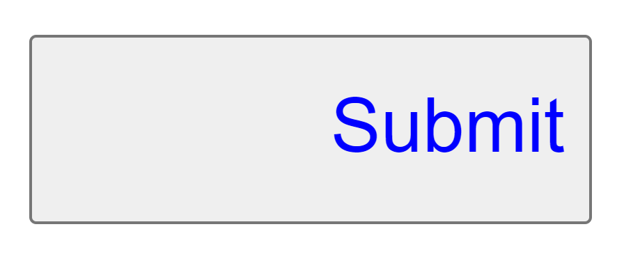

Cara Pemanggilan CSS Cara untuk memanggil css ke html ada 3 cara yaitu inline, internal, dan external.

Inline jadi Inline merupakan salah satu cara untuk memanggil css yaitu dengan cara memanggilnya kedalam baris yang sama dengan tag yang ingin di modifikasi contoh

inline

Kode Program
```css
<!DOCTYPE html>
<html lang="en">
<head>
    <title>Contoh CSS Inline</title>
</head>
<body>
    <h1 style="color: blue; text-align: center;">Selamat Datang di Halaman Saya</h1>
    <p style="font-size: 16px; color: green;">Ini adalah contoh paragraf dengan CSS inline.</p>
</body>
</html>

```

Hasil
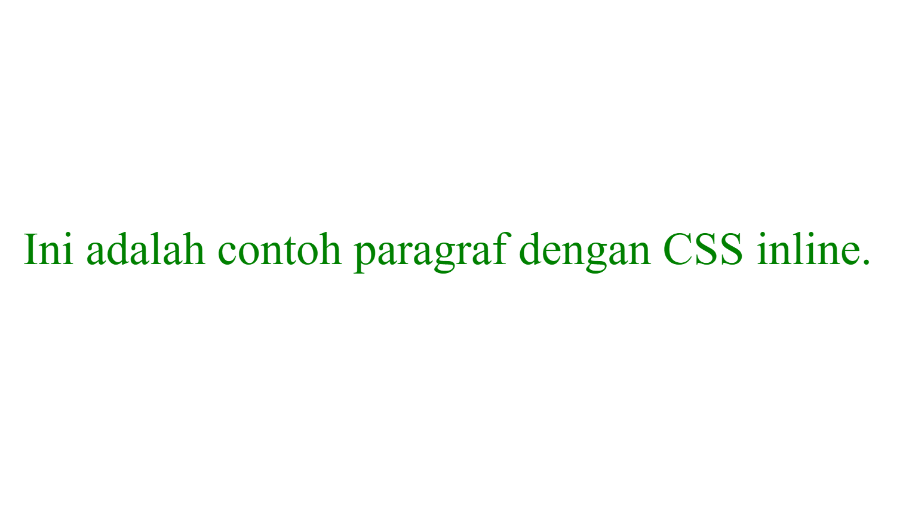
Internal

Kode Program
```css
<title>Belajar CSS 1</title>        
<style>          
p {               
color: red;         
}        
</style>                
```

Hasil
![[Asset8CSS.png]]

External Kode Program

Kode Program HTML yang dimana ini adalah tempat css di panggil dengan menggunakan metode external
```css
  <title>Belajar CSS2</title>             
```

Kode Program CSS
```css
p{ 
color: red;
}
```

Hasil
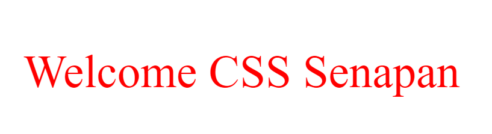

Selector Kode Program

```css
p{
color: red; 
}
```

Hasil


Materi Text Text-align Kode Program

```css
p{
Text-align: center;
}
```

Hasil
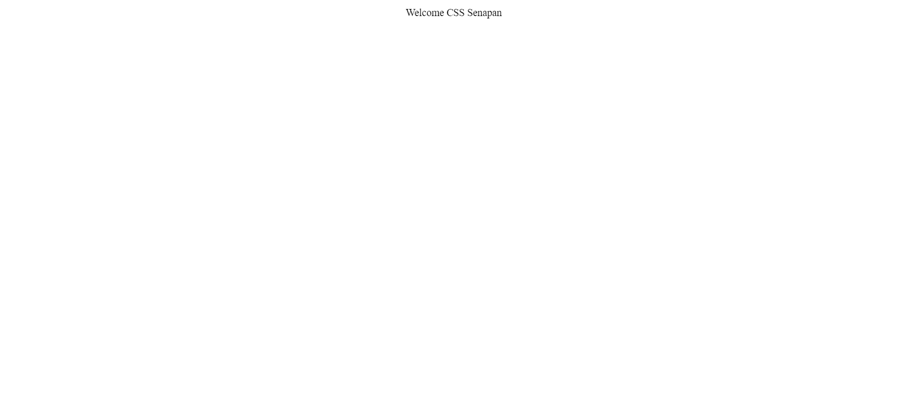

Text-decoration Kode Program

```css
p{ 
text-decoration: overline;
}
```

Hasil
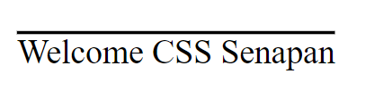

Text-transform Kode Program

```css
p{ 
text-transform: uppercase; 
}
```

Hasil
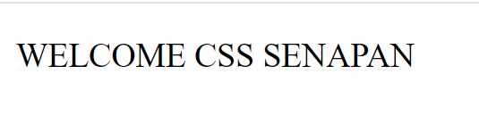

Text-indent

Kode Program

```css
p{ 
text-indent: 10px;
}
```

Hasil
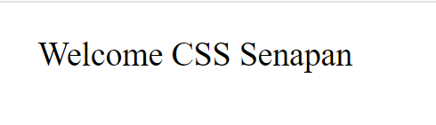

Latter-spacing

Kode Program

```css
p{ 
letter-spacing: 100px;
}
```

Hasil
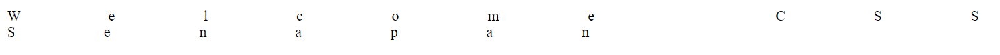

Line-height

Kode Program

```css
p{ 
line-height: 100ox; 
}
```

Hasil
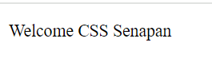

Word-spacing

Kode Program

```css
p{ 
word-spacing: 100px;
}
```

Hasil
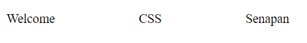

Materi Backgraund Background-image Kode Program

```css
p{ 
background-image: url("aset/nafan.png");
}
```

Hasil


Background-size Kode Program

```css
body{ 
background-image: url("aset/nafan.png");
background-size: 100px; 
}
```

Hasil
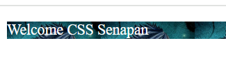

Background-reapet Kode Program

```css
body{ 
background-image: url("aset/nafan.png"); 
background-size: cover; 
background-repeat: no-repeat; 
}
```

Hasil


Background-attachment Kode Program

```css
body{               
background-image: url("aset/nafan.png");  
background-size: cover;         
background-repeat: no-repeat;     
background-attachment: fixed;       
}
```

Hasil
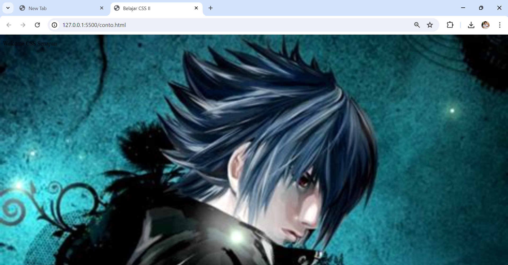
Background-potition Kode Program

```css
body{               
background-image: url("aset/nafan.png");      
background-size: cover;             
background-repeat: no-repeat;       
background-attachment: fixed;        
background-position: -50px -50px;        
}
```

Hasil


Materi Font Font-size
Kode Program

```css
p{ 
font-size: 100; 
}
```

Hasil
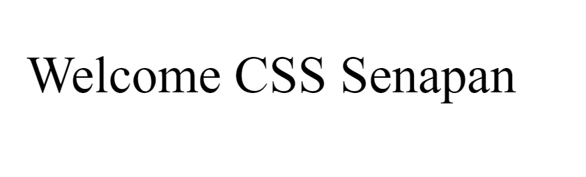
Font-style Kode Program

```css
p{ 
font-style: italic;
}
```

Hasil
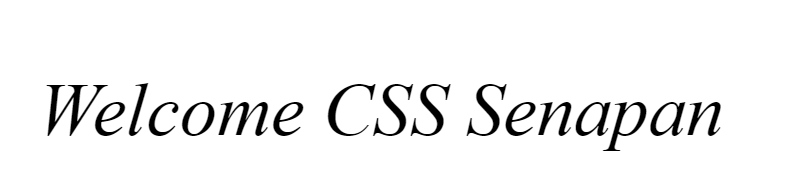

Font-family Kode Program

```css
p{ 
font-family: Cambria, Cochin, Georgia, Times, 'Times New Roman', serif; 
}
```

Hasil
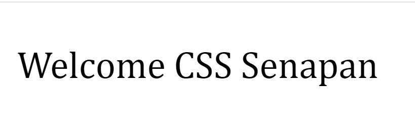

Font-weight Kode Program

```css
p{ 
font-weight: 100; 
}
```

Hasil


Border-Width Border-widthdigunakan untuk menentukan lebar border dari sebuah elemen.

## Border-style solid
border-style: solid; adalah properti CSS yang mengatur gaya border menjadi garis lurus dan solid. Kode program

```css
img{
​​​​border-style: solid;
}
```


Kesimpulan border-style: solid; adalah properti CSS yang mengatur gaya border menjadi garis lurus dan solid dan memberikan warna putih pada pinggir gambar.

Border-color orangered border-color: orangered; adalah properti CSS yang mengatur warna border dari sebuah elemen menjadi oranye merah (orangered). Kode program

```css
button{ 
border-color: orangered;
}
```

Hasil
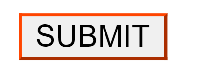

Kesimpulan Mengatur warna atau memberikan warna orangered pada pinggiran border Padding Padding-left padding-left adalah properti CSS yang digunakan untuk menentukan jarak atau ruang tambahan di sebelah kiri konten dalam sebuah elemen. Kode Program

```css
button{  
padding-left: 29px; 
}
```

Hasil


Kesimpulan elemen HTML yang memiliki kelas "F" akan memiliki ruang tambahan di bagian kiri sebesar 29 piksel. Dan membuat tulisan klik disini tidak terlalu ke kiri. Padding-bottom padding-bottom adalah properti CSS yang digunakan untuk menentukan jarak atau ruang tambahan di bagian bawah konten dalam sebuah elemen. Kode Program

```css
button{
padding-bottom: 25px;
}
```

Hasil
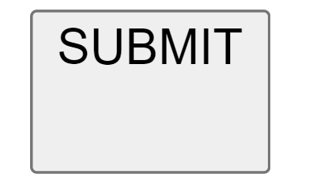

Kesimpulan elemen HTML yang memiliki kelas "F" akan memiliki ruang tambahan di bagian bawah sebesar 25 piksel. Dan membuat tulisan klik disini tidak terlalu ke bawah. Padding-Right padding-right adalah properti CSS yang digunakan untuk menentukan jarak atau ruang tambahan di sebelah kanan konten dalam sebuah elemen. Kode Program

```css
button{
padding-right: 29px;
}
```

Hasil
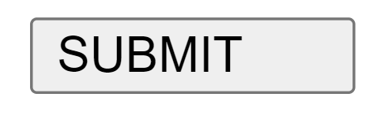

Kesimpulan elemen HTML yang memiliki kelas "F" akan memiliki ruang tambahan di bagian kanan sebesar 29 piksel. Dan membuat tulisan klik disini tidak terlalu ke kanan. Padding-top padding-topadalah properti CSS yang digunakan untuk menentukan jarak atau ruang tambahan di bagian atas konten dalam sebuah elemen. Kode program

```css
button{
padding-top: 20px;
}
```

Hasil
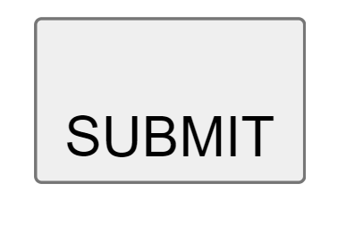

Kesimpulan elemen HTML yang memiliki kelas "F" akan memiliki ruang tambahan di bagian atasnya sebesar 20 piksel. Dan membuat tulisan klik disini tidak terlalu ke atas. Margin Margin-Left margin-leftadalah properti CSS yang digunakan untuk menentukan jarak atau ruang tambahan di sebelah kiri dari sebuah elemen terhadap elemen lain di sekitarnya. Kode Program

```css
button{
margin-left: 600px;
}
```

Hasil
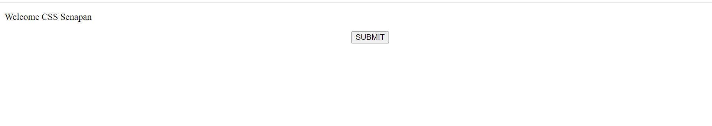

Kesimpulan margin-left: 600px; pada elemen img, Anda akan memberikan jarak 600 piksel antara batas kiri elemen gambar dan batas kiri elemen. Margin-Top margin-top adalah properti CSS yang digunakan untuk menentukan jarak atau ruang tambahan di bagian atas dari sebuah elemen terhadap elemen lain di atasnya. Kode Program

```css
button{ 
margin-top: 50px; 
}
```

Hasil
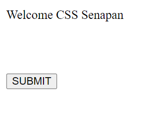

Kesimpulan atura gaya ini memengaruhi tata letak (layout) elemen-elemen HTML dengan tag "button" dengan menambahkan margin di bagian atas sebesar 50 piksel. Margin-Right margin-right adalah properti CSS yang digunakan untuk menentukan jarak atau ruang tambahan di sebelah kanan dari sebuah elemen terhadap elemen lain di sekitarnya. Kode program

```css
button{  
margin-right: 60px;
}
```

Hasil
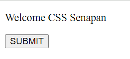

Kesimpulan elemen-elemen HTML dengan tag "button" akan memiliki jarak atau spasi tambahan sebesar 60 piksel di sebelah kanan. Margin-Bottom margin-bottom adalah properti CSS yang digunakan untuk menentukan jarak atau ruang tambahan di bagian bawah dari sebuah elemen terhadap elemen lain di bawahnya.

Kode program

```css
button{
Margin-bottom: 90px 
}
```

Hasil
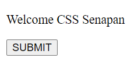

Kesimpulan elemen-elemen yang memiliki kelas "F" akan memiliki jarak atau spasi sebesar 90 piksel di bagian bawahnya. Pseudo-classes

Hover

- button:hover: adalah pseudo-class selector yang menargetkan tombol (button) ketika pengguna mengarahkan kursor ke atasnya (hover) atau diklik.
- background-color: red;: Properti ini menetapkan warna latar belakang tombol menjadi merah ketika tombol sedang di-hover.
- color: white;: Properti ini menetapkan warna teks pada tombol menjadi putih ketika tombol di-hover.
- height: 100px;: Properti yang digunakan untuk membuat tinggi (height) tombol menjadi 100 piksel ketika tombol di-hover.
- width: 100px;: Properti yang digunakan untuk membuat lebar (width) tombol menjadi 100 piksel ketika tombol di-hover. Kode program

```css
button:hover{ 

background-color:red; 
color:white; 
height:100px;
width:100px;

}
```

Hasil
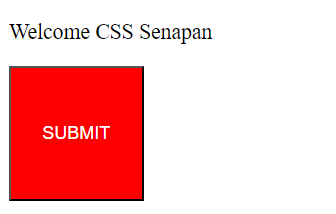

Kesimpulan Setiap property memberikan perubahan yang berbeda dari hover akan memberikan perubahan saat di klik, width dan height untuk mengatur lebar dan tinggi, background-color red memberikan warna merah ketika diklik, dan color white digunakan untuk memberikan warna putih pada teks.

Active button:active: adalah pseudo-class selector yang menargetkan tombol (button) ketika tombol tersebut sedang dalam keadaan "active", atau tombol sedang ditekan. color: yellow;: Properti memberikan warna kuning pada teks ketika tombol sedang active atau tombol sedang ditekan. Kode program

```css
button:active{

background-color:red; 
color:white; 
height:100px;
width:100px; }
```

Hasil
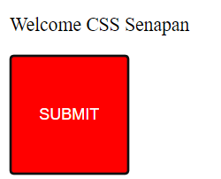

Kesimpulan Teks klik akan berganti warna menjadi kuning jika ditekan dan berputar.

Transition Penjelasan

- Transition: untuk mengatur pertunjukan perubahan, mengubah penampilan elemen dari satu keadaan ke keadaan lain, memberikan dinamika visual yang menarik dalam desain web Anda.
- Transition-delay: properti ini memberikan momen kejutan atau antisipasi sebelum perubahan yang dijanjikan terjadi, menambah dramatisasi pada tampilan elemen.

- Transition-duration: menentukan lamanya waktu ketika elemen berubah, memungkinkan Anda untuk mengatur seberapa lama penonton (pengguna) menikmati perubahan tersebut.
- Transition-property: menentukan apa yang akan berubah, seperti warna, ukuran, atau posisi, menciptakan efek transisi yang beragam dan menarik.
- Transition-timing-function: properti ini mengatur ritme perubahan, menentukan apakah transisi akan bergerak dengan lembut dan halus seperti aliran air, atau tiba-tiba dan dramatis seperti petir yang menyambar. Kode program

```css
button:hover{
background-color:red;
color:white;
height:100px; 
width:100px; 
transition:all 0.9s ease-in; 
}
```

Hasil
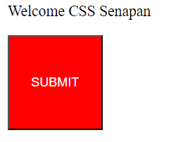

Kesimpulan transition dalam desain web memberikan kemampuan untuk mengatur perubahan visual pada elemen-elemen dengan mulus dan menarik. Dan berbeda sesuai dengan properti diatas. Transform Penjelasan

- transform: scale(0.5);= Mengubah ukuran elemen menjadi setengah dari ukuran aslinya.
- transform: scalex(0.5);= Hanya mengubah skala elemen secara horizontal menjadi setengah dari ukuran aslinya.
- transform: rotate(45deg);= Memutar elemen sebesar 45 derajat searah jarum jam.
- transform: skewX(-25deg);= Membengkokkan elemen secara horizontal sebesar -25 derajat (ke arah kiri).
- transform: skew(25deg,5deg);= Membengkokkan elemen sebesar 25 derajat secara horizontal (ke kanan) dan 5 derajat secara vertikal (ke atas).
- transform: translate(50px,52px);= Menggeser elemen sebesar 50 piksel ke kanan dan 52 piksel ke bawah.
- transform: matrix(0.7,-0.5,0.5,0.4,0.5,0.7);= Menggambarkan transformasi menggunakan matriks 2D den Kode Program

```css
button:hover{
transform:matrix(0.7,-0.5,0.5,0.4,0.5,0.7);
}
```

Hasil
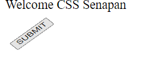

Kesimpulan Setiap properti transform mengubah tampilan elemen dengan cara yang berbeda-beda sesuai dengan property.

Flexbox Flex Container Display Flex display: flex, kita dapat dengan mudah mengatur tata letak elemen-elemen di dalamnya dengan properti-properti seperti flex-direction, justify-content, align-items, dan lain-lain.

Kesimpulan display: flex, kita dapat dengan mudah mengatur tata letak elemen-elemen di dalamnya menggunakan properti-properti seperti flex-direction, justify-content, align-items, dan properti lainnya yang terkait dengan model tata letak flexbox.

Flex-Direction

- flex-direction: column;: Mengatur tata letak dari flex container menjadi vertikal, sehingga flex items diatur dari atas ke bawah.
    
- flex-direction: column-reverse;: Mengatur tata letak dari flex container menjadi vertikal terbalik, sehingga flex items diatur dari bawah ke atas.
    
- flex-direction: row;: Mengatur tata letak dari flex container menjadi horizontal, sehingga flex items diatur dari kiri ke kanan.
    
- flex-direction: row-reverse;: Mengatur tata letak dari flex container menjadi horizontal terbalik, sehingga flex items diatur dari kanan ke kiri. Kode Program
    
```css
    .box-container{ 
    flex-direction: column; 
    }
```
    

Hasil


Kesimpulan Setiap properti flex-direction mengubah tampilan elemen dengan cara yang berbeda-beda sesuai dengan property. Contohcolumn untuk tata letak vertikal dari atas ke bawah. column-reverse untuk tata letak vertikal terbalik dari bawah ke atas. row untuk tata letak horizontal dari kiri ke kanan.row-reverse untuk tata letak horizontal terbalik dari kanan ke kiri. Align-Items

- align-items: center;: Flex items akan diatur di tengah-tengah sumbu silang dari flex container.
- align-items: flex-start;: Flex items akan diatur pada awal sumbu silang dari flex container.
- align-items: flex-end;: Flex items akan diatur pada akhir sumbu silang dari flex container.
- align-items: baseline;: Flex items akan diatur sedemikian rupa sehingga garis dasar dari teks pada masing-masing item berada pada level yang sama.
- align-items: stretch;: Flex items akan diperpanjang untuk mencapai tinggi maksimal flex container, mengisi ruang kosong di sepanjang sumbu silang. Kode Program

```css
.box-container{
align-items:center ;
}
```

Hasil


Kesimpulan Setiap properti align-items mengubah tampilan elemen dengan cara yang berbeda-beda sesuai dengan property. Contohcenter untuk menempatkan flex items di tengah-tengah sumbu silang.flex-start untuk menempatkan flex items di awal sumbu silang.flex-end untuk menempatkan flex items di akhir sumbu silang.baseline untuk menempatkan flex items sehingga garis dasar teks masing-masing item berada pada level yang sama.stretch untuk memperpanjang flex items sehingga mencapai tinggi maksimal flex container, mengisi ruang kosong di sepanjang sumbu silang. Justify-Content

- justify-content: flex-start;: Mengatur fleks item ditempatkan di bagian awal (mulai) dari sumbu utama flex container.
- justify-content: flex-end;: Mengatur fleks item ditempatkan di bagian akhir (akhir) dari sumbu utama flex container.
- justify-content: center;: Mengatur fleks item ditempatkan di tengah-tengah sumbu utama flex container.
- justify-content: space-around;: Mengatur fleks item didistribusikan secara merata di sekitar sumbu utama flex container, dengan ruang yang sama di antara mereka.
- justify-content: space-between;: Mengatur fleks item didistribusikan secara merata di sepanjang sumbu utama flex container, dengan ruang yang sama di antara fleks item pertama dan terakhir, tetapi tidak ada ruang di antara fleks item yang berdekatan. Kode Program

```css
.box-container{ 
justify-content: center ; 
}
```

Hasil


Kesimpulan Setiap properti justify-Content mengubah tampilan elemen dengan cara yang berbeda-beda sesuai dengan property. Contohflex-start untuk menempatkan flex items di awal (mulai) sumbu utama.flex-end untuk menempatkan flex items di akhir (akhir) sumbu utama.center untuk menempatkan flex items di tengah-tengah sumbu utama.space-around untuk mendistribusikan flex items secara merata di sekitar sumbu utama dengan ruang yang sama di antara mereka.space-between untuk mendistribusikan flex items secara merata di sepanjang sumbu utama dengan ruang yang sama di antara flex items pertama dan terakhir, tetapi tidak ada ruang di antara flex items yang berdekatan.

Flex Items Penjelasan

- flex-grow: 1;: menentukan seberapa besar elemen akan tumbuh relatif terhadap elemen lain dalam kontainer flex. Nilai 1 berarti elemen akan memperluas untuk mengisi ruang yang tersedia dalam kontainer.
- flex-basis: auto;: menentukan ukuran awal elemen sebelum faktor-faktor flex-grow dan flex-shrink diterapkan.
- flex-shrink: 1;: menentukan seberapa besar elemen akan menyusut jika kontainer flex terlalu kecil untuk menampung semua elemen. Nilai 1 berarti elemen akan menyusut dengan tingkat yang sama dengan elemen-elemen lain dalam kontainer flex. Kode Program

```css
.box-item-1 { 
flex-grow: 1; 
flex-basis: auto;
}
```

Hasil
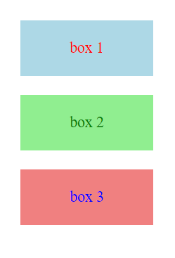

Kesimpulan flex-shrink: 1;, flex-basis: auto;, dan flex-grow: 1;, elemen tersebut akan menyusut jika perlu, ukuran awalnya akan disesuaikan dengan konten di dalamnya, dan akan memperluas untuk mengisi ruang yang tersedia dalam kontainer flex jika ada ruang tambahan.

Tantangan Flexbox 

Penjelasan

1. body:
    
    - display: flex; membuat body menggunakan flexbox, sehingga elemen-elemen di dalamnya dapat diatur menggunakan properti flexbox.
    - min-height: 100vh; mengatur tinggi minimum body setidaknya 100% dari tinggi viewport (tinggi layar pengguna).
    - background-color: purple; memberikan warna latar belakang body menjadi ungu.
2. .container:
    
    - display: flex; membuat container menggunakan flexbox, sehingga elemen-elemen di dalamnya dapat diatur menggunakan properti flexbox.
    - flex-direction: column; mengatur arah tata letak flexbox menjadi kolom, sehingga elemen-elemen di dalamnya akan ditumpuk secara vertikal.
    - background-color: purple; memberikan warna latar belakang container menjadi ungu.
    - margin-top: 50px; memberikan jarak 50px di bagian atas container.
    - margin-right: 60px; memberikan jarak 60px di bagian kanan container.
    - padding: 20px; memberikan padding 20px di dalam container.
3. span:
    
    - font-size: 50px; mengatur ukuran font menjadi 50px.
    - color: white; mengatur warna teks menjadi putih.
    - margin-bottom: 20px; memberikan jarak 20px di bagian bawah setiap elemen span.
4. .ajay:
    
    - background-color: purple; memberikan warna latar belakang tombol menjadi ungu.
    - padding: 20px 29px; memberikan padding 20px di atas dan bawah, serta 29px di kiri dan kanan tombol.
    - color: orangered; mengatur warna teks tombol menjadi oranye.
    - border: 2px solid orangered; memberikan border pada tombol dengan ketebalan 2px dan warna oranye.
    - margin-top: 50px; memberikan jarak 50px di atas tombol.
    - margin-left: 500px; memberikan jarak 500px dari sisi kiri tombol.
    - margin-right: 40px; memberikan jarak 40px dari sisi kanan tombol.
5. img:
    
    - width: 250px; mengatur lebar gambar menjadi 250px.
    - height: 250px; mengatur tinggi gambar menjadi 250px.
    - border-radius: 50%; memberikan border-radius sehingga gambar terlihat bulat.
    - border: 2px solid white; memberikan border pada gambar dengan ketebalan 2px dan warna putih.
    - margin-top: 20px; memberikan jarak 20px di atas gambar.

kode program

 ```css
<title>Belajar CSS3</title>  
<style>     
body {        
display: flex;       
height: 100vh;       
background-color: purple;    
}        
.container {   
display: flex;          
flex-direction: column;        
background-color: purple;      
margin-top: 50px;        
margin-right: 60px;          
padding: 20px;     
}     
span {  
font-size: 50px; 
color: white;     
margin-bottom: 20px; /* Jarak antara dua elemen span */    
}   
.ajay {      
background-color: purple;    
padding: 20px 29px;        
color: orangered;      
border: 2px solid orangered;  
margin-top: 50px; /* Jarak tombol dari teks di atasnya */    
margin-left: 500px;     
margin-right: 40px;    
}      
img {      
width: 250px;      
height: 250px;     
border-radius: 50%;  
border: 2px solid white;   
margin-top: 20px; /* Jarak gambar dari teks di bawahnya */   
}     </style>    

        Selamat datang  
        di **Web Nafan Univers!**      
           Klik disini    
```

   
Hasil
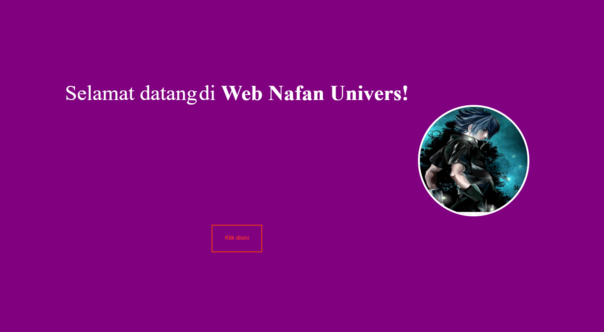

Kesimpulan Body menggunakan display: flex; untuk mengaktifkan flexbox, memungkinkan elemen-elemen di dalamnya diatur menggunakan properti flexbox. Selain itu, height: 100vh; mengatur tinggi minimum body setidaknya 100% dari tinggi viewport (tinggi layar pengguna), dan background-color: purple; memberikan warna latar belakang body menjadi ungu.

.container juga menggunakan flexbox dengan display: flex;, sehingga elemen-elemen di dalamnya dapat diatur menggunakan properti flexbox. flex-direction: column; mengatur arah tata letak flexbox menjadi kolom, sehingga elemen-elemen di dalamnya akan ditumpuk secara vertikal. Selain itu, background-color: purple; memberikan warna latar belakang container menjadi ungu, margin-top: 50px; memberikan jarak 50px di bagian atas container, dan margin-right: 60px; memberikan jarak 60px di bagian kanan container. Terakhir, padding: 20px; memberikan padding 20px di dalam container.

Elemen span memiliki font-size: 50px; untuk mengatur ukuran font menjadi 50px, color: white; untuk mengatur warna teks menjadi putih, dan margin-bottom: 20px; memberikan jarak 20px di bagian bawah setiap elemen span.

Sementara itu, .ajay memiliki beberapa properti seperti background-color: purple; untuk memberikan warna latar belakang tombol menjadi ungu, padding: 20px 29px; untuk memberikan padding 20px di atas dan bawah, serta 29px di kiri dan kanan tombol. Selain itu, color: orangered; mengatur warna teks tombol menjadi oranye, dan border: 2px solid orangered; memberikan border pada tombol dengan ketebalan 2px dan warna oranye. Terakhir, margin-top: 50px; memberikan jarak 50px di atas tombol, margin-left: 500px; memberikan jarak 500px dari sisi kiri tombol, dan margin-right: 40px; memberikan jarak 40px dari sisi kanan tombol.

Tantangan Box Model
Penjelasan

1. background-color: Properti ini mengatur warna latar belakang elemen. Pada bagian body, Anda mengatur latar belakang menjadi ungu (purple).
    
2. font-size: Properti ini mengatur ukuran font teks. Di bagian span, Anda mengatur ukuran font menjadi 50 piksel.
    
3. color: Properti ini mengatur warna teks. Di bagian span, Anda mengatur warna teks menjadi putih (white).
    
4. margin-top: Properti ini mengatur jarak antara elemen dengan elemen lain di atasnya. Di bagian b, Anda mengatur margin atas sebesar 1 piksel.
    
5. background-color, margin-left, padding-left, padding-top, padding-bottom, padding-right, color, border-color, margin-top, margin-right: Semua properti ini diterapkan pada elemen dengan kelas .ajay. Elemen ini memiliki latar belakang ungu, teks oranye, beberapa padding, dan beberapa margin.
    
6. width, height, border-radius, border-color, border-style, margin-left, margin-top: Properti ini diterapkan pada elemen [](https://github.com/ahmadanugrahsatya/Pemograman_Web/blob/master/pemograman%20web/CSS/Pengenalan%20CSS.md). Gambar ini memiliki lebar 250 piksel, tinggi 250 piksel, sudut melengkung pada tepinya, dan garis tepi berwarna putih (white). Gambar ini juga diberi margin kiri sebesar 600 piksel dan margin atas sebesar -220 piksel (sehingga muncul di atas teks).
    

Kode program

```css
    <title>Belajar CSS3</title>               
                          Selamat datang                  
                    di **Web Nafan Univers!**  
            Klik disini                  
```

body{     background-color: purple; } span{     font-size: 50px;     color: white; } b{     margin-top: 1px; } .ajay{     background-color: purple;     margin-left: 400px;     padding-left: 29px;     padding-top: 20px;     padding-bottom: 25px;     padding-right: 29px;     color: orangered;     border-color: orangered;     margin-top: 50px;     margin-right: 60px; } img{     width: 250px;     height: 250px;     border-radius: 200px;     border-color: white;     border-style: solid;     margin-left: 600px;     margin-top: -220px; }

Hasil
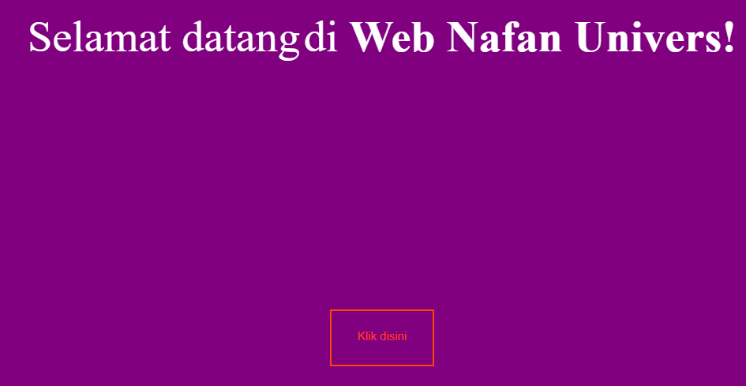
Kesimpulan  dengan boxmodel kita bisa mengatur jarak antar item dengan begitu kita bisa membuat web dengan lebih mudah karena adanya bantuan dari margin padding dan border.

Tantangan Transition Penjelasan

- background-color: purple; pada body: Mengatur warna latar belakang halaman (body) menjadi ungu.
- background-color: purple; pada .main-container: Mengatur warna latar belakang kontainer utama (main-container) menjadi ungu.
- .box-item-1 dan .box-item-2: Keduanya memiliki properti-properti seperti:
- ​​font-size: 50px;: Mengatur ukuran font menjadi 50 piksel.
- ​color: white;: Mengatur warna teks menjadi putih.
- margin-top: 10px;: Menambahkan jarak 10 piksel di atas elemen.
- .ajay:hover: Ini adalah aturan CSS untuk ketika elemen dengan class .F sedang dihover (mouse berada di atasnya). Properti yang diberikan adalah:
- background-color: purple;: Mengubah warna latar belakang menjadi ungu ketika dihover.
- margin-left: 200px;: Menggeser elemen ke kanan sejauh 200 piksel.
- padding-left: 29px; padding-top: 20px; padding-bottom: 25px; padding-right: 29px;: Menambahkan padding pada sisi-sisi elemen.
- color: orangered;: Mengubah warna teks menjadi oranye kemerahan.
- border-color: orangered;: Mengubah warna border menjadi oranye kemerahan.
- margin-top: 50px; margin-right: 60px; margin-bottom: 90px;: Menambahkan jarak atas, kanan, dan bawah elemen.
- transition: all 0.9s ease-in;: Menambahkan efek transisi pada perubahan properti.
- button:active: adalah aturan CSS untuk ketika tombol sedang dalam keadaan aktif. Properti yang diberikan adalah:
- transform: rotate(45deg);: Memutar tombol sebesar 45 derajat ketika tombol ditekan.
- img: Properti-properti yang diberikan pada gambar adalah:
- width: 250px; height: 250px;: Mengatur lebar dan tinggi gambar menjadi 250 piksel.
- border-radius: 200px;: Membuat sudut-sudut gambar menjadi bulat dengan radius 200 piksel.
- border-color: white; border-style: solid;: Mengatur border dengan warna putih dan stye solid.
- margin-left: 400px; margin-top: -400px;: Menggeser gambar ke kanan sejauh 400 piksel dan ke atas sejauh -400 piksel. Kode Program

 ```css
  <title>Belajar CSS3</title>                                 
                        Selamat datang                  
                    di **Web Nafan Univers!**  
            Klik disini                  
```
    
 ```css
 body{    
 background-color: purple; 
 } 
 span{  
 font-size: 50px;  
 color: white; 
 } 
 b{ 
 margin-top: 1px;
 } 
.ajay{  
background-color: purple; 
margin-left: 400px;   
padding-left: 29px;  
padding-top: 20px;  
padding-bottom: 25px;  
padding-right: 29px; 
color: orangered;  
border-color: orangered; 
margin-top: 50px;  
margin-right: 60px; 
} 
.ajay:hover {     
background-color: purple;  
margin-left:200px;  
padding-left:29px;  
padding-top:20px;  
padding-bottom:25px;  
padding-right:29px; 
color: orangered;                                                               
border-color:orangered;   
margin-top: 50px;    
margin-right:60px;   
margin-bottom:90px; 
transition:all 0.9s ease-in;
} 
img{ 
width: 250px; 
height: 250px;  
border-radius: 200px;  
border-color: white;  
border-style: solid;  
margin-left: 600px;  
margin-top: -220px;
}
```

Hasil
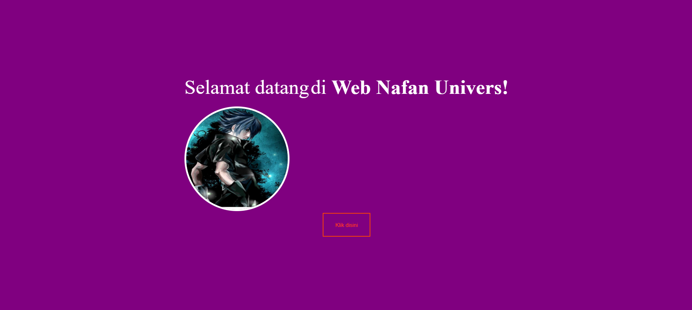

Kesimpulan Memberikan gaya atau menggeser dimana klik disini posisi awal berada samping kiri di bawah selamat datang di web nafan dimana jika di klik maka posisi klik disini pindah ke sebelah kanan pas di bawah nafan dan gambarnya ikut juga geser. Position Position Relative Penjelasan

- background-color: aqua;: Memberikan warna latar belakang elemen menjadi aqua.
- position: relative;: Menetapkan posisi elemen relatif terhadap posisi defaultnya.
- top: 20px;: Menggeser elemen 20 piksel ke bawah dari posisi defaultnya.
- left: 30px;: Menggeser elemen 30 piksel ke kanan dari posisi defaultnya. Kode Program

```css
box-1{ 
background-color:aqua;
position:relative;
top:20px; 
left:30px;
}
```

Hasil
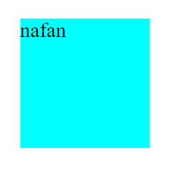

Kesimpulan elemen dengan kelas "box-1" mengatur latar belakang menjadi warna aqua dan menggeser elemen 20 piksel ke bawah dan 30 piksel ke kanan dari posisi defaultnya. Position Absolute Penjelasan

- background-color: purple;: Mengatur latar belakang elemen menjadi warna ungu (purple).
    
- position: absolute;: Menetapkan elemen ke dalam konteks posisi yang dihitung relatif terhadap elemen induk yang memiliki posisi non-static.
    
- top: 15px;: . elemen 15 piksel dari atas relatif terhadap posisi elemen induk yang ditetapkan dalam konteks posisi absolut.
    
- left: 10px;: Menggeser elemen 10 piksel dari kiri relatif terhadap posisi elemen induk yang ditetapkan dalam konteks posisi absolut. Kode Program
    
```css
    .box-2{
     background-color:purple;
     position:absolute;
      top:15px; 
      left:10px; 
    }
```
    

Hasil


Kesimpulan kelas "box-2" menetapkan latar belakangnya menjadi warna ungu (purple) dan mengatur posisinya secara absolut,dimana elemen digeser 15 piksel dari atas dan 10 piksel dari kiri.

Position Fixed Penjelasan

- top: 50px;: Menggeser elemen 50 piksel ke bawah dari posisi defaultnya.
- left: 30px;: Menggeser elemen 55 piksel ke kanan dari posisi defaultnya.
- background-color: aqua;: Mengatur latar belakang elemen menjadi warna aqua.
- position: fixed;: Mengatur elemen dalam posisi tetap, yang berarti elemen akan tetap berada pada lokasi yang sama saat kita scroll. Kode Program

```css
.box-1{
background-color:aqua; 
position:Fixed; 
top:50px; 
left:55px; 
}
```

Hasil
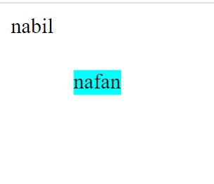

Kesimpulan position: fixed, elemen akan tetap berada pada posisinya yang ditentukan jika discrool.properti top dan left digunakan untuk menentukan jarak elemen dari tepi atas dan kiri.

Position Sticky Penjelasan

- background-color: aqua;: Mengatur latar belakang elemen menjadi warna aqua.
- Position: sticky;: Mengatur elemen dalam posisi "sticky", yang berarti elemen akan berperilaku seperti posisi relatif sampai mencapai posisi tertentu saat discrool kemudian akan tetap berada di tempat.elemen akan "melekat" pada posisi yang telah ditentukan saat jarak scroll mencapai nilai tertentu.
- top: 50px;: Menggeser elemen sejauh 50 piksel dari atas elemen induk yang memiliki posisi tetap.
- left: 55px;: Menggeser elemen sejauh 55 piksel dari sisi kiri elemen induk yang memiliki posisi tetap. Kode Program

```css
box-1{
background-color:aqua;
position:Sticky; top:50px;
left:55px;
}
```

Hasil
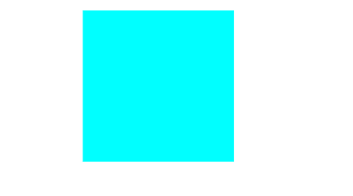

Kesimpulan position: sticky, elemen akan seperti posisi relatif sampai jarak scroll mencapai nilai tertentu. elemen akan tetap berada pada posisi yang telah ditentukan saat jarak scroll mencapai nilai tertentu, sambil tetap mengikuti pergeseran scroll di bawahnya.