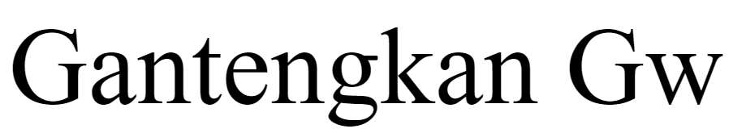

# Anatomi CSS

## Penjelasan

- `Selector`: Apa yang ingin di modifikasi

- `Property`: Bagian apa yang ingin dimodifikasi

- `Property value`: bentuk modifikasinya seperti apa

Contoh diatas, yang ingin di modifikasi adalah seluruh tag `<p>` pada komponen warna teksnya menjadi warna merah.

- `p` merupakan selector yang dimana selector adalah sebuah penanda yang digunakan untuk memberikan tanda terhadap tag html yang ingin di modifikasi

- `color` merupakan property yang di mana property digunakan untuk menambahkan atau mengatur ukuran teks, jenis font, warna teks, warna background, dan sebagainya

- `red` adalah nilai dari property
## Kode

```css

  

    p {

      color : red ;

    }

```
## Hasil
  


# Percobaan Pertama

## Penjelasan

- `<!DOCTYPE html>`: Mendefinisikan jenis dokumen HTML yang digunakan, dalam hal ini HTML5.

- `<html>`: Elemen utama yang memuat seluruh konten dokumen.

-  `<head>`: Bagian yang berisi informasi tambahan tentang dokumen, seperti judul dan link ke stylesheet eksternal.

- `<title>`: Menentukan judul halaman web yang akan ditampilkan di tab browser.

- `<style>`: Bagian di mana Anda dapat menambahkan aturan CSS untuk mengubah tampilan elemen HTML di halaman.

- `p { color: red; }`: Aturan CSS yang mengubah warna teks pada semua elemen `<p>` menjadi merah.

- `<body>`: Bagian yang berisi konten aktual halaman web, seperti teks, gambar, atau elemen lainnya.

- `<p>Welcome CSS</p>`: Elemen paragraf dengan teks "Welcome CSS", yang akan ditampilkan dengan warna merah karena aturan CSS yang telah ditentukan sebelumnya.

## Kode

```HTMl

<!Doctype html>

<html>

  <head>

    <style>

    p {

      color : red ;

    }

    </style>

   </head>

   <body>

    <p>Aku Nafan</p>

     </body>

</html>

  

```

## Hasil


# Percobaan Kedua

## Kode CSS


```css

  

button{

  

    Width:150px;

    Height:50px;

    Color: aqua;

    background-color:red;

    border : none;

    }

```

## Color

### Before


  

### After

  


  

>[! Penjelasan]-

>Color adalah memberikan warna kepada tulisan yang dimana sebelum di kasih color atau warna tulisan nya berwarna aqua. setelah dikasih color atau warna tulisan submit berwarna aqua

## Background-color
### Kode

```css
  body {

    background-color: black;

  }
```
### Before
  


### After


### Penjelasan 

- **Selektor (Selector)**:
    - `body`: Ini adalah selektor yang memilih elemen `<body>` dari dokumen HTML. Elemen `<body>` mencakup seluruh konten dari sebuah halaman web.
- **Deklarasi (Declaration)**:
    - `{ background-color: black; }`: Ini adalah deklarasi yang menentukan aturan gaya yang diterapkan pada elemen yang dipilih oleh selektor. Deklarasi ini terdiri dari dua bagian: properti dan nilai.
- **Properti (Property)**:
    - `background-color`: Ini adalah properti CSS yang digunakan untuk mengatur warna latar belakang dari elemen yang dipilih.
- **Nilai (Value)**:
    - `black`: Ini adalah nilai dari properti `background-color`, yang dalam hal ini adalah warna hitam. Warna bisa didefinisikan dengan berbagai cara di CSS, seperti nama warna, nilai hex, RGB, atau HSL.
  
## Border

### Kode
```Css
  p {

    border-style: solid; /

    border-color: black;

  }
```

### Before


### After


### Penjelasan

- `p`: Selector ini memilih semua elemen paragraf `<p>` di dalam dokumen HTML. Artinya, gaya yang didefinisikan di dalam blok `{}` akan diterapkan pada semua paragraf.
- `{ ... }`: Kurung kurawal ini menandai awal dan akhir dari deklarasi gaya yang diterapkan pada elemen yang dipilih.
- `border-style: solid;`: Ini adalah properti CSS yang mengatur gaya garis tepi (border) elemen. Nilai `solid` berarti garis tepi akan menjadi garis penuh tanpa putus. Properti `border-style` harus diatur agar garis tepi terlihat.
- `border-color: black;`: Ini adalah properti CSS yang mengatur warna garis tepi elemen. Nilai `black` berarti garis tepi akan berwarna hitam.


# Pemanggilan CSS

### Inline

  

>[!penjelasan]-

Tag `<p>` yang memiliki gaya inline yang diterapkan langsung ke dalam elemen tersebut. Gaya tersebut adalah `font-size: 50px;`, yang berarti teks di dalam paragraf akan ditampilkan dengan ukuran font 50 piksel. Gaya ini diterapkan menggunakan atribut style pada elemen `<p>`

  

```Html

<!DOCTYPE html>

<html>

  <head>

  </head>

  <body>

    <p style="font-size: 50px;">Welcome CSS!</p>

  </body>

</html>

  

```

Hasil :


### Internal

  

>[! penjelasan]-

> `h1`: Menetapkan warna teks biru dan margin atas sebesar `10000 pixel` untuk semua elemen `<h1>` dalam dokumen.

> `.merah`: Menetapkan warna teks merah untuk semua elemen yang memiliki kelas "merah".

> `.biru`: Menetapkan warna teks biru untuk semua elemen yang memiliki kelas "biru".

> `.kuning`: Menetapkan warna teks kuning untuk semua elemen yang memiliki kelas "kuning".

>  `#hijau`: Menetapkan warna teks hijau untuk elemen dengan `ID "hijau"`.

  
  

```CSS

h1{

  color:blue;

  Font-size:100px;

  font-weight:bold;

}

.merah {

  color: red;

}

.biru {

  color: blue;

}

.kuning {

  color: yellow ;

}

#hijau {

  color: green;

}

```
  


### External

>[! Penjelasan]-

>`<link rel="stylesheet" href="contoh.css">`: Menautkan dokumen HTML dengan file CSS eksternal bernama "contoh.css", sehingga dokumen HTML dapat menerapkan gaya yang didefinisikan dalam file CSS tersebut.

  

```html

<!DOCTYPE html>

<html>

  <head>

    <title>belajar panggilan css</title>

    <link rel="stylesheet" href="contoh.css">

  </head>

  <body>

    <p style="Font-size:48px;">Hello RPL</p>

    <h1>ini adalah warna</h1>

    <p class="merah">ini warna merah</p>

    <p class="biru">ini warna biru</p>

    <p class="kuning">ini warna kuning</p>

    <p id="hijau">ini warna hijau</p>

  </body>

</html>

```

  

```css

h1{

  color:blue;

  Font-size:100px;

  font-weight:bold;

}

.merah {

  color: red;

}

.biru {

  color: blue;

}

.kuning {

  color: yellow ;

}

#hijau {

  color: green;

}

```

  


# Selektor CSS

## Elemen Selector

### Penjelasan

`h1`: Ini adalah elemen selector yang menargetkan semua elemen `<h1>` dalam dokumen HTML untuk menerapkan aturan gaya tertentu, seperti warna teks biru dan margin atas sebesar 100 piksel.
### Code

```css
h1 {

  color: blue;

  margin-top: 100px;

}

```
### Hasil


## Class Selector

### Penjelasan
  
- `<!DOCTYPE html>`: Mendefinisikan tipe dokumen sebagai HTML versi 5.

- `<html>`: Menandakan awal dan akhir dari dokumen HTML.

- `<head>`: Berisi informasi tambahan tentang dokumen HTML, seperti judul dan tautan ke file CSS.    

- `<title>CSS</title>`: Menentukan judul dokumen yang akan ditampilkan di tab browser.

- `<link rel="stylesheet" href="contoh.css">`: Menautkan dokumen HTML dengan file CSS eksternal bernama "contoh.css", sehingga dokumen HTML dapat menerapkan gaya yang didefinisikan dalam file CSS tersebut.

- `<body>`: Berisi konten yang akan ditampilkan kepada pengguna.  

- `<h1 class="biru"> Welcome RPL 1 </h1>`: Elemen ini hanya memiliki satu kelas CSS, yaitu "biru". Oleh karena itu, elemen tersebut akan menerapkan gaya yang telah ditentukan untuk kelas "biru" dalam file CSS atau dalam bagian gaya internal/inline yang berkaitan dengan kelas tersebut. Dan memberikan warna biru.
### Code

```HTML

 <!DOCTYPE html>

 <html>

  <head>

    <title>CSS</title>

    <link rel="stylesheet" href="contoh.css">

  </head>

  <body>

    <h1 class="biru" >Welcome RPL 1 </h1>

     </body>

</html>

  
  

```
### Hasil

  


## ID Selector
### Penjelasan


- `<!DOCTYPE html>`: Mendefinisikan tipe dokumen sebagai HTML versi 5.

- `<html>`: Menandakan awal dan akhir dari dokumen HTML.

- `<head>`: Berisi informasi tambahan tentang dokumen HTML, seperti judul dan tautan ke file CSS.    

- `<title>CSS</title>`: Menentukan judul dokumen yang akan ditampilkan di tab browser.

- `<link rel="stylesheet" href="contoh.css">`: Menautkan dokumen HTML dengan file CSS eksternal bernama "contoh.css", sehingga dokumen HTML dapat menerapkan gaya yang didefinisikan dalam file CSS tersebut.

- `<body>`: Berisi konten yang akan ditampilkan kepada pengguna.  

- Elemen `<p id="hijau"> ini warna hijau </p>` memiliki atribut `id` yang menentukan identitas uniknya dalam dokumen HTML. Dengan demikian, fungsi dari atribut `id` ini adalah untuk memberikan cara yang unik untuk merujuk atau menargetkan elemen tersebut dalam CSS. Dan memberikan warna hijau pada teks.


### Code

  

```html

<!DOCTYPE html>

<html>

  <head>

    <title>CSS</title>

    <link rel="stylesheet" href="contoh.css">

  </head>

  <body>

    <p style="font-size: 48px;">Welcome CSS!</p>

    <h1>Halo RPL 1</h1>

    <p id="hijau" > ini warna hijau </p>

  </body>

</html>

  

```

### Hasil


# TEXT

## Text align

### Penjelasan

- `.oi` adalah selector yang menunjuk ke elemen HTML yang memiliki kelas oi.

- `text-align: center;` adalah properti dan nilai CSS yang mengatur perataan teks di dalam elemen tersebut agar berada di tengah.

  

### Kode Program

  

```css

.oi{

  text-align:center;
  }

```

### Hasil


### Kesimpulan

`.oi { text-align: center; }` digunakan untuk meratakan teks di tengah secara horizontal pada elemen HTML yang memiliki kelas `oi`.

## Text decoration

### Underline

#### Penjelasan

Mengatur gaya tampilan teks dengan memberikan efek garis bawah pada teks yang terdapat di dalam elemen dengan kelas `.oi`. Dengan menggunakan properti `text-decoration` dengan nilai `underline`, teks di dalam elemen tersebut akan ditampilkan dengan garis bawah.
#### Kode Program

```css

.oi{

  text-decoration:underline;

  }

```

#### Hasil
#### Before


#### After


#### Kesimpulan

Program ini mengatur tampilan teks di dalam elemen dengan kelas `.oi` dengan memberikan efek garis bawah menggunakan CSS. Ini memungkinkan untuk menonjolkan atau membedakan teks tertentu dalam halaman web.

### Overline

#### Penjelasan

mengatur tampilan teks dengan memberikan dekorasi garis di atas teks menggunakan properti `text-decoration` dengan nilai `overline`. Dengan demikian, teks yang dikelilingi oleh elemen HTML dengan kelas `.oi` akan memiliki garis di atasnya.
#### Kode Program


```css

.oi{

  text-decoration:overline;

  }

```

#### Hasil
#### Before


#### After

#### Kesimpulan


Program tersebut menghasilkan efek garis di atas teks dengan menggunakan CSS. Ini dapat digunakan untuk menyoroti atau menekankan bagian tertentu dari teks dalam elemen HTML yang memiliki kelas `.oi`.
### Line-through

#### Penjelasan

Mengubah gaya teks dengan memberikan efek garis melintang pada teks yang dipilih. Dalam kode tersebut, `.oi` adalah sebuah kelas yang ditentukan untuk menerapkan efek garis melintang, dan properti `text-decoration: Line-through;` menghasilkan efek tersebut pada teks yang memiliki kelas `.oi`.
#### Kode Program

```css

.oi{

  text-decoration:line-through;

  }

```
#### Hasil

#### Before

#### After


#### Kesimpulan

Memberikan efek garis melintang pada teks yang memiliki kelas `.oi`, sehingga teks tersebut terlihat seperti dicore

### None

#### Penjelasan

Mengatur tampilan teks dalam elemen dengan kelas `cuy`. Dengan properti `text-decoration: none;`, program tersebut menghilangkan garis bawah pada teks di dalam elemen tersebut.
#### Kode Program


```css

.cuy {

    text-decoration: none;

}

```

#### Hasil


#### Kesimpulan

Menetapkan bahwa teks di dalam elemen dengan kelas `cuy` tidak akan memiliki garis bawah, yang ditentukan oleh properti `text-decoration: none;`.

## Text-Transform

### Capitalize

#### Penjelasan

Untuk mengubah teks menjadi huruf kapital di awal kata. Dengan menetapkan properti `text-transform: capitalize;` pada kelas `.oi`, semua teks yang dimasukkan ke dalam elemen dengan kelas tersebut akan ditampilkan dengan huruf pertama setiap kata menjadi kapital.

#### Kode Program


```css

.oi {

text-transform: capitalize;

}

```
#### Hasil

#### Before

#### After

#### Kesimpulan

Mengubah teks di dalam elemen dengan kelas `.oi` sehingga huruf pertama setiap kata menjadi huruf kapital. Dengan demikian, teks yang dimasukkan ke dalam elemen tersebut akan ditampilkan dengan gaya huruf kapital di awal setiap kata.

### Uppercase

#### Penjelasan

Digunakan untuk mengubah teks menjadi huruf besar atau kapital. Dalam contoh yang diberikan, kelas `.ni` akan mengubah semua teks di dalamnya menjadi huruf kapital.
#### Kode Program

```css

.ni {

    text-transform: uppercase;

}

```
#### Hasil

#### Before

#### After


#### Kesimpulan

Digunakan untuk mengubah semua teks di dalam elemen dengan kelas `.ni` menjadi huruf besar atau kapital.
### Lowercase

#### Penjelasan

menetapkan gaya untuk elemen dengan kelas `.no`, dalam hal ini, properti `text-transform` ditetapkan ke nilai `lowercase`, yang berarti teks di dalam elemen tersebut akan diubah menjadi huruf kecil semua.

#### Kode Program


```css

.no {

    text-transform: lowercase;

}

```

  

#### Hasil
#### Before
  


#### After


#### Kesimpulan

Mengatur teks di dalam elemen yang memiliki kelas `.no` untuk ditampilkan dalam huruf kecil semua.

## Text-indent

### Penjelasan

  

Digunakan untuk memberikan tata letak teks yang khusus pada elemen dengan kelas `.oi`. Dengan menggunakan properti `text-indent` yang disetel ke nilai `100px`, teks di dalam elemen dengan kelas ".oi" akan memiliki indentasi sebesar 100 piksel dari sisi kiri.

### Kode Program

```css

.oi {

text-indent: 100px;

}

```

### Hasil
#### Before

#### After

### Kesimpulan

`.oi { text-indent: 100px; }` memberikan indentasi sebesar 100 piksel pada teks di dalam elemen yang memiliki kelas `.oi`, menciptakan tata letak teks yang rapi dan terstruktur dalam halaman web.
## Letter Spacing

### Penjelasan

Mengatur jarak antar huruf (letter-spacing) menjadi 100 piksel untuk elemen dengan kelas `oi`. Ini akan membuat teks dalam elemen tersebut memiliki jarak antar huruf yang sangat besar, sehingga mungkin akan sulit dibaca.
### Kode Program

```css

.oi{

  letter-spacing : 100 px ;

}

```
### Hasil


### Kesimpulan

teks di dalam elemen yang memiliki kelas `.oi` akan memiliki jarak antar huruf yang sangat besar. Dengan menerapkan properti `letter-spacing: 100px;`, spasi antara huruf-huruf dalam teks akan diperbesar menjadi 100 piksel.
## Line-height

### Penjelasan

Menetapkan tinggi garis (line-height) sebesar 100 piksel untuk elemen dengan kelas `.oi`. Ini akan mengatur jarak antara baris dalam teks di dalam elemen tersebut menjadi 100 piksel.
### Kode Program


```css

.oi{

  line-height:100px;

}

```

### Hasil
#### Before


#### After

### Kesimpulan

`.oi {line-height: 100px; }` mengatur tinggi garis menjadi 100 piksel untuk elemen dengan kelas .`oi` yang akan mempengaruhi jarak antara baris dalam teks di dalam elemen tersebut.

## Word-Spacing

### Penjelasan

Mengatur jarak antara kata dalam elemen yang memiliki kelas `.oi`. Properti `word-spacing` diberikan nilai `100px`, yang menghasilkan jarak sebesar 100 piksel antara setiap kata dalam elemen tersebut.
### Kode Program


```css

.oi{

  word-spacing:100px;

}

```

### Hasil

#### Before 

#### After

### Kesimpulan

Mengatur jarak antara kata dalam elemen yang memiliki kelas `.oi` menjadi 100 piksel. Dengan demikian, jika ingin menciptakan tata letak teks yang memiliki jarak kata yang luas.

# Background

## Background-image

### Penjelasan

Menetapkan latar belakang elemen HTML dengan kelas `yoi` menggunakan gambar dengan nama file `bunga1.jpg`. Ini berarti elemen HTML yang memiliki kelas `yoi` akan memiliki latar belakang yang ditentukan oleh gambar tersebut.
color memberikan warna dan kode diatas color: white; memberikan warna putih. 

### Kode program

```css

.oi {

background-image: url("bunga1.jpg");
color: white;

}

```

### Hasil

#### Before

#### After


### Kesimpulan

`.oi` dengan properti `background-image`, kita dapat menetapkan gambar `bunga1.jpg` sebagai latar belakang untuk elemen HTML yang memiliki kelas `yoi`.
## Background-size

### Penjelasan

Mengubah ukuran latar belakang elemen dengan kelas `.oi`. Properti `background-size: 100px` mengatur ukuran latar belakang menjadi 100 piksel.
color memberikan warna dan kode diatas color: white; memberikan warna putih. 

### Kode Program

```css

.oi {

  ​background-size: 100px
  color: white;

  }

```

### Hasil
#### Before

#### After

### Kesimpulan

`background-size: 100px` pada kelas `.oi`, kita dapat mengatur ukuran latar belakang elemen tersebut menjadi 100 piksel.
color memberikan warna dan kode diatas color: white; memberikan warna putih. 

## Background-repeat

### Penjelasan

`background-repeat` untuk mengatur pola pengulangan (repeat) gambar latar belakang di elemen HTML. Nilai `40px` menunjukkan jarak horizontal dan vertikal di antara setiap pengulangan gambar latar belakang.
color memberikan warna dan kode diatas color: white; memberikan warna putih. 
### Kode Program


```css

.oi {

 Background-repeat: 40px;
 color: white;

}

```
### Hasil

#### Before

#### After

### Kesimpulan

`background-repeat`. Dengan nilai `40px`, gambar latar belakang akan diulang setiap 40 piksel secara horizontal dan vertikal .
color memberikan warna dan kode diatas color: white; memberikan warna putih. 
## Background-attachment

### Penjelasan

Mengatur latar belakang elemen dengan kelas `.oi`. Properti `background-attachment: fixed;` menyatakan bahwa gambar latar belakang akan tetap diam ketika pengguna menggulir halaman, sehingga menciptakan efek paralaks atau efek visual menarik ketika halaman digulir.
### Kode program

```css

.oi {

 background-attachment: fixed;
 color: white;

}

```

### Hasil
#### Before

#### After


### Kesimpulan

Latar belakang elemen dengan kelas `.oi` akan tetap diam ketika pengguna menggulir halaman, menciptakan efek paralaks atau efek visual menarik.
color memberikan warna dan kode diatas color: white; memberikan warna putih. 
## Background-Position

### Penjelasan

Mengatur tata letak latar belakang elemen dengan kelas `.oi`. Dengan properti `background-position`, latar belakang akan diposisikan 100 piksel dari sisi kiri elemen tersebut.
### Kode Program

```css

.oi {

 Background-position: 100px;

}

```

### Hasil
#### Before


#### After


### Kesimpulan

Mengatur posisi latar belakang elemen dengan kelas `.oi` sejauh 100 piksel dari sisi kiri.
# Font

## Font Size

### Penjelasan

Menetapkan ukuran font untuk elemen dengan kelas `.pou` sebesar 100 piksel. Ini akan membuat teks di dalam elemen tersebut sangat besar
### Kode Program

```css

.pou {

    font-size: 100px;

}

```
### Hasil
#### Before

#### After

### Kesimpulan

properti font-size: 100px;, ukuran font dalam elemen tersebut akan diperbesar menjadi 100 piksel.

## Font-style

### Penjelasan

Digunakan untuk mengatur gaya font pada elemen-elemen yang memiliki kelas `.pou`. Dalam program tersebut, gaya font ditetapkan menjadi `italic`, yang berarti teks pada elemen-elemen dengan kelas `.pou` akan ditampilkan miring.

### Kode program

  

```css

.pou {

    font-style: italic;

}

```

### Hasil

#### Before

#### After

### Kesimpulan

Menetapkan gaya font menjadi italic untuk elemen-elemen dengan kelas `.pou`.
## Font-weight

### Penjelasan
Menentukan gaya teks untuk elemen dengan kelas `.pouu`. Dalam program ini, teks pada elemen dengan kelas `.pouu` akan diberi bobot tebal (bold).

### Kode program

```css

.pouu {

    font-weight:bold;

}

```

### Hasil

#### Before

#### After

### Kesimpulan

`font-weight: bold;`, teks dalam elemen tersebut akan memiliki gaya huruf tebal.
## Font-family justify

### Penjelasan

Mengatur tampilan teks dengan menggunakan `font-family:Courier New;`. Dengan menggunakan kelas `.pouuuu`, semua elemen yang memiliki kelas tersebut akan menggunakan jenis huruf `Courier New` untuk tampilannya.
### Kode Program

```css

.pouuuu {

    font-family: Courier New;

}

```
### Hasil

#### Before

#### After

### Kesimpulan

Digunakan untuk mengatur tampilan teks dengan menggunakan `font-family:Courier New;` melalui kelas CSS `.pouuuu`.

# Box Model

## Border-Color

### Penjelasan

- **`.coy`**: Ini adalah selector kelas. Selector ini memilih semua elemen HTML yang memiliki atribut `class` dengan nilai `coy`. Dalam HTML, kelas dapat diterapkan ke elemen menggunakan atribut `class`, misalnya: `<div class="coy">...</div>`.
- **`{ ... }`**: Kurung kurawal digunakan untuk membungkus aturan gaya yang akan diterapkan pada elemen yang dipilih oleh selector.
- **`border-color: yellow;`**: Ini adalah deklarasi gaya.     - **`border-color`**: Properti CSS yang menentukan warna dari semua sisi perbatasan elemen (atas, kanan, bawah, dan kiri).     - **`yellow`**: Nilai dari properti `border-color`, yang dalam hal ini adalah warna kuning. Ini adalah salah satu dari banyak nama warna yang dapat digunakan dalam CSS.
### Kode Program

```css

.coy {

 border-color: yellow

}

```

### Hasil

### Kesimpulan
Kode CSS `.coy { border-color: yellow; }` secara singkat dapat disimpulkan sebagai aturan gaya yang mengubah warna perbatasan (border) elemen HTML yang memiliki kelas "coy" menjadi kuning. Ini berarti setiap elemen dengan kelas "coy" akan memiliki perbatasan kuning saat dirender di browser.
## Border-Style

### Penjelasan

Mengatur gaya border (garis tepi) dari elemen-elemen tersebut dengan gaya `solid`, yang berarti garis tepi akan berupa garis lurus dan penuh.
### Kode program

```css

.coy {

   ​​​​border-style: solid;

    }

```
### Hasil


### Kesimpulan

`border-style: solid;` adalah properti CSS yang mengatur gaya border menjadi garis lurus dan solid.
## Border-Width

### Penjelasan

Mengatur lebar border (garis pinggir) elemen dengan kelas `.coy` sebesar `100px`. Dengan kata lain, elemen yang menggunakan kelas `.coy` akan memiliki border dengan lebar `100px`.
### Kode program
```css

.coy {

 border-color: red;

}

```
### Hasil


### Kesimpulan

 `.coy { border-width: 100px; }` memberikan elemen yang menggunakan kelas "coy" border dengan lebar 100 piksel.
## Padding
### Padding-left

#### Penjelasan

Elemen dengan kelas `.cuy`. Pada aturan ini, latar belakangnya diatur menjadi putih (white), lebarnya (width) adalah 95 piksel, tingginya (height) adalah 20 piksel, tanpa border (none), dan memiliki padding kiri (padding-left) sebesar 27 piksel.

#### Kode Program

```css

.cuy {

  background-color: black;

   width: 95px;

   height: 20px;

   border: none;

   padding-left: 27px;

}

```

#### Hasil
#### Before

#### After

#### Kesimpulan

Gaya untuk elemen dengan kelas `.cuy`, mengatur tampilan latar belakang, lebar, tinggi, border, dan padding kiri.

### Padding-bottom

#### Penjelasan

Elemen yang memiliki kelas `.cuy` akan memiliki tampilan dengan latar belakang putih, lebar 70 piksel, tinggi 20 piksel, tanpa border, dan memiliki ruang tambahan di bagian bawah sebesar 45 piksel.
#### Kode Program

```css

.cuy {

  background-color: white;

   width: 70px;

   height: 20px;

   border: none;

   padding-bottom: 45px;

```

#### Hasil

#### Before

#### After

#### Kesimpulan

mengatur tampilan elemen dengan kelas "cuy". Elemen tersebut akan memiliki latar belakang putih, lebar 70 piksel, tinggi 20 piksel, tanpa border, dan padding bawah sebesar 45 piksel.
### Padding-Right

#### Penjelasan

menentukan bahwa elemen dengan kelas `.cuy` akan memiliki latar belakang putih, lebar sebesar `108px`, tinggi sebesar `25px`, tanpa border (garis pinggir), dan memiliki padding (ruang tambahan di dalam elemen) sebesar `40px` di sebelah kanan.
#### Kode Program

```css

.cuy {

  background-color: white;

   width: 108px;

   height: 25px;

   border: none;

   padding-right: 40px;

}

```
#### Hasil
#### Before

#### After

#### Kesimpulan

Mengatur tampilan elemen yang memiliki kelas `.cuy` dengan latar belakang putih, lebar `108px`, tinggi `25px`, tanpa border, dan memiliki padding di sebelah kanan sebesar `40px`.
### Padding-top

#### Penjelasan

Properti `background-color` ditetapkan sebagai putih, `width` dan `height` elemen diatur masing-masing menjadi 70 piksel dan 55 piksel, dan `border` ditetapkan sebagai none, yang berarti tidak ada garis batas. Selain itu, `padding-top` disetel menjadi 35 piksel, yang menambahkan ruang kosong di bagian atas elemen.
#### Kode program

```css

.cuy {

  background-color: white;

   width: 70px;

   height: 55px;

   border: none;

   padding-top: 35px;

```

#### Hasil
#### Before


#### After


#### Kesimpulan
Digunakan untuk menyesuaikan tampilan elemen dengan kelas `.cuy`. Ini mengatur warna latar belakang, lebar, tinggi, batas, dan ruang kosong di bagian atas elemen tersebut.

## Margin

### Margin-Left

#### Penjelasan

Properti `background-color` mengatur warna latar belakang menjadi putih. Lebar elemen diatur menjadi `70px` dan tingginya `25px`. Properti `border` diatur menjadi `none`, sehingga tidak ada garis batas pada elemen. Dan `margin-left` menentukan jarak dari tepi kiri elemen sejauh `100px`.

#### Kode Program

```css

.coy {

  background-color: white;

   width: 70px;

    height: 25px;

    border: none;

    margin-left: 100px;

```
#### Hasil

#### Before

#### After

#### Kesimpulan

Untuk elemen dengan kelas `.coy`, yang mencakup warna latar belakang putih, lebar dan tinggi tertentu, tidak ada border, dan jarak dari tepi kiri sebesar `100px`.
### Margin-Top

#### Penjelasan
Kode tersebut menetapkan latar belakang berwarna putih (`background-color: white;`), lebar sebesar 70 piksel (`width: 70px;`), tinggi sebesar 25 piksel (`height: 25px;`), dan tidak ada batas (`border: none;`). Selain itu, elemen dengan kelas `.coy` akan memiliki jarak atas sebesar 50 piksel dari elemen di atasnya (`margin-top: 50px;`).
#### Kode Program

```css

.coy {

  background-color: white;

   width: 70px;

    height: 25px;

    border: none;

    margin-top: 50px;

```
#### Hasil
#### Before


#### After

#### Kesimpulan

Untuk elemen dengan kelas `.coy`, memberikan mereka latar belakang putih, ukuran lebar dan tinggi tertentu, tanpa batas, dan menempatkannya dengan jarak atas tertentu dari elemen di atasnya.
### Margin-Right

#### Penjelasan

Digunakan untuk mendesain elemen dengan kelas `.coy`. Di dalamnya, terdapat aturan styling yang mengatur `background-color` menjadi putih, lebar (width) sebesar `70px`, tinggi (height) sebesar `25px`, tidak ada border, dan memiliki jarak margin sebesar `50px` di sebelah kanan elemen tersebut.
#### Kode program

```css

.coy {

  background-color: white;

   width: 70px;

    height: 25px;

    border: none;

    margin-right: 50px;

```
#### Hasil
#### Before


#### After

#### Kesimpulan

Untuk mengatur tampilan dan tata letaknya. Dengan aturan tersebut, elemen tersebut akan memiliki latar belakang putih, lebar `70px`, tinggi `25px`, tanpa border, dan memiliki margin kanan sebesar `50px`.
### Margin-Bottom

#### Penjelasan

Mengatur tampilan elemen dengan kelas `.coy`. Dalam aturan tersebut, elemen dengan kelas `.coy` akan memiliki latar belakang warna putih, lebar sebesar `70px`, tinggi sebesar `25px`, tidak memiliki batas `(border: none)`, dan memiliki jarak bawah sebesar `100px` dari elemen di bawahnya.
#### Kode program

```css

.coy {

  background-color: white;

   width: 70px;

    height: 25px;

    border: none;

    margin-bottom: 100px;

```
#### Hasil

#### Before

#### After

#### Kesimpulan

Menentukan tampilan elemen dengan kelas `.coy` dengan latar belakang putih, lebar `70px`, tinggi `25px`, tanpa batas, dan memiliki margin bawah sebesar `100px`.
# Tantangan (box model)

## Penjelasan
**HTML**

Halaman web tersebut memiliki struktur dasar HTML dengan elemen-elemen seperti `<html>`, `<head>`, dan `<body>`.

Di dalam `<head>`, terdapat judul halaman yang ditentukan oleh elemen `<title>`.
Di dalam `<body>`, terdapat beberapa elemen, antara lain:
- Sebuah `<span>` yang berisi teks "Selamat Datang di Web Ardi".
- Sebuah `` yang menampilkan gambar bunga dengan sumber gambar yang ditentukan oleh atribut `src`.

- Sebuah `<button>` dengan teks "Klik web".

Selain itu, halaman web juga menghubungkan file eksternal CSS menggunakan tag `<link>` dengan atribut `rel="stylesheet"` dan `href="contoh.css"`. CSS digunakan untuk mengatur tata letak dan gaya tampilan halaman web, seperti warna latar belakang, warna teks, dan tata letak elemen-elemen.

Dengan menggunakan CSS, elemen-elemen HTML seperti `<span>`, ``, dan `<button>` dapat diatur gaya tampilannya dengan lebih fleksibel. Misalnya, di dalam file CSS `latihan.css`, mungkin terdapat aturan-aturan gaya untuk mengubah warna teks, ukuran teks, dan tata letak elemen-elemen tersebut.

**CSS**

Program ini adalah kode CSS yang mengatur tata letak dan gaya visual elemen-elemen HTML di dalam sebuah halaman web.
1. `.span`: Mengatur teks dalam elemen `<span>`, dengan ukuran font 35px, warna putih, dan penyesuaian margin untuk penempatan yang tepat di halaman.
2. `.img`: Mengatur gambar dengan lebar dan tinggi 150px, dengan border-radius 100px untuk membuatnya berbentuk bulat, dan border warna putih untuk memberi garis pinggir, serta penyesuaian margin agar posisinya tepat di halaman.
3. `.cuy`: Mengatur latar belakang menjadi ungu, dan menambahkan ruang putih di sekitar konten teks dengan menggunakan padding, serta mengatur warna teks menjadi oranye dengan border berwarna oranye, dan penyesuaian margin agar posisinya sesuai di halaman.

Dengan menggunakan kombinasi class-class ini, elemen-elemen dalam halaman web akan ditata dan dihias sesuai dengan spesifikasi yang diinginkan.
## Kode Program

  

```html

<!DOCTYPE>

<html>

  <head>

    <title>box model</title>

  </head>

  <body bgcolor="purple">

    <link rel="stylesheet" href="latihan.css">

    <span class="span">Selamat Datang</span><br>

     <span class="span">di<b> Web Nafan Unviers!</b></b></span><br>

     

     <button class="cuy">Klik web</button>

  </body>

</html>

```

  

```css

.span {

  font-size: 35px;

  color: white;

  margin-right: 100px;

  margin-left: 50px;

  margin-top: 150px;

  margin-bottom: 100px;

}

.img {

  width: 150px;

  height: 150px;

  border-radius: 100px;

  border-color: white;

  border-style: solid;

  margin-left: 400px;

  margin-right: 100px;

  margin-top: 5px;

}

.cuy {

  background-color: purple;

  margin-left: 50px;

  padding-left: 29px;

  padding-top: 20px;

  padding-bottom: 25px;

  padding-right: 20px;

  color: orangered;

  border-color: orangered;

  margin-top: 40px;

  margin-right: 100px;

  margin-bottom: 45px;

}

```

  

## Hasil

  


  

# FlexBox

## display

### Penjelasan

Saat `.container` memiliki properti display yang diatur menjadi `flex`, itu mengubah elemen tersebut menjadi kontainer `flex` yang memungkinkan untuk mengatur tata letak anak-anaknya dengan menggunakan properti flex.
### Kode Program

```css

.container {

 display: flex;

}

```
### Hasil
#### Before

#### After

### Kesimpulan


Menggunakan properti `display: flex` pada kelas `.container`. Ini memungkinkan pengaturan tata letak elemen-elemen anak di dalamnya dengan menggunakan fleksibilitas yang disediakan oleh model tata letak flexbox.
## flex-direction

### Penjelasan

Mengatur tata letak elemen-elemen dalam sebuah kontainer. Dengan properti `flex-direction: column;`, elemen-elemen akan disusun secara vertikal dari atas ke bawah, yang berarti setiap elemen akan mendapatkan satu kolom untuk dirinya sendiri di dalam kontainer tersebut.
### Kode Program

```css

.container {

 flex-direction: column;

}

```
### Hasil


### Kesimpulan

Menggunakan CSS Flexbox dengan properti `flex-direction: column;` untuk mengatur tata letak elemen-elemen dalam sebuah kontainer secara vertikal dari atas ke bawah.
## align-items

### Penjelasan

Tata letak elemen dalam sebuah kontainer dengan kelas `container`. Properti `align-items: center;` digunakan untuk mengatur posisi secara horizontal semua elemen di dalam kontainer agar berada di tengah.

### Kode Program


```css

.container {

 align-items: center;

}

```

### Hasil
#### Before

#### After

### Kesimpulan

`.container { align-items: center; }`, kita dapat dengan mudah mengatur posisi horizontal semua elemen di dalam sebuah kontainer menjadi berada di tengah.
## justify-content
### Penjelasan

 Dalam program tersebut, properti `justify-content` digunakan untuk mengatur cara penempatan item dalam sebuah kontainer. Nilai `center` yang diberikan akan membuat item diatur sedemikian rupa sehingga terpusat secara horizontal dalam kontainer.
### Kode Program

```css

.container {

 justify-content: center;

}

```

### Hasil

#### Before

#### After


### Kesimpulan

Dengan properti `justify-content: center;`, item akan terpusat secara horizontal dalam kontainer, sehingga konten halaman akan terletak di tengah.
# Tantangan (flexbox)

## Penjelasan

**HTML**

Program ini merupakan sebuah halaman web yang menggunakan HTML dan CSS untuk membuat tampilan.

1. `<!DOCTYPE html>`: Deklarasi tipe dokumen HTML yang digunakan.
2. `<html lang="en">`: Memulai elemen HTML dan menentukan bahasa dokumen.
3. `<head>`: Bagian kepala dokumen yang biasanya berisi metadata dan tautan ke file eksternal seperti CSS.
   - `<title>`: Menentukan judul halaman web.
   - `<link rel="stylesheet" href="contoh.css">`: Menghubungkan halaman dengan file CSS eksternal bernama "contoh.css".
4. `<body bgcolor="purple">`: Mulai dari sini konten halaman ditampilkan. Memberikan warna latar belakang ungu pada halaman.
5. `<div class="main-container">`: Memulai div dengan kelas "main-container" untuk mengelompokkan elemen-elemen utama.
6. `<div class="hero-container">`: Div dengan kelas "hero-container" untuk menampilkan elemen utama dalam tata letak hero.
   - `<div class="item p">`: Div dengan kelas "item p" yang berisi teks dan tombol selamat datang.
     - `<p>`: Paragraf teks selamat datang.
     - `<b>`: Menggunakan tag tebal untuk menyoroti teks "Web Ardi".
     - `<button>`: Tombol yang mungkin memiliki fungsionalitas lebih lanjut dengan JavaScript.
   - `<div>`: Div tambahan untuk menampilkan gambar.
     - `<span class="img">`: Span dengan kelas "img" untuk mengelompokkan gambar.
       - ``: Gambar dengan sumber "dee.jpeg" yang ditampilkan dengan lebar dan tinggi tertentu dan diatur posisinya ke kanan.
7. Penutupan elemen-elemen HTML seperti `</div>` dan `</body>`.
8. Penutupan dokumen HTML dengan `</html>`.

**CSS**

Program ini adalah kode CSS yang digunakan untuk mengatur tata letak dan tampilan elemen HTML pada sebuah halaman web.

- Kode di atas mendefinisikan beberapa kelas seperti `.main-container`, `.hero-container`, dan `.item`, yang digunakan untuk mengatur tata letak dan tampilan elemen-elemen HTML.
- Penggunaan properti `display:flex` pada `.main-container` dan `.hero-container` mengatur elemen-elemen tersebut sebagai flex container, yang memungkinkan penataan fleksibel terhadap anak-anak elemennya.
- Properti `height: 100vh` pada kedua container tersebut mengatur tinggi mereka agar sesuai dengan tinggi viewport (layar).
- Properti `justify-content` digunakan untuk mengatur penempatan anak-anak elemen secara horizontal, sementara `align-items` digunakan untuk penempatan vertikal.
- Warna latar belakang halaman diatur menggunakan `background-color`.
- Elemen-elemen dengan kelas `.item` memiliki lebar dan tinggi tertentu serta warna latar belakang.
- Properti `font-size`, `font-family`, dan `color` digunakan untuk mengatur tampilan teks.
- Gambar (`img`) memiliki beberapa properti seperti `margin` dan `border` untuk penataan dan tampilan visualnya.
- Tombol (`button`) memiliki properti untuk tampilan visualnya, seperti warna latar belakang, ukuran, dan warna teks.
### Kode Program

```html

<!DOCTYPE html>

<html lang="en">

<head>

    <title>Document</title>

    <link rel="stylesheet" href="tugasflex.css">

</head>

<body bgcolor="purple">

    <div class="main-container">

    <div class="hero-container">

        <div class="item p">

            <p> Selamat Datang <br>

            di <b>Web Senapan</b> </P>

            <button> klik di sini </button>

        </div>

        <div>

            <span class="img">

                

            </span>

    </div>

    </div>

</div>

</body>

</html>

```

  

```css

.main-container {

    display:flex;

    height: 100vh;

    justify-content: space-around ;

    align-items: center  ;

    background-color: purple;

}

.hero-container {

    display:flex;

    height: 100vh;

    justify-content: space-between;

    align-items: center  ;

    background-color: purple;

}

.item {

    width: 500px;

    height: 250px;

    background-color: none;

}

  

.p {

    font-size: 65px;

    font-family: 'arial';

    margin-top: 40px;

    margin-bottom: 100px;

    margin-left: 50px;

    margin-right: 100px;  

    color: aliceblue;

}

img {

    margin-right: 100px;

    margin-top: -10px;  

    border: 10px solid white;

    border-radius: 1500px 1500px;

}

button {

    background-color: purple;

    width: 150px;

    height: 50px;

    border-width: 2px;

    color: orange;

    border-color: orange;

    margin-bottom: 20px;

    margin-left: 290px;  

    box-shadow: 20px;

}

```

  

## Kode Program

  

```html

<!DOCTYPE html>

<html lang="en">

<head>

    <title>Document</title>

    <link rel="stylesheet" href="tugasflex.css">

</head>

<body bgcolor="purple">

    <div class="main-container">

    <div class="hero-container">

        <div class="item p">

            <p> Selamat Datang <br>

            di <b>Web Senapan</b> </P>

            <button> klik di sini </button>

        </div>

        <div>

            <span class="img">

                

            </span>

    </div>

    </div>

</div>

</body>

</html>

```

  

```css

.main-container {

    display:flex;

    height: 100vh;

    justify-content: space-around ;

    align-items: center  ;

    background-color: purple;

}

.hero-container {

    display:flex;

    height: 100vh;

    justify-content: space-between;

    align-items: center  ;

    background-color: purple;

}

.item {

    width: 500px;

    height: 250px;

    background-color: none;

}

  

.p {

    font-size: 65px;

    font-family: 'arial';

    margin-top: 40px;

    margin-bottom: 100px;

    margin-left: 50px;

    margin-right: 100px;  

    color: aliceblue;

}

img {

    margin-right: 100px;

    margin-top: -10px;  

    border: 10px solid white;

    border-radius: 1500px 1500px;

}

button {

    background-color: purple;

    width: 150px;

    height: 50px;

    border-width: 2px;

    color: orange;

    border-color: orange;

    margin-bottom: 20px;

    margin-left: 290px;  

    box-shadow: 20px;

}

```

## Hasil


# Pseudo-classes
##  Hover

### Penjelasan

Ketika kursor mouse mengarah ke tombol, warna latar belakangnya akan berubah menjadi merah, dan warna teksnya akan menjadi putih.

### Kode program

```css

button:hover {

  background-color: red;

  color: white;

  }

```

### Hasil
#### Before

### After


### Kesimpulan

Tombol akan mengalami perubahan tampilan yang menarik saat kursor mouse mengarah ke atasnya, dengan latar belakang merah dan teks putih.
## Active

### Penjelasan

Mengatur transformasi dari tombol saat tombol tersebut sedang aktif. Ketika tombol ditekan `(active)`, properti transform digunakan untuk mengubah ukuran tombol menjadi `70%` dari ukuran aslinya, menggunakan fungsi `scale()`.
### Kode program

```css

button:active {

  transform: scale(0.70);

}

```

### Hasil
#### Before

#### After

### Kesimpulan

 Menggunakan CSS untuk mengubah ukuran tombol menjadi `70%` dari ukuran aslinya saat tombol tersebut sedang aktif.

## Link

### Penjelasan

Mengubah warna teks dari tautan atau tombol dengan kelas `link` menjadi merah. Jadi, jika Anda memiliki tombol dengan kelas `link` dalam halaman web Anda, teksnya akan ditampilkan dalam warna merah.
### Kode Program

```css

button:link {

 color: red;

}

```

### Hasil


### Kesimpulan

mengubah warna teks menjadi merah untuk tombol dengan kelas "link" di dalam halaman web.

## Visited

### Penjelasan

Mengubah warna teks dari tombol setelah tombol tersebut dikunjungi oleh pengguna. Saat pengguna mengklik tombol dan mengunjungi halaman yang ditautkan oleh tombol tersebut, teks tombol akan berubah menjadi warna merah.

### Kode Program

```css

button:visited {

 color: red;

}

```

### Hasil


### Kesimpulan


 `button:visited { color: red; }` digunakan untuk mengubah warna teks tombol menjadi merah setelah tombol tersebut dikunjungi oleh pengguna.


# Transition

## Transition

### Penjelasan


Mengubah tampilan tombol ketika kursor mouse mengarah ke tombol tersebut. Ketika kursor mouse mengarah ke tombol, warna latar belakangnya akan berubah menjadi merah, warna teksnya akan berubah menjadi putih, dan transisi antara perubahan tersebut akan berlangsung selama `0.3` detik dengan efek yang mulus.
### Kode


```css

button:hover {

  background-color: red;

  color: white;

  transition: all 0.3s ease-in;

}

```
### Hasil

#### Before


#### After


### Kesimpulan

Mengatur tampilan tombol saat kursor mouse mengarah ke tombol tersebut dengan mengubah warna latar belakang dan warna teksnya, serta memberikan transisi yang mulus.
## Transition-delay

### Penjelasan

Mengatur tampilan saat tombol dihover. Ketika tombol dihover, warna latar belakangnya akan berubah menjadi merah dan teksnya akan berubah menjadi putih. Selain itu, terdapat efek transisi yang mengatur penundaan 1 detik sebelum perubahan warna terjadi, memberikan kesan perubahan yang halus dan elegan saat mengarahkan kursor ke tombol.
### Kode Program

```css

button:hover {

  background-color: red;

  color: white;

  transition-delay: 1s;

}

```

### Hasil


### Kesimpulan

Mengatur tampilan tombol pada saat dihover, dengan mengubah warna latar belakang dan teksnya serta menambahkan efek transisi untuk pengalaman pengguna yang lebih halus.
## Transition-duration

### Penjelasan

Mengatur tampilan tombol saat kursor mengarah ke atasnya (hover). Saat tombol dihover, warna latar belakangnya akan berubah menjadi merah dan teksnya akan menjadi putih. Transisi antara warna-warna tersebut akan berlangsung selama 2 detik, memberikan efek perubahan yang halus.
### Kode Program

```css

button:hover {

  background-color: red;

  color: white;

  transition-duration: 2s;

}

```
### Hasil

#### Before

#### After


### Kesimpulan
Mengatur tampilan tombol saat dihover, dengan mengubah warna latar belakang dan warna teks serta menerapkan transisi yang halus. Ini memberikan interaktivitas visual yang menarik pada tombol tersebut.
## Transition-property

### Penjelasan

Mengatur tampilan sebuah tombol saat digerakkan pointer `(hover)`. Ketika pointer mengarah pada tombol, warna latar belakangnya berubah menjadi merah dan teksnya berubah menjadi putih. Transisi juga diterapkan pada properti lebar `(width)`, sehingga perubahan ukuran tombol akan berlangsung selama `200px`.
### Kode Program


```css

button:hover {

  background-color: red;

  color: white;

  transition-property: width 200px;

}

```

### Hasil

#### Before

#### After

### Kesimpulan

Menyajikan efek visual yang menarik saat pengguna mengarahkan pointer pada tombol, dengan mengubah warna latar belakang dan teks tombol serta menerapkan transisi pada lebar tombol.
## Transition-timing-function

### Penjelasan

Mengatur tampilan tombol saat kursor mengarah ke atasnya (hover). Ketika kursor berada di atas tombol, warna latar belakangnya akan berubah menjadi merah, sedangkan warna teksnya akan menjadi putih. Selain itu, terdapat efek transisi yang membuat perubahan warna tersebut terjadi secara perlahan selama 2 detik dengan gaya 'ease-in', sehingga memberikan efek yang lebih halus.
### Kode Program

```css

button:hover {

 background-color: red;

 color: white;

 transition-timing-function: all 2s ease-in;

}

```
### Hasil
#### Before

#### After

### Kesimpulan

Membuat tombol yang responsif terhadap interaksi pengguna, dengan mengubah warna latar belakang dan teks secara halus saat kursor mengarah ke tombol tersebut.

# Tantangan (transition)

## Penjelasan

**HTML**

Program yang disertakan adalah sebuah halaman web sederhana yang ditulis dalam bahasa HTML.

1. `<!DOCTYPE html>`: Ini adalah deklarasi untuk menentukan jenis dokumen HTML yang digunakan, dalam hal ini HTML versi 5.
2. `<html lang="en">`: Ini adalah tag pembuka untuk elemen HTML dan juga menentukan bahasa dokumen, dalam hal ini bahasa Inggris.
3. `<head>`: Ini adalah bagian dari dokumen HTML yang berisi meta-informasi tentang halaman web, seperti judul, tautan ke berkas eksternal (CSS), dan lainnya.
    - `<title>Document</title>`: Ini menentukan judul halaman web, dalam hal ini "Document".
    - `<link rel="stylesheet" href="t.css">`: Ini adalah tautan ke berkas CSS eksternal yang digunakan untuk mengatur tampilan halaman web. Berkas CSS yang digunakan adalah "t.css".
4. `<body bgcolor="purple">`: Ini menentukan warna latar belakang halaman web, dalam hal ini berwarna ungu (purple).
5. `<div class="main-container">`: Ini adalah sebuah div (elemen blok) dengan kelas "main-container", yang digunakan untuk mengelompokkan konten utama halaman.
6. `<div class="hero-container">`: Ini adalah sebuah div dengan kelas "hero-container", yang mungkin digunakan untuk menampilkan elemen-elemen hero (seperti judul besar, gambar utama, dll.).
7. `<div class="item p">`: Ini adalah sebuah div dengan kelas "item p", yang mungkin digunakan untuk mengelompokkan elemen-elemen yang terkait.
    - `<p> Selamat Datang <br> di <b>Web Nafan</b> </P>`: Ini adalah elemen paragraf yang berisi teks "Selamat Datang" dengan sebuah baris baru (br), diikuti dengan kata "di" yang ditebalkan (bold) dan diakhiri dengan teks "Web Ardi".
    - `<button> klik saya </button>`: Ini adalah sebuah tombol dengan teks "klik saya".
8. `<span class="img">`: Ini adalah sebuah span (elemen inline) dengan kelas "img", yang mungkin digunakan untuk mengelompokkan elemen gambar.
    - ``: Ini adalah elemen gambar yang menampilkan gambar dengan nama file "wind.jpeg", dengan lebar dan tinggi masing-masing 350 piksel, dan diatur ke kanan halaman.

**CSS**

Program ini adalah kode CSS yang mendefinisikan tata letak dan gaya untuk elemen-elemen HTML dalam suatu halaman web.
1. `.main-container` dan `.hero-container`: Kedua kelas ini mendefinisikan kontainer utama dengan tata letak fleksibel (flexbox) yang mengisi seluruh tinggi layar (100vh). Mereka menggunakan properti `justify-content` untuk mengatur tata letak item secara horizontal dan `align-items` untuk mengatur tata letak secara vertikal.
2. `.item`: Kelas ini mendefinisikan gaya untuk item-item di dalam kontainer. Mereka memiliki lebar dan tinggi tetap serta latar belakang yang belum ditentukan.
3. `.p`: Kelas ini mendefinisikan gaya untuk elemen teks paragraf dengan ukuran font besar, jenis font Arial, dan warna putih. Properti `margin` digunakan untuk mengatur jarak antara paragraf dengan elemen lain di sekitarnya.
4. `img`: Ini adalah gaya untuk gambar dengan efek bayangan, jarak dari tepi kanan dan atas tertentu, dan bingkai putih dengan radius lengkung.
5. `button`: Mendefinisikan gaya untuk tombol dengan latar belakang dan teks warna ungu dan oranye, ukuran tetap, bayangan, dan jarak tertentu dari tepi kiri dan bawah.
6. `button:hover` dan `button:active`: Mendefinisikan gaya tambahan untuk saat tombol dihover dan saat ditekan, seperti perubahan warna dan animasi transformasi.
## Kode Program


```html

<!DOCTYPE html>

<html lang="en">

<head>

    <title>Document</title>

    <link rel="stylesheet" href="t.css">

</head>

<body bgcolor="purple">

    <div class="main-container">

    <div class="hero-container">

        <div class="item p">

            <p> Selamat Datang <br>

            di <b>Web Ardi</b> </P>

            <button> klik saya </button>

        </div>

        <div>

            <span class="img">

                

            </span>

    </div>

    </div>

</div>

</body>

</html>

```

  

```css

.main-container {

display:flex;

height: 100vh;

justify-content: space-around ;

align-items: center  ;

background-color: purple;

    }

    .hero-container {

display:flex;

height: 100vh;

justify-content: space-between;

align-items: center  ;

background-color: purple;

    }

    .item {

width: 500px;

height: 250px;

background-color: none;

    }

     .p{

font-size: 65px;

font-family: 'arial';

margin-top: 40px;

margin-bottom: 100px;

margin-left: 50px;

margin-right: 100px;

color: aliceblue;

    }

     img {

margin-right: 100px;

margin-top: -10px;

border: 10px solid white;

border-radius: 1500px 1500px;

    }

     button {

background-color: purple;

width: 150px;

height: 50px;

border-width: 2px;

color: orange;

border-color: orange;

margin-bottom: 20px;

margin-left: 290px;

box-shadow: 20px;

    }

     button:hover {

background-color: rgb(255, 51, 0);

color: white;

width: 150px;

transition: all 0.3s esse-in;

cursor: pointer;

    }

     button:active {

transform:scale(0.5);

    }

```

  

## Hasil

#### Before


  

#### After

  


  

# Transform

## Transform-scale

### Penjelasan

Digunakan untuk mengatur tampilan dan format halaman web. Ketika sebuah tombol diaktifkan, yang dapat terjadi saat tombol ditekan atau diklik, properti `transform` diterapkan dengan nilai `scale(0.75)`. Ini mengakibatkan tombol tersebut menyusut sebesar 75% dari ukuran aslinya ketika dalam keadaan aktif.
### Kode Program

```css

button:active {

 transform: scale(0.75);

}

```


### Hasil

  
#### Before


#### After


### Kesimpulan

Mengatur perilaku tampilan tombol pada halaman web saat tombol tersebut dalam keadaan aktif, dengan mengubah ukurannya menjadi 75% dari ukuran aslinya menggunakan properti `transform: scale(0.75)`.
## Transform-scalex

### Penjelasan

Mengatur perilaku tombol saat dalam keadaan aktif atau ditekan oleh pengguna. Saat tombol ditekan, properti `transform-scaleX(0.5)` digunakan untuk mengubah skala lebar `(scaleX)` dari tombol menjadi setengah dari ukuran aslinya.
### Kode Program

```css

button:active {

 transform-scaleX(0.5);

}

```

### Hasil

#### Before


#### After


### Kesimpulan
`button:active { transform-scaleX(0.5); }` mengatur perilaku tombol saat dalam keadaan aktif, dengan mengubah skala lebar tombol menjadi setengah dari ukuran aslinya saat tombol ditekan.
## Transform-rotate

### Penjelasan
Mengatur tampilan dari sebuah halaman web. Ketika sebuah tombol `(button)` ditekan `(active)`, perintah transformasi (transform) akan diberlakukan, dalam hal ini melakukan rotasi sebesar 45 derajat `(rotate(45deg))`. Jadi, ketika tombol tersebut ditekan, maka akan terjadi rotasi sebesar 45 derajat pada tombol tersebut.
### Kode Program

```css

button:active {

 transform: rotate(45deg);

}

```
### Hasil

#### Before

#### After


### Kesimpulan

Ini menghasilkan efek rotasi sebesar 45 derajat pada tombol saat tombol tersebut sedang dalam keadaan aktif (ditekan).
## Transform-skew

### Penjelasan

Digunakan untuk mengatur tampilan dan gaya elemen-elemen HTML di dalam sebuah halaman web. Ketika sebuah tombol (button) aktif (ditekan), properti `transform` digunakan untuk menerapkan transformasi `skew`, yang memiringkan atau membengkokkan tombol sebesar 20 derajat ke kanan dan 5 derajat ke bawah.
### Kode Program

```css

button:active {

 transform: skew(20deg, 5deg);

}

```
### Hasil

#### Before


#### After


### Kesimpulan

Tombol akan terlihat seperti sedang dimiringkan atau dibengkokkan saat dalam kondisi aktif, menambahkan dimensi dan kedalaman pada desain tampilan tombol tersebut.
## Transform-skewX

### Penjelasan

Mengatur tampilan dan gaya elemen HTML di dalam sebuah halaman web. Saat tombol tersebut aktif, dengan kata lain saat tombol tersebut sedang ditekan oleh pengguna, properti `transform` akan membuat tombol menjadi miring dengan menggunakan nilai `skewX(-25deg)`, yang berarti tombol akan dimiringkan sebesar 25 derajat ke arah horizontal sepanjang sumbu X.

### Kode Program

```css

button:active {

 transform: skewX(-25deg);

}

```
### Hasil
#### Before


#### After


### Kesimpulan

Mengubah tampilan tombol saat tombol tersebut ditekan oleh pengguna. Ketika tombol aktif, program akan membuatnya miring sebesar 25 derajat ke arah horizontal sepanjang sumbu X.
## Transform-translate

### Penjelasan

Digunakan untuk mengubah tampilan tombol saat sedang dalam keadaan aktif atau ditekan. Ketika tombol tersebut diaktifkan (ditekan), properti `transform` digunakan untuk memindahkan posisi tombol sebesar 5 piksel ke kanan dan 12 piksel ke bawah, menciptakan efek visual pergeseran sederhana.
### Kode Program

```css

button:active {

 transform: translate(5px, 12px);

}

```

### Hasil

#### Before

#### After


### Kesimpulan
`button:active { transform: translate(5px, 12px); }`, tombol akan bergeser 5 piksel ke kanan dan 12 piksel ke bawah saat ditekan.
## Transform-matrix

### Penjelasan

Diterapkan pada elemen tombol saat dalam kondisi aktif. Ketika tombol ditekan atau diklik, perubahan transformasi matriks diterapkan pada tombol tersebut. Transformasi matriks ini mengubah skala, rotasi, dan mungkin juga translasi dari elemen tombol.
### Kode Program

```css

button:active {

 transform: matrix(0.7 -0.5, 0.4, 0.5, 0.7);

}

```

### Hasil

#### Before

#### After

### Kesimpulan

`button:active { transform: matrix(0.7 -0.5, 0.4, 0.5, 0.7); }`, saat tombol ditekan, akan terjadi transformasi matriks pada tombol tersebut, yang kemungkinan mengubah skala, rotasi, dan translasi.
# Position

## Position Relative

### Penjelasan

Container dengan kelas `.container` dan sebuah item di dalamnya dengan kelas `.item`. Container memiliki ukuran 400px x 200px dan memiliki border 2px solid warna abu-abu (#333). Sedangkan item memiliki ukuran 100px x 100px, latar belakang berwarna biru (#548), teks berwarna putih (#fff), dan berada di tengah dengan menggunakan properti `text-align: center` dan `line-height: 100px`.
### Kode Program

```css

.container {

  position: relative;

  width: 400px;

  height: 200px;

  border: 2px solid #333;

}

  

.item {

  position: relative;

  width: 100px;

  height: 100px;

  background-color: #548;

  color: #fff;

  text-align: center;

  line-height: 100px;

}

```

### Hasil


### Kesimpulan

Merupakan container dengan batasan ukuran dan border tertentu, serta sebuah item di dalamnya dengan tata letak dan gaya tertentu.
## Position Absolute

### Penjelasan

1. `position: absolute;`: Mengatur posisi elemen secara absolut, yaitu relatif terhadap elemen yang memiliki posisi non-static (misalnya, `position: relative;` pada elemen parent).
2. `top: 20px; left: 20px;`: Menetapkan jarak elemen dari sisi atas dan kiri, masing-masing sebesar 20 piksel dari elemen parent atau kontainer yang memiliki posisi non-static.
3. `width: 100px; height: 100px;`: Menetapkan lebar dan tinggi elemen sebesar 100 piksel.
4. `background-color: #333;`: Memberikan warna latar belakang elemen, dalam hal ini warna abu-abu gelap (#333).
5. `color: #fff;`: Menetapkan warna teks elemen menjadi putih (#fff).
6. `text-align: center;`: Mengatur penempatan teks menjadi rata tengah di dalam elemen.
7. `line-height: 100px;`: Menetapkan tinggi baris teks sehingga teks berada di tengah vertikal dalam elemen.
### Kode Program

```css

.item {

  position: absolute;

  top: 20px;

  left: 20px;

  width: 100px;

  height: 100px;

  background-color: #333;

  color: #fff;

  text-align: center;

  line-height: 100px;

}

```
### Hasil


### Kesimpulan

Jadi, secara keseluruhan menghasilkan kotak dengan latar belakang abu-abu gelap, teks putih di tengah kotak, dengan lebar dan tinggi 100 piksel, dan posisinya terletak 20 piksel dari sisi atas dan kiri dari elemen parent.
## Position Fixed

### Penjelasan

Membuat elemen tersebut memiliki posisi tetap (fixed) di layar dengan lebar dan tinggi masing-masing 100 piksel. Warna teksnya adalah putih dengan latar belakang hitam, dan teksnya terpusat. Elemen tersebut akan berada 10 piksel dari bagian atas dan 10 piksel dari kiri. Selain itu, elemen ini memiliki padding sebesar 10 piksel di dalamnya.

### Kode Program


```css

.item {

    position: fixed;

    width: 100px;

    height: 100px;

    color: white;

    text-align: center;

    top: 10px;

    left: 10px;

    background-color: aqua;

    padding: 10px;

  }

```

### Hasil


### Kesimpulan

Elemen tersebut diberi posisi tetap di layar dengan ukuran 100x100 piksel, teks berwarna putih, latar belakang hitam, dan diposisikan di bagian atas kiri layar dengan jarak 10 piksel dari tepi. Selain itu, elemen tersebut memiliki padding 10 piksel dan teksnya terpusat secara horizontal.

## Position Sticky

### Penjelasan

1. `body`: Menetapkan margin ke nol dan menggunakan font family Arial atau fallback ke sans-serif jika Arial tidak tersedia.
2. `.content`: Memberi padding 20px ke konten di dalamnya.
3. `.item`: Mengatur tampilan elemen dengan kelas "item":
   - Latar belakang berwarna aqua (aqua biru kehijauan).
   - Warna teks putih.
   - Teks di tengah.
   - Elemen "melekat" pada bagian atas halaman (stiky) dan lebar 100% dari tampilan.
   - Memberi padding tambahan sebesar 20px

### Kode Program

```css

body {

    margin: 0;

    font-family: Arial, sans-serif;

}

.content {

    padding: 20px;

}

.item {

    background-color: #333;

    color: #fff;

    text-align: center;

    position: sticky;

    top: 0;

    width: 100%;

    padding: 20px;

}

```

### Hasil


### Kesimpulan

Mengatur tampilan dan tata letak elemen-elemen di dalam halaman web dengan menggunakan beberapa aturan seperti menghilangkan margin default, memberikan padding pada konten, dan menentukan tampilan elemen dengan kelas "item".
# Tantangan (position)

## Penjelasan

**HTML dan CSS**


Program ini adalah sebuah halaman web HTML yang menggunakan CSS untuk styling.

1. **DOCTYPE dan HTML Tag**: Dimulai dengan deklarasi DOCTYPE dan tag pembuka `<html>` yang menandakan dimulainya halaman HTML.
2. **Head Section**: Bagian `<head>` dari halaman mengandung metadata dan referensi ke file eksternal seperti CSS dan gambar. Di sini terdapat metadata seperti charset, viewport, dan judul halaman. Kemudian ada tag `<style>` yang berisi CSS untuk styling halaman.
3. **Body Section**: Bagian `<body>` adalah tempat konten halaman web ditampilkan. Di sini terdapat sebuah `<div>` dengan kelas "container" yang berfungsi sebagai wadah untuk elemen-elemen lainnya.
4. **CSS Styling**: CSS digunakan untuk mengatur tata letak dan penampilan elemen-elemen HTML. Beberapa styling yang diterapkan antara lain:
   - Warna latar belakang
   - Tata letak flexbox untuk "container" dan "item" di dalamnya
   - Pengaturan ukuran, warna, dan bentuk (border radius) elemen-elemen
   - Posisi relatif dan absolut untuk elemen tertentu
   - Penerapan gambar latar belakang dan elemen ``
5. **Konten**: Di dalam "container" terdapat tiga "item":
   - "item1": Berisi gambar dengan judul dan tanggal
   - "item2": Berisi teks deskripsi
   - "item3": Berisi tombol "Read more" dan ikon gambar
6. **Tombol Like**: Ada sebuah tombol "Like" yang memiliki gambar sebagai ikonnya, diatur dengan posisi absolut untuk menempatkannya secara spesifik di dalam halaman.

Secara keseluruhan, program ini adalah contoh halaman web sederhana yang menggunakan HTML untuk struktur konten dan CSS untuk tata letak dan penampilan visual.

## Kode Program


```html

<!DOCTYPE html>

<html lang="en">

<head>

    <meta charset="UTF-8">

    <meta http-equiv="X-UA-Compatible" content="IE=edge">

    <meta name="viewport" content="width=device-width, initial-scale=1.0">

    <title>Tantangan Position</title>

    <style>

        body{

            background-color: aqua;

        }

        .container {

            display: flex;

            flex-direction: column;

            background-color: white;

            height: 458px;

            width: 300px;

            border-radius: 10px;

            margin-top: 150px;

            margin-left: 720px;

            position: relative;

        }

        .item1{

            background-color: red;

            height: 250px;

            width: 300px;

            border-radius: 10px 10px 0px 0px;

        }

        img {

            width:100%;

            height:100%;

            border-radius: 5px 5px 0px 0px;

        }

        .item2{

            background-color: whitesmoke;

            height: 175px;

            width: 300px;

            justify-content: center;

            align-items: center;

        }

        .text1 {

            font-size: small;

            font-family: Arial, Helvetica, sans-serif;

            margin-left: 20px;

        }

        .text2 {

            font-size: 20px;

            font-family: Arial, Helvetica, sans-serif;

            margin-left: 20px;

        }

        .text3 {

            margin-left: 20px;

            font-family: Arial, Helvetica, sans-serif;

            font-size: medium;

            margin-bottom: 30px;

        }  

        .item3 {

            display: flex;

            flex-direction: row;

            padding: 2px;

            background-color: gainsboro;

            border-radius: 0px 0px 5px 5px;

            width: 296px;

            justify-content: space-between;

            font-weight: bold;

        }

        .text4 {

            margin-left: 20px;

            font-family: Arial, Helvetica, sans-serif;

        }

        button {

            width: 62px;

            height: 55px;

            background-color: transparent;

            border: none;

            border-radius: 100px 100px 100px 100px;

            position: fixed;

            background-repeat: no-repeat;

            top: 350px;

            right: 520px;

        }

        .like img {

            border-radius: 100% ;

            margin-right: 110px;

            margin-left: 135px;

            position: absolute;

            /* right: -20px; */

        }

        .item3 img {

            height: 30px;

            width: 30px;

            border-radius: 100% 100% ;

            align-items: center;

            justify-items: center;

            margin-right: 25px;

            margin-top: 10px;

        }

    </style>

</head>

<body>

    <div class="container">

        <div class="item1">

            

        </div>

        <div class="item2">

            <p class="text1">senin,02,2021</p>

            <h4 class="text2">judul</h4>

            <p class="text3">Manhwa RAW memakai judul penamaan yang cocok untuk balapan sepeda ekstrim yang merupakan inti cerita.</p>

        </div>

        <div class="item3">

            <p class="text4">Read more</p>

            

        </div>

          <div class="like">

              <button>

              

            </button>

        </div>

    </div>

</body>

</html>

```

## Hasil

