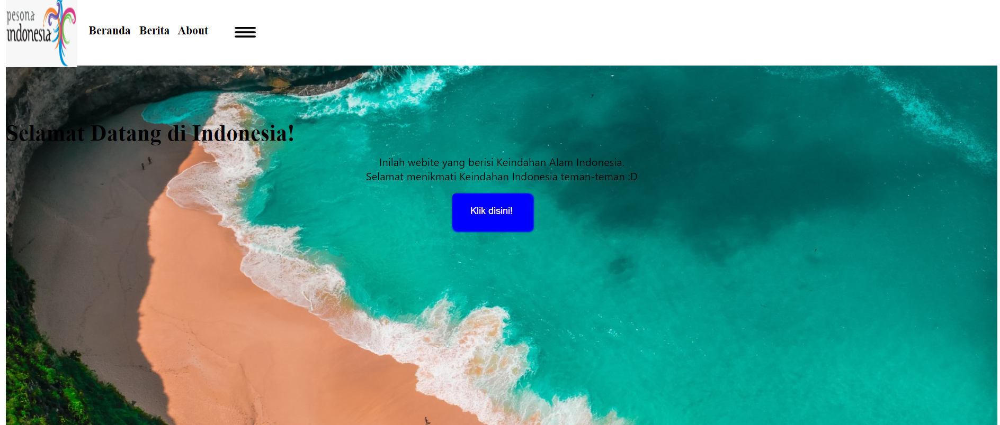

# Remedial Pesona Indonesia

## Query HTML
```HTML
<!DOCTYPE html>

<html>

<head>

    <link rel="stylesheet" href="./pesona indonesia.css">

    <title>Pesona Indonesia</title>

</head>

<body>

   <div class="container">

        <div class="kotak">

                

                    <div class="tulisan">

                        <h4 class="teksnavbar">&nbsp;&nbsp;&nbsp;&nbsp;Beranda&nbsp;&nbsp;&nbsp;Berita&nbsp;&nbsp;&nbsp;About&nbsp;&nbsp;&nbsp;&nbsp;</h4>

                        

                    </div>

        </div>

  

        <div class="box1">

            <h1 class="tek1ws2">Selamat Datang di Indonesia!</h1>

             <p class="teks3">Inilah webite yang berisi Keindahan Alam Indonesia.<br>Selamat menikmati Keindahan Indonesia teman-teman :D</p>

             <button class="tombol2">Klik disini!</button>

        </div>

  

        <div class="box2">

            <h1 class="judul" align="center">Berita</h1>

              <div class="berita">

                    

                    <h2 class="tk">Pantai Kuta</h2> <br>

                    <p class="teks33">Indonesia, dikenal dengan nama resmi Republik Indonesia

                        atau lebih lengkapnya Negara Kesatuan Republik Indonesia,

                        adalah negara kepulauan di Asia Tenggara yang dilintasi garis khatulistiwa

                        dan berada di antara daratan benua Asia

                        dan Oseania sehingga dikenal sebagai negara lintas benua.</p>

                    <button class="tombol1">Baca selengkapnya >></button>

              </div>

  

              <div class="berita">

                    

                    <h2 class="tk">Kebun Tetta</h2> <br>

                    <p class="teks33">Indonesia, dikenal dengan nama resmi Republik Indonesia

                        atau lebih lengkapnya Negara Kesatuan Republik Indonesia,

                        adalah negara kepulauan di Asia Tenggara yang dilintasi garis khatulistiwa

                        dan berada di antara daratan benua Asia

                        dan Oseania sehingga dikenal sebagai negara lintas benua.</p>

                    <button class="tombol1">Baca selengkapnya >></button>

              </div>

  

              <div class="berita">

                

                <h2 class="tk">Gunung Bromo</h2> <br>

                <p class="teks33">Indonesia, dikenal dengan nama resmi Republik Indonesia

                    atau lebih lengkapnya Negara Kesatuan Republik Indonesia,

                    adalah negara kepulauan di Asia Tenggara yang dilintasi garis khatulistiwa

                    dan berada di antara daratan benua Asia

                    dan Oseania sehingga dikenal sebagai negara lintas benua.</p>

                <button class="tombol1">Baca selengkapnya >></button>

              </div>

  

              <div class="berita">

                

                <h2 class="tk">Jekadah!</h2> <br>

                <p class="teks33">Indonesia, dikenal dengan nama resmi Republik Indonesia

                    atau lebih lengkapnya Negara Kesatuan Republik Indonesia,

                    adalah negara kepulauan di Asia Tenggara yang dilintasi garis khatulistiwa

                    dan berada di antara daratan benua Asia

                    dan Oseania sehingga dikenal sebagai negara lintas benua.</p>

                <button class="tombol1">Baca selengkapnya >></button>

              </div>

        </div>

  

  

        <div class="box3">

        <h1 class="about">About</h1>

        <div class="teks4">

                

                <p class="teks5">Indonesia, dikenal dengan nama resmi Republik Indonesia

                    atau lebih lengkapnya <br> Negara Kesatuan Republik Indonesia,

                    adalah negara kepulauan di Asia Tenggara yang <br> dilintasi garis khatulistiwa

                    dan berada di antara daratan benua Asia dan Oseania <br> sehingga dikenal sebagai negara lintas benua.</p>

            </div>

        </div>

  

   </div>

</body>

</html>
```
### Penjelasan
  
Program HTML yang diberikan adalah sebuah halaman web sederhana berjudul "Pesona Indonesia." Halaman ini memperkenalkan keindahan alam Indonesia dan menampilkan beberapa bagian utama: Beranda, Berita, dan About. Berikut penjelasan terperinci dari setiap bagian:

### Struktur HTML:
1. **Header (`<head>`)**
    - **Link ke CSS (`<link rel="stylesheet" href="./pesona indonesia.css">`)** Ini merujuk pada file CSS eksternal bernama `pesona indonesia.css` yang akan digunakan untuk menata halaman web ini.
    
    - **Judul Halaman (`<title>`)** Menetapkan judul halaman sebagai "Pesona Indonesia."
2. **Body (`<body>`)**
    - **Container Utama (`<div class="container">`)** Seluruh konten halaman berada di dalam div ini.
    - **Bagian Navigasi (`<div class="kotak">`)**
        - **Logo (``)** Gambar logo yang ditampilkan pada bagian navigasi.
        - **Tulisan Navigasi (`<div class="tulisan">`)**
            - **Teks Navigasi (`<h4 class="teksnavbar">`)** Tautan navigasi untuk Beranda, Berita, dan About.
            - **Gambar Tambahan (``)** Gambar tambahan di sebelah tautan navigasi.
            
    - **Box 1 (Selamat Datang) (`<div class="box1">`)**
        - **Judul Selamat Datang (`<h1 class="tek1ws2">`)** Menampilkan ucapan selamat datang di Indonesia.
        - **Paragraf Deskripsi (`<p class="teks3">`)** Deskripsi singkat tentang tujuan website ini.
        - **Tombol Aksi (`<button class="tombol2">`)** Tombol yang bertuliskan "Klik disini!".
        
    - **Box 2 (Berita) (`<div class="box2">`)**
        - **Judul Berita (`<h1 class="judul" align="center">`)** Menampilkan judul bagian berita.
        - **Berita Individual (`<div class="berita">`)** Setiap berita memiliki elemen:
            - **Gambar Berita (``)**
            - **Judul Berita (`<h2 class="tk">`)**
            - **Deskripsi Singkat (`<p class="teks33">`)**
            - **Tombol Aksi (`<button class="tombol1">`)** Tombol yang bertuliskan "Baca selengkapnya >>". Ada empat berita yang ditampilkan dengan struktur yang sama, hanya berbeda pada gambar dan judulnya.
            
    - **Box 3 (About) (`<div class="box3">`)**
        - **Judul About (`<h1 class="about">`)** Menampilkan judul bagian About.
        - **Konten About (`<div class="teks4">`)**
            - **Gambar About (``)**
            - **Paragraf Deskripsi (`<p class="teks5">`)** Deskripsi lebih lanjut tentang Indonesia.
### Analisis
Halaman web "Pesona Indonesia" adalah sebuah halaman statis yang dirancang untuk menampilkan keindahan alam Indonesia. Berikut ini adalah analisis mendetail dari struktur dan elemen-elemen yang ada di dalam HTML tersebut.

#### Struktur Utama
1. **Header (`<head>`)**
    - **CSS Link (`<link rel="stylesheet" href="./pesona indonesia.css">`)** Menghubungkan halaman HTML dengan stylesheet eksternal bernama `pesona indonesia.css`. File CSS ini akan memberikan gaya pada elemen-elemen HTML.
    - **Title (`<title>`)** Menentukan judul halaman web yang akan ditampilkan di tab browser sebagai "Pesona Indonesia".
    
1. **Body (`<body>`)**
    - **Container Utama (`<div class="container">`)** Seluruh konten halaman ditempatkan di dalam elemen div dengan kelas `container`. Ini mungkin digunakan untuk mengatur tata letak keseluruhan halaman.
        
    - **Bagian Navigasi (`<div class="kotak">`)**
        - **Logo (``)** Gambar logo yang mungkin mewakili merek atau identitas situs web.
        - **Navigasi Teks (`<div class="tulisan">`)**
            - **Teks Navigasi (`<h4 class="teksnavbar">`)** Berisi tautan ke berbagai bagian situs web: Beranda, Berita, dan About. Tautan ini memungkinkan pengguna untuk menavigasi ke bagian berbeda dari situs.
            - **Gambar Dekoratif (``)** Gambar tambahan yang mungkin digunakan untuk estetika atau branding.
            
    - **Bagian Sambutan (`<div class="box1">`)**
        - **Judul Sambutan (`<h1 class="tek1ws2">`)** Menyambut pengunjung dengan pesan "Selamat Datang di Indonesia!".
        - **Paragraf Deskripsi (`<p class="teks3">`)** Memberikan informasi singkat tentang tujuan halaman web, yaitu menampilkan keindahan alam Indonesia.
        - **Tombol Aksi (`<button class="tombol2">`)** Tombol interaktif yang mengundang pengguna untuk "Klik disini!", mungkin untuk memulai tur atau menuju ke bagian lain dari situs.
        
    - **Bagian Berita (`<div class="box2">`)**
        - **Judul Bagian Berita (`<h1 class="judul" align="center">`)** Menampilkan judul bagian "Berita" di tengah halaman.
        - **Berita Individu** Setiap item berita berada dalam elemen div dengan kelas `berita`. Setiap berita memiliki elemen berikut:
            - **Gambar Berita (``)** Gambar yang mewakili setiap berita.
            - **Judul Berita (`<h2 class="tk">`)** Judul berita, seperti "Pantai Kuta", "Kebun Tetta", "Gunung Bromo", dan "Jekadah!".
            - **Deskripsi Berita (`<p class="teks33">`)** Paragraf pendek yang memberikan gambaran tentang berita.
            - **Tombol Baca Selengkapnya (`<button class="tombol1">`)** Tombol yang mengundang pengguna untuk "Baca selengkapnya >>", mungkin menuju artikel lengkap atau halaman berita terkait.
            
    - **Bagian About (`<div class="box3">`)**
        - **Judul Bagian About (`<h1 class="about">`)** Judul bagian "About" yang memperkenalkan bagian ini.
        - **Konten About (`<div class="teks4">`)**
            - **Gambar About (``)** Gambar yang terkait dengan informasi di bagian About.
            - **Deskripsi About (`<p class="teks5">`)** Paragraf yang menjelaskan lebih detail tentang Indonesia, termasuk fakta geografis dan budaya.
### Kesimpulan
Halaman web "Pesona Indonesia" ini dirancang dengan baik untuk menarik minat pengunjung dengan menampilkan destinasi wisata populer di Indonesia. Struktur HTML yang jelas dan penggunaan elemen visual seperti gambar dan tombol interaktif meningkatkan pengalaman pengguna. Dengan penambahan konten lebih mendalam di setiap artikel berita dan destinasi tambahan, halaman ini dapat menjadi sumber informasi yang berguna bagi wisatawan yang tertarik mengunjungi Indonesia. Implementasi CSS yang efektif juga akan sangat meningkatkan tampilan dan nuansa keseluruhan dari halaman ini.
## Query CSS
```CSS
.container{

  width: auto;

  height: auto;

}

  

.container >.kotak{

  width: 100%;

  height: 15%;

  position: fixed;

  background-color: white;

  margin-top: -1%;

  z-index: 1;

}

  

.box  >.tulisan{

  margin-left: 38%;

  font-size: 18px;

  padding-top: 40px;

 font-family: 'Segoe UI';

}

  

.logo{

  width: 100px;

  height: 100px;

  float: left;

}

  

.teksnavbar {

margin-left: 15px;

margin-top: 40px;

}

  
  

.samadengan{

width: 30px;

height: 15px;

margin-left: 220px;

float: left;

margin-top: -36px;

  

}

  

.box1{

  padding-bottom: 20%;

  padding-top: 10%;

  background-image: url(./foto\ 1.jpg);

  width: 100%;

  height: 18%;

  margin-bottom: 40px;

  background-size:cover ;

}

  

.teks3{

  text-align: center;

  font-size: 15px;

  font-family: 'Segoe UI';

  margin-top: -10px;

}

  

.teks33{

  text-align: center;

  font-size: 15px;

  font-family: 'Segoe UI';

  margin-top: -5px;

  margin-right: 7px;

}

  

.teks2{

  margin-top: 150px;

  text-align: center;

  font-family: 'Segoe UI';

}

  

.teks2{

color: white;

text-align: center;

font-family: 'Segoe UI';

}

  

.tombol2 {

color: white;

background-color: blue;

width: 110px;

height: 50px;

margin-left: 45%;

border-radius: 5px;

box-shadow: 2px 2px 2px 2px blue;

border: none;

position: flex -15px;

}

  

.tombol2:hover {

background-color: burlywood;

color: black;

box-shadow: 2px 3px 2px 3px gray;

transition: all 0.5s ease-in;

}

  

.berita {

margin-top: 150px;

  width: 275px;

  height: 520px;

  border-radius: 15px;

  box-shadow: 5px 4px 10px 4px #c7c1c1;

  float: left;

  margin: 16px;

  font-size: 15px;

  padding: 10px 0px 20px 20px;

}

  

.tk{

  color: blue;

  font-family: 'Segoe UI';

 margin-bottom: 1px;

 margin-left: 3px;

}

  

.gambar{

 width: 265px;

 border-radius: 20px;

 height: 170px;

}

  

.tombol1{

  border: none;

  background-color: blue;

  width: 194px;

  height: 50px;

  color:white;

  box-shadow: 2px 3px 2px 3px #4c86df;

  border-radius: 10px;

  margin-top: 1px;

  margin-left: 30px;

}

  

.tombol1:hover {

  background-color: burlywood;

  color: black;

  box-shadow: 2px 3px 2px 3px gray;

  transition: all 0.3s ease-in;

}

  

/*.tetx{

  margin-top: -1px;

  padding: 10px 20px 20px 20px;

  font-family: 'Segoe UI';

}*/

  

.box3{    

  margin-top: 100px;

  background-color: blue;

  height: 360px;

  width: 100%;

  display: flex;

  flex-direction: column;

}

  

.teks4 {

  display: flex;

  flex-direction: row;

}

  

.gambar1{

  width: 200px;

  height: 200px;

  border-radius: 100px;

  margin-left: 15%;

  margin-top: 50px;

  filter: grayscale(100%);

  margin-top: 0px;

}

  

.about{

  color: white;

  text-align: center;

  font-family: 'Segoe UI';

  padding-top: 35px;

  margin-top: -5px;

  margin-left: -10px;

}

  

.teks5{

  text-align: justify;

  margin-top: 50px;

  font-family: 'Segoe UI';

  color: white;

  margin-left: 5%;

  display: flex;

  flex-direction: column;

}

  

.tambahan {

  margin-top: 650px;

  background-color: cadetblue;

  height: 500px;

  width: 100%;

  display: flex;

  flex-direction: row;

  justify-content: space-around;

}

  

.tomboltambahan{

    border: none;

    background-color: blue;

    width: 194px;

    height: 50px;

    color:white;

    box-shadow: 2px 3px 2px 3px #4c86df;

    border-radius: 10px;

    margin-top: 20px;

    margin-left: 35px;

  }

  

.tomboltambahan:hover {

    background-color: burlywood;

    color: black;

    box-shadow: 2px 3px 2px 3px gray;

    transition: all 0.5s ease-in;

  }

  
  
  
  
  

/*@media (max-width: 701px){

  .tombol2 {

    margin-left: 275px;

  }

  

  .logo {

    margin-left: 150px;

  }

  

  .tulisan {

    margin-left: 150px;

  }

  

  .gambar1 {

    margin-left: 20px;

  }

  

  .teks5 {

    margin-top: 25px;

    margin-right: 30px;

  }

}

  

/*.{

  width: 145px;

  height: 200px;

  border-radius: 200px;

  margin-left: -150%;

  margin-top: 10px;

 display: flex;

 margin-top: 100px;  

 align-items: center;

}

  

.deskripsi{

  margin-left: -350%;

  text-align: center;

  margin-top: 40px;

  font-family: 'Segoe UI';

  color: white;

  border: 10px;

  border-color: white;

  border-radius: 15px;

}

  

.satu {

  width: 100px;

  

}

  

.dua {

  width: 100px;

  float: left;

}

  

.tiga {

  width: 100px;

  float: left;

}*/
```
### Penjelasan

  **Container Utama**
    - `.container`: Menetapkan lebar dan tinggi kontainer utama menjadi otomatis.
**Navigasi**
    - `.kotak`: Mengatur tata letak dan tampilan kotak navigasi. Lebarnya diatur menjadi 100% dari lebar layar. Tingginya diatur 15% dari tinggi layar dengan posisi tetap (fixed) di bagian atas layar.
    - `.tulisan`: Menetapkan tata letak dan gaya teks pada navigasi. Margin kiri diatur untuk menyesuaikan dengan posisi logo.
**Logo**
    - `.logo`: Menetapkan ukuran dan tata letak logo. Gambar logo diatur menjadi 100x100 piksel dengan posisi mengambang ke kiri.
**Tombol Klik**
    - `.tombol2`: Mengatur tampilan tombol "Klik disini!". Warna latar belakangnya adalah biru dengan bayangan dan radius sudut. Tombol ini muncul di tengah dengan bantuan margin.
 **Bagian Berita**
    - `.berita`: Mengatur tampilan setiap berita dalam kotak yang terdefinisi dengan bayangan dan radius sudut.
    - `.tk`: Memberi warna teks biru pada judul berita.
**Tombol Baca Selengkapnya**
    - `.tombol1`: Mengatur tampilan tombol "Baca selengkapnya". Sama seperti tombol sebelumnya, namun dengan lebar yang lebih kecil.
**Bagian About**
    - `.box3`: Mengatur tampilan kotak tentang. Background-color diatur biru, tinggi dan lebarnya 100% dari lebar layar, dengan tata letak kolom.
    - `.teks4`: Menetapkan tata letak kolom untuk teks dan gambar dalam bagian tentang.
**Tombol Tambahan**
    - `.tambahan`: Mengatur tampilan kotak tambahan. Background-color diatur ke cadetblue dengan tata letak kolom.
    - `.tomboltambahan`: Menetapkan tampilan tombol tambahan. Sama seperti tombol sebelumnya, namun digunakan untuk bagian tambahan.
### Analisis
**Tata Letak dan Pengaturan Kontainer:**
    - Penggunaan properti `width: auto;` dan `height: auto;` pada `.container` memungkinkan konten untuk menyesuaikan ukuran halaman secara otomatis.
    - `.kotak` mengatur navigasi dengan lebar 100% dan tinggi 15% dari tinggi layar, dengan posisi tetap (fixed) di bagian atas layar. Hal ini memastikan navigasi tetap terlihat saat pengguna melakukan gulir ke bawah.
**Navigasi dan Logo:**
    - Logo diatur dengan ukuran tetap 100x100 piksel dan posisi mengambang ke kiri, memberikan identitas visual yang konsisten.
    - Tautan navigasi diberi gaya dengan margin dan ukuran teks yang sesuai agar terlihat rapi dan mudah dinavigasi.
**Bagian Sambutan dan Tombol Klik:**
    - `.box1` menentukan tata letak dan gaya visual bagi bagian sambutan, dengan menggunakan gambar latar belakang.
    - Tombol "Klik disini!" (`tombol2`) memiliki tampilan yang menarik dengan bayangan dan transisi warna saat digulir.
**Bagian Berita:**
    - Setiap berita (`berita`) diatur dalam kotak dengan bayangan dan radius sudut yang memberikan dimensi visual.
    - Judul berita (`tk`) diberi warna biru untuk menonjolkan informasi yang penting.
 **Tombol Baca Selengkapnya:**
    - Tombol "Baca selengkapnya" (`tombol1`) memiliki tampilan yang serupa dengan tombol "Klik disini!", namun lebih kecil untuk konsistensi.
**Bagian About:**
    - `.box3` menetapkan tampilan bagian About dengan warna latar belakang biru dan tata letak kolom.
    - Gambar dan teks dalam bagian About (`teks4`) diatur secara bersamaan dengan tata letak kolom yang mengoptimalkan ruang.
**Tombol Tambahan:**
    - `.tomboltambahan` dan `.tambahan` digunakan untuk bagian tambahan di halaman. Ini menunjukkan kemungkinan perluasan dan konsistensi desain.
### Kesimpulan
- CSS ini memberikan tampilan yang menarik dan terstruktur bagi halaman "Pesona Indonesia", dengan penggunaan warna, bayangan, dan tata letak yang baik.
- Penggunaan properti CSS seperti `position`, `float`, `margin`, dan `padding` membantu dalam menata elemen-elemen dengan baik.
- Konsistensi gaya dan tata letak, seperti ukuran dan warna tombol, memberikan kesan yang profesional dan mudah dipahami bagi pengguna.
- Potongan kode yang di-comment menunjukkan adanya eksperimen atau rencana pengembangan lebih lanjut dalam desain halaman.

Secara keseluruhan, CSS ini berperan penting dalam meningkatkan pengalaman pengguna dan menampilkan konten halaman "Pesona Indonesia" dengan cara yang menarik dan informatif.
## Hasil



## Link Video Tutorial Pesona Indonesia


Belum Selesai :)