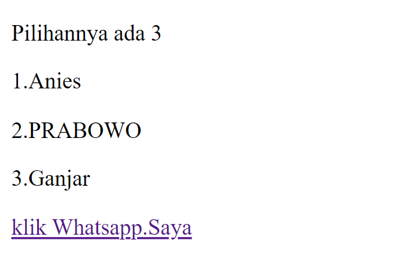
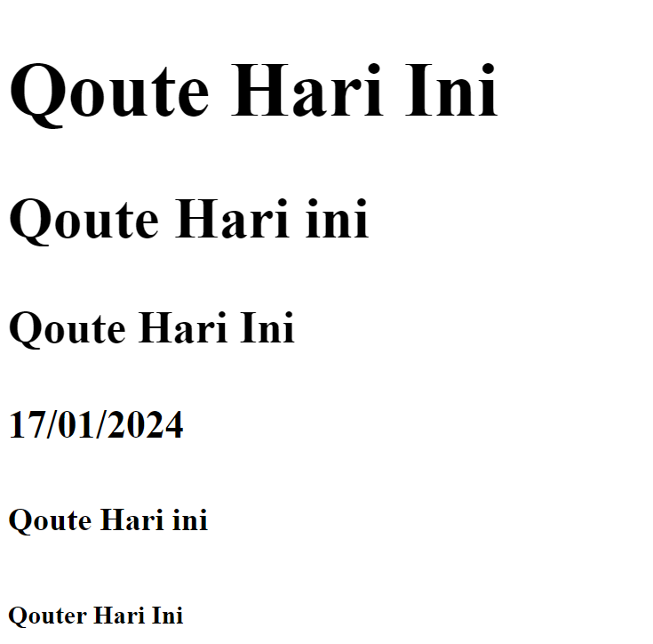
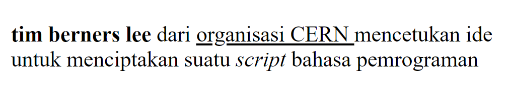
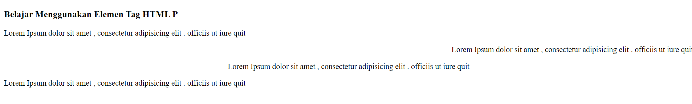
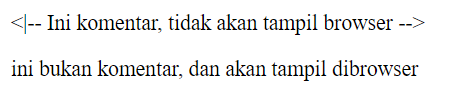
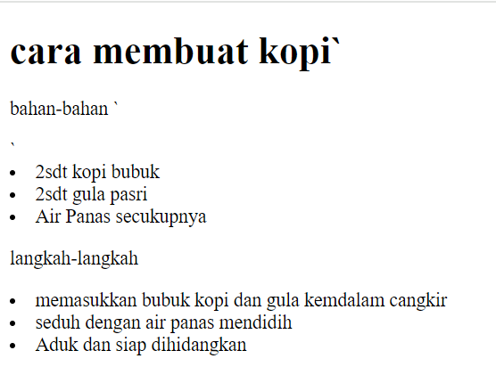
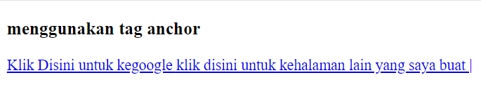
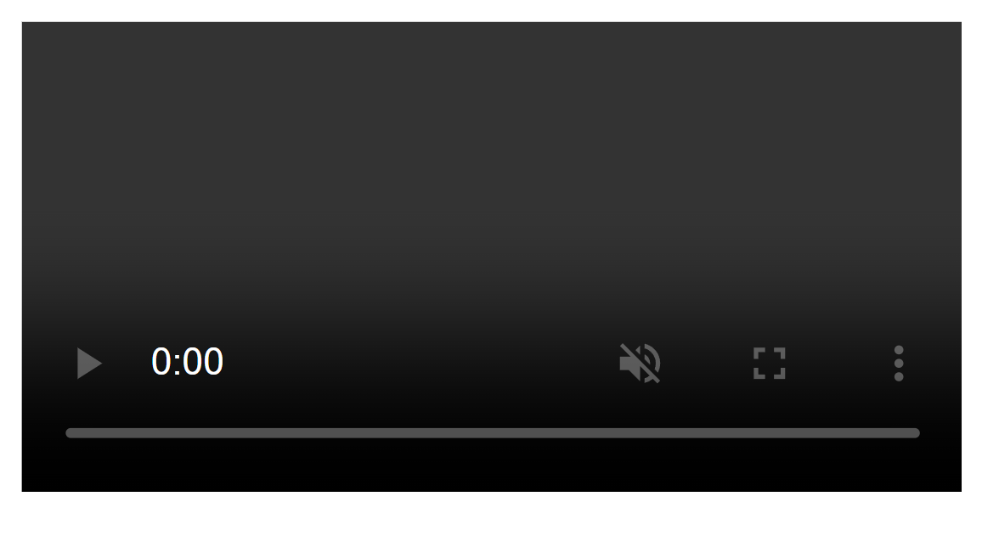
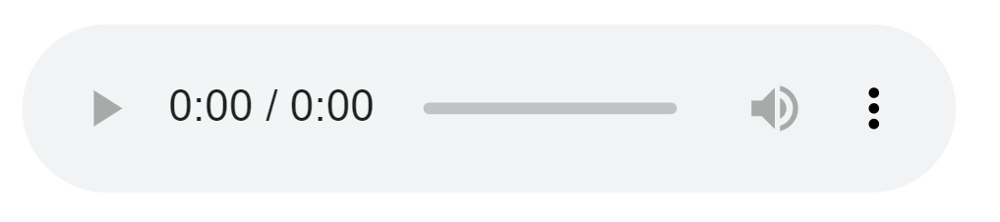
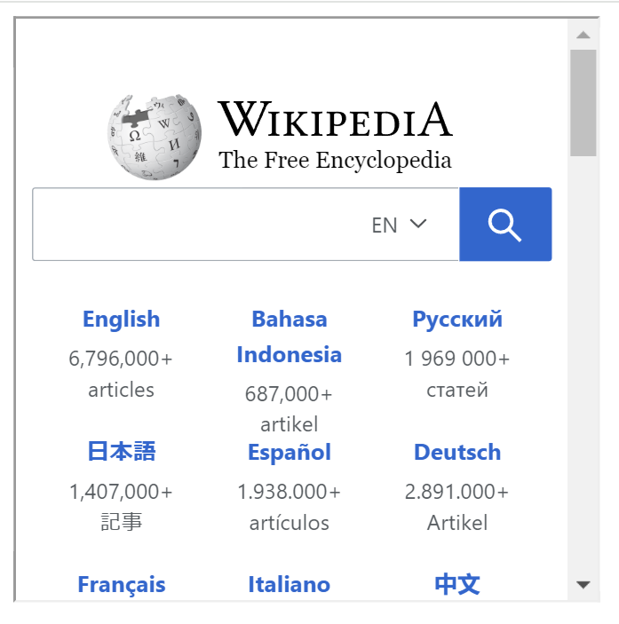

# Struktur Dasar HTML
```html
<!DOCTYPE html>
    <html>  

        <body>

            <title>ini adalaah judul</title>

            <body>
            
                <p>Pilihannya ada 3</p>

                <p>1.Anies</p>

                <p>2.PRABOWO</p>

                <p>3.Ganjar</p>

            <a href="https://web.whatsapp.com/">klik Whatsapp.Saya</a>

            </body>

        </html>
```


## Penjelasan
-Tag <!DOCTYPE html> memberitahukan web bahwa dokumen HTML Adalah Versi 5
-Tag pembuka `<html>` menandai awal sebuah dokumen HTML Sampai dengan tag penutup `</html>`
-Tag pembuka `<head>` berisi informasi tentang halaman HTML Sampai Dengan Tag penutup
halaman HTML
-Apapun tag yang berada diantara tag pembuka <body> sampai dengan tag penutup 
</body> akan tampil di web browser
## Hasil

ini gambar hasil yang ada diatas...
# Sejarah Web
Sejarah atau cerita developer yaitu pada tahun 1980seseorang insyinur bernama (Team Berners-Lee)ia menciptakan sebuah dokumen bisa terhubung satu sama lain melalui internet


## Protokol HTML,BROWSER
ia menciptakan protokol http yang jadi jembatan antara server dan client untuk saling mengirim data jadi http ini yang menjadi perantara atau jembatannya karena data yang dikirim berupa teks teks mentah kita lebih mudah membaca dokumen yang diformat makanya dia ciptain html sebagai bahasa untuk simpelnya ngobromatin teks jadi lebih rapi dan lebih terstruktur. Ia juga menciptakan browser pertama yang dikasi nama worldwipe atau www yang sampai saat ini nama www ini kita sering temuin diwebsite jadi dia bikin http untuk mentransfer data. diciptain html untuk format datanya dan dia ciptain browser www tadi untuk nampilin data nya dari sini udah kebayang belum kalau kita mau bikin website berarti wajib hukumnya atau yang namanya html yang sampai saat ini ciptain html untuk format datanya dan dia nyitain browser www tadi untuk nampilin datanya Nah dari sini udah kebayang belum kalau kita mau bikin website berarti wajib hukumnya atau yang namanya html yang sampai saat ini

# Deskirpsi Sebuah Rumah Di HTML CSS JAVA SCRIPT
## Struktur

## HTML Rumah KERANGKA
Seperti Kerangka rumah html menyediakan struktur dasar halaman web itu menentukan elemen elemen utama seperti header footer dan konten
## CSS Rumah Berwarna
Analogi ini mencerminkan CSS Yang Memberikan gaya dan tata letak pada halaman web mirip dengan cara warna dan estetika memberikan keindahan pada rumah
## JavaScript Rumah Mempunyai Lampu
seperti sistem elektronik rumah yang dapat diatur javascript menambahkan fungsi dinamis seperti lampu yang menyala memberikan interaktivitas dan meningkatkan pengalaman pengguna pada halaman web


# Anatomi Elemen HTML
Analisis
Anatomi Elemen HTML adalah pemahaman tentang struktur dasar atau "anatomi" suatu halaman web yang ditulis dengan bahasa markup HTML.

Struktur:
```html
<a href=" "https://web.whatsapp.com/"
```
Tag <.a adalah elemen dasar untuk membuat link di html dan termasuk
tag pembuka
herf adalah nama atribut digunakan untuk menghubungkan antara halaman web dan termasuk tag pembuka
*https://www.google.com* adalah nilai atribut yang digunakan untuk mengakses sebuah  dan termasuk tag pembuka
~Klik Google adalah~ adalah konten si yang digunakan untuk kata kunci atau judul untuk memudahkan seseorang mengakses link yang ditampilkan
`</a>` adalah tag penutupnya


# Tag Dasar
## Heading
Heading merupakan tag HTML Yang digunakan untuk menunjukkan bagian penting pada halaman website dan memiliki enam tingkatan yang berurutan yaitu H1 Hingga H1 Semakin besar tingkatnya headingnya semakin kecil juga tulisannya

Struktu Headingr:
```html
				<h1>Qoute Hari Ini</h1>

                <h2>Qoute Hari ini</h2>

                <h3>Qoute Hari Ini</h3>

                <h4>17/01/2024</h4>

                <h5>Qoute Hari ini</h5>

                <h6>Qouter Hari Ini</h6>
```

Hasil Heading:


kesimpulan Heading:
  
Kesimpulan mengenai penggunaan elemen judul (heading) dalam HTML (h1, h2, h3, h4, h5, h6) adalah sebagai berikut:
h1: Digunakan untuk judul utama atau judul halaman. Hanya satu h1 sebaiknya digunakan dalam satu halaman untuk menunjukkan hierarki informasi yang jelas.
h: Digunakan untuk judul subbagian yang penting dalam halaman. Biasanya berada di bawah h1 dan menunjukkan subbagian yang lebih spesifik.
 **h3**: Digunakan untuk subjudul yang lebih spesifik dari h2. Biasanya digunakan untuk membagi subbagian dari h2.
h4, h5, h6: Digunakan untuk subjudul yang lebih spesifik lagi. Penggunaan h4, h5, dan h6 sebaiknya terbatas pada kasus-kasus di mana ada struktur hierarki yang sangat dalam.

## Paragraf
Analisis:
paragraf adalah kumpulan dari beberapa kalimat pada web paragraf biasany digunakan untuk menampilkan teks atau artikel didalam paragraf terdapat kode `<p>,<b>,<u>,<i>,<br>`

Struktur Paragraf:
```html
<p>
<b> tim berners lee </b> dari <u> organisasi  CERN </u> mencetukan ide
<br> untuk menciptakan suatu <i> script </i> bahasa pemrograman <br>
</p>
```

Hasil Paragraf:


Kesimpulan Paragraf:
`<p>` digunakan untuk pengaturan antara halaman diweb
`<b>`digunakan agar teks pada halaman tebal
`<u>` digunakan untuk memberikan garis bawa pada web halaman
`<i>`digunakan agar teks miring pada halaman
`<br>` digunakan membuat baris baru

### Atribut Align

Analisis:
Atribut align digunakan untuk mengatur  perataan teks pada halaman HTML Elemen `<p>`
dapat menggunakan nilai atribut `align="left"` , akan menghasilkan paragraf dengan perataan
teks disebelah kiri Nilai atribut `align="right"` , akan menghasilakn paragraf dengan perataan
teks sebelah kanan nilai atribut `align"center"` , akan menghasilkan paragraf dengan perataan
teks ditengah dan nilai atribut `align="justify"` , akan menghasilkan paragraf dengan perataan
teks pada kiri dan sisi kanan

Struktur Align:
```html
<h3> Belajar Menggunakan Elemen Tag HTML P </h3>
<p align ="left">
	Lorem Ipsum dolor sit amet , consectetur adipisicing elit . officiis ut iure quit
</p>
<p align="right">
	 Lorem Ipsum dolor sit amet , consectetur adipisicing elit . officiis ut iure quit
</p>
<p align="center">
	Lorem Ipsum dolor sit amet , consectetur adipisicing elit . officiis ut iure quit
</p>
<p align="justify">
	Lorem Ipsum dolor sit amet , consectetur adipisicing elit . officiis ut iure quit
</p>
```

Hasil Align:


Kesimpulan Align:
Kesimpulan tentang penggunaan atribut `align` dalam HTML, termasuk `align="left"`, `align="right"`, `align="center"`, dan `align="justify"`, adalah sebagai berikut:
**align="left"**: Atribut ini digunakan untuk mengatur penempatan elemen ke sisi kiri dari area konten atau wadah yang mengelilinginya. Ini berguna untuk mengatur teks atau elemen lain agar mulai dari sisi kiri dan rapi.
**align="right"**: Atribut ini digunakan untuk mengatur penempatan elemen ke sisi kanan dari area konten atau wadah yang mengelilinginya. Ini berguna untuk mengatur teks atau elemen lain agar berada di sebelah kanan dan rapi.
**align="center"**: Atribut ini digunakan untuk mengatur penempatan elemen di tengah dari area konten atau wadah yang mengelilinginya. Ini berguna untuk mengatur teks atau elemen lain agar berada di tengah secara horizontal.
 **align="justify"**: Atribut ini digunakan untuk mengatur teks agar rata di kedua sisi, sehingga teks membentuk garis vertikal yang lurus di sisi kiri dan kanan. Ini biasanya digunakan untuk paragraf teks untuk menciptakan tata letak yang rapi dan terstruktur.
### Belajar Menggunakan Element Tag HTML 
Lorem ipsum dolor sit amet consectetur adipisicing elit, Officiis ut iure qusqum  consequuntur id rustor vitae molestiae assumenda ipsam eaque ipsa sit porro earum alias raitone asper

## Komentar
Analisis:
HTML juga mempunyai tag khusus untuk komentar untuk membuat komentar di HTML
kita menggunakan awalan `"<|--" dan penutup"-->"`
`Komentar tidak akan ditampilkan pada halaman website namun programmer biasanya menggunakan komentar untuk memperjelas kode program`

Struktur Komentar:
```html
<|-- Ini komentar, tidak akan tampil browser -->
<p> ini bukan komentar, dan akan tampil dibrowser
```

Hasil Komentar:


Kesimpulan Komentar:
  
Komentar dalam HTML adalah bagian dari kode yang tidak ditampilkan di browser web, tetapi digunakan oleh pengembang untuk memberikan informasi tambahan atau catatan tentang kode tersebut. Berikut adalah kesimpulan mengenai penggunaan komentar dalam HTML:
**Meningkatkan Keterbacaan Kode**: Komentar digunakan untuk menjelaskan atau memberikan konteks tentang bagian-bagian tertentu dari kode HTML. Ini membantu pengembang lain atau bahkan diri sendiri di masa depan untuk lebih mudah memahami tujuan dan fungsi dari bagian-bagian tersebut.
 **Penyembunyian Informasi**: Komentar juga digunakan untuk menyembunyikan bagian-bagian kode yang sedang diuji atau tidak aktif, tanpa harus menghapusnya sepenuhnya. Ini memungkinkan pengembang untuk menguji variasi dalam kode tanpa memengaruhi tampilan halaman web secara langsung.
 **Kolaborasi Tim**: Dalam proyek kolaboratif, komentar memungkinkan anggota tim untuk berkomunikasi dan berbagi informasi tentang bagaimana kode tersebut bekerja atau perubahan apa yang telah dilakukan.
**Dokumentasi**: Komentar juga dapat digunakan sebagai bagian dari dokumentasi kode, memberikan petunjuk tentang cara menggunakan atau memodifikasi bagian-bagian tertentu dari kode.
**Debugging**: Komentar dapat membantu dalam proses debugging (penelusuran kesalahan) dengan memberikan petunjuk tentang bagian mana yang menyebabkan masalah atau bagian mana yang telah diuji.
## List
Analisis:
list adalah fungsi dalam HTML yang digunakan untuk menampilkan daftar dari sesuatu dalam HTML tag list terdiri dari 2 jenis `<o1>` ordered list (berurutan) dan `<u1>`unordered list (tidak berurutan) ordered list akan ditampilkan dengan angka atau huruf sedangkan unordered list dengan bulatan atau kotak ataupun simbol lainnya

Struktur List:
```html
<h1> cara membuat kopi`</b1>
<p> bahan-bahan `</p>`
<u1>
	<li> 2sdt kopi bubuk</li>
	<li> 2sdt gula pasri</li>
	<li> Air Panas secukupnya</li>
</u1>
<p> langkah-langkah</p>
<o1>
	<li> memasukkan bubuk kopi dan gula kemdalam cangkir</li>
	<li> seduh dengan air panas mendidih</li>
	<li> Aduk dan siap dihidangkan</li>
</o1>
```

Hasil List:


Kesimpulan List:
  
Kesimpulan tentang penggunaan list dalam HTML, termasuk unordered list (ul), ordered list (ol), dan list item (li), adalah sebagai berikut:
 **Unordered List (ul)**: Digunakan untuk membuat daftar yang tidak berurutan, di mana setiap item dalam daftar ditampilkan dengan simbol atau bullet. Contoh penggunaan ul adalah untuk membuat daftar pilihan atau daftar item yang tidak memiliki urutan tertentu.
**Ordered List (ol)**: Digunakan untuk membuat daftar yang terurut, di mana setiap item dalam daftar ditampilkan dengan nomor atau huruf berurutan. Contoh penggunaan ol adalah untuk membuat daftar langkah-langkah, daftar peringkat, atau daftar yang harus diikuti sesuai dengan urutannya.
**List Item (li)**: Digunakan untuk menandai setiap item dalam daftar, baik dalam ul (daftar tidak berurutan) atau ol (daftar terurut). Setiap li biasanya berada di dalam ul atau ol dan menampilkan konten yang ingin dimasukkan dalam daftar.

## Link
Analisis
Link Dapat ditemukan dihampir semua halaman link/tautan memungkinkan sebuah teks yang ketika di-klik akan pindah ke halaman lainnya HTML menggunakan tag `<a>` untuk keperluan ini. Link ditulis dengan `<a>` yang merupakan singkatan cari anchor (angka)
`Setiap tag <a> setidaknya memiliki sebuah atribut href dimana href berisi alamat yang dulu href adalah singkatan dari hypertext reference

Atribut penting lainnya dari tag `<a>` adalah target atribut target menentukan tempat untuk membuka dokumen yang ditautkan atribut `target` memiliki beberapa nilai salah satunya `_blank` yang berfungsi untuk membuka tautan ditab baru

Struktur Link:
```html
<h3> menggunakan tag anchor </h3>
<a href="https://www.google.com" target="_blank">Klik Disini untuk kegoogle </a>
<a href="halaman _lain.html">klik disini untuk kehalaman lain yang saya buat | </a>
```

Hasil Link:


Kesimpulan Link:
Dalam HTML, tautan (link) digunakan untuk menghubungkan halaman web satu dengan yang lainnya atau untuk menghubungkan bagian-bagian tertentu dari halaman yang sama. Tautan dapat berupa teks, gambar, atau elemen lainnya.
# Multimedia
## Foto
Analisis:

 **``**: Ini adalah tag gambar dalam HTML yang digunakan untuk menampilkan gambar di halaman web.
 **`src="kadin.png"`**: Atribut `src` menentukan sumber atau lokasi file gambar. Dalam contoh ini, gambar bernama "smk7.png" akan diambil dari direktori yang sama dengan halaman HTML.
 **`alt="Soal"`**: Atribut `alt` menyediakan teks alternatif yang akan muncul jika gambar tidak dapat dimuat. Ini juga digunakan oleh pembaca layar untuk membantu pengguna dengan keterbatasan penglihatan. Dalam contoh ini, teks alternatifnya adalah "Soal".
 **`width="150"` dan `height="150"`**: Atribut `width` dan `height` menentukan lebar dan tinggi gambar, masing-masing. Dalam contoh ini, gambar akan ditampilkan dengan lebar 150 piksel dan tinggi 150 piksel.

Struktur Foto:
```html

`.Tag `` adalah tag kosong.hanya berisi atribut saja, dan tidak memiliki tag penutup
`Atribut src setidaknya mesti ada dalam tag ini untuk menentukan URL (alamt web) dari gambar yang ingin ditampilkan.`
Atribut `alt` menyediakan teks alternatif untuk gambar jika pengguna karena beberapa alasan tidak dapat melihatnya (karena koneksi lambat kesalahan pada atribut `src` , atau jika web browser  telah disetting untuk tidak menampilkan gambar). jika browser tidak dapt menemukan gambar maka akan muncul nilai pada atribut alt.

## Video
Analisis:
Kode HTML yang Anda berikan adalah elemen `<video>` yang digunakan untuk menampilkan video di halaman web. Berikut penjelasan untuk atribut-atribut yang digunakan dalam elemen tersebut:

**`src`**: Atribut ini menentukan lokasi file video yang akan dimuat. Dalam contoh ini, video berjudul "video lucu.mp4" akan diambil dari lokasi yang sama dengan halaman HTML.
 **`controls`**: Atribut ini menambahkan kontrol pemutaran video seperti tombol play, pause, dan volume ke pemutar video. Jika diatur, pengguna dapat mengontrol pemutaran video.
**`autoplay`**: Atribut ini, jika diatur, akan memulai pemutaran video secara otomatis begitu halaman dimuat. Dalam contoh ini, video akan dimulai secara otomatis.
**`muted`**: Atribut ini, jika diatur, akan memulai video dalam keadaan terdiam (tanpa suara). Ini umumnya digunakan ketika video diinginkan untuk diputar otomatis tanpa mengganggu pengalaman pengguna dengan suara.
**`width` dan `height`**: Atribut-atribut ini menentukan lebar dan tinggi elemen video dalam piksel. Dalam contoh ini, video akan ditampilkan dengan lebar 350 piksel dan tinggi 350 piksel.

Struktur Video :
```html
<video src="video lucu.mp4"controls autoplay muted width="350: height=350:></video>
```
#### Hasil Video



Kesimpulan:
Kesimpulan tentang penggunaan video dalam HTML adalah sebagai berikut:

**Kemudahan Integrasi**: HTML menyediakan tag `<video>` yang memungkinkan pengembang web untuk menyertakan konten video langsung ke dalam halaman web tanpa perlu menggunakan plugin tambahan atau teknologi pihak ketiga.
**Dukungan Cross-Browser**: Mayoritas browser modern mendukung tag `<video>`, memastikan bahwa video yang ditampilkan dapat diakses dan dinikmati oleh pengguna dengan berbagai browser.
 **Fleksibilitas**: Tag `<video>` mendukung berbagai format video seperti MP4, WebM, dan Ogg, sehingga pengembang memiliki fleksibilitas dalam memilih format yang paling cocok untuk konten video mereka.
**Kontrol dan Aksesibilitas**: Pengembang dapat mengontrol berbagai aspek video seperti pemutaran, volume, dan navigasi melalui kontrol media bawaan atau menggunakan JavaScript. Selain itu, tag `<video>` juga mendukung aksesibilitas dengan menyediakan atribut seperti `alt` dan `title` untuk deskripsi alternatif atau transkripsi video.
**Responsif**: Video dalam HTML dapat dengan mudah diatur agar responsif, sehingga dapat menyesuaikan ukuran dan proporsi dengan perangkat dan tata letak halaman web yang berbeda.

## Audio
Analisis:
 **Kemudahan Integrasi**: HTML menyediakan elemen `<audio>` yang memungkinkan pengembang untuk menyertakan konten audio secara langsung ke dalam halaman web tanpa perlu menggunakan plugin tambahan atau teknologi pihak ketiga.
 **Dukungan Cross-Browser**: Sebagian besar browser modern mendukung tag `<audio>`, memastikan bahwa audio yang ditampilkan dapat diakses dan dinikmati oleh pengguna dengan berbagai browser.
**Fleksibilitas**: Elemen `<audio>` mendukung berbagai format audio seperti MP3, WAV, dan Ogg, sehingga pengembang memiliki fleksibilitas dalam memilih format yang paling cocok untuk konten audio mereka.
**Kontrol dan Aksesibilitas**: Pengembang dapat mengontrol berbagai aspek audio seperti pemutaran, volume, dan navigasi melalui kontrol media bawaan atau menggunakan JavaScript. Selain itu, tag `<audio>` juga mendukung aksesibilitas dengan menyediakan atribut seperti `alt` dan `title` untuk deskripsi alternatif atau transkripsi audio.
 **Responsif**: Audio dalam HTML dapat dengan mudah diatur agar responsif, sehingga dapat menyesuaikan ukuran dan proporsi dengan perangkat dan tata letak halaman web yang berbeda.
**Pengalaman Pengguna**: Menyertakan elemen audio dalam halaman web dapat meningkatkan pengalaman pengguna dengan menambahkan dimensi audio ke dalam konten, seperti latar belakang musik, efek suara, atau narasi.

Struktur Audio:
```html
<audio src="./audio/rest.mp4"controls autoplay autoplay width="350" height="350"></audio>
```

Hasil Audio:


Kesimpulan Audio:
Kesimpulan tentang penggunaan audio dalam HTML adalah sebagai berikut:
 **Integrasi Mudah**: HTML menyediakan tag `<audio>` yang memungkinkan pengembang web untuk menyertakan konten audio langsung ke dalam halaman web tanpa perlu menggunakan plugin tambahan atau teknologi pihak ketiga.
 **Dukungan Cross-Browser**: Mayoritas browser modern mendukung tag `<audio>`, memastikan bahwa audio yang ditampilkan dapat diakses dan dinikmati oleh pengguna dengan berbagai browser.
 **Fleksibilitas Format**: Tag `<audio>` mendukung berbagai format audio seperti MP3, WAV, dan Ogg Vorbis, sehingga pengembang memiliki fleksibilitas dalam memilih format yang paling cocok untuk konten audio mereka.
**Kontrol dan Aksesibilitas**: Pengembang dapat mengontrol berbagai aspek audio seperti pemutaran, volume, dan navigasi melalui kontrol media bawaan atau menggunakan JavaScript. Selain itu, tag `<audio>` juga mendukung aksesibilitas dengan menyediakan atribut seperti `alt` dan `title` untuk deskripsi alternatif atau transkripsi audio.
**Responsif**: Audio dalam HTML dapat dengan mudah diatur agar responsif, sehingga dapat menyesuaikan ukuran dan proporsi dengan perangkat dan tata letak halaman web yang berbeda.

## iFrame
Analisis : 
* `<iframe>` yang digunakan untuk menyematkan atau menampilkan konten dari situs web lain di dalam halaman web
*  `src`: Atribut ini menentukan URL atau lokasi dari halaman web atau sumber daya yang ingin ditampilkan di dalam iframe. Dalam kasus ini, itu adalah situs web "Link Yang Ingin digunakan"
- `style`: Atribut ini digunakan untuk menentukan gaya atau properti CSS untuk iframe. Dalam contoh ini, ukuran lebar dan tinggi ditentukan sebagai 350 piksel masing-masing.
- 4`title`: Atribut ini memberikan judul atau deskripsi singkat untuk iframe. Ini membantu dalam aksesibilitas dan memberikan informasi tambahan tentang konten yang disematkan.

Struktur Iframe :
```html
<iframe src="https://www.kemkes.go.id/id/home" style width="350" height="350" title="iframe example"> 
</iframe>
```

Hasil Iframe:

 
Kesimpulan Iframe:
Kesimpulan tentang penggunaan tag `<iframe>` dalam HTML adalah sebagai berikut:
 **Integrasi Halaman Web**: Tag `<iframe>` memungkinkan pengembang untuk menyertakan halaman web lain di dalam halaman web utama. Hal ini memungkinkan pengguna untuk melihat dan berinteraksi dengan konten dari berbagai sumber secara langsung di dalam satu halaman.
 **Fleksibilitas**: Penggunaan `<iframe>` memberikan fleksibilitas dalam menampilkan konten dari berbagai sumber seperti video YouTube, peta Google Maps, situs web eksternal, dan banyak lagi. Ini memungkinkan pengembang untuk memperluas fungsionalitas halaman web mereka dengan menambahkan konten yang relevan dan berguna.
**Kontrol Ukuran**: Pengembang dapat mengontrol ukuran `<iframe>` dengan menentukan lebar dan tinggi sesuai dengan preferensi mereka. Ini memungkinkan penyesuaian tampilan konten yang dimuat dalam iframe.
**Pentingnya Keamanan**: Penggunaan `<iframe>` dapat meningkatkan risiko keamanan jika konten yang dimuat dalam iframe berasal dari sumber yang tidak terpercaya. Oleh karena itu, penting untuk memastikan bahwa konten yang dimuat dalam iframe berasal dari sumber yang dapat dipercaya untuk mencegah serangan seperti XSS (Cross-Site Scripting).
**Aksesibilitas**: Saat menggunakan `<iframe>`, penting untuk mempertimbangkan aksesibilitas bagi pengguna dengan disabilitas. Memastikan bahwa konten dalam iframe dapat diakses dan dinavigasi dengan baik oleh semua pengguna adalah suatu keharusan.
# Table
Tabel dalam HTML Didefinisikan dengan tag `<table>.`
* Setiap Bari tabel didefinisikan dengan tag `<tr>.`
* Header (Judul) tabel didefinisikan dengan tag `<th>.` secara default header tabel memiliki teks tebal dan berada ditengah
*  Data Taabel/sel didefinisikan dengan tag `<td>.` karena sel merupakan bagian terkecil dari tabel maka dari itu tag ini selalu berada didalam tag `<tr>.`
Contoh : 
 ```html
 <table border="1">
 <tr>
	 <th>Nama</th>
	 <th>Asal Institusi</th>
</tr>
<tr>
<td>ibrahim mallombasang</td>
<td>SMAN 14 Makassar</td>
<td>Universitas Negeri makassar</td>
</tr>
```
Perhatikan bahwa pada tag `<table>` terdapat sebuah atribut `border` atribut `border`digunakan untuk memberikan nilai garis tepi dari tabel. nilai ini dalam ukuran pixel `border="1"` berarti kita mengistruksikan kepada web browser bahwa tabel tersebut akan memiliki garis tepi sebesar 1pixel jika tidak ditambahkan secara default tabel tidak memiliki garis 
selain itu,terdapat pula beberapa atribut tabel yang penting untuk diketahui yaitu
* `rowspan`merupakan atribut HTML yang berfungsi untuk menggabungkan beberapa baris (kebawah)
* `colspan` atau column span merupakan atribut HTML Yang berfungsi untuk menggabungkan  beberapa kolom (kesamping)
* `width` berfungsi untuk mengatur lebar tabel yang nilai didefinisikan dalam satu pixel secara default 
* `height` berfungsi untuk mengatur tinggi tabel yang nilainya didefinisikan dalam satuan pixel secara default 
* `align` berfungsi untuk mengatur perataan teks pada tabel nilai atribut yang dapat diberikan yaitu `left` untuk perataan teks kekiri `right` untuk perataan teks kekanan dan `center` untuk perataan teks kekanan
Contoh : 
```html
<table border="1">
<tr>
	<th> Nama </th>
	<th> Asal Institusi</th>
</tr>
<tr>
	<th width="100">Sekolah</th>
	<th width="100">Kampus</th>
</tr>
<tr>
	<td>ibrahim malombasang</td>
	<td>Universitas Negeri Makassar</td>
</tr>
<tr>
	<td> M Nafan Nabil.N</td>
	<td rowspan="2">SMK7N Makassar</td>
	<td align="center" rowspan="2">-</td>
</tr>
<tr>
	<td>Hansar</td>
</tr>
</table>
```
Perhatikan pada konten e lemen `<td>`yang berisi `Hansar`hanya terdapat statu elemen `<td>` disana hal ini dikarenakan konten elemen `<td>` sebelumnya yaitu `SMK7 MAKASSAR` dan `-` pada data `M Nafan Nabil.N` mengandung atribut `rowspan`dengan nilai `2` yang secara otomatis mengisi data dibawahnya yakni data `Hansar`.Nilai `2`menunjukkan bahwa ada dua baris yang digabungkan menjadi satu

Konsep ini juga sama dengan apa yang terjadi pada `<th rowspan="2">Nama</th>`dan `<th colspan="2">Asal institusi</th>`  

# Form
Elemen `<form>` HTML Digunakan untuk mendefinisikan form yang digunakan untuk   inputan dari pengguna website tag ini digunakan untuk mengkoleksi inputan dari user konsep ini sama seperti konsep formulir didunia nyata 
```
Dengan kata lain tag <form> merepresentasikan sebuah "formulir" dimana satu formulir bisa memiliki banyak kolom isian
```
Form HTML berisikan elemen elemen `form` lainnya elemen `<form>`digunakan untuk menampung macam macam elemen yang berkaitan sebuah `form` seperti `text` `fields` `checkbox` `radio button` tombol `submit` dan banyak lagi yang dapat diedit kemudian ditulis untuk dikirim pada sebuah server untuk selanjutnya diproses guna mendapatkan informasi tertentu dari atau untuk user.
umumnya sebuah website selalu memiliki fitur form contoh paling umum yang sering kita temui adalah seperti form login form sign up form komentar disuatu blog/media
1.  input
element `inpit>` adalah element `form` yang paling penting elemen `<input>` dapat ditampilkan dalam beberapa cara tergantung pada nilai atribut `type`yang digunakan berikut adalah beberapa contoh nilai dari atribu `type :` 
* `text` digunakan untuk mengambil isian berupa `teks` contohnya seperti nama
* `password` digunakan untuk mengambil isian berupa kata sandi atau sesuatu yang bersifat rahasia tipe ini akan mengubah semua karakter yang diketikkan kedalam karakter bulat
* `bulat` digunakan sebagai kolom isian bertipe pilihan yang menawarkan beberapa opsi kepada user namun tetapi hanya satu opsi saja yang boleh dipilih contohnya seperti jenis kelamin atau agama 
```
Perlu ketahui bahwa untuk pengguna tipe radio yang berkategori set pilihan yang sama mengharuskan nilai name -nya juga sama
```
Opsi default dapat dilakukan dengan menambahkan atribut `checked` pada elemen opsi yang dijadikan sebagi opsi default 
* `checkbox` digunakan untuk memberikan daftar pilihan dalam satu set opsi user dapat memilih satu atau bahkan lebih dari satu pilihan pada tipe ini hal ini berbeda dengan tipe sebelumnya yaitu `radio` yang hanya  memungkinkan user untuk memilih satu pilihan saja contohnya `checkbox` seperti daftar makanan kesukaan daftar olahraga yang tidak disukai dan yang semisalnya 
```
Perlu diperhatikan bahwa penggunaan tipe checkbox yang berkategori set pilihan yang sama mengharuskan nilai name -nya juga sama
```
* `number` digunakan untuk membatasui isian user hanya pada karakter numerik saja browser akan menambahkan dua buah tombol atas dan bawah untuk mengubah angka isian 
Beberapa Atribut untuk tipe `number`: 
* `min` - menentukan angka minimal 
* `max` - menentukan angka maksimal 
* `step` -  menentukan kelihatan (nilai yang tidak sesuai kelipatan tidak bisa di-input dan default dari atribut ini adalah 1)
* `date` digunakan untuk memberikan isian berupa tanggal  atribut `min` dan `max` dapat pula difungsikan pada tipe ini untuk mengatur tanggal minimal dan tanggal maksimal yang diinginkan Nilai `min` dan `max` tersebut ditulis dengan format: `YYY-MM-dd.`
* `file` digunakan untuk memungkina pengguna memuat file  atribut `accept` juga dapat disisipkan pada tipe ini dengan maksud untuk mengatur file apa saja yang boleh diupload beberapa contoh value  dari atribut `accept`yait : 
* `accept="image/png.image/jpg.image/jpeg"` - untuk file gambar seperti `png`- `jpg`,atau `jpeg` 
* `accept=".pdf"` - untuk file pdf 
* `accept=".doc.docx`- untuk file `doc` atau `docx`
* `accept=".ppt.pptx"` - untuk file `ppt` atau `pptx`
* `submit` ditampilkan dalam bentuk tombol untuk mengiri data  pada `<form>` yang menjadi pembungkus  atribut `value`digunakan untuk mengisi teks yang ingin ditampilkan pada tombol 
* `reset` berguna untuk mengembalikan state (keadaan)atau data dari suatu form ke nilai awalnya jika nilai awal sebuah input adalah kosong maka ketika direset ia akan kembali kosong tapi jika nilai awalnya sudah terisi sesuatu maka ketika direset datanya akan kemali seperti yang sudah diset sebelumnya
* `button` berguna untuk membuat inputan berupa sebuah tombol tombol ini nantinya bisa difungsikan sesuai dengan keinginan dari pengembangan web

2. Label
Elemen `<label>` memiliki fungsi khusus untuk melabeli sebuah kolom inputan ketika screen reader membaca konten halaman HTML lalu menemukan sebuah inputan ia akan membaca tabel yang bersangkutan 
 Fungsi lain dari tag `<label>` adalah keteika kita mengklik label maka browser akan meletakkan fokus pada kolom isian yang terhubung dengannya syarat yang perlu `for` untuk `label` dan atribut `id`pada `<input>` dengan nilai untuk kedua atribut tersebut mesti sama persis
 3. Select 
 Elemen `<select>` berguna dalam mendefinisikan sebuah tombol dropdown yang dimana user dapat memilih salah satu dari banyak pilihan 
 ```
 Elemen <select>nantinya berperan sebagai kontainer atau pembungkus dari elemen <option> yang berperan sebagai daftar pilihan atau opsi
```
Elemen `<select>`hampir mirip fungsinya dengan `<input type="radio">`akan tetapi baiknya elemen `<select>`digunakan untuk memilih satu pilihan yang terdapat banyak opsi didalamnya sedangkan `<input type="radio">`lebih baiknya untuk digunakan jika user diarahkan memilih hanya satu pilihan yang opsi pilihannya tidak terlalu banyak contoh penggunaan elemen ini seperti memasukkan pilihan berupa asal daaerah atau yang semisalnya 
penting untuk diketahui bahwasanya opsi yang aktif secara default adalah adalah opsi yang pertama akan tetapi kita bisa mengatur opsi mana yang aktif secara default dengan menambahkan atribut `selected`pada suatu `<option>`yang ingin dijadikan sebagai opsi default 
4. Text Area
Elemen `<textarea>`berguna untuk mengambil inputan user berupa teks yang dapat memuat lebih dari  satu baris jika dibandingkan dengan elemen `<input>` teks biasa, elemen `<textarea>`memiliki ukuran tinggi yang lebih besar elemen `textarea` bisa diisi lebih dari satu baris dengan menekan enter  
Atribut yang dapat digunakan untuk mengatur kuran dari `textarea`yaitu `rows`untuk jumlah baris sedangkan atribut `cols`untuk lebarnya
5. Button 
Elemen `<button>`yang berada didalam sebuah `form` akan otomatis dianggap sama fungsinya seperti `<input type="submit">`jika ingin membuat tombol biasa yang tidak men-submit `<form>` dapat dilakukan dengan menambahkan atribut `type="button"`. 
```html
<h1>formulir pendaftaran</h1>
<form action="">
<div>
	<label for="nama lengkap"><b>Nama lengkap:</b></label><br>
	<input type="text" id="nama lengkap" name="password" placeholder="Masukkan Nama Lengkap">
</div>

<div>
	<label for="password"><b>password:</b></label><br>
	<input type="password" id="password" name="password" placeholder="Masukkan  Password">
</div>

<div>
<b>jenis kelamin:</b><br>
	<input id="1k" type="radio" name="jenis _kelamin" checked> 
	<label for="1k"> laki-laki</label>

	<input id="pr" type="radio" name="jenis_kelamin" checked>
	<label for="pr">Perempuan</label>
</div>

<div>
<label for="isian-usia"><b>Usia:</b></label><br>
<input type="number" id="isian-usia name="usia" min="25" value="19 placeholder="Masukkan Usia">
</div>

<div>
<label for="tgl-ijazah"><b>Tanggal ijazah:</b></label><br>
<input type="date" id="tgl-ijazah" name="tgl-ijazah" min="2021-01-01" value="2021-01-01"> 
</div>

<div>
<label for="opsi-agama"><b>agama:</b></label><br>
<select id="opsi-agama" name="agama" required>
<option disabled>---Pilih Agama---</option>
<option value="islam">islam</option>
<option value="kristen">Kristen</option>
<option value="katolik">katolik</option>
<option value="Hindu">Hindu</option>
<option value="Budhha">Budhha</option>
<option value="Atheis" disabled>Atheis</option>
</select>
</div> 

<div>
<label for="alamat"><b>Alamat:</br></label><br>
<textarea id="alamat" name="alamat" cols="25" rows="25" placeholder="Harap masukkan Alamat">
</div>

<div>
<b>Kemampuan Berbahasa Asing: *</b><br> 
<input type="checkbox" id="inggris name="bahasa_asing">
<label for="inggris">inggris</label>
<input type="checkbox" id="arab" name="bahasa_asing">
<label for="arab">arab</label>
<input type="checkbox" id="jepang" name="bahasa_asing">
<label for="jepang">jepang</label>
</div>

<div>
<label for="islam-foto"><b>foto 4x6>:*</b></label><br>
<input type="file" id="islam-foto" name="foto" accept="image/png.image/jpg.image/image.jpeg"> 
</div>
<br>
<input type="submit" value="kirim">
<input type="reset" value="Batal">
<i>*opsional (tidak wajib diisi)</i>
</form>
```

💡 Beberapa atribut yang digunakan pada contoh di atas yang perlu untuk diperjelas yaitu sebagai berikut:

- name - digunakan sebagai nama variabel yang akan diproses oleh web server (contoh menggunakan PHP)
- required - digunakan untuk memastikan bahwa pengguna harus memasukkan nilai pada input tersebut sebelum dapat melakukan proses submit formulir
- placeholder - menuliskan teks pada elemen input. Placeholder sangat bermanfaat untuk memberikan teks bantuan kepada user untuk inputan form yang kompleks
- value - menentukan nilai awal dari sebuah elemen input
- disabled - digunakan untuk menonaktifkan inputan pada elemen yang diberi atribut ini 

### *Bagaimana Cara Memproses Form?*

Ketika sebuah `<form>` disubmit, baik menggunakan elemen `<button>` mau pun `<input>` `<type="submit">`, browser akan mengirimkan data tersebut kepada URL yang didefinisikan pada atribut action di dalam tag form.

Ada pun jika atribut action tidak didefinisikan, maka browser akan menggunakan URL sekarang sebagai tujuan pengiriman data.

Contoh:

html
`**<form**/ action**=**"/proses-pendaftaran"**>**`
  ...
`**</form>**`


Pada contoh di atas, ketika form di-submit, browser akan mengirimkan data yang ada  menuju URL /proses-pendaftaran

*Apa yang terjadi pada URL /proses-pendaftaran?*

Pada URL tersebut terdapat sebuah aplikasi/program yang berjalan di server (bukan di browser). Tugas dari program tersebut adalah mengelola data yang dikirim seperti misalnya menyimpan data tersebut ke dalam sebuah database.

Bahasa yang umum digunakan di dalam server adalah python, nodejs, PHP, dan lain sebagainya.

Untuk mendapatkan gambaran lebih jelas, sebenarnya akan dijelaskan pada modul selanjutnya yang berkaitan dengan materi PHP atau juga bisa dengan membaca tutorial berikut:
