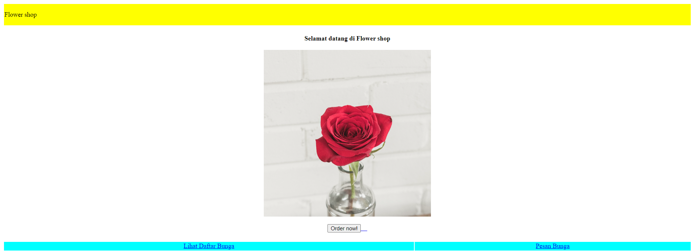
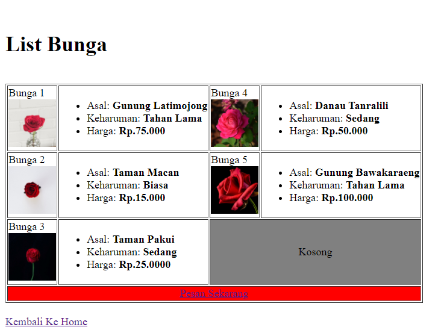
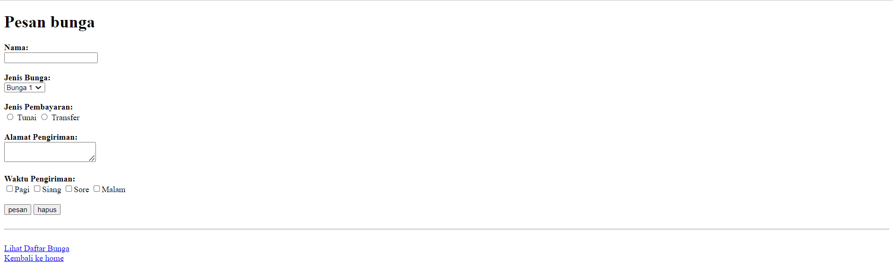

# Analisis Ujian Html

## Index

```html
<!DOCTYPE html>

<html>

<head>

    <title>ujian</title>

</head>

<body>

    <table border="0" height="100%" width="100%">

        <tr>

            <td width="100%" align="=left" bgcolor=" yellow" height="50px">Flower shop</td>

        </tr>

    </table><br>

  

    <table align="center">

        <tr>

            <th colspan="2" align="center">Selamat datang di Flower shop <br><br>

            <br><br>

            <a href="file:///C:/Users/ASUS/Documents/Visual%20Studio%20Code/Ujian%20HTML/order%20bunga.html" target="_blank"><input type="submit" value="Order now!"</a>    

            </th>

        </tr>

    </table><br>

    <table border="0" height="100%" width="100%">

        <tr bgcolor="aqua" >

            <td align="center"><a href="file:///C:/Users/ASUS/Documents/Visual%20Studio%20Code/Ujian%20HTML/list%20bunga.html" target="_blank">Lihat Daftar Bunga</a></td>

            <td align="center"><a href="file:///C:/Users/ASUS/Documents/Visual%20Studio%20Code/Ujian%20HTML/order%20bunga.html" target="_blank">Pesan Bunga </a></td>

        </tr>

    </table>

</body>

</html>
```

### Hasil


### Analisis

- `<table border="0" height="100%" width="100%">`:
    - **`border="0"`**: Menentukan bahwa tabel tidak memiliki garis pembatas di sekitar sel dan kolomnya.
    - **`height="100%"`**: Menentukan tinggi tabel sebagai 100% dari kontainer induknya.
    - **`width="100%"`**: Menentukan lebar tabel sebagai 100% dari kontainer induknya.
- `<td width="100%" align="left" bgcolor="yellow" height="50px">Flower shop</td>`:
    - **`width="100%"`**: Menentukan lebar sel sebagai 100% dari lebar tabel atau barisnya.
    - **`align="left"`**: Menentukan perataan teks dalam sel menjadi rata kiri.
    - **`bgcolor="yellow"`**: Menentukan warna latar belakang sel menjadi kuning.
    - **`height="50px"`**: Menentukan tinggi sel sebagai 50 piksel.
- `<table>`:
    - Tag pembuka untuk membuat tabel.
- `<th colspan="2">`:
    - **`colspan="2"`**: Atribut untuk menggabungkan dua kolom atau lebih dalam sel header (th).
- ``:
    - **`src`**: Digunakan untuk menentukan sumber gambar yang akan ditampilkan.
    - **`alt`**: Digunakan untuk memberikan teks alternatif jika gambar tidak dapat ditampilkan.
- `<br>`:
    - Digunakan untuk membuat baris baru (line break).
- `<a href="...">`:
    - Digunakan untuk menambahkan link (tautan) ke halaman web.
    - **`href`**: Menentukan URL tujuan tautan.
- `<a target="_blank">`:
    - **`target="_blank"`**: Atribut untuk membuka link di tab atau jendela baru.
### Kesimpulan 
- `<table border="0" height="100%" width="100%">`
    - **`border="0"`**: Tabel tanpa garis pembatas.
    - **`height="100%"`**: Tinggi tabel 100% dari kontainer.
    - **`width="100%"`**: Lebar tabel 100% dari kontainer.
- `<td width="100%" align="left" bgcolor="yellow" height="50px">Flower shop</td>`
    - **`width="100%"`**: Lebar sel 100%.
    - **`align="left"`**: Teks rata kiri.
    - **`bgcolor="yellow"`**: Latar belakang kuning.
    - **`height="50px"`**: Tinggi sel 50 piksel.
- `<table>`
    - Tag pembuka untuk membuat tabel.
- `<th colspan="2">`
    - **`colspan="2"`**: Menggabungkan dua kolom dalam sel header.
- ``
    - **`src`**: Sumber gambar.
    - **`alt`**: Teks alternatif jika gambar tidak tampil.
- `<br>`
    - Membuat baris baru.
- `<a href="...">`
    - Menambahkan tautan.
    - **`href`**: URL tujuan tautan.
- `<a target="_blank">`
    - **`target="_blank"`**: Membuka tautan di tab/jendela baru.
## List Bunga

```html
<!DOCTYPE html>

<html>

<head>

    <title>List Bunga</title>

</head>

<body>

    <h1>List Bunga</h1>

    <table border="1">

        <div>

            <tr>

                <td>Bunga 1 <br>

                 </td>

                 <td>

                    <ul>

                        <li>Asal: <b>Gunung Latimojong</b></li>

                        <li>Keharuman: <b>Tahan Lama</b></li>

                        <li>Harga: <b>Rp.75.000</b></li>

                    </ul>

                 </td>

  

                 <td>Bunga 4 <br>

                    </td>

                    <td>

                       <ul>

                           <li>Asal: <b>Danau Tanralili</b></li>

                           <li>Keharuman: <b>Sedang</b></li>

                           <li>Harga: <b>Rp.50.000</b></li>

                       </ul>

                    </td>

            </tr>

        </div>

  

                <div>

                    <tr>

                    <td>Bunga 2 <br>

                        </td>

                        <td>

                           <ul>

                               <li>Asal: <b>Taman Macan</b></li>

                               <li>Keharuman: <b>Biasa</b></li>

                               <li>Harga: <b>Rp.15.000</b></li>

                           </ul>

                        </td>

  

                        <td>Bunga 5 <br>

                            </td>

                            <td>

                               <ul>

                                   <li>Asal: <b>Gunung Bawakaraeng</b></li>

                                   <li>Keharuman: <b>Tahan Lama</b></li>

                                   <li>Harga: <b>Rp.100.000</b></li>

                               </ul>

                            </td>

                    </tr>

                </div>

  

                <div>

                    <tr>

                        <td>Bunga 3 <br>

                            </td>

                            <td>

                               <ul>

                                   <li>Asal: <b>Taman Pakui</b></li>

                                   <li>Keharuman: <b>Sedang</b></li>

                                   <li>Harga: <b>Rp.25.0000</b></li>

                               </ul>

                            </td>

  

                            <td colspan="2" align="center" bgcolor="grey">Kosong</td>

                    </tr>

                </div>

  

                <tr bgcolor="red">

                <td colspan="4" align="center"><a href="file:///C:/Users/ASUS/Documents/Visual%20Studio%20Code/Ujian%20HTML/order%20bunga.html" target="_blank">Pesan Sekarang</a></td><br>

                </tr>

             </table><br>

             <td align="center"><a href="file:///C:/Users/ASUS/Documents/Visual%20Studio%20Code/Ujian%20HTML/latihan%20ujian.html" target="_blank">Kembali Ke Home</a></td>

    </body>

</html>
```
### Hasil

### Analisis

- `<h1>` adalah heading untuk membuat judul
-   `<table border="1">` adalah atribut yang digunakan untuk menentukan apkah tabel tersebut memiliki garis pembatas disekitar sel dan kolomnya.
- `<div>` digunakan dalam tabel untuk membagi konteks menjadi beberapa bagian
- `img src` dgunakan untuk menambahkan gambar
- `ul` digunakan untuk mendefinisikan sebuah daftar tak berurutan
- `li` digunakan untuk membuat setiap item dalam daftar informasi
- `height dan width` digunakan untuk mengatur lebar dan tingginya
- `br` digunakan untuk membuat baris baru
- `colspan` dgunakan untuk menggabungkan 2 kolom/lebih
- `bgcolor` digunakan untuk warna baground pada paragraf
- `<a href` digunakan untuk menambakan link halaman link
- `target=_blank` digunakan untuk menambahkan judul linknya

### Kesimpulan

- `<h1>`: Membuat judul besar.
- `<table border="1">`: Membuat tabel dengan garis pembatas.
- `<div>`: Membagi konten menjadi beberapa bagian.
- ``: Menambahkan gambar.
- `<ul>`: Membuat daftar tanpa urutan.
- `<li>`: Membuat item dalam daftar.
- `height` dan `width`: Mengatur tinggi dan lebar elemen.
- `<br>`: Membuat baris baru.
- `colspan`: Menggabungkan beberapa kolom dalam tabel.
- `bgcolor`: Memberi warna latar belakang.
- `<a href>`: Menambahkan tautan.
- `target="_blank"`: Membuka tautan di tab baru.

## Order Bunga

```html
<!DOCTYPE html>

<html>

<head>

    <title>Order Bunga</title>

</head>

<body>

    <h1>Pesan bunga</h1>

    <label for="nama">

       <b>Nama:</b>

    </label><br>

    <input type="text" required id="nama"><br>

    <div><br>

        <b>Jenis Bunga:</b> <br>

        <select>

            <option>Bunga 1</option>

            <option>Bunga 2</option>

            <option>Bunga 3</option>

            <option>Bunga 4</option>

            <option>Bunga 5</option>

        </select>

    </div><br>

  

    <div>

        <label for="pembayaran"><b>Jenis Pembayaran:</b></label><br>

        <input type="radio" name="jp" id="pembayaran">

        <label>Tunai</label>

        <input type="radio" name="jp" id="pembayaran">

        <labe>Transfer</label>

    </div> <br>

  

   <b>Alamat Pengiriman:</b> <br>

    <textarea name="Alamat"></textarea><br>

  

    <label><br>

       <b>Waktu Pengiriman:</b>

    </label> <br>

    <input type="checkbox"

    name="Waktu">Pagi

    <input type="checkbox"

    name="Waktu">Siang

    <input type="checkbox"

    name="Waktu">Sore

    <input type="checkbox"

    name="Waktu">Malam <br>

  

   <br> <input type="submit"value="pesan">

      <input type="reset"value="hapus">

  

    <br><br><hr>

    <br> <td align="center"><a href="file:///C:/Users/ASUS/Documents/Visual%20Studio%20Code/Ujian%20HTML/list%20bunga.html" target="_blank">Lihat Daftar Bunga</a></td>

    <br> <td align="center"><a href="file:///C:/Users/ASUS/Documents/Visual%20Studio%20Code/latihan%20ujian.html" target="_blank">Kembali ke home </a></td>

  

</body>

</html>
```

### Hasil

### Analisis

- `h1` digunakan untuk membuat judul
- `<label for` digunakan untuk memberi id elemen yg sesuai sebagai nilainya,yg kemudian akan dihubungkan dengan elemen input tersebut
- `<input type="text" required id="nama">` `input type text`  digunakan untuk menentukan bahwa inpu tersebut akan menerima text, `required id` menandakan bahwa input ini harus diisi sebelum formulr dapat disubmit
- `<div` digunakan untuk mengelompokkan elemen2 html tertentu dalam sebuah wadah
- `<select` digunakan untu membuat menu atau kotak pilhan
- `<option` digunakan untuk menampilkan plihan kpada pengguna
- `value` digunakan untuk menentukan nlaii yang akan dikirimkan saat formulr disubmit
-   `<input type="radio" name="jp" id="pembayaran">` , `input type radio`  digunakan untuk menentukan bahwa input tersebut akan menerima beberapa pilihan,`id` digunakan untuk memberkan identifikasi unik pada suatu elemen
-  `<textarea name="Alamat"></textarea>` digunakan untuk membuat formulr alamat
- `<input type="checkbox"` digunakan untuk membuat pilihan dan pilihannya hanya boleh 1
- `<input type="submit"value="pesan">` digunakan untuk membua tombol submit atau tombol selesai mengisi formulir
- `<input type="reset"value="hapus">` digunakan untuk membuat tombol hapus atau meriset semua jawaban
- `<a href` dgunakan untuk menambakan link halaman web lain


### Kesimpulan

- `<h1>`: Membuat judul besar.
- `<label for>`: Menghubungkan label dengan elemen input.
- `<input type="text" required id="nama">`:
    - `type="text"`: Input untuk teks.
    - `required`: Input harus diisi.
    - `id`: Identifikasi unik untuk input.
- `<div>`: Mengelompokkan elemen HTML.
- `<select>`: Membuat menu pilihan.
- `<option>`: Menampilkan pilihan dalam menu.
- `value`: Nilai yang dikirim saat formulir disubmit.
- `<input type="radio" name="jp" id="pembayaran">`:
    - `type="radio"`: Input untuk pilihan ganda.
    - `id`: Identifikasi unik.
- `<textarea name="Alamat"></textarea>`: Membuat area teks untuk alamat.
- `<input type="checkbox">`: Membuat pilihan tunggal (checkbox).
- `<input type="submit" value="pesan">`: Membuat tombol submit.
- `<input type="reset" value="hapus">`: Membuat tombol reset.
- `<a href>`: Menambahkan tautan ke halaman web lain.