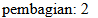
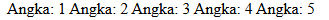

# Web Dinamis

Pembagian jenis website di bagi menjadi dua bagian yaitu web statis dan web dinamis. Web statis adalah website yang hanya menampilkan sebuah output dari hasil program yang telah diketikkan sedangkan web dinamis adalah sebuah web yang lebih kompleks karena kita dapat memberi input pada website dan website tersebut dapat menyimpan data yang kita masukkan.

# PHP

PHP (Hypertext Preprocessor) adalah sebuah bahasa skrip dengan fungsi umum yang terutama digunakan untuk pengembangan sebuah web dinamis ataupun website interaktif. PHP juga mendukung banyak jenis database seperti MySQL, PostgreSQL dan Oracle sehingga pembangunan sebuah website dapat menjadi lebih kompleks.

  

## Penggunaan Awal PHP

untuk penggunaan awal PHP kita harus mengikuti langkah langkah berikut.

1) Buka XAMPP lalu aktifkan "MySQL" dan "Apache". 

2) Masuk ke directory C.

   [Gambar](aset/2.png)

3) Buka folder XAMPP lalu buka folder Htdocs. 

4) Buat folder dengan nama yang anda inginkan.

5) Kemudian Masuk ke VSCode lalu klik "Open Folder" dan pilih folder yang telah anda buat.

5) Buat Dokumen dengan ekstensi "php".

   

6) Untuk mengetikkan program php, dokemnnya selalu dibuka dengan "`<?php`" dan di akhiri dengan `?>`.

   

7) Anda telah dapat membuat kode program PHP sesuai dengan keinginan anda.

## Echo & Komentar

Dalam php kita dapat mengetikkan sesuatu dengan kode "echo" dan menambahkan membuat sebuah komentar di penulisan program untuk penjelasan lebih lanjutnya akan dijelaskan di bawah ini. Dalam penulisan echo terdapat dua cara yaitu dengan kutip satu dan kutip dua, lalu untuk perbedaan antara keduanya akan dijelaskan lebih lanjut dibawah ini.

### Echo kutip satu

Untuk penulisan echo dengan kutip satu hasil yang akan tampil adalah seluruh yang ditulis di dalamnya dan hasil yang tampil akan terhitung sebagai string, walaupun ada variable yang dituliskan di dalam kutipnya. Untuk contoh programnya akan seperti berikut.

```php

echo 'Jumlah meja di kelas '. $meja . ' buah';

    echo "<br>";

```

### Echo kutip dua

Sedangkan untuk penulisan kutip dua akan menampilkan hasil dari variable maupun konstanta walapaun ditulis dalam kutip yang sama. Dan untuk contoh cara pengaplikasiannya akan seperti dibawah ini.

```php

echo "Shalat dlu, nabilang pak $wali_kelas dan $ketua_kelas";

    echo "<br>";

    echo "Kalau tidak, diracca' sama ketua gang $ketua_geng";

    echo "<br>";

```

  

### Komentar

Lalu untuk membuat komentar dalam kode program kita, kita dapat menggunakan dua cara yaitu `//` untuk komentar satu baris dan `/* */` untuk komentar multi baris. Dan untuk cara pengaplikasiaanya akan seperti di bawah ini

```php

//ini komentar satu baris

/*ini komentar

multi baris*/

```

  

## Variable & Konstanta

Dalam php kita dapat menuliskan variable dan kosntanta untuk menyimpan data yang akan digunakan kedepannya, untuk penjelasan lebih lanjutnya akan dijelaskan di bawah ini.

### Variable

Untuk penulisan variable kita awali dengan `$` lalu menuliskan nama variable nya dan menuliskan nilainya setelahnya dan di akhiri dengan `;`. Untuk contoh penggunaannya akan seperti di bawah ini.

```php

$meja = 30;

    $tk_kelas = "XI";

    $ketua_kelas = "July";

    $wali_kelas = "Saleh";

```

  

### Konstanta

Untuk konstanta berfungsi untuk menetapkan nilai dari sebuah data agar tidak dapat di ganti ganti kedepannya. Lalu untuk cara penulisannya akan seperti di bawah ini.

```php

const KEPSEK = "Herwelis";

define ('kelas', 'RPL 1');

```

  

## Operator

Dalam php juga kita dapat menggunakan operator operator untuk memudahkan penulisan program kita, Untuk penjelasan lebih jelasnya akan di dijelaskan di bawah.

### Aritmatika

Operator aritmatika berfungsi untuk penjumlah, pengurangan, perkalian dan pembagian. Untuk penggunaan akan seperti di bawah ini.

1. Penjumlahan

```php

    $a = 10;

    $b = 5;

    //Penambahan

    $penambahan = $a + $b;

    echo "penambahan: " . $Penambahan . "<br>";

  

```

**Hasil :**


> [! info]- Analisis penjumlahan

>> `$a = 10;` : berfungsi sebagai variable yang memiliki nilai "10"

>> `$b = 5;` : berfungsi sebagai variable yang memiliki nilai "5"

>> `$penambahan = $a + $b;` : `$penambahan` berfungsi menyimpan variable dari hasil dari variable `$a` dan `$b`.

>> `echo "penambahan: " .$penambahan . "<br>;"` berfungsi untuk menampilkan hasil dari penambahan variable `$a` dan `$b`.

  

**Kesimpulan :**

operator `+` berfungsi untuk menjumlahkan isi dari variable yang kita ketikkan, dan hasilnya dapat kita tampilkan menggunakan echo.

  
  

2. Pengurangan

```php

  //pengurangan

    $Pengurangan = $a - $b;

    echo "Pengurangan: " . $Pengurangan . "<br>";

```

**Hasil :**


  

> [! info]- Analisis pengurangan

>> `$a = 10;` : berfungsi sebagai variable yang memiliki nilai "10"

>> `$b = 5;` : berfungsi sebagai variable yang memiliki nilai "5"

>> `$penambahan = $a - $b;` : `$pengurangan` berfungsi menyimpan variable dari hasil dari variable `$a` dan `$b`.

>> `echo "pengurangan: " .$pengurangan . "<br>;"` berfungsi untuk menampilkan hasil dari pengurangan variable `$a` dan `$b`.

  

**Kesimpulan :**

operator `-` berfungsi untuk menguragi isi dari variable yang kita ketikkan, dan hasilnya dapat kita tampilkan menggunakan echo.

  

3. Perkalian

```php

  //perkalian

    $Perkalian = $a * $b;

    echo "Perkalian: " . $Perkalian . "<br>";

```

**Hasil :**


  

> [! info]- Analisis perkalian

>> `$a = 10;` : berfungsi sebagai variable yang memiliki nilai "10"

>> `$b = 5;` : berfungsi sebagai variable yang memiliki nilai "5"

>> `$perkalian = $a + $b;` : `$perkalian` berfungsi menyimpan variable dari hasil dari variable `$a` dan `$b`.

>> `echo "perkalian: " .$perkalian . "<br>;"` berfungsi untuk menampilkan hasil dari perkalian variable `$a` dan `$b`.

  

**Kesimpulan :**

operator `*` berfungsi untuk mengkali isi dari variable yang kita ketikkan, dan hasilnya dapat kita tampilkan menggunakan echo.

  

4. Pembagian

```php

  //pembagian

    $pembagian = $a / $b;

    echo "pembagian: " . $pembagian . "<br>";

```

**Hasil :**



  

> [! info]- Analisis pembagian

>> `$a = 10;` : berfungsi sebagai variable yang memiliki nilai "10"

>> `$b = 5;` : berfungsi sebagai variable yang memiliki nilai "5"

>> `$pembagian = $a + $b;` : `$pembagian` berfungsi menyimpan variable dari hasil dari variable `$a` dan `$b`.

>> `echo "pembagian: " .$pembagian . "<br>;"` berfungsi untuk menampilkan hasil dari pembagian variable `$a` dan `$b`.

  

**Kesimpulan :**

operator `/` berfungsi untuk membagi isi dari variable yang kita ketikkan, dan hasilnya dapat kita tampilkan menggunakan echo.

  
  

### Perbandingan

Operator perbandingan atau operator perbandingan digunakan untuk membandingkan 2 operan atau lebih. Pada umumnya Operator perbandingan digunakan pada kondisi if-else sebagai penentu tingkat kesesuaian.

  

1. Perbandingan ==

```php

$a = 5;

$b = 10;

// Operator perbandingan ==

if ($a == $b) {

    echo "Nilai a sama dengan nilai b";

} else {

    echo "Nilai a tidak sama dengan nilai b";

}

```

**Hasil :**


  

> [! info]- Analisis pembagian ==

>> `$a = 5;` : berfungsi sebagai variable yang memiliki nilai "5"

>> `$b = 10;` : berfungsi sebagai variable yang memiliki nilai "10"

>> `if ($a == $b) { echo "Nilai a sama dengan nilai b";` : jika nilai `$a` dan nilai `$b` sama makan akan menampilkan "Nilai a sama dengan nilai b"

>> `} else { echo "Nilai a tidak sama dengan nilai b";}` : Namun jika nilai `$a` dan nilai `$b` tidak sama maka akan menampilkan hasil "Nilai a tidak sama dengan nilai b"

  

**Kesimpulan :**

jadi pada perbandingan `==` ialah untuk membandingkan apakah nilai dari variable `$a` dan variable `$a` bernilai sama atau kah tidak.

  

2. Perbandingan !=

```php

// Operator perbandingan !=

if ($a != $b) {

    echo "Nilai a tidak sama dengan nilai b";

} else {

    echo "Nilai a sama dengan nilai b";

}

```

**Hasil :**


  

> [! info]- Analisis pembagian !=

>> `$a = 5;` : berfungsi sebagai variable yang memiliki nilai "5"

>> `$b = 10;` : berfungsi sebagai variable yang memiliki nilai "10"

>> `if ($a != $b) { echo "Nilai a tidak sama dengan nilai b";` : jika nilai `$a` dan nilai `$b` tidal sama makan akan menampilkan "Nilai a tidak sama dengan nilai b"

>> `} else { echo "Nilai a sama dengan nilai b";}` : Namun jika nilai `$a` dan nilai `$b` sama maka akan menampilkan hasil "Nilai a sama dengan nilai b"

  

**Kesimpulan :**

Jadi pada perbandingan != ialah untuk membandingkan variable `$a` dan variable `$a` apakah tidak sama dengan atau tidak.

  

3. Perbandingan > dan <

```php

if ($a > $b) {

    echo "Nilai a lebih besar dari nilai b";

} else {

    echo "Nilai a tidak lebih besar dari nilai b";

}

```

**Hasil :**


  

> [! info]- Analisis pembagian < dan >

>> `$a = 5;` : berfungsi sebagai variable yang memiliki nilai "5"

>> `$b = 10;` : berfungsi sebagai variable yang memiliki nilai "10"

>> `if ($a > $b) { echo "Nilai a lebih besar dari nilai b";` : jika nilai `$a` dan nilai `$b` tidal sama makan akan menampilkan "Nilai a lebih besar dari nilai b"

>> `} else { echo "Nilai a tidak lebih besar dari nilai b";}` : Namun jika nilai `$a` dan nilai `$b` sama maka akan menampilkan hasil "Nilai a tidak lebih besar dari nilai b"

>> **Namun jika tandanya berubah `<` maka hasilnya akan sebaliknya**

  

**Kesimpulan :**

jadi pada perbandingan `>` atau `<` adalah untuk membandingkan nilai dari kedua vaiable dimana salah satunya lebih besar dari atau lebih kecil dari.

  

4. Perbandingan >= dan =<

```php

if ($a >= $b) {

    echo "Nilai a lebih besar dari atau sama dengan nilai b";

} else {

    echo "Nilai a tidak lebih besar dari atau sama dengan nilai b";

}

```

**Hasil :**


  

> [! info]- Analisis pembagian >= dan =<

>> `$a = 5;` : berfungsi sebagai variable yang memiliki nilai "5"

>> `$b = 10;` : berfungsi sebagai variable yang memiliki nilai "10"

>> `if ($a >= $b) { echo "Nilai a lebih besar dari atau sama dengan nilai b";` : jika nilai `$a` dan nilai `$b` tidal sama makan akan menampilkan "Nilai a lebih besar dari atau sama dengan nilai b"

>> `} else { echo "Nilai a tidak lebih besar dari atau sama dengan nilai b` : Namun jika nilai `$a` dan nilai `$b` sama maka akan menampilkan hasil "Nilai a tidak lebih besar dari atau sama dengan nilai b"

>> **Namun jika tandanya berubah `<=` maka hasilnya akan sebaliknya

  

**Kesimpulan :**

jadi pada perbandingan `>=` atau `=<` adalah untuk membandingkan nilai dari kedua variable dimana salah satunya lebih besar atau sama dengan atau lebih kecil atau sama dengan.

  

### Logika

Berikutnya adalah operator logika yang terdiri menjadi tiga jenis yaitu AND, OR dan NOT. Lalu untuk penjelasan tiap materinya akan dijelaskan di bawah ini.

1. Logika AND

```php

$nilai_a = 10;

$nilai_b = 5;

echo ($nilai_a > 0 && $nilai_b > 0) ? "Kedua nilai \$nilai_a dan \$nilai_b positif." : "Salah satu atau kedua nilai \$nilai_a dan \$nilai_b tidak positif.";

```

**Hasil :**


  

> [! info]- Analisis logika AND

>> `$a = 10;` : berfungsi sebagai variable yang memiliki nilai "10"

>> `$b = 5;` : berfungsi sebagai variable yang memiliki nilai "5"

>> `echo ($nilai_a > 0 && $nilai_b > 0) ?` : akan menampilkan "Kedua nilai 10 dan 5 positif" jika hasilnya true atau akan menampilkan "Salah satu atau kedua nilai 10 dan 5 tidak positif" jika hasil keduanya false

  

**Kesimpulan :**

jadi pada logika `AND` ini berfungsi untuk memberi penghubung "dan" pada kedua nilai seperti pada contoh di atas yang akan menmpilkan nilai dari variable `$nilai_a` **DAN** variable `$nilai_b`.

  

2. Logika OR

```php

$usia = 25;

echo ($usia < 18 || $usia > 60) ? "Anda tidak termasuk dalam rentang usia yang diizinkan." : "Anda termasuk dalam rentang usia yang diizinkan.";

```

**Hasil :**


  

> [! info]- Analisis logika OR

>> `$a = 10;` : berfungsi sebagai variable yang memiliki nilai "10"

>> `$b = 5;` : berfungsi sebagai variable yang memiliki nilai "5"

>> `echo ($usia < 18 || $usia > 60) ?` : akan menampilkan salah nilai jika salah satu nilainya bernilai bernilai true.

  

**kesimpulan :**

jadi pada logika `OR` berfungsi untuk memilih salah satu dari nilai seperti pada contoh di bawah ini di mana apakah usianya di bawah 18 **ATAU** di atas 60 tahun.

  

3. Logika NOT

```php

$telah_login = false;

echo (!$telah_login) ? "Anda belum login." : "Anda sudah login.";

```

**Hasil :**


  

> [! info]- Analisis logika NOT

>> `$a = 10;` : berfungsi sebagai variable yang memiliki nilai "10"

>> `$b = 5;` : berfungsi sebagai variable yang memiliki nilai "5"

>> `echo (!$telah_login) ?` : akan menampilkan nilai kebalik dari nilai yang di inputkan.

  

**Kesimpulan :**

jadi Program menggunakan operator NOT (`!`) untuk membalikkan nilai variabel `$telah_login`. Jika `$telah_login` adalah `false` (pengguna belum login), maka NOT akan mengubahnya menjadi `true`, sehingga program menampilkan "Anda belum login." Jika `$telah_login` adalah `true` (pengguna sudah login), NOT akan mengubahnya menjadi `false`, sehingga program menampilkan "Anda sudah login.

  

## Conditional Statement

sekarang kita akan mempelajari apabila suatu program yang mengharuskan kita untuk menjalankan salah satu kondisi dari banyak kemungkinan, untuk materi yang akan kita pelajari ialah IF, IF ELSE, IF ELSE ELSE dan Switch Case. Untuk penjelasan lebih lanjutnya akan dijelaskan di bawah ini

### IF

"IF" ini adalah sebuah kode yang dapat membuat kita menjalankan salah satu dari dua kindisi yang akan di jalankan. Dan berikut adalah contoh penggunaan dan pengaplikasiannya.

```php

$nilai_a = 10;

$nilai_b = 5;

if (nilai_a > nilai_b) {

  echo "Have a good day!";

}

```

**Hasil :**


  

> [! info]- Analisis IF

>> `$a = 10;` : berfungsi sebagai variable yang memiliki nilai "10"

>> `$b = 5;` : berfungsi sebagai variable yang memiliki nilai "5"

>> `if (nilai_a > nilai_b) {echo "Have a good day!";` : jika nilai a > nilai b maka program akan menampilkan "have a good day!"

  

**Kesimpulan :**

Kesumpulannya adalah pada program **IF** jika syarat terpenuhi maka program akan menampilkan statement dari **IF** seperti yang terlihat pada program di atas.

  

### IF ELSE

```php

$nilai_a = 10;

  

if ($nilai_a < "15") {

  echo "Have a good day!";

} else {

  echo "Have a good night!";

}

```

**Hasil :**


  

> [! info]- Analisis IF ELSE

>> `$a = 10;` : berfungsi sebagai variable yang memiliki nilai "10"

>> `if ($nilai_a < "15") {echo "Have a good day!";} else {echo "Have a good night!";}` : program akan menampilkan "Have a good day!" jika nilai a < 15 dan jika tidak maka akan menampilkan "Have a good night"

  

**Kesmipulan :**

Kesimpulannya adalah program akan menampilkan statement dari **IF (kondisi pertama)** jika syarat terpenuhi namun jika syarat tidak terpenuhi maka program akan turun ke **ELSE** untuk menjalankan statement dari **ELSE** karena syarat **IF** tidak dapat terpenuhi.

  

### IF ELSE ELSE

```php

$nilai_a = 10;

  

if ($nilai_a < "9") {

  echo "Have a good morning!";

} elseif ($nilai_a < "11") {

  echo "Have a good day!";

} else {

  echo "Have a good night!";

}

```

**Hasil :**


  

> [! info]- Analisis IF ELSE ELSE

>> `$a = 10;` : berfungsi sebagai variable yang memiliki nilai "10"

>> `if ($t < "9") {echo "Have a good morning!";` : jika nilai_a < 9 maka akan menampilkan "have a good morning!"

>> `} elseif ($nilai_a < "11") {echo "Have a good day!";` : jika nilai_a < 11 maka akan menampilkan "Have a good day!"

>> `} else {echo "Have a good night!";}` : jika tidak termasuk dari kedua kondisi maka akan menampilkan "Have a good night"

  

**Kesimpulan :**

Kesimpulannya adalah program akan menampilkan statement dari **IF (kondisi pertama)** jika syarat terpenuhi namun jika syarat tidak terpenuhi maka program akan turun ke **ELSE IF (kondisi kedua)** dan menampilkan statementnya apabila syarat terpenuhi namun bila tidak program akan turun ke **ELSE** dan menjalan kan statement dari **ELSE** karena kedua kondisi di atas syaratnya tidak terpenuhi.

  

### Switch Case

```php

$favcolor = "red";

switch ($favcolor) {

  case "red":

    echo "Your favorite color is red!";

  case "blue":

    "Your favorite color is blue!";

    break;

  case "green":

    echo "Your favorite color is green!";

    break;

  default:

    echo "Your favorite color is neither red, blue, nor green!";

}

```

**Hasil :**

!

  

> [! info]- Analisis Switch Case

>> `$favcolor = "red";` : adalah sebuah variable yang menyimpan nilai "red"

>> `case "red": echo "Your favorite color is red!";` : pada baris ini program akan menampilkan teks "your favorite color is red" jika kondis terpenuhi dan akan turun kebawah jika kondisi tidak terpenuhi.

>> `break;` : break untuk menahan program jika syarat terpenuhi

  

**Kesimpulan :**

Program akan menjalankan kode program dari atas, jika syarat terpenuhi maka akan menampilkan statement dari kondisinya dan akan dihentikkan disitu (kode lain di abaikan), namun jika tidak program akan terus turun ke bawah mencari syarat yang terpenuhi, dan apabila masih tidak ada maka akan dijalankan **default**.

  

## Array

array adalah metode untuk menyimpan suatu data di variable secara terstruktur agar data yang disimpan data tertata dan data menyimpan banyak data.

### Array 1 dimensi

```php

$cars = array("Volvo", "BMW", "Toyota");

echo $cars[0];

```

**Hasil :**


  

> [! info]- Analisis Array 1 Dimensi

>> `$cars` : adalah nama dari variable yang menyimpan nilai nilai di dalamnya.

>> `("Volvo", "BMW", "Toyoto");` : adalah nilai data yang berada di dalam array.

>> `echo` : adalah perintah untuk menampilkan nilai.

>> `$cars[0]` : adalah perintah untuk memanggil nilai pertama pada baris array.

  

**Kesimpulan :**

program di atas menyimpan data dalam variable `$cars` dan di atur di dalam array menjadi satu baris sehingga terstruktur. lalu dapat di panggil dengan menyebutkan nama variable dan ditambah `[urutan nilai di dalam arraynya]`.

### Array Asosiatif

```php

$car = array("brand"=>"Ford", "model"=>"Mustang", "year"=>1964);

echo $car["model"];

```

**Hasil :**


  

> [! info]- Analisis Array Asosiatif

>> `$cars` : adalah nama dari variable yang menyimpan nilai nilai di dalamnya.

>> `("brand"=>"Ford", "model"=>"Mustang", "year"=>1964);` : ialah nama dan isi nilai dari array.

>> `echo` : adalah perintah untuk menampilkan nilai.

>> `$cars["models"]` : adalah perintah untuk memanggil nilai pada array.

  

**Kesimpulan :**

program di atas menyimpan data dalam variable `$cars` dan di atur di dalam array menjadi satu baris, namun terdapat nama penanda untuk nilai dari isi penanda tersebut sehingga untuk memanggil arraynya kita hanya perlu menuliskan nama penandanya, contohnya ialah seperti berikut `echo $car["model"];`.

  

### Array Multidimensi

```php

$cars = array (

  array("Volvo",22,18),

  array("BMW",15,13),

  array("Saab",5,2),

  array("Land Rover",17,15)

);

```

**Hasil :**


  

> [! info]- Analisis Array Asosiatif

>> `$cars` : adalah nama dari variable yang menyimpan nilai nilai di dalamnya.

>>`array("Volvo",22,18),``array("BMW",15,13),``array("Saab",5,2),``array("Land Rover",17,15)` : adalah isi dari array multidimensi yang terdiri dari beberapa baris

  

**Kesimpulan :**

Array kali ini dapat menyimpan sangat banyak data dan di bagi dalam bermacam macam bagain array sehingga menjadi lebih terstruktur seperti yang bisa kita lihat di atas.

## Var_Dump

`var_dump` pada PHP adalah sebuah fungsi yang digunakan untuk menampilkan informasi rinci tentang satu atau beberapa variabel. Fungsi ini mencetak tipe data dan nilai dari variabel tersebut, termasuk struktur data untuk array dan objek. `var_dump` sangat berguna untuk debugging karena memberikan gambaran lengkap tentang isi dari variabel yang sedang diperiksa.

```php

php $angka = 123; var_dump($angka);

```

**Hasil :**


  

**Kesimpulan :**

`var_dump` akan menampilkan informasi rinci program yang telah kita ketikkan

  

## Looping (Pengulangan)

Looping atau pengulangan pada PHP adalah cara untuk mengeksekusi serangkaian pernyataan atau blok kode secara berulang berdasarkan kondisi tertentu.

### For

```php

for ( $nilai_a = 0; $nilai_a <= 5; $nilai_a++) {

  echo "ini perulangan yang: $nilai_a <br>";

}

```

**Hasil** :


  

> [! info]- Analisis WHILE

>>1. `for (`: Ini menandakan awal dari deklarasi for loop.

>> 2. `$nilai_a = 0;`: Inisialisasi variabel `$nilai_a` dengan nilai 0.

>> 3. `$nilai_b <= 10;`: Ini adalah kondisi untuk loop. Loop akan terus berjalan selama nilai dari variabel `$nilai_b` kurang dari atau sama dengan 10. Namun, perlu dicatat bahwa di dalam loop tidak ada pernyataan yang mengubah nilai variabel `$nilai_b`, jadi jika tidak ada perubahan nilai di luar loop, kondisi ini akan selalu benar dan loop akan menjadi loop tak terbatas. Mungkin ada kesalahan karena variabel `$nilai_b` belum didefinisikan sebelumnya.

>>4. `$nilai_a++`: Setiap kali iterasi dilakukan, nilai dari variabel `$nilai_a` akan bertambah satu.

>>

  

**Kesimpulan** :

Kode ini mencoba untuk membuat perulangan menggunakan for loop dengan inisialisasi variabel `$nilai_a` di 0 dan kondisi loop berdasarkan variabel `$nilai_b`, yang tidak didefinisikan sebelumnya.

 Karena variabel `$nilai_b` tidak didefinisikan sebelumnya dan tidak ada pernyataan yang mengubah nilainya dalam loop, maka loop ini akan menjadi loop tak terbatas, terus mencetak pesan "ini perulangan yang:" diikuti dengan nilai `$nilai_a`, terus menerus tanpa berhenti sampai dihentikan secara manual atau hingga batas eksekusi PHP tercapai.

 Untuk memperbaiki loop ini, pastikan untuk menentukan kondisi yang tepat dan inisialisasi variabel yang sesuai sebelum memulai loop.

  

### While

```php

$nilai = 1;

while ($nilai < 6) {

  echo $nilai;

  $nilai++;

}

```

**Hasil :**


  

> [! info]- Analisis WHILE

> >> 1. `$nilai = 1;`: Variabel `$nilai` diinisialisasi dengan nilai 1.

>>> 2. `while ($nilai < 6) {`: Loop akan terus berjalan selama nilai dari variabel `$nilai` kurang dari 6.

>> 3. `echo $nilai;`: Setiap iterasi dari loop, nilai dari variabel `$nilai` akan dicetak.

>> 4. `$nilai++;`: Setiap iterasi, nilai variabel `$nilai` akan bertambah satu.

  

**Kesimpulan** :

Loop while tidak berjalan beberapa kali, tetapi memeriksa setelah setiap iterasi apakah kondisinya masih benar.

Kondisi ini tidak harus menjadi penghitung, bisa jadi status operasi atau kondisi apa pun yang mengevaluasi benar atau salah.

Masukkan teks.

  

###  Do-While

```php

$nilai= 1;

do {

  echo $nilai;

  $nilai++;

} while ($nilai < 6);

```

**Hasil :**


  

> [! info]- Analisis Do-While

> >> 1. `$nilai = 1;`: Variabel `$nilai` diinisialisasi dengan nilai 1.

>>> 2. `while ($nilai < 6) {`: Loop akan terus berjalan selama nilai dari variabel `$nilai` kurang dari 6.

>> 3. `echo $nilai;`: Setiap iterasi dari loop, nilai dari variabel `$nilai` akan dicetak.

>> 4. `$nilai++;`: Setiap iterasi, nilai variabel `$nilai` akan bertambah satu.

  

**Kesimpulan :**

Variable `$nilai` berisikan nilai 3 dan di tampilkan di dalam perintah **do** dengan cara mengetikkan `echo`.

setelah menampilkan hasil variable di tambah nilainya dengan perintah `$nilai++` dan programnya akan terus berulang sampai syaratnya tidak terpenuhi lagi, yaitu `($nilai < 6)`.

  
  

### Foreach

```php

$numbers = [1, 2, 3, 4, 5];

foreach ($numbers as $number) {

echo "Angka: $number\n"; }

```

**Hasil :**



  

> [! info]- Analisis Foreach

> >> 1. `$nilai = 1;`: Variabel `$nilai` diinisialisasi dengan nilai 1.

>>

  

**Kesimpulan :**

## Function

```php

function greet($name) {

echo "Hello, $name!"; }

  

greet("Alice");

```

**Hasil :**


  

> [! info]- Analisis Function

> >> 1. `greet` : adalah nama dari function yang dibuat

> >> 2. `echo "Hello"` : untuk menampilkan hello

> >> 3. `$name` : adalah nama variable yang dijadikan tempat menyimpan data

> >> 4. `("Alice")` : adalah isi nilai dari variable `$nilai`

  

**Kesimpulan :**

function ini berfungsi untuk menjadi tempat untuk menyimpan data yang bisa di panggil berkali kali dan data atau nilai dari variable akan di isi di bagian bawah, seperti pada contoh di atas yang telah di tuliskan.

  

## PHP Form

Kode html :

```html

<form>

     <input type="text" name="nama_lengkap" placeholder="Masukkan nama">

     <input type="number" name="umur" placeholder="Masukkan umur"><br>

     <button type="submit">Kirim</button>

</form>

```

**Hasil :**


  

> [! info]- Analisis Form

> >> 1. `input type="text"` : untuk membuat kolom form bertipe text

> >> 2. `input type="number"` : untuk membuat kolom form bertipe nomor

> >> 3. `placeholder` : berfungsi untuk menampilkan teks pada kolom sebelum ada text yang tertulis

> >> 4. `button type="submit` : berfungsi untuk membuat button bertipe submit

  

**Kesimpulan :**

form dalam php berfungsi untuk mengambil data yang akan dimasukkan di data base dan proses pembuatannya di lakukan atau diketikkan pada html.

  

## Get Method

Kode html :

```html

<body>

    <!-- Pada atribut action, kalian tuliskan nama file php yang bertugas untuk mengelola atau menangkap data dari form tersebut. -->

    <form action="proses_get.php" method="GET">

        <input type="text" name="nama" placeholder="Masukkan nama">

        <input type="number" name="umur" placeholder="Masukkan umur"> <br>

        <button type="submit">Kirim</button>

</form>

```

Kode PHP :

```php

<?php

// Key dari array-nya, sesuai dengan nama dari atribut name di setiap input-nya

$nama = $_GET["nama"];

$umur = $_GET["umur"];

?>

<!DOCTYPE html>

<html lang="en">

<head>

    <meta charset="UTF-8">

    <meta name="viewport" content="width=device-width, initial-scale=1.0">

    <title>GET</title>

</head>

<body>

    <p>nama anda <?= $nama ?></p>

    <p>Umur anda <?= $umur ?> tahun</p>

</body>

</html>

```

**Hasil :**

HTML :


PHP :


  

> [! info]- Analisis GET PHP

> >> 1. `<form action="proses_get.php" method="GET">` : berfungsi untuk menghubungkan nilai dari form ke dokumen `proses_get.php`.

> >> 2. `$nama = $_GET["nama"];` berfungsi untuk mengambil nilai dari form yang telah di tulis

> >> 3. `$umur = $_GET["umur"];` berfungsi untuk mengambil nilai dari form yang telah di tulis

> >> 4. `<p>nama anda <?= $nama ?></p>` : untuk menampilkan output dari `$nama`

> >> 5. `<p>umur anda <?= $umur ?></p>` : untuk menampilkan output dari `$umur

  

**Kesimpulan :**

Jadi dari page form data akan di ambil dengan action yang di tuliskan pada kode di atas dan di page selanjutnya akan di tampilkan seluruh hasil dari nilai yang telah di input termasuk di antaranya nama dan umur.

  

## Post Method

Kode Html :

```html

    <form action="proses_post.php" method="POST">

        <input type="text" name="nama_lengkap" placeholder="Masukkan nama">

        <input type="number" name="umur" placeholder="Masukkan umur">

        <input type="password" name="password" placeholder="Masukkan password"><br>

        <button type="submit">Kirim</button>

   </form>

```

Kode PHP :

```php

<?php

// Key dari array-nya, sesuai dengan nama dari atribut name di setiap input-nya

$nama = $_POST["nama"];

$umur = $_POST["umur"];

?>

<!DOCTYPE html>

<html lang="en">

<head>

    <title> XI RPL 1 - POST</title>

</head>

<body>

    <p>Nama anda <?= $nama ?></p>

    <p>Umur anda <?= $umur ?> tahun</p>

    <p>Password anda aman!</p>

</body>

</html>

```

**Hasil :**

HTML :


PHP :


  

> [! info]- Analisis POST PHP

> >> 1. `<form action="proses_post.php" method="POST">` : berfungsi untuk menghubungkan nilai dari form ke dokumen `proses_POST.php`.

> >> 2. `$nama = $_POST["nama"];` berfungsi untuk mengambil nilai dari form yang telah di tulis

> >> 3. `$umur = $_POST["umur"];` berfungsi untuk mengambil nilai dari form yang telah di tulis

> >> 4. `<p>nama anda <?= $nama ?></p>` : untuk menampilkan output dari `$nama`

> >> 5. `<p>umur anda <?= $umur ?></p>` : untuk menampilkan output dari `$umur

  

**Kesimpulan :**

POST dan Get memiliki fungsi yang bisa dibilang hampir sama namun pada `POST` data yang dikirim tidak ditampilkan di url sehingga ini sangat cocok pada perpindahan data yang sensitif dan bersifat pribadi.