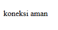
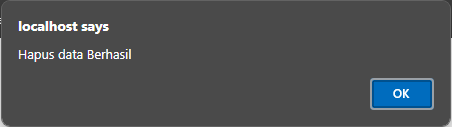

## Koneksi Database

**Query :**

```php

<?php

  

//koneksi ke database

$koneksi = mysqli_connect('localhost', 'root', '', 'rental_fadhil');

  

if ($koneksi) {

    echo "<br> koneksi aman <br>";

} else {

    echo "error, tidak bisa koneksi ke database";

}

?>

```

**Hasil :**



  

> [! info]- Analisis koneksi

>>`<? Php` tag pembuka php

>>`mysqli_connect()` adalah fungsi yang digunakan untuk membuat koneksi ke server MySQL.

>>`'localhost'` adalah hostname dari server MySQL. Biasanya `localhost` digunakan jika server MySQL berjalan di mesin yang sama dengan server web.

>>`'root'` adalah username yang digunakan untuk login ke server MySQL.

>>`''` adalah tempat untuk password username `root`. karena kosong artinya tidak ada password yang di berikan.

>>`'rental_nero'` adalah nama database yang ingin diakses.

>>`if ($koneksi)`memeriksa apakah variabel $koneksi berhasil mengembalikan resource koneksi (bernilai true jika berhasil).

>>`echo "<br> koneksi aman <br>"`; menampilkan pesan "koneksi aman" jika koneksi berhasil.

>>`else` digunakan jika koneksi gagal.

>>`echo "error, tidak bisa koneksi ke database";`menampilkan pesan kesalahan jika koneksi gagal.

>>`?>` adalah tag penutup php

  

**Kesimpulan :**

bertujuan untuk membuat koneksi ke database MySQL menggunakan `mysqli_connect()` dengan parameter hostname (`localhost`), username (`root`), password (kosong), dan nama database (`rental_nero`). Koneksi diperiksa dengan kondisi `if ($koneksi)`; jika koneksi berhasil, ditampilkan pesan "koneksi aman", jika gagal, ditampilkan pesan kesalahan "error, tidak bisa koneksi ke database".

  

## Tampilkan Data

**Query :**

```php

<?php

  
  

echo 'Berikut mobil-mobil beserta pemiliknya<br>';

  

$a = 1;

foreach ($select as $key => $data) {

    echo $a++ . ". " . $data['no_plat'] . " : " . $data['pemilik'] . '<br>';

}

  

?>

```

**Hasil :**


  

> [! info]- Analisis Tampilkan Data

>>`<?Php` tag pembuka php

>>`echo 'Berikut mobil-mobil beserta pemiliknya<br>'; ` Menampilkan teks pengantar untuk daftar mobil.`<br>`menambahkan baris baru setelah teks.

>>`$a = 1;` Mendefinisikan variabel `$a` dengan nilai awal 1. Variabel ini digunakan untuk memberi nomor urut pada daftar mobil.

>>`foreach ($select as $key => $data)` adalah loop yang mengiterasi setiap elemen dalam array $select.

>>`$key` adalah indeks dari elemen dalam array $select.

>>`$data` adalah nilai dari elemen dalam array $select.

>>`echo $a++ . ". " . $data['no_plat'] . " : " . $data['pemilik'] . '<br>';` menampilkan nomor urut, nomor plat mobil, dan pemilik mobil dari array $data.

>>`$a++` menambah nilai $a setelah digunakan, sehingga memberikan nomor urut untuk setiap item.

>>`?>` tag penutup php

  

**Kesimpulan :**

Kode menggunakan echo untuk mencetak teks HTML dan variabel dari array. Nomor urut ditampilkan menggunakan variabel $a yang diincrement setiap iterasi dalam loop foreach. Kode ini memanfaatkan data dari array $result untuk menampilkan nama pemilik dan array $select untuk menampilkan informasi mobil.

  

## Tambahkan Data

**Query :**

```Php

<?php

include 'database.php';

  

if ($_SERVER["REQUEST_METHOD"] == "POST") {

    $no_plat = $_POST['no_plat'];

    $no_mesin = $_POST['no_mesin'];

    $warna = $_POST['warna'];

    $pemilik = $_POST['pemilik'];

    $peminjam = $_POST['peminjam'];

    $harga_rental = $_POST['harga_rental'];

  

    $query = "INSERT INTO mobil (no_plat, no_mesin, warna, pemilik, peminjam, harga_rental) VALUES ('$no_plat', '$no_mesin', '$warna', '$pemilik', '$peminjam', '$harga_rental')";

    if (mysqli_query($koneksi, $query)) {

        header("Location: index.php");

    } else {

        echo "Error: " . $query . "<br>" . mysqli_error($koneksi);

    }

}

?>

  

<!DOCTYPE html>

<html>

<head>

    <title>Tambah Data Mobil</title>

</head>

<body>

    <h1>Tambah Data Mobil</h1>

    <form method="post" action="tambah.php">

        <label>No Plat:</label><br>

        <input type="text" name="no_plat"><br>

        <label>No Mesin:</label><br>

        <input type="text" name="no_mesin"><br>

        <label>Warna:</label><br>

        <input type="text" name="warna"><br>

        <label>Pemilik:</label><br>

        <input type="text" name="pemilik"><br>

        <label>Peminjam:</label><br>

        <input type="text" name="peminjam"><br>

        <label>Harga Rental:</label><br>

        <input type="number" name="harga_rental"><br>

        <input type="submit" value="Tambah">

    </form>

</body>

</html>

```

**Hasil :**


### Penjelasan

- `include 'database.php';`: mengimpor file database.php, yang mungkin berisi informasi koneksi ke database (seperti hostname, username, password, dan nama database).

- `if ($_SERVER["REQUEST_METHOD"] == "POST") {`: memeriksa apakah metode request adalah POST. Ini berarti bahwa form telah disubmit oleh pengguna.

- `$no_plat = $_POST['no_plat'];  ​$no_mesin = $POST['no_mesin']; ​$warna = $POST['warna'];$pemilik = $_POST['pemilik'];  ​$peminjam = $_POST['peminjam'];$harga_rental = $_POST['harga_rental'];` : Baris-baris ini mengambil data dari form yang telah disubmit menggunakan metode POST dan menyimpannya dalam variabel PHP. Variabel ini akan digunakan untuk menyusun query SQL.

- `$query = "INSERT INTO mobil (no_plat, no_mesin, warna, pemilik, peminjam, harga_rental) VALUES ('$no_plat', '$no_mesin', '$warna', '$pemilik', '$peminjam', '$harga_rental')";`: Baris ini membentuk query SQL yang akan menyisipkan data ke dalam tabel mobil. Data diambil dari variabel yang sudah diisi sebelumnya.

- `if (mysqli_query($koneksi, $query)) {    header("Location: index.php");`: Baris ini menjalankan query SQL. Jika eksekusi query berhasil, pengguna akan dialihkan ke halaman index.php.

- `} else {     echo "Error: " . koneksi)  }}`:Jika eksekusi query gagal, baris ini akan menampilkan pesan error yang menjelaskan kesalahan yang terjadi. mysqli_error($koneksi) menampilkan pesan kesalahan yang diberikan oleh MySQL.

- ``<!DOCTYPE html>`

`<html>`

`<head>`

    `<title>Tambah Data Mobil</title>`

`</head>`

`<body>`

 `<h1>Tambah Data Mobil</h1>`: Bagian ini adalah awal dari dokumen HTML. Deklarasi `<!DOCTYPE html>`menentukan tipe dokumen sebagai HTML5. Elemen html adalah root dari dokumen HTML. Elemen head berisi informasi meta, seperti title yang menentukan judul halaman. Elemen body berisi konten halaman web yang akan ditampilkan kepada pengguna.

 - `<form method="post" action="tambah.php">`: **Baris ini memulai form HTML**. Form ini menggunakan metode POST untuk mengirimkan data ke `tambah.php` saat disubmit.

 - `<label>No Plat:</label><br>`

       `<input type="text" name="no_plat"><br>`

        `<label>No Mesin:</label><br>`

        `<input type="text" name="no_mesin"><br>`

        `<label>Warna:</label><br>`

        `<input type="text" name="warna"><br>`

        `<label>Pemilik:</label><br>`

        `<input type="text" name="pemilik"><br>`

        `<label>Peminjam:</label><br>`

       ` <input type="text" name="peminjam"><br>`

        `<label>Harga Rental:</label><br>`

        `<input type="number"` `name="harga_rental"><br>`:

        Baris-baris ini membuat elemen input dalam form. Setiap pasangan `<label>` dan `<input>` membuat label dan field input untuk data mobil yang berbeda (no plat, no mesin, warna, pemilik, peminjam, harga rental). `<br>` digunakan untuk membuat baris baru setelah setiap elemen input.

- `<input type="submit" value="Tambah">`

    `</form>`

- `</body> </html>`: Baris ini menambahkan tombol submit yang ketika diklik akan mengirimkan data form ke tambah.php. Form kemudian ditutup dengan tag `</form>`. Bagian body dan html ditutup dengan tag penutup masing-masing.

  

## Ubah Data

**Query :**

```php

<!DOCTYPE html>

<html lang="en">

<head>

    <title>Document</title>

</head>

<body>

    <h2>Ubah Data</h2>

    <?php

    include "koneksi.php";

  

    $id = $_GET['id'];

  

    if (isset($_POST['simpan'])) {

        $nama = $_POST['nama'];

        $email = $_POST['email'];

        $jenis_kelamin = $_POST['jenis_kelamin'];

        $alamat = $_POST['alamat'];

        $query = mysqli_query($koneksi, "UPDATE siswa SET

                                        nama='$nama',

                                        email='$email',

                                        jenis_kelamin='$jenis_kelamin',

                                        alamat='$alamat'

                                        WHERE id_siswa=$id");

        if ($query) {

            echo "<script>

            alert('ubah data Berhasil')

            window.location.href='table.php'

            </script>";

        } else {

            echo '<script>alert("ubah data gagal")</script>';

        }

    }

    $query = mysqli_query($koneksi, "SELECT * FROM siswa where id_siswa=$id");

    $data = mysqli_fetch_array($query);

    if ($data == "") {

        die('Data tidak ada');

    }

    ?>

    <form method="post">

        <table>

            <tr>

                <td>Nama</td>

                <td><input type="text" value="<?= $data['nama'] ?>" name="nama"></td>

            </tr>

            <tr>

                <td>Email</td>

                <td><input type="text" value="<?= $data['email'] ?>" name="email"></td>

            </tr>

            <tr>

                <td>Jenis Kelamin</td>

                <td>

                    <select name="jenis_kelamin">

                        <option <?php if ($data['jenis_kelamin'] == "laki-laki")

                            echo 'selected'; ?>>Laki-laki</option>

                        <option <?php if ($data['jenis_kelamin'] == "perempuan")

                            echo 'selected'; ?>>Perempuan</option>

                    </select>

                </td>

            </tr>

            <tr>

                <td>Alamat</td>

                <td><input type="text" value="<?= $data['alamat'] ?>" name="alamat"></td>

            </tr>

            <tr>

                <td></td>

                <td>

                    <button name="simpan" type="submit">Ubah</button>

                    <button type="reset">Reset</button>

                    <a href="table.php">Kembali</a>

                </td>

            </tr>

        </table>

    </form>

</body>

</html>

```

**Hasil :**


### Penjelasan

- `include "koneksi.php";` :

- 1. `include "koneksi.php";` : Menyertakan file `koneksi.php` untuk menghubungkan ke database.

- 2. `$id = $_GET['id'];` : Mengambil nilai `id` dari parameter URL untuk menentukan data yang akan diubah.

- 3.`if (isset($_POST['simpan'])) {` : Mengecek apakah tombol "simpan" telah diklik, yang menunjukkan bahwa formulir telah disubmit.

- 4. ```php

  $nama = $_POST['nama'];

  $email = $_POST['email'];

  $jenis_kelamin = $_POST['jenis_kelamin'];

  $alamat = $_POST['alamat'];``` : Mengambil data yang diinput pengguna dari formulir.

- 5. ``` $query = mysqli_query($koneksi, "UPDATE siswa SET

                                 nama='$nama',

                                 email='$email',

                                 jenis_kelamin='$jenis_kelamin',

                                 alamat='$alamat'

                                 WHERE id_siswa=$id");

  ```: Menjalankan query untuk memperbarui data siswa dalam database berdasarkan `id`.

- 6. ```if ($query) {

    echo "<script>

    alert('ubah data Berhasil')

    window.location.href='table.php'

    </script>";

  } else {

    echo '<script>alert("ubah data gagal")</script>';

  }

``` : Menampilkan pesan keberhasilan atau kegagalan setelah query dijalankan dan mengarahkan kembali ke halaman `table.php` jika berhasil.

- 7. ```$query = mysqli_query($koneksi, "SELECT * FROM siswa where id_siswa=$id");

  $data = mysqli_fetch_array($query);

  if ($data == "") {

    die('Data tidak ada');

  }

  ``` :Menjalankan query untuk mengambil data siswa berdasarkan `id` dan menampilkannya di formulir jika data ditemukan, atau menampilkan pesan kesalahan jika data tidak ditemukan.

  

## Hapus Data

**Query :**

```php

<?php

include('koneksi.php');

if(isset($_GET['id'])){

    $id = $_GET['id'];

    $query = mysqli_query($koneksi, "DELETE FROM siswa WHERE id_siswa = $id");

   if($query) {

            echo "<script>

            alert('Hapus data Berhasil')

            window.location.href='table.php'

            </script>";

        }else {

            echo '<script>alert("Hapus data gagal")</script>';

        }

}

?>

```

**Hasil :**



  

### Penjelasan

- `<?php include('koneksi.php');` : - Menyertakan file `koneksi.php` untuk menghubungkan ke database.

- `if(isset($_GET['id'])){ $id = $_GET['id'];` : - Mengecek apakah parameter `id` ada di URL, kemudian menyimpan nilai `id` tersebut ke dalam variabel `$id`.

-  `$query = mysqli_query($koneksi, "DELETE FROM siswa WHERE id_siswa = $id");` : - Menjalankan query untuk menghapus data siswa dari database berdasarkan `id` yang diperoleh dari URL.

-     ```if($query) {

        echo "<script>

        alert('Hapus data Berhasil')

        window.location.href='table.php'

        </script>";

      } else {

        echo '<script>alert("Hapus data gagal")</script>';

      }

    }

    ?>```

: - Mengecek apakah query berhasil dijalankan. Jika berhasil, menampilkan pesan sukses dan mengarahkan pengguna kembali ke halaman `table.php`. Jika gagal, menampilkan pesan kegagalan.

  

## Session / Login

**Query :**

```php

<?php

  

session_start();

  

if (isset($_POST['submit'])) {

    $username = $_POST['username'];

    $password = $_POST['password'];

  

    $koneksi = mysqli_connect('localhost', 'root', '', 'pemilu_test') or die('error koneksi');

  

    $result = mysqli_query($koneksi, "SELECT * FROM user

                            WHERE username = '$username' AND password = '$password'");

  

    $data = mysqli_fetch_assoc($result);

  

    if (isset($data)) {

        $_SESSION['username'] = $data['username'];

        $_SESSION['nama'] = $data['nama'];

        $_SESSION['status'] = 'login';

        header('Location: user.php');

    } else {

        echo "Username dan Password Salah";

    }

}

  
  

?>

<!DOCTYPE html>

<html>

  

<head>

    <title>Login Session</title>

</head>

  

<body>

  

    <form method="post">

        <label>Username</label>

        <input type="text" name="username">

        <br>

        <label>Password</label>

        <input type="text" name="password">

        <br>

        <button type="submit" name="submit">Login</button>

    </form>

  

</body>

  

</html>

```

**Hasil :**


  

**Query Log out :**

```php

<?php

session_start();

  

session_destroy();

session_unset();

  

header('Location: login.php');

  

## Upload & Download

```

**Hasil :**


  

### Penjelasan Login

- `session_start();` :  Memulai atau melanjutkan sesi pengguna.

- `if (isset($_POST['submit'])) {` : Memeriksa apakah form telah disubmit.

- `$username = $_POST['username'];$password = $POST['password']; ` : Mengambil username dan password dari form.

- `$koneksi = mysqli_connect('localhost', 'root', '', 'pemilu_test') or die('error koneksi');` : Menghubungkan ke database pemilu_test.

- `$result = mysqli_query($koneksi, "SELECT * FROM user WHERE username = '$username' AND password = '$password'");` : Menjalankan query untuk memeriksa username dan password.

- `$data = mysqli_fetch_assoc($result);`: Mengambil data pengguna dari hasil query.

- `if (isset($data)) {  ​$SESSION['username'] = $data['username'];  ​$SESSION['nama'] = $data['nama'];$_SESSION['status'] = 'login'; header('Location: user.php');} else { echo "Username dan Password Salah";}`: Jika cocok, mengatur variabel sesi dan mengarahkan ke user.php. Jika tidak cocok, menampilkan pesan kesalahan.

```

<!DOCTYPE html>

<html>

<head>

    <title>Login Session</title>

</head>

<body>

    <form method="post">

        <label>Username</label>

        <input type="text" name="username">

        <br>

        <label>Password</label>

        <input type="text" name="password">

        <br>

        <button type="submit" name="submit">Login</button>

    </form>

</body>

</html>

  

```

Menampilkan form login untuk memasukkan username dan password.

### Penjelasan Log out

- Sesi Dimulai: Jika belum ada sesi yang berjalan, `session_start()` akan memulai sesi baru atau melanjutkan sesi yang ada.

- Sesi Dihancurkan: `session_destroy()` akan menghapus data sesi dari server, mengakhiri sesi pengguna saat ini.

- Variabel Sesi Dihapus: `session_unset()` memastikan bahwa semua variabel sesi yang ada dihapus.

- Pengalihan ke Halaman Login: `header('Location: login.php')` mengarahkan pengguna ke halaman login, yang biasanya berarti pengguna perlu masuk kembali untuk mengakses bagian yang dilindungi dari situs.

  
  

## Upload / Download

### Download

```php

<?php

include "koneksi.php";

  

$query = mysqli_query($koneksi, 'SELECT * FROM siswa');

$data = [];

$data[] = ["ID", "Nama", "Email", "Jenis Kelamin", "Alamat"];

while ($row = mysqli_fetch_assoc($query)) {

    $data[] = [

        $row['id_siswa'],

        $row['nama'],

        $row['email'],

        $row['jenis_kelamin'],

        $row['alamat']

    ];

}

$namafile = "excel_data.xls";

header("Content-Type: application/vnd.ms-excel");

header("Content-Disposition: attachment;filename=\"$namafile\"");

header("Cache-Control: max-age=0");

$output = fopen("php://output", "w");

foreach ($data as $row) {

    fputcsv($output, $row, "\t");

}

fclose($output);

exit;

```

**Hasil :**


  

### Penjelasan

- `<!DOCTYPE html>`: Mendefinisikan versi HTML yang digunakan, ini HTML5.

- `<html lang="en">`: Menentukan bahasa dokumen sebagai bahasa Inggris.

- `<head>`: Berisi informasi meta seperti tag meta, judul, dan referensi ke file eksternal.

- `<meta charset="UTF-8">`: Mendefinisikan pengkodean karakter sebagai UTF-8, standar untuk pengkodean karakter.

- `<meta name="viewport" content="width=device-width, initial-scale=1.0">`: Menyetel area pandang untuk desain web responsif.

- `<title>index tabel</title>`: Menyetel judul dokumen HTML.

- `<body>`: Berisi konten yang ditampilkan pada halaman web.

- `<h2>Data Mobil</h2>`: Membuat heading level 2 dengan teks "Data Mobil".

- `<a href="tambah.php">+Tambah Data Baru</a><br><br>`: Membuat hyperlink ke "tambah.php" dengan teks "+Tambah Data Baru" diikuti dengan dua baris baru.

- `<p><a href="ekspor.php">Eksport Excel</a></p>`: Membuat paragraf dengan hyperlink ke "ekspor.php" dengan teks "Eksport Excel".

- `<table border="5">`: Membuat tabel dengan ketebalan batas 5 piksel.

- `<tr>...</tr>`: Mewakili baris dalam tabel.

- `<th>...</th>`: Mendefinisikan sel header (kolom) dalam tabel.

- `<td>...</td>`: Mendefinisikan sel data dalam tabel.

- `<?php ... ?>`: Menyematkan kode PHP ke dalam dokumen HTML untuk konten atau logika dinamis.

- `include "koneksi.php";: Termasuk file "koneksi.php" yang berisi koneksi database.

- `$query = mysqli_query($koneksi, "SELECT * FROM mobil");`: Menjalankan kueri SQL untuk mengambil data dari tabel "mobil" di database yang terhubung.

- `while ($data = mysqli_fetch_array($query)) { ... }`: Mengulang setiap baris hasil kueri dan menampilkannya dalam tabel.

- `" width="100">`: Menampilkan gambar yang bersumber dari folder "img" menggunakan URL gambar yang diambil dari database.

- `<a href="update.php?id=<?= $data['id_mobil']; ?>">Ubah</a> | <a href="delete.php?id=<?= $data['id_mobil']; ?>">Hapus</a> |`: Membuat hyperlink untuk memperbarui dan menghapus data mobil tertentu menggunakan parameter ID dari setiap baris data.

  

### Upload

**Query :**

```php

<!DOCTYPE html>

<html lang="en">

<head>

    <title>Document</title>

</head>

<body>

    <h2>Tambah Data</h2>

    <?php

  

    include "koneksi.php";

    function upload(): string

    {

        $nameImage = $_FILES['gambar']['name'];

        $directoryFile = $_FILES['gambar']['tmp_name'];

        $errorImage = intval($_FILES['gambar']['error']);

        $sizeFile = $_FILES['gambar']['size'];

  

        // cek apakah6 gambar ada

        if ($errorImage === 4) {

            echo "<script>alert('Anda Belum Upload Gambar')</script>";

            return false;

        }

  

        // mengambil ekstensi file

  

        $validType = ['svg', 'jpg', 'png', 'jpeg', 'webp'];

        $extensionFile = explode(".", $nameImage);

        $extensionValid = strtolower(end($extensionFile));

  

        // cek apakah yang diupload gambar atau bukan

        if (!in_array($extensionValid, $validType)) {

            echo "<script>alert('yang anda Upload bukan gambar')</script>";

            return false;

        }

        // cek size file

        if ($sizeFile > 3_000_000) {

            echo "<script>alert('Ukuran File Terlalu Besar!!(Maks 3MB)')</script>";

            return false;

        }

        // upload file

        $nameImage = uniqid() . "." . $extensionValid;

        move_uploaded_file($directoryFile, "img/{$nameImage}");

  

```

**Hasil :**


### Penjelasan

- `<!DOCTYPE html>`: Mendefinisikan versi HTML yang digunakan, ini HTML5.

- `<html lang="en">`: Menentukan bahasa dokumen sebagai bahasa Inggris.

- `<head>`: Berisi informasi meta seperti tag meta, judul, dan referensi ke file eksternal.

- `<meta charset="UTF-8">`: Mendefinisikan pengkodean karakter sebagai UTF-8, standar untuk pengkodean karakter.

- `<meta name="viewport" content="width=device-width, initial-scale=1.0">`: Menyetel area pandang untuk desain web responsif.

- `<title>Document</title>`: Menyetel judul dokumen HTML.

- `<body>`: Berisi konten yang ditampilkan pada halaman web.

- `<h2>Tambah Data</h2>`: Membuat heading level 2 dengan teks "Tambah Data".

- `include "koneksi.php";` : untuk menghubungkan dengan `koneksi.php`

- $nameImage = $_FILES`['gambar']['name']`;  : Mengambil nama asli file gambar yang diunggah dan menyimpannya dalam variabel $nameImage.

- $directoryFile = $_FILES`['gambar']['tmp_name']`; Mengambil lokasi sementara file gambar yang diunggah di server dan menyimpannya dalam variabel $directoryFile.

- $errorImage = intval($_FILES`['gambar']['error']`); : Mengambil kode kesalahan dari proses upload file, mengonversinya menjadi integer, dan menyimpannya dalam variabel $errorImage.

- $sizeFile = $_FILES`['gambar']['size']`; : Mengambil ukuran file gambar yang diunggah dalam byte dan menyimpannya dalam variabel $sizeFile.

- `if ($errorImage === 4) { echo "<script>alert('Anda Belum Upload Gambar')</script>"; return false; }` : Mengecek apakah ada file yang diunggah dengan melihat kode kesalahan. Jika kode kesalahan adalah 4 (berarti tidak ada file yang diunggah), maka menampilkan pesan peringatan dan menghentikan eksekusi fungsi.

- Membuat daftar ekstensi file yang valid dalam array` $validType`.

- Memecah nama file berdasarkan tanda titik (.) untuk mengambil ekstensi file dan menyimpannya dalam variabel `$extensionFile`.

- Mengambil ekstensi terakhir dari file (bagian setelah titik terakhir) dan mengonversinya menjadi huruf kecil, menyimpannya dalam variabel `$extensionValid`.

- `if (!in_array($extensionValid, $validType)) { echo "<script>alert('yang anda Upload bukan gambar')</script>"; return false;` : Mengecek apakah ekstensi file yang diunggah termasuk dalam daftar ekstensi yang valid. Jika tidak, menampilkan pesan peringatan dan menghentikan eksekusi fungsi.

- `if ($sizeFile > 3_000_000) { echo "<script>alert('Ukuran File Terlalu Besar!!(Maks 3MB)')</script>"; return false; }` : - Mengecek apakah ukuran file yang diunggah melebihi 3MB (3.000.000 byte). Jika ya, menampilkan pesan peringatan dan menghentikan eksekusi fungsi.

- Menghasilkan nama file baru yang unik dengan menambahkan ekstensi yang valid, dan menyimpannya dalam variabel `$nameImage`.

- Memindahkan file dari lokasi sementara ke direktori tujuan `(img/)` dengan nama file yang baru dibuat.