# Struktur Dasar HTML
Struktur dasar HTML adalah kerangka dokumen yang terdiri dari elemen-elemen dasar. Berikut adalah contoh struktur dasar HTML:

## Kode :

```html
<!DOCTYPE html>
<html>
    <head>
        <title>ini adalah judul</title>
    </head>
    <body>
        <p>Kalau Nafan Ganteng yasudah Ganteng</p>
    </body>
</html>

```

## Hasil : 
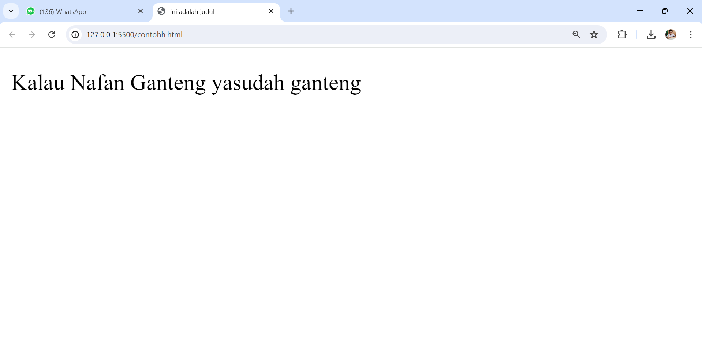
## Penjelasan
- **Tag `<DOCTYPE html>`**: Menyatakan bahwa dokumen HTML ini menggunakan versi 5.
- **Tag `<html>`**: Menandai awal dokumen HTML dan ditutup dengan `</html>`.
- **Tag `<head>`**: Berisi informasi tentang halaman HTML dan ditutup dengan `</head>`. Di dalamnya biasanya terdapat tag `<title>` yang memberikan informasi judul halaman.
- **Tag `<body>`**: Berisi semua konten yang akan ditampilkan di web browser. Semua elemen di dalamnya ditampilkan di halaman web.

# Anatomi Elemen HTML

## Tag Pembuka dan Tag Penutup

Dalam HTML, elemen terdiri dari tag pembuka dan tag penutup yang menandai awal dan akhir elemen tersebut.

- **Tag Pembuka**: Dimulai dengan nama elemen yang diapit oleh tanda kurung sudut atau tanda lebih kecil dan lebih besar (`<` dan `>`). Contoh: `<a>`.
- **Tag Penutup**: Hampir sama dengan tag pembuka, namun memiliki karakter garis miring tambahan (`/`) sebelum nama elemen. Contoh: `</a>`.
## Atribut Tag

Atribut tag memberikan informasi tambahan tentang elemen HTML tertentu dan biasanya disertakan dalam tag pembuka. Atribut ini menentukan dan mengonfigurasi sifat-sifat elemen seperti warna, tautan, atau ukuran.

## Isi atau Konten Tag

Isi atau konten tag adalah informasi yang ditempatkan di antara tag pembuka dan tag penutup. Konten ini bisa berupa teks, gambar, hyperlink, atau elemen HTML lainnya yang akan ditampilkan atau diolah oleh web browser ketika halaman HTML di-render.

### Kode :
```html
<a href="halaman-lain.html">pergi ke halaman selanjutnya</a>
```

### Hasil : 


### Penjelasan:

- **Tag Pembuka `<a>`**: Digunakan untuk membuat hyperlink.
- **Tag Penutup `</a>`**: Menutup elemen hyperlink.
- **Atribut `href`**: Menentukan tujuan atau arah link.
- **Nilai Atribut `href="halaman-lain.html"`**: Menunjukkan file atau halaman yang dituju oleh link.
- **Isi Konten**: "pergi ke halaman selanjutnya" adalah teks yang akan muncul sebagai link.
# Tag Dasar
## Heading

Tag heading digunakan untuk menunjukkan bagian penting pada halaman website dan memiliki enam tingkatan berurutan dari H1 hingga H6, dengan fungsi berbeda:

1. **Tag `<h1>`**: Seperti topik utama dari sebuah website. Tag ini memberi tahu Google tentang konten halaman tersebut.
2. **Tag `<h2>` hingga `<h6>`**: Digunakan sebagai sub-judul. Bayangkan halaman website seperti buku: H1 adalah judul buku, H2 adalah heading bab, dan H3-H6 adalah sub-bab.

> **Catatan:** Tidak disarankan melompati urutan. Jika H1 adalah heading utama, sub-heading harus menggunakan tag H2, tidak boleh langsung ke H3 atau H4.

## Kode :
```html
<!DOCTYPE html>
<html>
    <head>
        <title>ini judul</title>
    </head>
    <body>
        <h1>Qoute Hari Ini</h1>
        <h2>Kalau Ada Nafan</h2>
        <h3>Lari Lah</h3>
        <h4>Karena Nafan Gantenge</h4>
        <h5>Chuaakkkk</h5>
        <h6>Chuakkk</h6>
    </body>
</html>

```

## Hasil : 
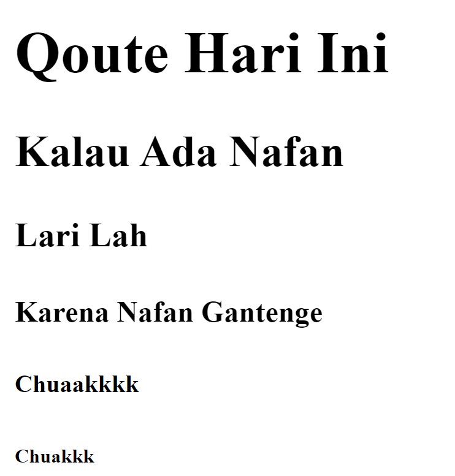

## Penjelasan

- **`<!DOCTYPE html>`**: Ini adalah deklarasi dokumen HTML yang menunjukkan bahwa dokumen menggunakan standar HTML terbaru.
- **`<html>`, `<head>`, `<title>`, `<body>`**: Ini adalah elemen dasar untuk membuat struktur dokumen HTML. `<html>` adalah elemen root yang mengapit seluruh konten HTML. `<head>` berisi informasi metadata seperti judul halaman (dalam tag `<title>`), sedangkan `<body>` berisi konten yang akan ditampilkan di browser.
- **`<h1>`**, **`<h2>`**, **`<h3>`**, **`<h4>`**, **`<h5>`**, **`<h6>`**: Ini adalah tag heading (judul) dengan tingkatan yang berbeda dari 1 sampai 6. Setiap tingkatan digunakan untuk memberikan hierarki yang berbeda pada judul-judul di halaman web. Umumnya, `<h1>` digunakan untuk judul utama, `<h2>` untuk sub-judul, dan seterusnya hingga `<h6>` untuk judul yang paling kecil.
# Paragraf

Tag paragraf dalam HTML digunakan untuk format teks dan mencakup beberapa tag berikut:

- **`<p>`**: Menampilkan sebuah paragraf.
- **`<b>`**: Menebalkan teks (bold).
- **`<i>`**: Memiringkan teks (italic).
- **`<u>`**: Memberikan garis bawah pada teks (underline).
- **`<br>`**: Membuat baris baru.
- **`<hr>`**: Membuat garis lurus secara horizontal.
## Kode : 

```html 
<!DOCTYPE html>
<html>
    <head>
        <title>ini judul</title>
    </head>
    <body>
        <p>html merupakan kepanjangan dari
        <i>Hyperteks Markup Language</i> dan dibuat oleh bapak <b>Tim Berners-Lee</b> yang bertujuan untuk
        <u>berbagi informasi yang dapat dibaca dan diakses melalui web browser</u></p>
        <br>
        <p>www atau World Wide Web juga dibuat oleh Tim Berners-Lee beserta juga HTTP atau Hypertext Transfer Protocol</p>
        <hr>
    </body>
</html>

```
## Hasil 
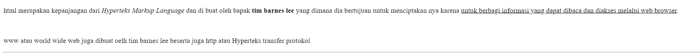

## Penjelasan

- **`<!DOCTYPE html>`**: Ini adalah deklarasi dokumen HTML yang menunjukkan bahwa dokumen menggunakan standar HTML terbaru.
- **`<html>`, `<head>`, `<title>`, `<body>`**: Ini adalah elemen dasar untuk membuat struktur dokumen HTML. `<html>` adalah elemen root yang mengapit seluruh konten HTML. `<head>` berisi informasi metadata seperti judul halaman (dalam tag `<title>`), sedangkan `<body>` berisi konten yang akan ditampilkan di browser.
- **`<p>`**: Ini adalah tag paragraf yang digunakan untuk menampilkan teks dalam paragraf.
- **`<i>`**, **`<b>`**, **`<u>`**: Ini adalah tag untuk memformat teks:
    - `<i>`: Untuk memiringkan teks (italic).
    - `<b>`: Untuk membuat teks tebal (bold).
    - `<u>`: Untuk memberikan garis bawah pada teks (underline).
- **`<br>`**: Ini adalah tag untuk membuat baris baru di dalam paragraf.
- **`<hr>`**: Ini adalah tag untuk membuat garis horizontal secara horizontal di antara dua konten.
# Atribut Align

Tag paragraf dalam HTML memiliki atribut `align` yang digunakan untuk mengatur perataan teks atau paragraf. Berikut adalah beberapa nilai yang dapat digunakan:

- **`align="left"`**: Mengatur teks rata kiri.
- **`align="right"`**: Mengatur teks rata kanan.
- **`align="center"`**: Mengatur teks rata tengah.
- **`align="justify"`**: Mengatur teks rata kiri dan kanan.

## Kode : 

```html
<!DOCTYPE html>
<html>
    <head>
        <title>ini adalah judul</title>
    </head>
    <body>
        <h3>Belajar Menggunakan Elemen Tag html</h3>
        <p align="left">
            Lorem ipsum dolor, sit amet consectetur adipisicing elit. Cumque, adipisci impedit rem numquam labore aut placeat! Accusamus, at nisi ipsum quidem veniam impedit eius culpa ab nemo omnis aliquid. Deserunt!
        </p>
        <p align="right">
            Lorem ipsum dolor sit amet consectetur adipisicing elit. Deserunt, quisquam delectus tempore voluptatem voluptas velit magni minima maxime totam libero aut molestiae, dolores, id provident reprehenderit exercitationem laborum enim necessitatibus!
        </p>
        <p align="center">
            Lorem ipsum dolor sit amet consectetur adipisicing elit. Fugiat quod quaerat ducimus molestiae et incidunt exercitationem consequuntur, impedit delectus, provident deleniti suscipit nemo amet facere veniam magnam quos? Inventore, adipisci!
        </p>
        <p align="justify">
            Lorem ipsum dolor sit, amet consectetur adipisicing elit. Dolorum pariatur quaerat facere totam eos dolores molestiae facilis maxime. Suscipit praesentium porro quas nam est error veritatis tempore debitis, voluptatem commodi.
        </p>
    </body>
</html>

```

## Hasil : 
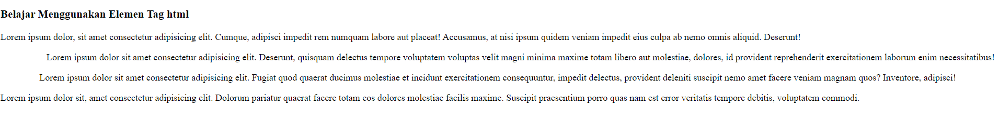

## Penjelasan
- **`<html>`, `<head>`, `<title>`, `<body>`**: Ini adalah elemen dasar untuk membuat struktur dokumen HTML. `<html>` adalah elemen root yang mengapit seluruh konten HTML. `<head>` berisi informasi metadata seperti judul halaman (dalam tag `<title>`), sedangkan `<body>` berisi konten yang akan ditampilkan di browser.
- **`<h3>`**: Ini adalah tag heading level 3 yang menampilkan teks "Belajar Menggunakan Elemen Tag html" sebagai judul sub-bab.
- **`<p align="left">`, `<p align="right">`, `<p align="center">`, `<p align="justify">`**: Ini adalah tag paragraf dengan atribut `align` yang berbeda-beda:
    - `<p align="left">`: Teks paragrafnya rata kiri.
    - `<p align="right">`: Teks paragrafnya rata kanan.
    - `<p align="center">`: Teks paragrafnya rata tengah.
    - `<p align="justify">`: Teks paragrafnya rata kiri dan kanan (justify).

### Komentar

HTML juga memiliki tag khusus untuk membuat komentar. Komentar tidak akan ditampilkan di browser dan digunakan untuk memberikan catatan atau penjelasan dalam kode HTML. Untuk membuat komentar, gunakan `<!--` sebagai awalan dan `-->` sebagai penutup. 

## Kode : 

```html

<!-- ini komentar, tidak akan di tampilkan di browser-->
<p>ini bukan komentar, dan akan tampil di browser</p>

```

## Penjelasan

1. **Komentar HTML**: Dalam contoh `<!-- ini komentar, tidak akan di tampilkan di browser-->`, bagian ini adalah komentar. Komentar dimulai dengan `<!--` dan diakhiri dengan `-->`. Isi komentar tidak akan muncul di halaman web saat halaman tersebut dirender di browser.
2. **Elemen `<p>`**: Bagian `<p>ini bukan komentar, dan akan tampil di browser</p>` adalah sebuah elemen paragraf dalam HTML. Elemen ini akan ditampilkan di halaman web karena tidak ada di dalam tag komentar.

# List

list adalah fungsi di html yang di gunakan untuk menampilkan daftar dari sesuatu. Dalam HTML , tag list terdiri dari 2 jenis, `<ol>` ordered list (berurutan) dan `<ul>` unordered list (tidak berurutan). Ordered list yang akan menampikan angka atau huruf, sedangkan unordered list yang akan menampilkan simbol-simbol seperti simbol bulat atau kotak

## Kode :

```html
  

<!DOCTYPE html>

 <html>

 <head>

  

<title>ini adalah judul</title>

  

</head>

  

 <body>

    <h1>Team esport Mobile legend</h1>

  

    <ul>

     <li>Onic</li>

     <li>RRQ</li>

     <li>Alterigo</li>

     <li>Aura</li>

    </ul>

    <p>absensi XI RPL 1</p>

   <ol>

     <li>ansar</li>

    <li>nafan</li>

     <li>ardi</li>

   </ol>

</body>

  

</html>

```


## Hasil

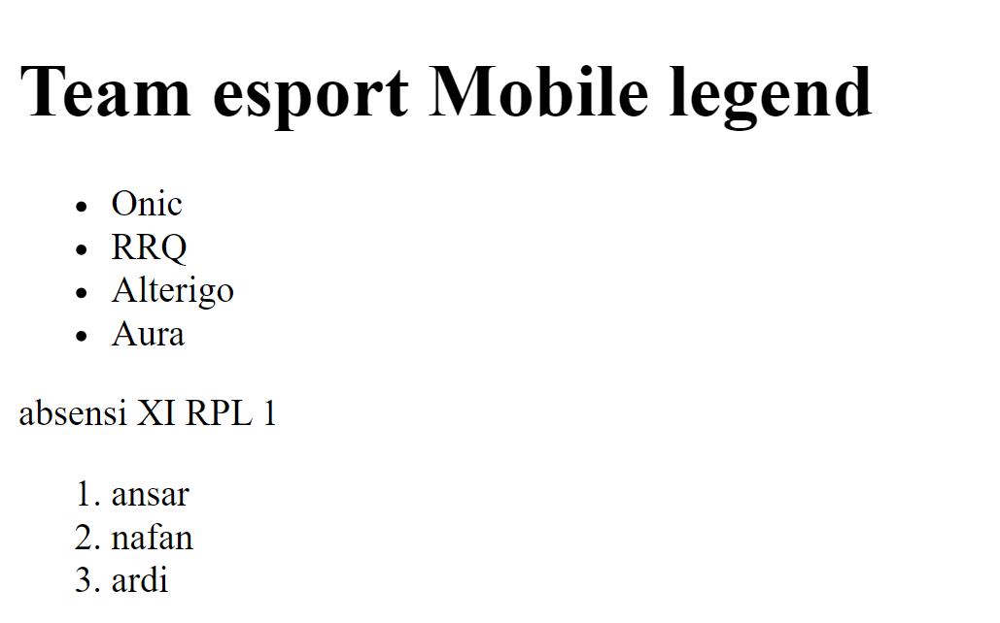

# Link

link dapat ditemukan di hampir semua halaman web. link/tautan memungkinkan sebuah teks yang ketika di klik akan berpindah ke halaman lainnya. HTML menggunakan tag `<a>` untuk keperluan ini. link ditulis dengan `<a>` yang merupakan singkatan cari anchor(jangkar).


>[!tip] Setiap tag `<a>` setidaknya memiliki sebuah atribut `href` berisi alamat yang dituju.`herf` adalah atribut singkatan dari hypertext reference.

Atribut penting lainnya dati tag `<a>` adalah `target` . Atribut target menetukan tempat untuk membuka dokumen yang ditautkan. Atribut `target` memiliki beberapa nilai salah satunya `_blank` yang berfungsi untuk membuka tautan di tab baru
  
## Kode :

```html

<h3>menggunkan tag anchor</h3>

<a herf="https://web.whatsapp.com/.html" target="_blank">Wa AKuy</a><br>

<a herf="https://www.instagram.com/nafan.nafan.3990/.html" target="_blank">IG Akuy selanjutnya

```
  

## Hasil 

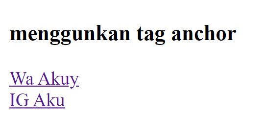

# Multimedia

## Gambar

dalam HTML, gambar didefinisikan dengan tag ``, tag `` adalah tag kosong, hanya berisi atribut saja, dan tidak memiliki tag penutup. Atribut `src` setidaknya mesti dalam tag ini untuk menentukan URL (alamat web) dari gambar yang ingin ditampilkan. Atribut menyediakan teks alternatif untuk gambar, jika pengguna karena beberapa alasan tidak dapat melihatnya (karena koneksi lambat, kesalahan pada atribut `src` , atau jika web browser telah disetting untuk tidak menampilkan gambar). jika dapat menemukan gambar, maka akan muncul nilai pada atribut alt.

Dalam tag `` terdapat juga atribut `width` dan  `height` untuk mengatur ukuran gambar, pada versi HTML 5 standar satuan ukuran gambar adalah pixel

- misalnya dalam folder root terdapat file gambar bernama logo.png. untuk menampilkan gambar tersebut kita hanya perlu mengisi nama gambar beserta jenis ekstensi file gambar kedalam atribut `src`

## Kode :

```html


```


Berikut di bawah ini gambar yang mendeskiripsikan letak/lokasi gambar yang disisipkan pada tag di atas, terlihat bahwa file html dalam satu letak penyimpanan yang sama dengan gambar yang dimuat oleh web.
## Hasil 


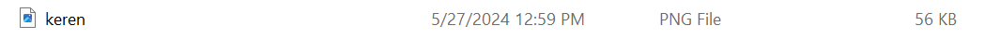


## Penjelasan 

- `` adalah tag HTML untuk menampilkan gambar di halaman web.
- Atribut `src` menentukan path atau URL dari gambar yang akan ditampilkan. Dalam contoh ini, nilai "keren.png" harus diganti dengan path atau URL yang benar dari gambar.
- Atribut `alt` digunakan untuk memberikan teks alternatif yang akan ditampilkan jika gambar tidak dapat ditampilkan. Pada contoh ini, nilai alt kosong, namun sebaiknya diisi dengan deskripsi gambar untuk keperluan aksesibilitas dan SEO.
- Atribut `width` dan `height` menentukan dimensi gambar dalam piksel. Nilai dalam contoh tersebut (250 dan 350) adalah ukuran gambar dalam lebar dan tinggi. Ukuran ini dapat disesuaikan sesuai dengan kebutuhan tata letak halaman web.
# Video

 dalam HTML, video didefinisikan dengan tag `<video>`, tag `<video>` adalah tag yang digunakan untuk memasukkan video kedalam web, di tag `<video>` terdapat tag khusus yang dimana tag ini tidak memiliki tag penutup yaitu `<source>` yang Digunakan untuk menyediakan beberapa sumber video dan memberi browser pilihan format yang sesuai.

Dalam tag `<video>` terdapat juga atribut   `controls` yang digunakan untuk Menambahkan kontrol pemutaran standar seperti play, pause, dan volume, dan juga di tag `<video>` ada atribut `width` dan `height` yang digunakan untuk mengatur ukuran video, pada versi HTML 5 standar satuan ukuran video adalah pixel, dan juga di dalam nya juga terdapat atribut `type` yang di gunakan untuk menentukan tipe MIME (Multipurpose Internet Mail Extensions) dari file video yang disematkan.

misalnya dalam folder root terdapat file video bernama video.mp4. untuk menampilkan video tersebut kita hanya perlu mengisi nama video beserta jenis ekstensinya didalamnya atribut `src` lalu kita berikanan atribut `controls` dan berikan atribut `width` dan `height` .

## Kode :

```html

<video controls src="Opening intro ATTA HALILINTAR" width="350x" height="250px"></video>

```

  
Gambar dibawah merupakan gambar yang mendefinisikan bahwa file html dengan gambar dalam 1 folder

## Hasil 
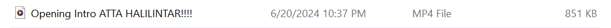


## Penjelasan 

- `<video>` adalah tag HTML untuk menampilkan elemen video di halaman web.
- Atribut `controls` menampilkan kontrol pemutaran video seperti play, pause, volume, dan lainnya.
- Atribut `src` menentukan URL atau path dari file video yang akan ditampilkan. Dalam contoh ini, "Opening intro ATTA HALILINTAR" harus diganti dengan path atau URL yang benar dari video.
- Atribut `width` dan `height` menentukan dimensi video dalam piksel. Nilai dalam contoh tersebut (350 dan 250) harus diubah sesuai dengan ukuran yang diinginkan 

# Audio

Di HTML, tag `<audio>` digunakan untuk menyematkan dan memainkan file audio di halaman web. Tag ini memungkinkan pengembang web menyertakan file audio langsung di dalam dokumen HTML, memungkinkan pemutaran langsung di halaman tanpa perlu mengarahkan pengguna ke halaman terpisah atau menggunakan pemutar audio eksternal. di dalam tag `<audio>` juga memiliki atribut yaitu `src` ,  `controls`  yang memiliki fungsi masing masing

- `src` digunakan untuk menentukan URL atau path ke file media yang akan dimainkan.

- `controls` yang digunakan untuk Menambahkan kontrol pemutaran standar seperti play, pause, dan volume.

## Kode :

```html

<audio controls src="EIY.mp3" type="audio/mp3"></audio>

```

## Hasil 

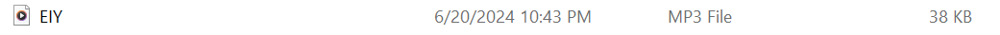


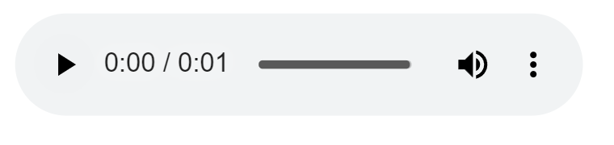

## Penjelasan

- Tag `<audio>` digunakan untuk menampilkan pemutar audio di halaman web.
- Atribut `controls` menampilkan kontrol pemutaran audio.
- Atribut `src` harus berisi path atau URL yang benar dari file audio yang ingin diputar.
- Atribut `type` menentukan jenis file audio yang diacu. Dalam contoh ini, file audio berformat MP3.

# Halaman Web Lain

Elemen `<iframe>` dapat digunakan untuk menampilkan dokumen html lain dalam sebuah website. Mudahnya, bisa dibilang website dalam website.

  

>[!tip] Contoh : penggunaannya seperti ini. jika kita mempunyai website sekolah, lalu di website tersebut ingin menampilkan alamat alamat dalam google maps sekolah. Agar memudahkan pengunjung website, kita bsia langsung tampilan saja halaman sekolah yang ada di google maps


Dalam tag `<iframe>` ada beberapa atribut yang penting seperti:

- `src` , untuk mencari sumber halaman html atau web yang akan ditampilkan di dalam iframe

-  `width` dan `height` , untuk mengatur ukuran panjang dan lebar dari frame

## Kode :

```html

<iframe src="https://www.petanikode.com/" width="1300px" height="450px"></iframe>

```
  
## Hasil
  


## Penjelasan 

- `<iframe>` adalah tag HTML yang memungkinkan Anda untuk menampilkan halaman web lain di dalam halaman web saat ini.
- Atribut `src` menentukan URL dari halaman web yang akan ditampilkan dalam `<iframe>`. Dalam contoh ini, halaman web yang ditampilkan berasal dari "[https://www.petanikode.com/](https://www.petanikode.com/)".
- Atribut `width` dan `height` menentukan dimensi `<iframe>` dalam piksel. Dalam contoh ini, `<iframe>` akan memiliki lebar 1300 piksel dan tinggi 450 piksel.
# Table

Tabel dalam HTML di definisikan dengan `<table>`

- Setiap baris tabel didefinisikan dengan tag `<tr>`

- Header (judul) tabel didefinisikan dengan tag `<th>`. secara default, header tabel memiliki teks tebal dan beraada di tengah

- Data tabel/sel didefinisikan dengan tag `<td>` . Karena sel merupakan bagian terkecil dari tabel maka dari itu tag selalu berada di dalam tag `<tr>` .

## Tabel Latihan 1

### Kode :

```html

    <table border="1">

  

         <tr>

         <th>no</th>

         <th>NAMA</th>

         <th>asal sekolah</th>

         <th>kelas</th>

         <th>kelamin</th>

         <th>umur</th>

         </tr>

         <tr>

        <td>1</td>

         <td>nafan</td>

         <td>smk negeri 7 makassar</td>

         <td>XI RPL 1</td>

         <td>laki-laki</td>

         <td>16</td>

        </tr>

         <tr>

         <td>2</td>

        <td>farhan</td>

         <td>smk negeri 7 makassar</td>

        <td>XI RPL 1</td>

         <td>laki-laki</td>

        <td>16</td>

         </tr>

         <tr>

         <td>3</td>

         <td>Ardi </td>

         <td>smk negeri 7 makassar</td>

         <td>XI RPL 1</td>

         <td>laki-laki</td>

         <td>17</td>

        </tr>

         <tr>

         <th>4</th>

         <th>Muh.Nur Resky Alfatir </th>

         <th>smk negeri 7 makassar</th>

       <th>XI RPL 1</th>

         <th>laki-laki</th>

         <th>16</th>

         </tr>

         </table>
```

### Hasil

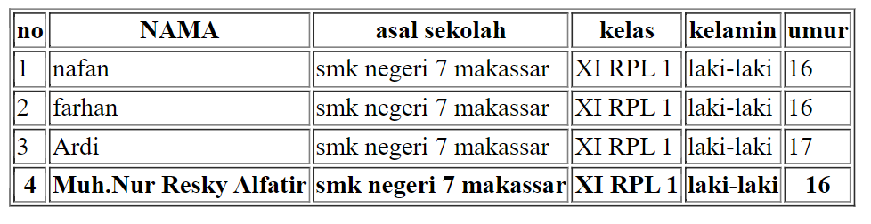

## Penjelasan 

- Tabel ini digunakan untuk menampilkan data siswa dengan menggunakan HTML.
- Setiap baris tabel memiliki informasi yang terorganisir dalam kolom-kolom yang ditentukan.
- Penggunaan `<th>` untuk header kolom dan `<td>` untuk data memungkinkan pembaca tabel untuk dengan mudah mengidentifikasi judul dan nilai yang sesuai.
- Atribut `border="1"` digunakan untuk menampilkan garis tepi pada tabel, membedakan antara sel-sel tabel untuk penampilan yang lebih terstruktur.

## Tabel Latihan 2
Tabel Latihan 2 menggunakan tag `<table>` untuk menampilkan data dengan penggunaan atribut-atribut tabel yang penting seperti `rowspan`, `colspan`, `width`, `height`, dan `align`. Berikut adalah rangkuman dari contoh tabel tersebut: 

### Kode :
```html 
<table border="1">
    <tr>
        <th rowspan="2">Nama</th>
        <th colspan="2">Asal Instansi</th>
    </tr>
    <tr>
        <th width="100">Sekolah</th>
        <th width="100">Kampus</th>
    </tr>
    <tr>
        <td>Muh.Daud Resky Jayadi</td>
        <td rowspan="3">SMKN 7 Makassar</td>
        <td rowspan="3" align="center">-</td>
    </tr>
    <tr>
        <td>Ansar</td>
    </tr>
    <tr>
        <td>Senapan</td>
    </tr>
</table>

```

### Hasil : 
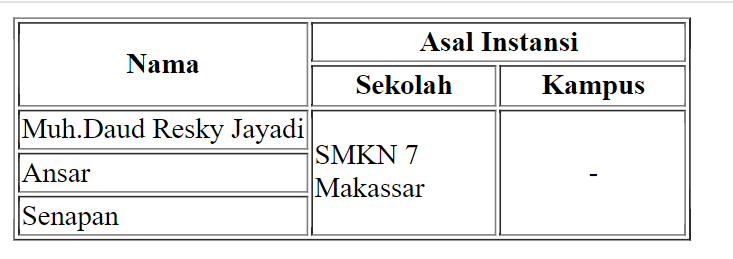

## Penjelasan 

- **Tag `<table>`**: Digunakan untuk membuat tabel di HTML.
- **Atribut `border="1"`**: Menampilkan garis tepi tabel dengan ketebalan 1 piksel.
- **Tag `<tr>`**: Menandakan baris dalam tabel.
- **Tag `<th>`**: Digunakan untuk header kolom dalam tabel.
- **Tag `<td>`**: Digunakan untuk sel data dalam tabel.
- **Atribut `rowspan`**: Menggabungkan beberapa baris ke bawah untuk sel tertentu.
- **Atribut `colspan`**: Menggabungkan beberapa kolom ke samping untuk sel tertentu.
- **Atribut `width`**: Menentukan lebar kolom atau tabel dalam piksel.
- **Atribut `height`**: Menentukan tinggi kolom atau tabel dalam piksel.
- **Atribut `align`**: Mengatur perataan teks dalam sel atau header (`left`, `right`, `center`) 

## Tabel Latihan 3

Tabel ini terdiri dari dua baris pertama yang memiliki header kolom gabungan (`Nama hari` dan `Nama bulan`). Di baris kedua, kolom `Nama hari` terbagi menjadi dua sel (`senin` dan `selasa`), begitu juga dengan `Nama bulan` (`april` dan `juni`) Dengan menggunakan atribut-atribut seperti `colspan`, `rowspan`, `width`, `height`, `align`, dan `bgcolor`, Anda dapat mengontrol tampilan dan struktur tabel HTML sesuai dengan kebutuhan desain dan presentasi data di halaman web Anda. 

### Kode :
```html
<table border="1">
    <tr bgcolor="green">
        <th colspan="2" align="center">Nama hari</th>
        <th colspan="2" align="center">Nama bulan</th>
    </tr>
    <tr>
        <td align="center" width="100">senin</td>
        <td align="center" width="100">selasa</td>
        <td align="center" width="100">april</td>
        <td rowspan="2" align="center" width="100">juni</td>
    </tr>
    <tr>
        <td align="center" width="100">rabu</td>
        <td align="center" width="100">kamis</td>
        <td align="center" width="100">mei</td>
    </tr>
</table>

```

### Hasil : 
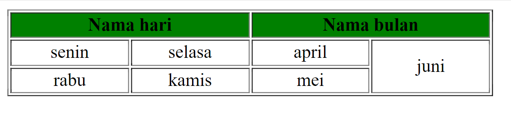
### Penjelasan

- **Tag `<table>`**:
    - Digunakan untuk mendefinisikan tabel di HTML.
    - Atribut `border="1"` menunjukkan garis tepi tabel dengan ketebalan 1 piksel.
- **Tag `<tr>`**:
    - Tag untuk mendefinisikan baris dalam tabel.
- **Tag `<th>`**:
    - Tag untuk header kolom dalam tabel.
    - Atribut `colspan="2"` pada dua header pertama (`Nama hari` dan `Nama bulan`) menggabungkan dua kolom menjadi satu di atas baris tersebut.
    - Atribut `align="center"` untuk memusatkan teks di dalam header dan sel.
- **Tag `<td>`**
    - Tag untuk sel data dalam tabel.
    - Atribut `align="center"` untuk memusatkan teks di dalam sel.
    - Atribut `width="100"` untuk menetapkan lebar setiap sel menjadi 100 piksel.
- **Atribut `bgcolor`**:
    - Mengatur warna latar belakang untuk baris tertentu dalam tabel (`bgcolor="green"` pada baris pertama).
- **Atribut `rowspan`**:
    - Pada sel `juni`, menggunakan `rowspan="2"` menggabungkan sel tersebut dengan dua baris di bawahnya.

# Form

Elemen `<form>` HTML digunakan untuk mendefinisikan form yang digunakan  untuk mengumpulkan inputan dari penggunaan website. Tag ini digunakan untuk mengoleksi inputan dari user, konsep ini sama seperti konsep formulir di dunia nyata.

>[!tip] dengan kata lain tag `<form>`  merepsentikasikan sebuah "formulir" di mana satu formulir bisa dimiliki banyak kolom isian.


Form HTML berikan elemen-elemen `form` lainnya. Elemen `<form>` digunakan untuk menampung macam-macam  elemen yang berkaitan dengan sebuah `form`, seperti `text` `fields`, `checkbox`, `radio button`, tombol `submit`, dan  banyak lagi yang dapat diedit kemudian ditulis untuk dikirim pada sebuah server untuk selanjutnya diproses guna mendapatkan informasi tertentu dari atau untuk user.

Umumnya, sebuah website selalu memiliki fitur form, Contoh : paling umum yang sering kita temui adalah seperti form login, form sign up, form komentar di suatu blog/media.

# Input

Elemen `<input>` adalah elemen `form`yang paling penting. Elemen `<input>` dapat ditampilkan dalam beberapa cara, tergantung pada nilai atribut `type` yang digunakan. Berikut adalah beberapa Contoh : nilai dari atribut type:

- `text` digunakan untuk mengambil isian berupa teks. Contoh :nya seperti nama.

- `password` digunakan untuk mengambil isian berupa kata sandi atau sesuatu yang bersifat rahasia. Tipe ini akan mengubah semua karakter yang diketikkan ke dalam karakter bulat.

- `radio` digunakan sebagai kolom isian bertipe pilihan yang menawarkan beberapa opsi kepada user namun tetapi hanya satu opsi saja yang boleh dipilih. Contoh :nya seperti jenis kelamin atau agama.

  

>[!tip] Perlu diperhatikan bahwa untuk penggunaan tipe `radio` yang berkategori set pilihan yang sama mengharuskan nilai `name` -nya juga sama.

  

Opsi default dapat dilakukan dengan menambahkan atribut `checked` pada elemen opsi yang dijadikan sebagai opsi default.

  

- `checkbox` digunakan untuk memberikan daftar pilihan dalam satu set opsi. User dapat memilih satu atau bahkan lebih dari satu pilihan pada tipe ini. Hal ini berbeda dengan tipe sebelumnya yaitu `radio` yang hanya memungkinkan user untuk memilih satu pilhan saja. Contoh : penggunaan `checkbox` seperti daftar makanan kesukaan, daftar olahraga yang tidak disukai, dan yang semisalnya.

>[!tip] Perlu diperhatikan bahwa untuk penggunaan tipe `checkbox` yang berkategori set pilihan yang sama mengharuskan nilai `name`-nya juga sama.


- `number` digunakan untuk membatasi isian user hanya pada karakter numerik saja. Browser akan menambahkan dua buah tombol atas dan bawah untuk mengubah angka isian.

Beberapa atribut untuk tipe number:

- `min` - menentukan angka minimal

- `max` - menentukan angka maksimal

- `step` - menentukan kelipatan (nilai yang tidak sesuai kelipatan tidak bisa di-input, dan default dari atribut ini adalah 1)

- `date` digunakan untuk memberikan isian berupa tanggal. Atribut `min`dan `max` dapat pula difungsikan pada tipe ini untuk mengatur tanggal minimal dan tanggal maksimal yang diinginkan. Nilai `min` dan `max` tersebut ditulis dengan format: `YYYY-MM-dd`.

- `file` digunakan untuk memungkinkan pengguna memuat file. Atribut `accept` juga dapat disisipkan pada tipe ini dengan maksud untuk mengatur file apa saja yang boleh di-upload. Beberapa Contoh : value dari atribut `accept` yaitu:

- `accept="image/png,image/jpg, image/jpeg"` - untuk file gambar seperti png, jpg, atau jpeg

- `accept=".pdf` - untuk file pdf

- `accept=".doc, .docx"` - untuk file `doc` atau `docx`

- `accept=".ppt, .pptx"` - untuk file `ppt` atau `pptx`

- `submit` ditampilkan dalam bentuk tombol untuk mengirim data pada `<form>` yang menjadi pembungkusnya. Atribut `value` digunakan untuk mengisi teks yang ingin ditampilkan pada tombol.

- `reset` berguna untuk mengembalikan state (keadaan) atau data dari suatu form ke nilai awalnya. Jika nilai awal sebuah input adalah kosong, maka ketika direset ia akan kembali kosong. Tapi jika nilai awalnya sudah terisi sesuatu, maka ketika direset datanya akan kembali seperti yang sudah diset sebelumnya.

- `button` berguna untuk membuat inputan berupa sebuah tombol. Tombol ini nantinya bisa difungsikan sesuai dengan keinginan dari pengembang web.
# Label

Elemen `<label>` memiliki fungsi khusus untuk melabeli sebuah kolom inputan. Ketika screen reader membaca konten halaman HTML, lalu menemukan sebuah inputan, ia akan membaca label yang bersangkutan.

Fungsi lain dari tag `<label>` adalah ketika kita mengklik label, maka browser akan meletakkan fokus pada kolom isian yang terhubung dengannya. Syarat yang perlu diperhatikan yaitu dengan menghubungkan sebuah `<label>` dan `<input>` dengan atribut for untuk label, dan atribut id pada `<input>` dengan nilai untuk kedua atribut tersebut mesti sama persis.

# Select

Elemen `<select>` berguna dalam mendefinisikan sebuah tombol dropdown yang dimana user dapat memilih salah satu dari banyak pilihan.


> [!tip] - Elemen `<select>` nantinya berperan sebagai kontainer atau pembungkus dari elemen `<option>` yang berperan sebagai daftar pilihan atau opsi.


 Elemen `<select>` hampir mirip fungsinya dengan `<input type ="radio">` akan tetapi baiknya elemen `<select>`digunakan untuk memilih satu pilihan yang terdapat banyak opsi di dalamnya, sedangkan `<input type ="radio">` lebih baiknya untuk digunakan jika user diarahkan memilih hanya satu pilihan yang opsi pilihannya tidak terlalu banyak. Contoh : penggunaan elemen ini seperti memasukkan pilihan berupa asal daerah atau yang semisalnya.

Penting untuk diketahui bahwasanya opsi yang aktif secara default adalah adalah opsi yang pertama. Akan tetapi, kita bisa mengatur opsi mana yang aktif secara default dengan menambahkan atribut selected pada suatu `<option>` yang ingin dijadikan sebagai opsi default.
### Text Area

Elemen `<textarea>` berguna untuk mengambil inputan user berupa teks yang dapat memuat lebih dari satu baris. Jika dibandingkan dengan elemen `<input>` teks biasa, elemen `<textarea>` memiliki ukuran tinggi yang lebih besar. Element `<textarea>` bisa diisi lebih dari satu baris dengan menekan enter.

Atribut yang dapat digunakan untuk mengatur ukuran dari textarea yaitu `rows` untuk jumlah baris, sedangkan atribut `cols` untuk lebarnya.

### Text Area

Elemen `<textarea>` berguna untuk mengambil inputan user berupa teks yang dapat memuat lebih dari satu baris. Jika dibandingkan dengan elemen `<input>` teks biasa, elemen `<textarea>` memiliki ukuran tinggi yang lebih besar. Element `<textarea>` bisa diisi lebih dari satu baris dengan menekan enter.

Atribut yang dapat digunakan untuk mengatur ukuran dari textarea yaitu `rows` untuk jumlah baris, sedangkan atribut `cols` untuk lebarnya.

### Button

Elemen `<button>` yang berada di dalam sebuah form akan otomatis dianggap sama fungsinya seperti `<input type="submit">`. Jika ingin membuat tombol biasa yang tidak men-submit `<form>` dapat dilakukan dengan menambahkan atribut type="button".

Beberapa atribut yang digunakan pada Contoh : di atas yang perlu untuk diperjelas yaitu sebagai berikut:
- `name` - digunakan sebagai nama variabel yang akan diproses oleh web server (Contoh : menggunakan PHP)
- `required` - digunakan untuk memastikan bahwa pengguna harus memasukkan nilai pada input tersebut sebelum dapat melakukan proses submit formulir
- `placeholder` - menuliskan teks pada elemen input. Placeholder sangat bermanfaat untuk memberikan teks bantuan kepada user untuk inputan form yang kompleks
- `value` - menentukan nilai awal dari sebuah elemen input
- `disabled` - digunakan untuk menonaktifkan inputan pada elemen yang diberi atribut ini

### Latihan Form 1

Formulir pendaftaran ini memungkinkan pengguna untuk mengisi informasi pribadi seperti nama lengkap, password, jenis kelamin, usia, tanggal ijazah, agama, alamat, kemampuan berbahasa asing, dan mengunggah foto. Beberapa bidang di formulir ini wajib diisi (ditandai dengan `required`), sementara yang lain opsional. Ini merupakan struktur formulir yang umum digunakan untuk mengumpulkan informasi pengguna secara terperinci.
## Kode : 

```html

<h1>Formulir Pendaftaran</h1>

<form action="">

  <div>

    <label for="nama-lengkap"><b>Nama Lengkap:</b></label>

    <br />

    <input

      type="text"

      id="nama-lengkap"

      name="nama_lengkap"

      placeholder="Masukkan nama lengkap"

      required

    />

  </div>

  <div>

    <label for="password"><b>Password:</b></label

    ><br />

    <input

      type="password"

      id="password"

      name="password"

      placeholder="Masukkan password"

      required

    />

  </div>

  <div>

    <b>Jenis Kelamin:</b><br />

    <input id="lk" type="radio" name="jenis_kelamin" checked />

    <label for="lk">Laki-Laki</label>

    <input id="pr" type="radio" name="jenis_kelamin" />

    <label for="pr">Perempuan</label>

  </div>

  <div>

    <label for="isian-usia"><b>Usia:</b></label

    ><br />

    <input

      type="number"

      id="isian-usia"

      name="usia"

      min="17"

      max="25"

      value="19"

      required

    >

    Tahun

  </div>

  <div>

    <label for="tgl-ijazah"><b>Tanggal Ijazah:</b></label> <br />

    <input

      type="date"

      id="tgl-ijazah"

      name="tgl_ijazah"

      min="2021-01-01"

      value="2023-06-20"

      required

    >

  </div>

  <div>

    <label for="opsi-agama"><b>Agama:</b></label

    ><br>

    <select id="opsi-agama" name="agama" required>

      <option disabled>---Pilih Agama----</option>

      <option value="islam">Islam</option>

      <option value="kristen">Kristen</option>

      <option value="katolik">Katolik</option>

      <option value="hindu">Hindu</option>

      <option value="buddha">Buddha</option>

      <option value="atheis" disabled>Atheis</option>

    </select>

  </div>

  <div>

    <label for="alamat"><b>Alamat:</b></label> <br />

    <textarea

      id="alamat"

      name="alamat"

      cols="25"

      rows="5"

      placeholder="Harap masukkan alamat secara lengkap"

      required

    ></textarea>

  </div>

  <div>

    <b>Kemampuan Berbahasa Asing:*</b><br />

    <input type="checkbox" id="inggris" name="bahasa_asing" />

    <label for="inggris">Inggris</label>

    <input type="checkbox" id="arab" name="bahasa_asing" />

    <label for="arab">Arab</label>

    <input type="checkbox" id="jepang" name="bahasa_asing" />

    <label for="jepang">Jepang</label>

  </div>

  <div>

    <label for="isian-foto"><b>Foto 4x6:*</b></label

    ><br />

    <input

      type="file"

      id="isian-foto"

      name="foto"

      accept="image/png,image/jpg,image/jpeg"

    />

  </div>

  <br />

  <input type="submit" value="Kirim" />

  <input type="reset" value="Batal" />

  <i>*opsional (tidak wajib diisi)</i>

</form>

```
## Hasil
  
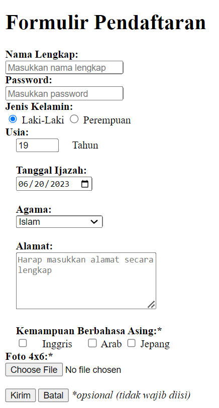

## Penjelasan 

- **Nama Lengkap**
    
    - **Elemen:** `<input type="text">`
    - **Atribut:** `id="nama-lengkap"`, `name="nama_lengkap"`, `placeholder="Masukkan nama lengkap"`, `required`
    - **Fungsi:** Meminta pengguna untuk memasukkan nama lengkap.
- **Password**
    - **Elemen:** `<input type="password">`
    - **Atribut:** `id="password"`, `name="password"`, `placeholder="Masukkan password"`, `required`
    - **Fungsi:** Mengambil input password dengan format yang tersembunyi.
- **Jenis Kelamin**
    - **Elemen:** `<input type="radio">`
    - **Atribut:** `id="lk"`, `id="pr"`, `name="jenis_kelamin"`, `checked` pada "Laki-Laki"
    - **Fungsi:** Memungkinkan pengguna memilih jenis kelamin (Laki-Laki atau Perempuan).
- **Usia**
    - **Elemen:** `<input type="number">`
    - **Atribut:** `id="isian-usia"`, `name="usia"`, `min="17"`, `max="25"`, `value="19"`, `required`
    - **Fungsi:** Meminta pengguna untuk memasukkan usia dalam rentang tertentu.
- **Tanggal Ijazah**
    - **Elemen:** `<input type="date">`
    - **Atribut:** `id="tgl-ijazah"`, `name="tgl_ijazah"`, `min="2021-01-01"`, `value="2023-06-20"`, `required`
    - **Fungsi:** Meminta pengguna memilih tanggal ijazah dengan batasan tanggal minimum dan nilai default.
- **Agama**
    - **Elemen:** `<select>`
    - **Atribut:** `id="opsi-agama"`, `name="agama"`, `required`
    - **Opsi:** Islam, Kristen, Katolik, Hindu, Buddha (Atheis disabled)
    - **Fungsi:** Memungkinkan pengguna memilih agama dari dropdown list.
- **Alamat**
    - **Elemen:** `<textarea>`
    - **Atribut:** `id="alamat"`, `name="alamat"`, `cols="25"`, `rows="5"`, `placeholder="Harap masukkan alamat secara lengkap"`, `required`
    - **Fungsi:** Meminta pengguna memasukkan alamat secara detail.
- **Kemampuan Berbahasa Asing**
    - **Elemen:** `<input type="checkbox">`
    - **Atribut:** `id="inggris"`, `id="arab"`, `id="jepang"`, `name="bahasa_asing"`
    - **Opsi:** Inggris, Arab, Jepang
    - **Fungsi:** Memungkinkan pengguna memilih kemampuan berbahasa asing yang dimiliki (opsional).
- **Foto 4x6**
    - **Elemen:** `<input type="file">`
    - **Atribut:** `id="isian-foto"`, `name="foto"`, `accept="image/png,image/jpg,image/jpeg"`
    - **Fungsi:** Memungkinkan pengguna mengunggah file foto dengan format yang diizinkan.
- **Tombol Kirim dan Batal**
    - **Elemen:** `<input type="submit">`, `<input type="reset">`
    - **Atribut:** `value="Kirim"` untuk submit, `value="Batal"` untuk reset
    - **Fungsi:** Mengirimkan atau menghapus inputan pada formulir.
- **Keterangan Opsional**
    - **Elemen:** `<i>`
    - **Fungsi:** Memberikan keterangan bahwa beberapa bagian formulir bersifat opsional.

# Latihan Form 2
Kode HTML yang diberikan adalah contoh sederhana dari formulir web yang mengandung beberapa elemen dasar seperti input teks, password, radio buttons, checkboxes, dan tombol submit. Penggunaan label dan atribut tertentu seperti `for` dan `required` memperjelas struktur dan fungsionalitas elemen-elemen form tersebut dalam hal interaksi dengan pengguna.

## Kode : 
```html

<form>

            <label for="nama">nama:</label>

            <input type="text" required>

            <br><br>

            <label for="password">password:</label>

            <input type="password" required>

            <br>

            <input type="radio" name="jk">

            <label for="jenis_kelamin">Laki-Laki</label>

            <input type="radio" name="jk">

            <label for="jenis_kelamin">Perempuan</label>

            <br>

            <input type="checkbox" name="web">

            <label for="web">web</label>

            <input type="checkbox" name="mobile">

            <label for="mobile">mobile</label>

            <input type="checkbox" name="desktop">

            <label for="desktop">desktop</label>

            <br>

            <input type="submit" value="kirim">

            <input type="submit" value="ulang">

            <br>

            pesan anda:

            <textarea></textarea>

        <br>

        </form>
```

## Hasil 
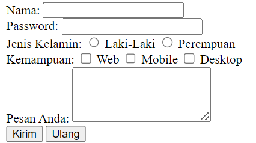

## Penjelasan

- **`<form>`**
    - Digunakan untuk mengumpulkan input dari pengguna website.
- **`<label>`**
    - Digunakan untuk memberi label pada elemen-elemen form seperti input, radio buttons, atau checkboxes.
- **`<br>`**
    - Digunakan untuk membuat baris baru di dalam form.
- **`type` attribute**
    - Menentukan jenis input yang akan digunakan.
    - Contoh: `type="text"`, `type="password"`, `type="radio"`, `type="checkbox"`, `type="submit"`.
- **`for` attribute pada `<label>`**
    - Menghubungkan label dengan elemen form lainnya (biasanya input) dengan menggunakan nilai dari atribut `id` yang sama.
    - Ini memungkinkan label untuk diklik sehingga memfokuskan atau memilih elemen yang sesuai.
- **`required` attribute**
    - Digunakan untuk menandai bahwa suatu input diperlukan sebelum pengguna dapat mengirimkan formulir.
    - Contoh: `<input type="text" required>` akan memaksa pengguna untuk mengisi bidang ini sebelum mengirimkan formulir.
- **Nilai dari atribut `for`**
    - `nama`, `password`, `jenis_kelamin`, `web`, `mobile`, `desktop` adalah nilai-nilai yang digunakan dalam atribut `for` pada label-label dalam contoh HTML yang diberikan.
    - Ini digunakan untuk mengaitkan label dengan elemen form yang sesuai.

# Bagaimana Cara Memproses Form?
 
Ketika sebuah `<form>` disubmit, baik menggunakan elemen `<button>` mau pun `<input type="submit">`, browser akan mengirimkan data tersebut kepada URL yang didefinisikan pada atribut `action` di dalam tag `form`.
Ada pun jika atribut action tidak didefinisikan, maka browser akan menggunakan URL sekarang sebagai tujuan pengiriman data.


```html

**<form** action**=**"/proses-pendaftaran"**>**

...

**</form>**

```


Pada Contoh : di atas, ketika form di-submit, browser akan mengirimkan data yang ada  menuju URL /proses-pendaftaran.

# Apa yang terjadi pada URL /proses-pendaftaran?


Pada URL tersebut terdapat sebuah aplikasi/program yang berjalan di server (bukan di browser). Tugas dari program tersebut adalah mengelola data yang dikirim seperti misalnya menyimpan data tersebut ke dalam sebuah database.


Bahasa yang umum digunakan di dalam server adalah python, nodejs, PHP, dan lain sebagainya.


Untuk mendapatkan gambaran lebih jelas, sebenarnya akan dijelaskan pada modul selanjutnya yang berkaitan dengan materi PHP atau juga bisa dengan membaca tutorial berikut:

https://jagongoding.com/web/php/web-dinamis/membuat-dan-menangani-form/
# DIV & SPAN

## `<div>`

### Penjelasan

tag div merupakan tag yang digunakan untuk membuat layer yang dimana itu akan memudahkan seorang devoloper untuk membuat layout sesuai dengan desain yang diinginkan.
### Kode :

```html

 <div>Ini dibuat menggunakan div</div>

 <div>Ini juga menggunakan div</div>

```
### Hasil :

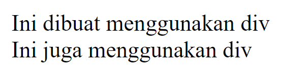
## `<span>`

### Penjelasan

Mirip seperti DIV, span adalah tag HTML yang tidak punya makna apa-apa ketika berdiri sendiri. Ia berguna untuk memberi aksi atau hiasan pada sebuah atau sekelompok elemen HTML.

### Kode :

```html

<p>Ini dibuat menggunakan tag paragraf, <span>dan ada span di dalamnya.</span></p>

        <span>Ini dibuat menggunakan span</span>

        <span>ini j uga dibuat menggunakan span</span>

```
### Hasil 

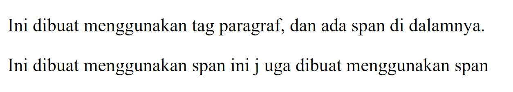

# Apa itu Semantic HTML
Semantic HTML adalah konsep dalam pengembangan web yang berfungsi menyediakan makna atau arti lebih dalam kode HTML.

Dalam semantic HTML, masing-masing elemen memiliki nama yang mencerminkan arti dari kontennya, bukan hanya presentasinya. Semantic membantu mesin pencari dan perangkat pembaca layar (screen reader) untuk memahami struktur dan konten dari halaman web dengan lebih maksimal. 

Artinya, jika kamu ingin membuat kode yang mudah dipahami, tidak hanya oleh manusia tapi juga oleh mesin, semantic HTML adalah solusi yang tepat. saya berikan contoh dari gambar berikut.
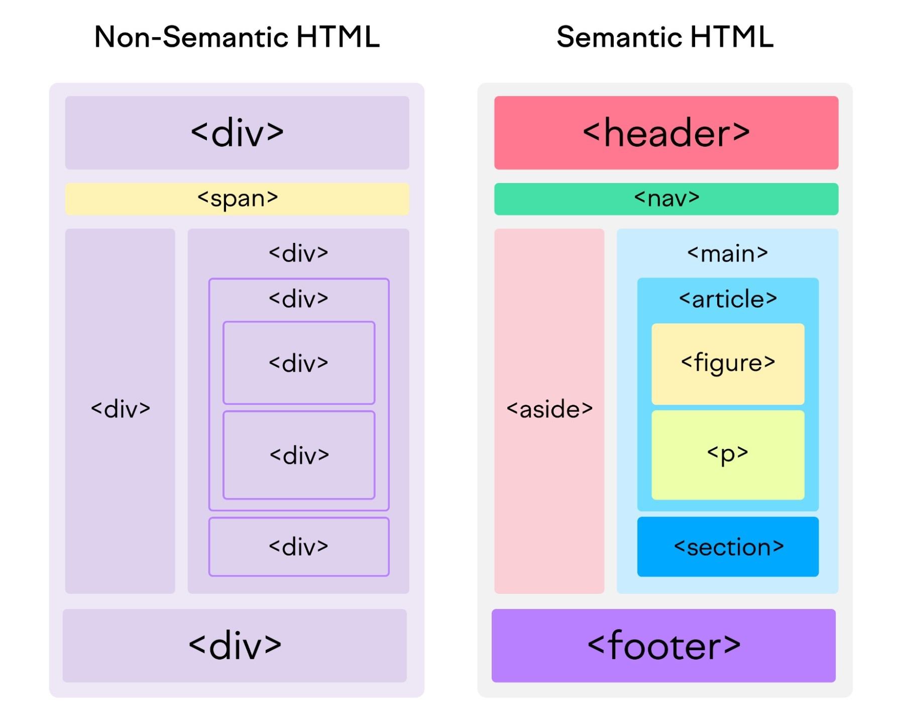
Mungkin kalian bertanya-tanya, “Apa perbedaan antara semantic HTML dan non-semantic HTML?” 

Perbedaan keduanya cukup sederhana.

Semantic HTML menggunakan elemen yang menggambarkan arti dari konten, seperti

,

, dan

. Sedangkan non-semantic HTML menggunakan elemen seperti

dan yang tidak mengungkapkan informasi apa pun tentang kontennya. Untuk memahami lebih jelas, mari kita lihat contoh kode berikut:

Bukan Semantic

```html
<div id="header"></div>
<div id="sidebar"></div>
<div  class="main">
	<div class="Section">
		<div class="articel">
				<div class="figure">
					
					<div class="figcaption"></div>
				</div>
				
			</div>
			
		</div>
	</div>
<div id="footer"></div>
```

Semantic HTML : 
```css
<header></header>
<main>
	<section>
		<articel>
			<figure>
				
				<figcaption></figcaption>
			</figure>
			
		</articel>
	
	</selection>

</main>
<footer></footer>
```
# Mengapa Menulis Semantic HTML

1. Aksesibilitas 
	Tag HTML yang semantik membantu membuat konten lebih mudah diakses oleh pembaca layar dan perangkat bantu lainnya. Ini meningkatkan pengalaman pengguna untuk orang dengan disabilitas
2. .SEO (Search Engine Optimization): 
	 Mesin pencari, seperti Google, cenderung memberikan peringkat lebih tinggi pada halaman web yang menggunakan Semantic HTML karena struktur yang jelas membantu mesin pencari memahami dan mengindeks konten dengan lebih baik.
3. Mudah Dibaca Pengembang/Developer 
	Penggunaan tag yang memiliki makna membuat kode HTML lebih mudah dibaca dan dimengerti oleh pengembang dan anggota tim lainnya. Ini mempermudah pemeliharaan dan pengembangan kode.
# Jenis Jenis Tag Semantic HTML

Tag semantik dapat mendefinisikan berbagai bagian halaman web. 

Mari kita lihat elemen semantik HTML yang paling umum, dibagi menjadi dua kategori berdasarkan penggunaannya:

* Tag semantik HTML untuk struktur
* Tag semantik HTML untuk teks 
## Tag  Semantic HTML untuk Struktur

Banyak tag HTML semantik mengkomunikasikan tata letak halaman.

Tag "struktural" ini diperkenalkan ketika HTML4 ditingkatkan ke HTML5. Itulah mengapa juga dikenal sebagai tag HTML5 semantik atau elemen HTML5 semantik.

`<Header>`

Tag header mendefinisikan konten yang harus dianggap sebagai informasi pengantar halaman atau bagian

`<nav>`
Tag navigasi digunakan untuk tautan navigasi. Tag ini dapat diletakkan di dalam tag

`<header>` namun tag navigasi sekunder`<nav>`juga biasa digunakan di tempat lain pada halaman.

`<main>`

Tag ini berisi konten utama (juga disebut badan) halaman. Hanya boleh ada satu tag per halaman.

`<section>`
Menggunakan `<section>`  adalah cara untuk  mengelompokkan konten yang  berdekatan dengan tema yang sama tag `<section>` berbeda dengan tag artikel. Tag `<section>`  tidak  selalu sendiri, tetapi merupakan bagian dari sesuatu  yang lain

`<Artikel>`
Tag artikel mendefinisikan konten yang dapat berdiri sendiri terlepas dari halaman atau situs tempat konten tersebut berada. Ini tidak selalu berarti "posting blog". Anggap saja sebagai "sebuah artikel" - sebuah item mandiri yang dapat digunakan dalam berbagai konteks.

`<aside>`
Elemen aside ini sering digunakan untuk bilah sisi-area yang menambahkan informasi pelengkap.

`<aside>`
Elemen `<footer>` juga sering digunakan di bagian bawah halaman. Biasanya mencakup informasi kontak, informasi hak cipta, dan beberapa navigasi situs.

## Tag Semantic HTML Untuk Teks
Tag HTML semantik untuk teks adalah tag HTML yang-selain pemformatan-juga menyampaikan fungsi semantik teks yang dikandungnya.

`<h1 (heading)>`
Tag H1 menandai judul tingkat atas. Biasanya hanya ada satu judul H1 per halaman.

`<p> paragraf`
Paragraf teks yang berdiri sendiri.

`<a> anchor`
Digunakan untuk menandai hyperlink dari satu halaman ke halaman lainnya.

`<ol> daftar terurut`
Daftar item yang ditampilkan dalam urutan tertentu, dimulai dengan poin-poin. Satu tag `<li>`
(item daftar) berisi satu item dalam daftar

`<ul> daftar tidak berurutan`
Daftar item yang tidak perlu ditampilkan dalam urutan tertentu, dimulai dengan nomor urut. Satu tag `<li>`(item daftar) berisi satu item dalam daftar.

`<q> / <blockqoute>`
Kutipan teks. Gunakan `<blockqoute>`untuk kutipan panjang dengan banyak baris dan`<q>` untuk kutipan pendek dan sejajar.

`<em>`
Digunakan untuk teks yang harus ditekankan.

`<strong>`
Digunakan untuk teks yang harus diberi penekanan kuat.

`<code>`
Blok kode computer.

Disini saya hanya mencantumkan beberapa tag HTML semantik yang paling umum. Anda dapat menggunakan banyak lainnya seperti `<summary>`, `<time>`, `<addres>`, `<video>`  dll. untuk membuat konten situs web Anda lebih mudah dipahami. Untuk menemukan lebih banyak elemen semantik HTML, lihat pada web berikut https://developer.mozilla.org/en-US/docs/Glossary/Semantics

## Tips & Best Practices Semantic HTML
mari kita bahas beberapa tips penerapan HTML berdasarkan kesalahan umum yang dilakukan orang saat menggunakan tag HTML semantic.
## Jangan Gunakan Tag Semantic HTML Untuk Styling
Meskipun browser web menerapkan styling pada banyak tag semantik (misalnya, teks dalam tag  `<a>`biasanya berwarna biru dan bergaris bawah), bukan berarti tag HTML seharusnya digunakan untuk menata gaya teks Anda.

Dengan kata lain, sama seperti Anda tidak akan menggunakan tag`<a>` untuk teks “non-link” hanya untuk membuatnya berwarna biru dan bergaris bawah, Anda juga tidak boleh menggunakan tag semantik lain hanya untuk tujuan gaya.

Berikut beberapa contoh umum penggunaan tag semantik yang salah:

1. Menggunakan tag `<h1>` hingga `<h6>` untuk teks yang bukan heading dengan tujuan untuk mengubah ukuran fontnya
2. Menggunakan `<blockquote>` hanya untuk membuat indentasi teks yang bukan kutipan
3. Menggunakan `<strong>` atau `<em>` hanya untuk menambahkan huruf tebal atau miring pada teks yang tidak memerlukan penekanan.

> **Untuk tujuan penataan gaya, selalu gunakan CSS.**

## Pertimbangkan Sarang Tag Heading Dengan Semantic HTML


Selalu urutkan elemen header berdasarkan kepentingannya.

Misalnya, semua judul H3 yang mengikuti judul H2 tertentu harus menjadi subtopik dari H2 tersebut. 
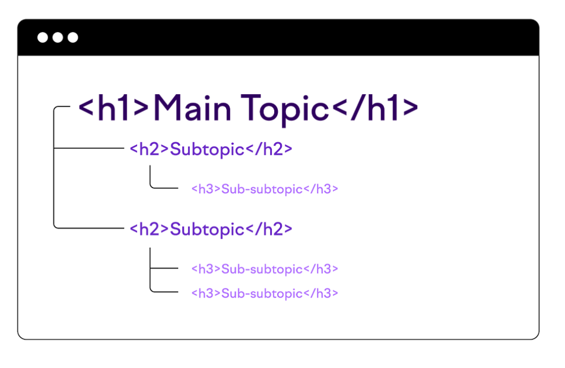
Dengan cara ini, struktur judul menciptakan hierarki logis dari topik dalam konten Anda dan membantu pembaca dan mesin pencari lebih memahami dan menavigasi teks.
## Jangan Hanya Menyalin Tata Letak Visual Anda

Implementasi HTML Anda tidak boleh hanya menjadi duplikat tata letak visual. Sebaliknya, itu harus mengikuti struktur semantik halaman.

Mari kita lihat contoh ini: 

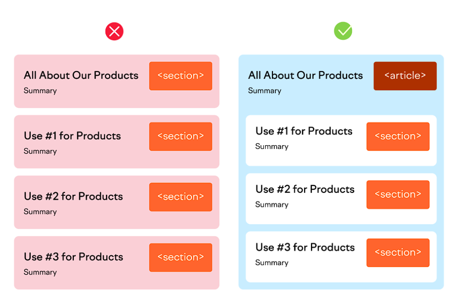


Penggunaan tag HTML di sisi kiri salah karena menunjukkan bahwa halaman tersebut berisi empat topik berbeda, bukan satu topik dan tiga subtopik, seperti yang ditunjukkan di sebelah kanan.

Di sisi kanan, kami memiliki halaman yang dibuat dengan benar menggunakan HTML semantik. Meskipun ada empat bagian terpisah dalam tata letak visual halaman, tag HTML disusun berdasarkan semantik konten.
