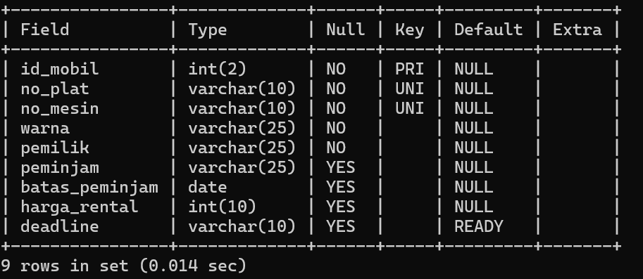

# Materi Pengenalan Basis Data
## penggunaan awal MySQL

### Query
```mysql
<mysql -u root -p>
```
### Hasil


## membuat data base

- `CREATE DATABASE` adalah perintah untuk membuat database baru.
- `[XI_RPL_1]` adalah nama yang Anda pilih untuk database baru Anda. Tanda kurung siku `<("[]")>` digunakan di sini untuk menghindari kesalahan jika nama database mengandung karakter spesial atau spasi. Namun, perlu dicatat bahwa tidak semua DBMS mengizinkan penggunaan tanda kurung siku dalam nama database, jadi pastikan untuk menyesuaikan sintaksdengan DBMS yang Anda gunakan.
### Query

```mysql
create database xi_rpl_1;
```
### Hasil:


## Tampilkan data base

`SHOW DATABASE` digunakan untuk menampilkan daftar database yang ada dalam sistem manejemen basis data (DBMS). Perintah ini dapat digunakan di beberapa DBMS seperti MYSQL, PostgreSQL, dan beberapa DBMS lainnya. Namun, perintahnya dapat sedikit berbeda tergantung

### Query

```mysql
show databases;
```
### Hasil:

## Hapus database

`<DROP DATABASE [nama_database]>` digunakan dalam sistem manajemen basis data (DBMS) untuk menghapus sebuah database beserta semua objek yang terkait dengan database tersebut, seperti tabel, indeks, tampilan, prosedur tersimpan, dan lain-lain.

### Query

```mysql
drop database xi_rpl_1;
```
### Hasil:


## gunakan data base

`USE [nama_database]` digunakan dalam sistem manajemen basis data (DBMS) untuk beralih atau memilih database yang akan digunakan. Ketika Anda menggunakan perintah `<USE>` diikuti dengan nama database, DBMS akan mengarahkan semua perintah dan operasi selanjutnya pada database yang ditentukan.

### Query
```mysql
use rental_nafan;
```
### Hasil:


## Membuat Tabel 

- Membuat tabel bernama `nafan_tables`.
- Tabel memiliki tiga kolom: `nama`, `alamat`, dan `catatan`.
- `nama` menyimpan teks maksimal 50 karakter.
- `alamat` menyimpan teks maksimal 100 karakter.
- `catatan` menyimpan teks panjang.

### Query
```mysql
CREATE TABLE nafan_tables (
    nama CHAR(50),
    alamat VARCHAR(100),
    catatan TEXT,
);
```
### Hasil : 


---
# Materi Select Lanjutan
## AND

untuk **AND** ini akan mengambil "data 1" _dan_ "data 2", contoh kodenya adalah seperti berikut :

### Query : 
```sql
SELECT warna,pemilik FROM data_mobil WHERE warna="Hitam" AND pemilik="ibrahim";
```

### Hasil


## NOT BETWEEN
Untuk **NOT BETWEEN** ini akan mengambil "data" yang _bukan antara_ "data 1" _dan_ "data 2", contoh kodenya ialah seperti berikut :

### Query : 
```sql
SELECT * FROM data_mobil WHERE harga_rental NOT BETWEEN 100000 AND 200000;
```

### Hasil


## >=
Untuk **>=** ini akan mengambil "data" lebih besar atau sama dengan "nilai data", contoh kodenya ialah seperti berikut :

### Query : 
```sql
MariaDB [rental_nafan]> SELECT * FROM data_mobil WHERE harga_rental >= 50000;
```

### Hasil


## <> atau !=
Untuk **<> atau !=** ini akan mengambil "data" yang tidak sama dengan "nilai data", contoh kodenya ialah seperti berikut :

### Query : 
```sql
MariaDB [rental_nafan]> SELECT * FROM data_mobil WHERE harga_rental <> 50000;
```

### Hasil 


## IN & OR

### Struktur Query


```sql
SELECT * FROM [nama_tabel]
    WHERE [nama_kolom] IN ('nilai')
    OR [nama_kolom] = nilai;
```

### Contoh


```sql
SELECT * FROM mobil
     WHERE warna IN('Merah','silver')
     OR harga_rental = 150000;
```

### Hasil


### Analisis

- `SELECT * FROM` : Merupakan query awal untuk menampilkan sebuah tabel yang didalamnya berisikan kolom, di mana kolom tersebut menampung sebuah data.
- `mobil` nama dari tabel yang ingin kita tampilkan data-data nya.
- `WHERE` : digunakan untuk menyaring data yang ada pada tabel.
- `warna IN('Merah','silver') OR harga_rental = 150000;` : query tersebut mencari data pada kolom warna bernilai Merah dan silver atau kolom harga_rental yang bernilai 150000 yang akan ditampilkan.

### Kesimpulan

Menggunakan operator logika OR memastikan bahwa salah satu dari 2 kondisi/kolom tersebut memenuhi syarat akan diambil.

---
## IN + AND + OPERATOR

### LEBIH BESAR

#### Struktur Query
```sql
SELECT * FROM [nama_tabel]
     WHERE [nama_kolom] IN ('nilai1','nilai2')
     AND [nama_kolom] > nilai;
```
#### Query : 
```sql
SELECT * FROM mobil
     WHERE warna IN('Merah','silver')
     AND harga_rental > 50000;
```
#### Hasil

#### Analisis
- `SELECT * FROM` : Merupakan query awal untuk menampilkan sebuah tabel yang didalamnya berisikan kolom, di mana kolom tersebut menampung sebuah data.
- `mobil` nama dari tabel yang ingin kita tampilkan data-data nya.
- `WHERE` : digunakan untuk menyaring data yang ada pada tabel.
- `warna IN('Merah','silver') AND harga_rental > 50000;`: query tersebut mencari data pada kolom warna yang bernilai Merah atau silver dengan kriteria harga_rental berada di atas 50000.
#### Kesimpulan
Query tersebut mencari data pada kolom warna yang bernilai Merah atau silver dan pada saat yang sama kolom harga_rental harus lebih besar dari 50000.

---
## Like
### MENCARI AWALAN & AKHIRAN

#### Struktur Query
```sql
SELECT * FROM [nama_tabel]
   WHERE [nama_kolom] LIKE                            'nilai_awal%nilai_akhir';
```
#### Query : 
```sql
SELECT * FROM mobil
   WHERE pemilik LIKE 'i%m';
```
#### Hasil

#### Analisis
- `SELECT * FROM` : Merupakan query awal untuk menampilkan sebuah tabel yang didalamnya berisikan kolom, di mana kolom tersebut menampung sebuah data.
- `mobil` nama dari tabel yang ingin kita tampilkan data-data nya.
- `WHERE` : digunakan untuk menyaring data yang ada pada tabel.
- `pemilik LIKE 'T%q';` : Perintah query tersebut akan menampilkan sebuah data pada kolom pemilik yang berawalan huruf T dan akhiran katanya q.

#### Kesimpulan
`SELECT * FROM mobil WHERE pemilik LIKE 'T%q';` : Perintah query tersebut mencari data pada tabel dimana kolom pemilik yang awalan katanya huruf T dan akhiran katanya q yang akan diambil.

---
### KOMBINASI

#### Struktur Query : 
```sql
SELECT * FROM [nama_tabel]
    WHERE [nama_kolom] LIKE 'nilai%'

SELECT * FROM [nama_tabel]
    WHERE [nama_kolom] LIKE 'nilai%';

```

#### Query :
```sql
SELECT * FROM mobil
    WHERE pemilik LIKE '_d%';

SELECT * FROM mobil
    WHERE pemilik LIKE '__i%';
```

#### Hasil


### Analisis

- `SELECT * FROM` : Merupakan query awal untuk menampilkan sebuah tabel yang didalamnya berisikan kolom, di mana kolom tersebut menampung sebuah data.
- `mobil` nama dari tabel yang ingin kita tampilkan data-data nya.
- `WHERE` : digunakan untuk menyaring data yang ada pada tabel.
- `pemilik LIKE '_d%';` : perintah ini akan mencari data pada kolom pemilik, dimana underscore nya sebagai pengganti karakter awal dan karakter keduanya bernilai d.
- `pemilik LIKE '__i%';` perintah ini akan mencari data pada kolom pemilik, yang dimana 2 underscore nya sebagai pengganti nilai asli dan karakter ketiganya bernilai i.

### Kesimpulan

- `SELECT * FROM mobil WHERE pemilik LIKE '_d%';` : Perintah query tersebut akan mencari data pada tabel mobil, dimana kolom pemilik yang bernilai d pada karakter keduanya akan diambil.
- `SELECT * FROM mobil WHERE pemilik LIKE '__i%';` : Perintah query tersebut akan mencari data pada tabel mobil, dimana kolom pemilik yang bernilai i pada karakter ketiga yang akan diambil.
--- 

## NOT LIKE

### Struktur Query
```sql
SELECT * FROM [nama_tabel]
    WHERE [nama_kolom] NOT LIKE 'nilai%';
```

### Query : 
```sql
SELECT * FROM mobil
    WHERE pemilik NOT LIKE 'nafan%';
```

### Hasil

### Analisis
- `SELECT * FROM` : Merupakan query awal untuk menampilkan sebuah tabel yang didalamnya berisikan kolom, di mana kolom tersebut menampung sebuah data.
- `mobil` nama dari tabel yang ingin kita tampilkan data-data nya.
- `WHERE` : digunakan untuk menyaring data yang ada pada tabel.
- `pemilik NOT LIKE 'opi%';` : Perintah query ini tidak akan menampilkan yang bernilai Opi pada kolom pemilik

### Kesimpulan
`SELECT * FROM mobil WHERE pemilik NOT LIKE 'opi%';`: Jadi Perintah tersebut mengecualikan sebuah data pada tabel mobil dimana kolom pemilik yang bernilai Opi tidak akan ditampilkan.

---
## NULL

### Struktur Query
```sql
SELECT * FROM [nama_tabel] WHERE [nama_kolom] IS NULL;
```

### Query : 
```sql
SELECT * FROM mobil WHERE peminjam IS NULL;
```

### Hasil


### Analisis
- `SELECT * FROM` : Merupakan query awal untuk menampilkan sebuah tabel yang didalamnya berisikan kolom, di mana kolom tersebut menampung sebuah data.
- `mobil` nama dari tabel yang ingin kita tampilkan data-data nya.
- `WHERE` : digunakan untuk menyaring data yang ada pada tabel.
- `peminjam IS NULL`pada kolom peminjam akan menampilkan data yang kosong.

### Kesimpulan
Null digunakan ketika kita ingin menampilkan kolom yang kosong/belum ada isinya.

---
## Kombinasi Distinct dan Order By

### Struktur Query
```sql
SELECT DISTINCT(nama_kolom) FROM [nama_tabel] ORDER BY [nama_kolom] DESC;
```

### Query :
```sql
SELECT DISTINCT(harga_rental) FROM mobil ORDER BY harga_rental DESC;
```

### Hasil


### Analisis
- `SELECT DISTINCT (harga_rental)` digunakan untuk mengambil nilai unik dari kolom harga_rental dalam tabel, dan menghapus data duplikat sehingga hanya menampilkan data-data yang berbeda.
- `FROM mobil` Query tersebut memerintahkan untuk mengambil data pada tabel mobil.
- `ORDER BY harga_rental DESC` Query tersebut Mengurutkan isi dalam kolom harga_rental dari yang tertinggi.

### Kesimpulan
Kombinasi Distinct dan Order By digunakan ketika ingin mengetahui jumlah data asli yang ada pada kolom secara berurutan, baik dari yang tertinggi ataupun yang terendah.

---
## CONCAT, CONCAT_WS, AS
### Menggabungkan kolom tanpa pemisah

#### Struktur Query
```sql
SELECT CONCAT(kolom1,kolom2) FROM [nama_tabel];
```

#### Query : 
```sql
SELECT CONCAT(pemilik,warna) FROM mobil;
```

#### Hasil


#### Analisis
- `SELECT CONCAT` digunakan untuk mengambil dan menggabungkan 2 kolom atau lebih menjadi satu string tunggal.
- `(pemilik,warna)` Merupakan kolom yang akan di gabungkan menjadi satu.
- `FROM mobil` query tersebut akan mengambil data dari tabel mobil.

#### kesimpulan
`CONCAT` digunakan ketika kita ingin menggabungkan suatu kolom menjadi satu.

---
## Memberikan nama kolom alias

### Struktur Query
```sql
SELECT CONCAT_WS(Separator,kolom1,kolom2) AS [nama_alias] FROM mobil;
```

### Query : 
```sql
SELECT CONCAT_WS("+",pemilik,peminjam) AS COLLAB FROM mobil;
```

### Hasil


### Analisis
- `SELECT CONCAT_WS` digunakan untuk mengambil dan menggabungkan 2 kolom atau lebih menjadi satu string tunggal dengan pemisah.
- `("+",pemilik,peminjam)` tanda`"+"` sebagai pemisah `pemilik,peminjam` merupakan kolom yang akan digabungkan nilainya,setiap nilai dari kolom `pemilik` dan `peminjam` akan digabungkan menjadi satu string dengan tanda `"+"` di antara mereka.
- `AS COLLAB` AS merupakan alias sedangkan collab nama dari penggabungan 2 kolom yaitu pemilik dan peminjam.
- `FROM mobil` query tersebut akan mengambil data dari tabel mobil.

### kesimpulan
Kita bisa menggunakan Query tersebut untuk menggabungkan sebuah kolom dengan memberi nama alias, agar lebih mudah di mengerti.

---

## VIEW
### Membuat tabel virtual

#### Struktur Query
```sql
CREATE VIEW [nama_tabel_virtual] AS SELECT id_mobil,no_plat,pemilik,peminjam FROM [nama_tabel] WHERE [nama_kolom] = "nilai";
```

#### Query : 
```sql
CREATE VIEW info_no_plat AS SELECT id_mobil, no_plat, pemilik, peminjam FROM mobil WHERE pemilik = "Baim";
```

#### Hasil


#### Analisis
- `CREATE VIEW info_no_plat AS` Perintah query tersebut membuat sebuah tabel virtual dengan nama info_no_plat.
- `SELECT id_mobil, no_plat, pemilik, peminjam FROM mobil` digunakan untuk memilih kolom-kolom dari tabel mobil untuk di masukkan ke dalam tabel virtual yang dibuat.
- `WHERE pemilik = "Baim";` perintah tersebut akan menampilkan data-data yang pemiliknya Dani.

#### kesimpulan
Tabel virtual digunakan untuk mengelompokkan sebuah kolom tertentu dari tabel yang sudah ada.

---
## AGREGASI

### Menghitung total nilai numerik suatu kolom (Sum)

#### Struktur Query
```sql
SELECT SUM(nama_kolom) AS [nama_alias] FROM [nama_tabel]
```

#### Query : 
```sql
SELECT SUM(harga_rental) AS total_harga FROM mobil;
```

#### Hasil


#### Analisis
- `SELECT` digunakan untuk mengambil/menampilkan data
- `SUM` digunakan untuk menjumlahkan nilai numerik dalam kolom.
- `harga_rental` nama kolom yang ingin di jumlahkan nilainya.
- `AS total_harga`sebagai nama alias kolom
- `FROM mobil` query tersebut akan mengambil data dari tabel mobil.

#### Kesimpulan
`SUM` digunakan untuk menjumlahkan nilai numerik dalam kolom

---
## Menghitung jumlah baris/data, biasanya berdasarkan kriteria tertentu (Count)

### Struktur Query
```sql
SELECT COUNT(nama_kolom) AS [nama_alias] FROM 
[nama_tabel];
```

### Query :
```sql
SELECT COUNT(pemilik) AS total_pemilik FROM mobil;
```

### Hasil


### Analisis
- `SELECT` digunakan untuk mengambil/menampilkan data.
- `COUNT` digunakan untuk menghitung jumlah baris(nilai non-NULL).
- `pemilik` nama kolom yang ingin di hitung jumlah barisnya.
- `AS total_pemilik` sebagai nama alias kolom
- `FROM mobil` query tersebut akan mengambil data dari tabel mobil.

### Kesimpulan
`COUNT` digunakan ketika ingin menghitung jumlah baris dalam suatu kolom(atau jumlah non-NULL).

---

## Menampilkan nilai terendah (Min)

### Struktur Query
```sql
SELECT MIN(nama_kolom) AS [nama_alias] FROM [nama_tabel];
```

### Query : 
```sql
SELECT MIN(harga_rental) AS minimum FROM mobil;
```

### Hasil

### Analisis
- `SELECT` digunakan untuk mengambil/menampilkan data.
- `MIN` digunakan untuk menampilkan nilai numerik terendah dalam suatu kolom.
- `harga_rental` nama kolom yang ingin kita tampilkan nilai terendahnya.
- `AS minuman` sebagai nama alias kolom
- `FROM mobil` query tersebut akan mengambil data dari tabel mobil.

### Kesimpulan
`MIN` digunakan untuk menampilkan nilai terendah dari suatu kolom.

---
## Menampilkan nilai rata-rata (Avg)
### Struktur Query
```sql
SELECT AVG(nama_kolom) AS [nama_alias] FROM [nama_tabel];
```

### Query : 
```sql
SELECT AVG(harga_rental) AS rerata FROM mobil;
```

### Hasil

### Analisis
- `SELECT` digunakan untuk mengambil/menampilkan data.
- `AVG` digunakan untuk menghitung rata-rata dari nilai numerik yang ada pada kolom
- `harga_rental` nama kolom yang ingin kita tampilkan nilai tertinggi nya.
- `AS rerata` sebagai nama alias kolom
- `FROM mobil` query tersebut akan mengambil data dari tabel mobil.
### Kesimpulan
`AVG` digunakan untuk menghitung rata-rata dari nilai numerik pada suatu kolom.

---
## Relasi Tabel

 

# Struktur Pegawai


## Data Pegawai


## Before


## After


# Cabang
## Before


## After


---

# Materi Alter 

## Menambahkan kolom

>[!Info] INI SEBELUM MENAMBAHKAN ALTER
### Struktur query
```mysql

ALTER TABLE nama_tabel ADD nama_kolom varchar(10) AFTER nama_kolom;

```

### Query : 
```mysql

	ALTER TABLE data_mobil ADD batas_peminjam varchar(10) peminjam;

```

### Hasil


>[!info] InI Yang Sudah Ditambah
### Query : 
```mysql

UPDATE mobil SET batas_peminjam="2024-04-24" WHERE peminjam IS NOT Null;

```
### Hasil

### Analisis
- **`ALTER TABLE`**: Digunakan untuk mengubah struktur tabel yang sudah ada.
- **`mobil`**: Nama tabel yang akan diubah.
- **`ADD batas_peminjam varchar(10)`**: Menambahkan kolom baru bernama `batas_peminjam` dengan tipe data karakter (maksimal 10 karakter).
- **`AFTER peminjam`**: Menempatkan kolom baru `batas_peminjam` setelah kolom `peminjam` yang sudah ada.
## Kesimpulan
Pernyataan SQL tersebut menambahkan kolom `batas_peminjam` ke tabel `mobil` dengan tipe data karakter (maksimal 10 karakter), dan menempatkannya setelah kolom `peminjam`.

>[!info] InI Yang Sudah Ditambah
### Query : 
```mysql

UPDATE mobil SET batas_peminjam="2024-04-24" WHERE peminjam IS NOT Null;

```
### Hasil


## Mengubah tipe data kolom

### Struktur query

```mysql

ALTER TABLE nama_tabel MODIFY nama_kolom DATE;

```

###  Query

```mysql

ALTER TABLE data_mobil MODIFY varchar(10) DATE;

```
### Hasil

### Analisis

- **`ALTER TABLE`**: Perintah SQL untuk mengubah struktur tabel.
- **`mobil`**: Nama tabel yang akan diubah.
- **`MODIFY deadline DATE`**: Mengubah kolom `deadline` dalam tabel `mobil` menjadi tipe data `DATE`.

### Kesimpulan
Perintah `ALTER TABLE mobil MODIFY deadline DATE;` mengubah tipe data kolom `deadline` dalam tabel `mobil` menjadi `DATE`, memastikan kolom tersebut hanya menyimpan nilai tanggal yang valid. Pastikan data kompatibel dan lakukan pencadangan sebelum menjalankan perintah ini.

## Menambahkan constraint

### Struktur query

```mysql

ALTER TABLE nama_tabel ALTER nama_kolom SET DEFAULT 'READY';

```

### Query
```mysql

ALTER TABLE data_mobil ALTER deadline SET DEFAULT 'READY';

```

### Hasil

### Analisis
Perintah `ALTER TABLE mobil ALTER deadline SET DEFAULT 'READY';` mengatur nilai default untuk kolom `deadline` dalam tabel `mobil` menjadi `READY`. Jika baris baru ditambahkan tanpa nilai untuk kolom `deadline`, nilainya otomatis akan diatur menjadi `READY`.
### kesimpulan
Perintah `ALTER TABLE mobil ALTER deadline SET DEFAULT 'READY';` mengatur nilai default kolom `deadline` dalam tabel `mobil` menjadi `READY`. Ini berarti setiap baris baru tanpa nilai `deadline` akan otomatis diisi dengan `READY`. Pastikan ini sesuai dengan kebutuhan aplikasi Anda sebelum menjalankan perintah.

### Referensi
https://revou.co/panduan-teknis/sql-constraint

## Menghapus kolom

### Struktur query
```mysql

ALTER TABLE nama_tabel DROP COLUMN nama_kolom;

```

### Query

```mysql

ALTER TABLE data_mobil DROP COLUMN deadline;

```

### Hasil

### Analisis
- **`ALTER TABLE`**: Perintah SQL untuk mengubah struktur tabel.
- **`data_mobil`**: Nama tabel yang ingin diubah.
- **`DROP COLUMN deadline`**: Menghapus kolom `deadline` dari tabel `data_mobil`. Ini berarti semua data dalam kolom `deadline` akan dihapus.
### kesimpulan
Perintah `ALTER TABLE data_mobil DROP COLUMN deadline;` menghapus kolom `deadline` dari tabel `data_mobil`. Pastikan untuk mencadangkan data sebelum menjalankan perintah ini dan konfirmasi bahwa penghapusan kolom sesuai dengan kebutuhan aplikasi Anda.

# Mengganti nama tabel

## Struktur query
```mysql

ALTER TABLE nama_tabel RENAME TO nama_kolom;

```

### Query
```mysql

ALTER TABLE data_mobil RENAME TO ganteng;

```

### Hasil


### Analisis

1. `ALTER TABLE`: Ini adalah perintah SQL yang digunakan untuk mengubah struktur tabel.
2. `mobil`: Ini adalah nama tabel yang ingin Anda ubah.
3. `RENAME TO data_mobil`: Ini adalah bagian yang melakukan perubahan. Perintah ini mengubah nama tabel "`mobil`" menjadi "`data_mobil`"..

### kesimpulan
Perintah `ALTER TABLE mobil RENAME TO data_mobil;` mengubah nama tabel "`mobil`" menjadi "`data_mobil`". Pastikan untuk memperbarui kode atau query yang menggunakan nama tabel lama setelah menjalankan perintah ini.

# Referensi pembahasan ALTER

https://www.techonthenet.com/mysql/tables/alter_table.php
