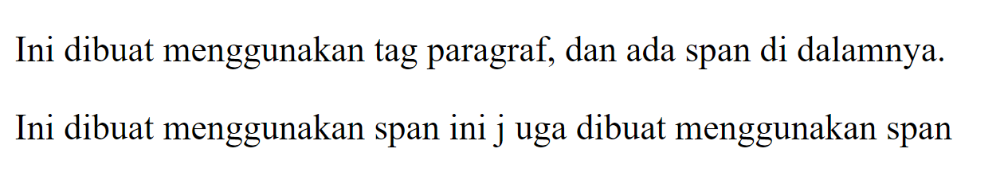

# Struktur Dasar HTML
Struktur dasar HTML adalah kerangka dokumen yang terdiri dari elemen-elemen dasar. Berikut adalah contoh struktur dasar HTML:

## Kode :

```html
<!DOCTYPE html>
<html>
    <head>
        <title>ini adalah judul</title>
    </head>
    <body>
        <p>Kalau Nafan Ganteng yasudah Ganteng</p>
    </body>
</html>

```

## Hasil : 

## Penjelasan
- **Tag `<DOCTYPE html>`**: Menyatakan bahwa dokumen HTML ini menggunakan versi 5.
- **Tag `<html>`**: Menandai awal dokumen HTML dan ditutup dengan `</html>`.
- **Tag `<head>`**: Berisi informasi tentang halaman HTML dan ditutup dengan `</head>`. Di dalamnya biasanya terdapat tag `<title>` yang memberikan informasi judul halaman.
- **Tag `<body>`**: Berisi semua konten yang akan ditampilkan di web browser. Semua elemen di dalamnya ditampilkan di halaman web.

# Anatomi Elemen HTML

## Tag Pembuka dan Tag Penutup

Dalam HTML, elemen terdiri dari tag pembuka dan tag penutup:
- **Tag Pembuka**: Nama elemen diapit oleh `<` dan `>`. Contoh: `<a>`.
- **Tag Penutup**: Sama dengan tag pembuka, tetapi dengan `/` sebelum nama elemen. Contoh: `</a>`.
## Isi atau Konten Tag

Isi tag adalah informasi antara tag pembuka dan penutup. Konten ini bisa berupa teks, gambar, hyperlink, atau elemen HTML lain yang akan ditampilkan oleh web browser.
### Kode :
```html
<a href="halaman-lain.html">pergi ke halaman selanjutnya</a>
```

### Hasil : 


### Penjelasan:

- **Tag Pembuka `<a>`**: Membuat hyperlink.
- **Tag Penutup `</a>`**: Menutup elemen hyperlink.
- **Atribut `href`**: Menentukan tujuan link.
- **Nilai `href="halaman-lain.html"`**: Halaman yang dituju oleh link.
- **Isi Konten**: Teks "pergi ke halaman selanjutnya" muncul sebagai link.

# Paragraf

Tag paragraf dalam HTML digunakan untuk format teks:
- **`<p>`**: Paragraf.
- **`<b>`**: Teks tebal.
- **`<i>`**: Teks miring.
- **`<u>`**: Teks bergaris bawah.
- **`<br>`**: Baris baru.
- **`<hr>`**: Garis horizontal.
## Kode : 

```html 
<!DOCTYPE html>
<html>
    <head>
        <title>ini judul</title>
    </head>
    <body>
        <p>html merupakan kepanjangan dari
        <i>Hyperteks Markup Language</i> dan dibuat oleh bapak <b>Tim Berners-Lee</b> yang bertujuan untuk
        <u>berbagi informasi yang dapat dibaca dan diakses melalui web browser</u></p>
        <br>
        <p>www atau World Wide Web juga dibuat oleh Tim Berners-Lee beserta juga HTTP atau Hypertext Transfer Protocol</p>
        <hr>
    </body>
</html>

```
## Hasil 


## Penjelasan

- **`<!DOCTYPE html>`**: Deklarasi standar HTML terbaru.
- **`<html>`, `<head>`, `<title>`, `<body>`**: Elemen dasar struktur HTML:
    - `<html>`: Elemen root.
    - `<head>`: Metadata seperti judul halaman (`<title>`).
    - `<body>`: Konten yang ditampilkan di browser.
- **`<p>`**: Tag paragraf untuk teks.
- **`<i>`, `<b>`, `<u>`**: Tag untuk format teks:
    - `<i>`: Italic.
    - `<b>`: Bold.
    - `<u>`: Garis bawah.
- **`<br>`**: Baris baru di dalam paragraf.
- **`<hr>`**: Garis horizontal antara konten.
# List

Di HTML, tag list terdiri dari dua jenis utama:
- `<ol>` (Ordered List): Menampilkan daftar berurutan dengan angka atau huruf.
- `<ul>` (Unordered List): Menampilkan daftar tidak berurutan dengan simbol-simbol seperti bulatan atau kotak.
## Kode :

```html
  

<!DOCTYPE html>

 <html>

 <head>

  

<title>ini adalah judul</title>

  

</head>

  

 <body>

    <h1>Team esport Mobile legend</h1>

  

    <ul>

     <li>Onic</li>

     <li>RRQ</li>

     <li>Alterigo</li>

     <li>Aura</li>

    </ul>

    <p>absensi XI RPL 1</p>

   <ol>

     <li>ansar</li>

    <li>nafan</li>

     <li>ardi</li>

   </ol>

</body>

  

</html>

```
## Hasil


## Penjelasan

- **`<!DOCTYPE html>`**: Standar HTML terbaru.
- **`<html>`**: Elemen root untuk konten HTML.
- **`<head>`**: Metadata seperti judul halaman.
- **`<title>`**: Judul halaman di tab browser.
- **`<body>`**: Konten utama yang ditampilkan di browser.
- **`<h1>`**: Judul utama.
- **`<ul>`**: Daftar tidak berurutan dengan simbol default.
- **`<li>`**: Setiap item dalam daftar.
- **`<p>`**: Paragraf teks, contoh: "absensi XI RPL 1".
- **`<ol>`**: Daftar berurutan dengan angka atau huruf.

# Multimedia

## Gambar

Tag `` digunakan untuk menampilkan gambar di halaman web. Ini adalah tag tunggal (void tag) dalam HTML yang hanya memiliki atribut tanpa tag penutup. Berikut adalah beberapa atribut penting dalam tag ``:

## Kode :
```html


```

Berikut di bawah ini gambar yang mendeskiripsikan letak/lokasi gambar yang disisipkan pada tag di atas, terlihat bahwa file html dalam satu letak penyimpanan yang sama dengan gambar yang dimuat oleh web.
## Hasil 


## Penjelasan 

-`` adalah tag HTML untuk menampilkan gambar di halaman web. Berikut adalah atribut-atribut utamanya:
- **`src`**: Path atau URL gambar yang akan ditampilkan.
- **`alt`**: Teks alternatif untuk gambar, penting untuk aksesibilitas dan SEO.
- **`width` dan `height`**: Dimensi gambar dalam piksel untuk tata letak halaman.
# Video

Untuk menambahkan video ke halaman web menggunakan tag `<video>`,
## Kode :

```html

<video controls src="Opening intro ATTA HALILINTAR" width="350x" height="250px"></video>

```

  
Gambar dibawah merupakan gambar yang mendefinisikan bahwa file html dengan gambar dalam 1 folder

## Hasil 


## Penjelasan 

- - **`controls`**: Kontrol pemutaran video seperti play, pause, dan volume.
- **`src`**: Path atau URL video yang akan ditampilkan.
- **`width` dan `height`**: Dimensi video dalam piksel.
# Audio

Tag `<audio>` digunakan untuk menyematkan dan memainkan file audio di halaman web. Ini memungkinkan pemutaran audio langsung tanpa perlu pemutar eksternal.

## Kode :

```html

<audio controls src="EIY.mp3" type="audio/mp3"></audio>

```

## Hasil 


## Penjelasan

Tag `<audio>` digunakan untuk menampilkan pemutar audio di halaman web dengan beberapa atribut penting:
- **`controls`**: Menampilkan kontrol pemutaran audio seperti play, pause, dan volume.
- **`src`**: Path atau URL file audio yang ingin diputar.
- **`type`**: Menentukan jenis file audio yang diacu, misalnya `"audio/mp3"` untuk format MP3.
## Form

Elemen `<form>` HTML digunakan untuk mengumpulkan input dari pengguna, mirip dengan formulir di dunia nyata. Tag `<form>` menampung berbagai elemen `form` seperti `text fields`, `checkbox`, `radio buttons`, dan tombol `submit`. Formulir ini biasanya digunakan di website untuk fitur seperti login, sign up, dan komentar blog.
 **Tip:** Tag `<form>` mewakili satu formulir yang bisa memiliki banyak kolom isian.
### Input

Elemen `<input>` adalah elemen formulir penting dalam HTML yang dapat memiliki berbagai tipe:

- - `text`: Input teks (misalnya: nama).
- `password`: Input kata sandi (karakter tersembunyi).
- `radio`: Pilihan tunggal dari beberapa opsi (misalnya: jenis kelamin).
- `checkbox`: Pilihan ganda (misalnya: daftar hobi).
- `number`: Input angka dengan batas minimal, maksimal, dan kelipatan.
- `date`: Input tanggal dengan batas minimal dan maksimal.
- `file`: Unggah file dengan tipe tertentu.
- `submit`: Tombol untuk mengirim data.
- `reset`: Mengembalikan nilai formulir.
- `button`: Tombol yang dapat diprogram.
### Label

Elemen `<label>` melabeli kolom input dan membantu aksesibilitas. Klik pada label akan memfokuskan kolom terkait. Hubungkan dengan atribut `for` pada `<label>` dan `id` pada `<input>` yang memiliki nilai sama.

### Select

Elemen `<select>` digunakan untuk membuat dropdown menu di mana pengguna memilih satu opsi dari banyak pilihan.
- `<select>` adalah wadah untuk `<option>`, yang merupakan pilihan yang tersedia.
- Opsi pertama dalam `<select>` akan terpilih secara default. Gunakan `selected` pada `<option>` untuk menentukan opsi default.
### Text Area

Elemen `<textarea>` digunakan untuk mengambil inputan teks dari pengguna yang bisa mencakup lebih dari satu baris. Berbeda dengan `<input>` teks biasa, `<textarea>` memiliki area input yang lebih besar yang memungkinkan pengguna untuk mengetik teks dalam beberapa baris dengan menekan tombol enter.

### Button
Elemen `<button>` di dalam sebuah form berfungsi sama seperti `<input type="submit">`. Untuk tombol biasa yang tidak mengirimkan form, gunakan `type="button"`:

- **`name`**: Untuk nama variabel yang diproses oleh server, misalnya dalam PHP.
- **`required`**: Memastikan input harus diisi sebelum submit.
- **`placeholder`**: Teks bantuan untuk input form.
- **`value`**: Nilai awal dari input.
- **`disabled`**: Menonaktifkan input atau tombol.
# DIV & SPAN

## `<div>`

### Penjelasan

tag div merupakan tag yang digunakan untuk membuat layer yang dimana itu akan memudahkan seorang devoloper untuk membuat layout sesuai dengan desain yang diinginkan.
### Kode :

```html

 <div>Ini dibuat menggunakan div</div>

 <div>Ini juga menggunakan div</div>

```
### Hasil :


## `<span>`

### Penjelasan

Mirip seperti DIV, span adalah tag HTML yang tidak punya makna apa-apa ketika berdiri sendiri. Ia berguna untuk memberi aksi atau hiasan pada sebuah atau sekelompok elemen HTML.

### Kode :

```html

<p>Ini dibuat menggunakan tag paragraf, <span>dan ada span di dalamnya.</span></p>

        <span>Ini dibuat menggunakan span</span>

        <span>ini j uga dibuat menggunakan span</span>

```
### Hasil 



## Penjelasan

Elemen `<span>` digunakan untuk mengaplikasikan gaya atau manipulasi teks langsung.
Elemen `<span>` tambahan untuk menambah gaya atau manipulasi teks.
Elemen `<span>` digunakan untuk menambah gaya visual atau efek pada teks tanpa mengubah struktur paragraf secara signifikan.