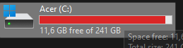

# Pengenalan PHP
## Web Dinamis

Pembagian jenis website di bagi menjadi dua bagian yaitu web statis dan web dinamis. Web statis adalah website yang hanya menampilkan sebuah output dari hasil program yang telah diketikkan sedangkan web dinamis adalah sebuah web yang lebih kompleks karena kita dapat memberi input pada website dan website tersebut dapat menyimpan data yang kita masukkan.

## PHP

PHP (Hypertext Preprocessor) adalah sebuah bahasa skrip dengan fungsi umum yang terutama digunakan untuk pengembangan sebuah web dinamis ataupun website interaktif. PHP juga mendukung banyak jenis database seperti MySQL, PostgreSQL dan Oracle sehingga pembangunan sebuah website dapat menjadi lebih kompleks.
## Penggunaan Awal PHP

untuk penggunaan awal PHP kita harus mengikuti langkah langkah berikut.

1) Buka XAMPP lalu aktifkan "MySQL" dan "Apache". 

2) Masuk ke directory C.

 

3) Buka folder XAMPP lalu buka folder Htdocs.


4) Buat folder dengan nama yang anda inginkan.
  

5) Kemudian Masuk ke VSCode lalu klik "Open Folder" dan pilih folder yang telah anda buat.

6) Buat Dokumen dengan ekstensi "php".

   

7) Untuk mengetikkan program php, dokemnnya selalu dibuka dengan "`<?php`" dan di akhiri dengan `?>`.

   

7) Anda telah dapat membuat kode program PHP sesuai dengan keinginan anda.

---
## Echo 

Dalam PHP, gunakan "echo" untuk menampilkan teks. Ada dua cara: dengan kutip satu ('') dan kutip dua (""), masing-masing dengan perbedaan tertentu. Komentar dalam kode akan dijelaskan nanti.
### Echo kutip satu

Penulisan `echo` dengan kutip satu ('') akan menampilkan semua yang ditulis di dalamnya sebagai string, termasuk variabel. Contoh programnya adalah sebagai berikut.

```php

echo 'Jumlah meja di kelas '. $meja . ' buah';

    echo "<br>";

```


---
## Variable

Untuk penulisan variable kita awali dengan `$` lalu menuliskan nama variable nya dan menuliskan nilainya setelahnya dan di akhiri dengan `;`. Untuk contoh penggunaannya akan seperti di bawah ini.

```php

$meja = 30;

    $tk_kelas = "XI";

    $ketua_kelas = "July";

    $wali_kelas = "Saleh";

```

---
## Operator

Dalam php juga kita dapat menggunakan operator operator untuk memudahkan penulisan program kita, Untuk penjelasan lebih jelasnya akan di dijelaskan di bawah.

### Aritmatika

Operator aritmatika berfungsi untuk penjumlah, pengurangan, perkalian dan pembagian. Untuk penggunaan akan seperti di bawah ini.

1. Penjumlahan

```php

    $a = 10;

    $b = 5;

    //Penambahan

    $penambahan = $a + $b;

    echo "penambahan: " . $Penambahan . "<br>";

  

```

**Hasil :**


> [! info]- Penjelasan penjumlahan

- `$a = 10;` : variabel dengan nilai 10
- `$b = 5;` : variabel dengan nilai 5
- `$penambahan = $a + $b;` : variabel untuk menyimpan hasil penjumlahan `$a` dan `$b`
- `echo "penambahan: " .$penambahan . "<br>";` : menampilkan hasil penjumlahan `$a` dan `$b`

**Kesimpulan :**
operator `+` berfungsi untuk menjumlahkan isi dari variable yang kita ketikkan, dan hasilnya dapat kita tampilkan menggunakan echo.

---
## Perbandingan

Operator perbandingan atau operator perbandingan digunakan untuk membandingkan 2 operan atau lebih. Pada umumnya Operator perbandingan digunakan pada kondisi if-else sebagai penentu tingkat kesesuaian.

1. Perbandingan ==

```php

$a = 5;

$b = 10;

// Operator perbandingan ==

if ($a == $b) {

    echo "Nilai a sama dengan nilai b";

} else {

    echo "Nilai a tidak sama dengan nilai b";

}

```

**Hasil :**


  

> [! info]- Penjelasan pembagian ==

- `$a = 5;` : variabel dengan nilai 5
- `$b = 10;` : variabel dengan nilai 10
- `if ($a == $b) { echo "Nilai a sama dengan nilai b"; }` : jika `$a` sama dengan `$b`, tampilkan "Nilai a sama dengan nilai b"
- `else { echo "Nilai a tidak sama dengan nilai b"; }` : jika `$a` tidak sama dengan `$b`, tampilkan "Nilai a tidak sama dengan nilai b"

**Kesimpulan :**
jadi pada perbandingan `==` ialah untuk membandingkan apakah nilai dari variable `$a` dan variable `$a` bernilai sama atau kah tidak.

---
## Logika

Berikutnya adalah operator logika yang terdiri menjadi tiga jenis yaitu AND, OR dan NOT. Lalu untuk penjelasan tiap materinya akan dijelaskan di bawah ini.

1. Logika AND

```php

$nilai_a = 10;

$nilai_b = 5;

echo ($nilai_a > 0 && $nilai_b > 0) ? "Kedua nilai \$nilai_a dan \$nilai_b positif." : "Salah satu atau kedua nilai \$nilai_a dan \$nilai_b tidak positif.";

```

**Hasil :**


  

> [! info]- Penjelasan logika AND

- `$a = 10;` : variabel dengan nilai 10
- `$b = 5;` : variabel dengan nilai 5
- `echo ($a > 0 && $b > 0) ? "Kedua nilai 10 dan 5 positif" : "Salah satu atau kedua nilai 10 dan 5 tidak positif";` : menampilkan "Kedua nilai 10 dan 5 positif" jika keduanya positif, atau "Salah satu atau kedua nilai 10 dan 5 tidak positif" jika tidak

**Kesimpulan :**

jadi pada logika `AND` ini berfungsi untuk memberi penghubung "dan" pada kedua nilai seperti pada contoh di atas yang akan menmpilkan nilai dari variable `$nilai_a` **DAN** variable `$nilai_b`.

---

## Conditional Statement
sekarang kita akan mempelajari apabila suatu program yang mengharuskan kita untuk menjalankan salah satu kondisi dari banyak kemungkinan, untuk materi yang akan kita pelajari ialah IF Untuk penjelasan lebih lanjutnya akan dijelaskan di bawah ini
### IF

"IF" ini adalah sebuah kode yang dapat membuat kita menjalankan salah satu dari dua kindisi yang akan di jalankan. Dan berikut adalah contoh penggunaan dan pengaplikasiannya.

```php

$nilai_a = 10;

$nilai_b = 5;

if (nilai_a > nilai_b) {

  echo "Have a good day!";

}

```

**Hasil :**


> [! info]- Penjelasan IF

- `$a = 10;` : variabel dengan nilai 10
- `$b = 5;` : variabel dengan nilai 5
- `if ($a > $b) { echo "Have a good day!"; }` : jika `$a` lebih besar dari `$b`, tampilkan "Have a good day!"

**Kesimpulan :**

Kesumpulannya adalah pada program **IF** jika syarat terpenuhi maka program akan menampilkan statement dari **IF** seperti yang terlihat pada program di atas.

---
## Array

array adalah metode untuk menyimpan suatu data di variable secara terstruktur agar data yang disimpan data tertata dan data menyimpan banyak data.

### Array 1 dimensi

```php

$cars = array("Volvo", "BMW", "Toyota");

echo $cars[0];

```

**Hasil :**


> [! info]- Penjelasan Array 1 Dimensi

 - `$cars` : variabel yang menyimpan nilai dalam array
- `("Volvo", "BMW", "Toyota")` : nilai-nilai dalam array
- `echo` : perintah untuk menampilkan nilai
- `$cars[0]` : memanggil nilai pertama dalam array

**Kesimpulan :**
program di atas menyimpan data dalam variable `$cars` dan di atur di dalam array menjadi satu baris sehingga terstruktur. lalu dapat di panggil dengan menyebutkan nama variable dan ditambah `[urutan nilai di dalam arraynya]`.

---
## Looping (Pengulangan)

Looping atau pengulangan pada PHP adalah cara untuk mengeksekusi serangkaian pernyataan atau blok kode secara berulang berdasarkan kondisi tertentu.
### For

```php

for ( $nilai_a = 0; $nilai_a <= 5; $nilai_a++) {

  echo "ini perulangan yang: $nilai_a <br>";

}

```

**Hasil** :


> [! info]- Penjelasan WHILE

- `for ($nilai_a = 0; $nilai_a <= 5; $nilai_a++)`: Memulai perulangan dengan `nilai_a` dimulai dari 0, terus berlanjut selama `nilai_a` kurang dari atau sama dengan 5, dan `nilai_a` bertambah 1 setiap kali iterasi.
- `{ echo "ini perulangan yang: $nilai_a <br>"; }`: Pada setiap iterasi, menampilkan teks "ini perulangan yang:" diikuti nilai dari `nilai_a` dan baris baru (<br>).

**Kesimpulan** :

- `for ($nilai_a = 0;; $nilai_a++)`: Memulai perulangan dengan `$nilai_a` dimulai dari 0. Kondisi loop tidak didefinisikan (`;;`), sehingga loop akan terus berjalan tanpa henti.
- `echo "ini perulangan yang: $nilai_a <br>";`: Pada setiap iterasi, mencetak teks "ini perulangan yang:" diikuti oleh nilai `$nilai_a` dan baris baru (`<br>`).

---
## Foreach

Dengan menggunakan `foreach`, Anda dapat dengan mudah mengakses dan memproses setiap elemen dalam array tanpa perlu menghitung indeksnya secara manual.

```php

$numbers = [1, 2, 3, 4, 5];

foreach ($numbers as $number) {

echo "Angka: $number\n"; }

```

**Hasil :**


> [! info]- Penjelasan Foreach

- `$numbers = [1, 2, 3, 4, 5];`: Membuat array `$numbers` yang berisi nilai-nilai integer.
- `foreach ($numbers as $number) { ... }`: Mengulang setiap elemen dalam array `$numbers`. Setiap elemen disimpan dalam variabel `$number` pada setiap iterasi.
- `echo "Angka: $number\n";`: Mencetak teks "Angka: " diikuti nilai dari `$number`, dengan karakter baris baru (`\n`), pada setiap iterasi.

**Kesimpulan :**

Ini adalah cara sederhana dan mudah dipahami untuk menggunakan foreach dalam PHP untuk mengulang dan mencetak setiap elemen dari sebuah array.

---
## Function

```php

function greet($name) {

echo "Hello, $name!"; }

  

greet("Alice");

```

**Hasil :**


> [! info]- Penjelasan Function

- `greet`: Nama dari fungsi yang dibuat.
- `echo "Hello"`: Menampilkan teks "Hello".
- `$name`: Variabel untuk menyimpan data.
- `("Alice")`: Isi nilai dari variabel `$name`, yang diisi dengan nilai "Alice".

**Kesimpulan :**
Fungsi ini berfungsi sebagai wadah penyimpanan data yang dapat dipanggil berkali-kali, di mana nilai variabel akan diisi di bagian bawah fungsi seperti contoh yang telah dituliskan di atas.

---

## PHP Form

Kode html :

```html

<form>

     <input type="text" name="nama_lengkap" placeholder="Masukkan nama">

     <input type="number" name="umur" placeholder="Masukkan umur"><br>

     <button type="submit">Kirim</button>

</form>

```

**Hasil :**


  

> [! info]- Penjelasan Form

- `input type="text"`: Kolom form untuk input teks.
- `input type="number"`: Kolom form untuk input angka.
- `placeholder`: Teks petunjuk dalam kolom form.
- `button type="submit"`: Tombol submit form.

**Kesimpulan :**

form dalam php berfungsi untuk mengambil data yang akan dimasukkan di data base dan proses pembuatannya di lakukan atau diketikkan pada html.

---
## Post Method

Kode Html :

```html

    <form action="proses_post.php" method="POST">

        <input type="text" name="nama_lengkap" placeholder="Masukkan nama">

        <input type="number" name="umur" placeholder="Masukkan umur">

        <input type="password" name="password" placeholder="Masukkan password"><br>

        <button type="submit">Kirim</button>

   </form>

```

Kode PHP :

```php

<?php

// Key dari array-nya, sesuai dengan nama dari atribut name di setiap input-nya

$nama = $_POST["nama"];

$umur = $_POST["umur"];

?>

<!DOCTYPE html>

<html lang="en">

<head>

    <title> XI RPL 1 - POST</title>

</head>

<body>

    <p>Nama anda <?= $nama ?></p>

    <p>Umur anda <?= $umur ?> tahun</p>

    <p>Password anda aman!</p>

</body>

</html>

```

**Hasil :**

HTML :


PHP :


  

> [! info]- Penjelasan POST PHP

- `<form action="proses_post.php" method="POST">`: Form untuk mengirim nilai ke `proses_post.php` dengan metode POST.
- `$nama = $_POST["nama"];`: Mengambil nilai input form dengan nama `nama`.
- `$umur = $_POST["umur"];`: Mengambil nilai input form dengan nama `umur`.
- `<p>nama anda <?= $nama ?></p>`: Menampilkan nilai `$nama`.
- `<p>umur anda <?= $umur ?></p>`: Menampilkan nilai `$umur`.

**Kesimpulan :**
POST dan GET memiliki fungsi yang hampir sama, namun pada `POST`, data yang dikirim tidak ditampilkan di URL. Ini sangat cocok untuk pengiriman data yang sensitif dan bersifat pribadi.

---
# PHP MYSQL

## Koneksi Database

**Query :**

```php

<?php

  

//koneksi ke database

$koneksi = mysqli_connect('localhost', 'root', '', 'rental_fadhil');

  

if ($koneksi) {

    echo "<br> koneksi aman <br>";

} else {

    echo "error, tidak bisa koneksi ke database";

}

?>

```

**Hasil :**


  

> [! info]- Penjelasan koneksi

- `<?php`: Tag pembuka PHP.
- `echo mysqli_connect('localhost', 'root', '', 'rental_nero') ? "<br> koneksi aman <br>" : "error, tidak bisa koneksi ke database";`: Memanggil `mysqli_connect()` untuk mencoba koneksi ke server MySQL dengan host 'localhost', username 'root', tanpa password (''), dan memilih database 'rental_nero'. Jika koneksi berhasil, maka pesan "koneksi aman" akan ditampilkan. Jika tidak berhasil, pesan "error, tidak bisa koneksi ke database" akan ditampilkan.
- `?>`: Tag penutup PHP.
  

**Kesimpulan :**
Dengan menggunakan kode ini, Anda dapat dengan singkat memeriksa koneksi ke database MySQL dan memberikan umpan balik berdasarkan keberhasilan atau kegagalan koneksi.

  
---
## Tampilkan Data

**Query :**

```php

<?php

  
  

echo 'Berikut mobil-mobil beserta pemiliknya<br>';

  

$a = 1;

foreach ($select as $key => $data) {

    echo $a++ . ". " . $data['no_plat'] . " : " . $data['pemilik'] . '<br>';

}

  

?>

```

**Hasil :**


  

> [! info]- Penjelasan Tampilkan Data

- `<?php`: Tag pembuka PHP.
- `echo 'Berikut mobil-mobil beserta pemiliknya<br>';`: Menampilkan teks pengantar untuk daftar mobil dengan tambahan baris baru setelah teks.
- `$a = 1;`: Mendefinisikan variabel `$a` dengan nilai awal 1 untuk memberi nomor urut pada daftar mobil.
- `foreach ($select as $data) echo $a++ . ". " . $data['no_plat'] . " : " . $data['pemilik'] . '<br>';`: Perulangan `foreach` yang mengiterasi setiap elemen dalam array `$select` dan langsung menampilkan nomor urut, nomor plat mobil, dan pemilik mobil dari array `$data`.
- `?>`: Tag penutup PHP untuk mengakhiri blok kode PHP.

**Kesimpulan :**
Kode ini menggabungkan informasi dari array `$select` untuk informasi mobil dan `$result` untuk nama pemilik, dengan menampilkan data menggunakan pernyataan `echo` dalam perulangan `foreach`.

---

## Ubah Data

**Query :**

```php

<!DOCTYPE html>

<html lang="en">

<head>

    <title>Document</title>

</head>

<body>

    <h2>Ubah Data</h2>

    <?php

    include "koneksi.php";

  

    $id = $_GET['id'];

  

    if (isset($_POST['simpan'])) {

        $nama = $_POST['nama'];

        $email = $_POST['email'];

        $jenis_kelamin = $_POST['jenis_kelamin'];

        $alamat = $_POST['alamat'];

        $query = mysqli_query($koneksi, "UPDATE siswa SET

                                        nama='$nama',

                                        email='$email',

                                        jenis_kelamin='$jenis_kelamin',

                                        alamat='$alamat'

                                        WHERE id_siswa=$id");

        if ($query) {

            echo "<script>

            alert('ubah data Berhasil')

            window.location.href='table.php'

            </script>";

        } else {

            echo '<script>alert("ubah data gagal")</script>';

        }

    }

    $query = mysqli_query($koneksi, "SELECT * FROM siswa where id_siswa=$id");

    $data = mysqli_fetch_array($query);

    if ($data == "") {

        die('Data tidak ada');

    }

    ?>

    <form method="post">

        <table>

            <tr>

                <td>Nama</td>

                <td><input type="text" value="<?= $data['nama'] ?>" name="nama"></td>

            </tr>

            <tr>

                <td>Email</td>

                <td><input type="text" value="<?= $data['email'] ?>" name="email"></td>

            </tr>

            <tr>

                <td>Jenis Kelamin</td>

                <td>

                    <select name="jenis_kelamin">

                        <option <?php if ($data['jenis_kelamin'] == "laki-laki")

                            echo 'selected'; ?>>Laki-laki</option>

                        <option <?php if ($data['jenis_kelamin'] == "perempuan")

                            echo 'selected'; ?>>Perempuan</option>

                    </select>

                </td>

            </tr>

            <tr>

                <td>Alamat</td>

                <td><input type="text" value="<?= $data['alamat'] ?>" name="alamat"></td>

            </tr>

            <tr>

                <td></td>

                <td>

                    <button name="simpan" type="submit">Ubah</button>

                    <button type="reset">Reset</button>

                    <a href="table.php">Kembali</a>

                </td>

            </tr>

        </table>

    </form>

</body>

</html>

```

**Hasil :**


### Penjelasan

- **Form Handling**: Memanfaatkan `$_SERVER['REQUEST_METHOD']` untuk mengecek apakah form sudah disubmit.
- **Update Query**: Melakukan update data berdasarkan nilai `id` yang diterima dari URL.
- **JavaScript Alert**: Menampilkan pesan sukses atau gagal menggunakan JavaScript setelah query dieksekusi.
- **Select Query**: Mengambil dan menampilkan data siswa berdasarkan `id`.
- **Form**: Memuat data saat ini dari database ke dalam form untuk memungkinkan pengubahan.
- **Button dan Link**: Tombol "Ubah" untuk mengirimkan form, "Reset" untuk mengosongkan form, dan tautan "Kembali" untuk kembali ke halaman `table.php`.
- **Tag Penutup**: Mengakhiri blok PHP dan HTML.

**Kesimpulan**

Kode ini menggabungkan PHP untuk logika backend dan HTML untuk tampilan frontend sehingga pengguna dapat mengubah data siswa dengan mudah melalui formulir yang disediakan.

---
## Hapus Data

**Query :**
```php

<?php

include('koneksi.php');

if(isset($_GET['id'])){

    $id = $_GET['id'];

    $query = mysqli_query($koneksi, "DELETE FROM siswa WHERE id_siswa = $id");

   if($query) {

            echo "<script>

            alert('Hapus data Berhasil')

            window.location.href='table.php'

            </script>";

        }else {

            echo '<script>alert("Hapus data gagal")</script>';

        }

}

?>

```

**Hasil :**


  

### Penjelasan

- **Include Koneksi**: Menyertakan file `koneksi.php` untuk menghubungkan ke database.
- **Pengecekan Parameter ID**: Memeriksa apakah parameter `id` ada di URL dan menyimpan nilainya dalam variabel `$id`.
- **Query Delete**: Menjalankan query DELETE untuk menghapus data siswa dari database berdasarkan nilai `id` dari URL.
- **JavaScript Alert**: Menampilkan pesan sukses atau gagal menggunakan JavaScript setelah query dieksekusi.
- **Redireksi**: Mengarahkan pengguna kembali ke halaman `table.php` setelah berhasil menghapus data.
- **Tag Penutup**: Mengakhiri blok PHP.

**Kesimpulan**

Kode ini memungkinkan pengguna untuk menghapus data siswa secara langsung dari halaman web dengan mengklik tombol atau tautan yang mengandung parameter `id` dari data yang ingin dihapus.

---
## Session / Login

**Query :**

```php

<?php

  

session_start();

  

if (isset($_POST['submit'])) {

    $username = $_POST['username'];

    $password = $_POST['password'];

  

    $koneksi = mysqli_connect('localhost', 'root', '', 'pemilu_test') or die('error koneksi');

  

    $result = mysqli_query($koneksi, "SELECT * FROM user

                            WHERE username = '$username' AND password = '$password'");

  

    $data = mysqli_fetch_assoc($result);

  

    if (isset($data)) {

        $_SESSION['username'] = $data['username'];

        $_SESSION['nama'] = $data['nama'];

        $_SESSION['status'] = 'login';

        header('Location: user.php');

    } else {

        echo "Username dan Password Salah";

    }

}

  
  

?>

<!DOCTYPE html>

<html>

  

<head>

    <title>Login Session</title>

</head>

  

<body>

  

    <form method="post">

        <label>Username</label>

        <input type="text" name="username">

        <br>

        <label>Password</label>

        <input type="text" name="password">

        <br>

        <button type="submit" name="submit">Login</button>

    </form>

  

</body>

  

</html>

```

**Hasil :**


### Penjelasan

-- **`session_start();`**: Memulai atau melanjutkan sesi pengguna.
- **Pengecekan Submit**: Memeriksa apakah form telah disubmit dengan `isset($_POST['submit'])`.
- **Mengambil Data**: Mengambil nilai username dan password dari form menggunakan `$_POST['username']` dan `$_POST['password']`.
- **Koneksi Database**: Menghubungkan ke database `pemilu_test` dengan `mysqli_connect`.
- **Query dan Pengecekan**: Menjalankan query SQL untuk memeriksa kecocokan username dan password dalam tabel `user`.
- **Mengatur Sesi**: Jika data ditemukan (`$data` tidak kosong), maka variabel sesi (`$_SESSION`) diatur dengan username dan nama pengguna, serta status login. Pengguna dialihkan ke halaman `user.php`.
- **Penanganan Kesalahan**: Jika tidak ada data yang cocok, menampilkan pesan "Username dan Password Salah".

**Kesimpulan**

Kode ini menggabungkan beberapa konsep dasar dalam pengembangan web menggunakan PHP, termasuk penggunaan session untuk mengelola status login pengguna dan koneksi ke database MySQL untuk validasi login.

---

## Download

### Download

```php

<?php

include "koneksi.php";

  

$query = mysqli_query($koneksi, 'SELECT * FROM siswa');

$data = [];

$data[] = ["ID", "Nama", "Email", "Jenis Kelamin", "Alamat"];

while ($row = mysqli_fetch_assoc($query)) {

    $data[] = [

        $row['id_siswa'],

        $row['nama'],

        $row['email'],

        $row['jenis_kelamin'],

        $row['alamat']

    ];

}

$namafile = "excel_data.xls";

header("Content-Type: application/vnd.ms-excel");

header("Content-Disposition: attachment;filename=\"$namafile\"");

header("Cache-Control: max-age=0");

$output = fopen("php://output", "w");

foreach ($data as $row) {

    fputcsv($output, $row, "\t");

}

fclose($output);

exit;

```

**Hasil :**


### Penjelasan

- **include "koneksi.php";**: Menghubungkan ke database dengan menyertakan file koneksi.php yang berisi informasi koneksi.
- **$query = mysqli_query($koneksi, 'SELECT * FROM siswa');**: Melakukan query untuk mengambil semua data siswa dari tabel "siswa" dalam database yang terhubung.
- **$ data = [];**: Membuat array kosong `$data` yang akan berisi baris-baris data yang akan diekspor ke Excel.
-  $ data[] = ["ID", "Nama", "Email", "Jenis Kelamin", "Alamat"];**: Menambahkan baris header ke array `$data`.
- **while ($row = mysqli_fetch_assoc($query)) { ... }**: Melakukan iterasi melalui hasil query untuk setiap baris data yang ditemukan.
- **$ data[] = [$row['id_siswa'], $row['nama'], $row['email'], $row['jenis_kelamin'], $row['alamat']];**: Menambahkan setiap baris data sebagai array ke dalam `$data`.
- **$namafile = "excel_data.xls";**: Menetapkan nama file Excel yang akan di-generate.
- **header("Content-Type: application/vnd.ms-excel");**: Mengatur header HTTP untuk memberitahu browser bahwa konten yang dikirim adalah file Excel.
- **header("Content-Disposition: attachment;filename="$namafile"");**: Mengatur header untuk menyertakan nama file saat di-download.
- **header("Cache-Control: max-age=0");**: Mengatur header untuk mengontrol cache.
- **$output = fopen("php://output", "w");**: Membuka output file untuk menulis data.
- **foreach ($data as $row) { ... }**: Iterasi melalui array `$data` dan menuliskan setiap baris sebagai baris dalam file Excel menggunakan fungsi `fputcsv`.
- **fclose($output);**: Menutup file output setelah selesai menulis.
- **exit;**: Mengakhiri eksekusi skrip PHP setelah selesai menghasilkan file Excel.

**Kesimpulan**
Kode ini menggabungkan penggunaan HTML untuk tampilan dan PHP untuk pengolahan data secara dinamis, memungkinkan pengguna untuk mengakses, menambahkan, mengubah, menghapus, dan mengekspor data dengan cara yang efisien dan terstruktur.